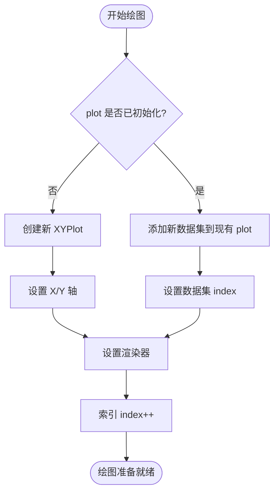
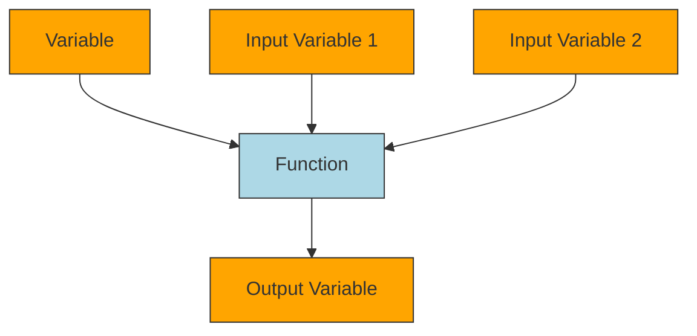

# 工具与可视化

<cite>
**本文档中引用的文件**  
- [Plot.java](file://src/main/java/io/leavesfly/tinydl/utils/Plot.java)
- [Uml.java](file://src/main/java/io/leavesfly/tinydl/utils/Uml.java)
- [Config.java](file://src/main/java/io/leavesfly/tinydl/utils/Config.java)
- [Util.java](file://src/main/java/io/leavesfly/tinydl/utils/Util.java)
- [Monitor.java](file://src/main/java/io/leavesfly/tinydl/mlearning/Monitor.java)
- [Model.java](file://src/main/java/io/leavesfly/tinydl/mlearning/Model.java)
- [MlpBlock.java](file://src/main/java/io/leavesfly/tinydl/nnet/block/MlpBlock.java)
- [ArrayDataset.java](file://src/main/java/io/leavesfly/tinydl/mlearning/dataset/ArrayDataset.java)
</cite>

## 目录
1. [Plot.java：训练过程可视化](#plotjava训练过程可视化)  
2. [Uml.java：计算图结构可视化](#umljava计算图结构可视化)  
3. [Config.java：全局配置管理](#configjava全局配置管理)  
4. [Util.java：通用工具方法](#utiljava通用工具方法)  
5. [总结](#总结)

## Plot.java：训练过程可视化

`Plot.java` 是基于 JFreeChart 库构建的绘图工具类，用于在模型训练过程中绘制损失曲线、准确率曲线以及数据分布图。它支持折线图和散点图的绘制，能够直观地展示训练过程中的关键指标变化趋势和数据特征分布。

该类通过 `line()` 方法绘制折线图，常用于展示训练损失随迭代次数的变化；通过 `scatter()` 方法绘制散点图，适用于可视化分类数据的分布情况，例如螺旋数据集（Spiral Dataset）的类别分布。

在实际使用中，`Monitor` 类在训练过程中收集损失值，并通过调用 `Plot` 类的 `line()` 方法生成损失曲线图。用户也可以直接传入 `float[]` 类型的横纵坐标数组来创建自定义图表。



**图示来源**  
- [Plot.java](file://src/main/java/io/leavesfly/tinydl/utils/Plot.java#L50-L150)
- [Monitor.java](file://src/main/java/io/leavesfly/tinydl/mlearning/Monitor.java#L35-L40)

**本节来源**  
- [Plot.java](file://src/main/java/io/leavesfly/tinydl/utils/Plot.java#L1-L179)
- [Monitor.java](file://src/main/java/io/leavesfly/tinydl/mlearning/Monitor.java#L30-L40)

## Uml.java：计算图结构可视化

`Uml.java` 提供了将深度学习模型的计算图转换为 PlantUML 格式文本的功能，便于开发者可视化和调试模型内部的函数依赖关系。其核心方法 `getDotGraph(Variable)` 接收一个变量节点，递归遍历其创建者（`Function`）和输入变量，生成描述整个计算路径的 UML 图代码。

生成的图采用有向图（digraph）形式，节点代表 `Variable` 或 `Function`，边表示数据流向。`Variable` 节点以橙色填充，`Function` 节点以浅蓝色填充并用矩形表示，清晰地区分了数据与操作。

开发者可将输出的 PlantUML 代码粘贴至在线编辑器（如 http://www.plantuml.com/plantuml/）中实时查看图形化结构，极大提升了对复杂模型结构的理解效率。



**图示来源**  
- [Uml.java](file://src/main/java/io/leavesfly/tinydl/utils/Uml.java#L10-L70)
- [Model.java](file://src/main/java/io/leavesfly/tinydl/mlearning/Model.java#L60-L65)

**本节来源**  
- [Uml.java](file://src/main/java/io/leavesfly/tinydl/utils/Uml.java#L1-L70)
- [Model.java](file://src/main/java/io/leavesfly/tinydl/mlearning/Model.java#L60-L65)

## Config.java：全局配置管理

`Config.java` 作为框架的全局配置中心，定义了影响模型行为的静态参数和枚举类型。目前包含一个布尔型字段 `train`，用于控制模型处于训练模式还是推理模式，便于在不同阶段启用或关闭如 Dropout 等正则化操作。

此外，`Config` 内部定义了 `ActiveFunc` 枚举，列举了框架支持的激活函数类型：`ReLU`、`Sigmoid`、`SoftMax` 和 `Tanh`。这些枚举值被 `MlpBlock` 等网络构建模块直接引用，作为构造函数的参数，实现了激活函数的灵活配置。

```mermaid
classDiagram
class Config {
+static Boolean train
}
class MlpBlock {
-Config.ActiveFunc activeFunc
+MlpBlock(String, int, Config.ActiveFunc, int[])
}
Config : ActiveFunc {
ReLU
Sigmoid
SoftMax
Tanh
}
MlpBlock --> Config.ActiveFunc : 使用
```

**图示来源**  
- [Config.java](file://src/main/java/io/leavesfly/tinydl/utils/Config.java#L1-L13)
- [MlpBlock.java](file://src/main/java/io/leavesfly/tinydl/nnet/block/MlpBlock.java#L1-L42)

**本节来源**  
- [Config.java](file://src/main/java/io/leavesfly/tinydl/utils/Config.java#L1-L13)
- [MlpBlock.java](file://src/main/java/io/leavesfly/tinydl/nnet/block/MlpBlock.java#L1-L42)

## Util.java：通用工具方法

`Util.java` 封装了一系列在深度学习开发中常用的辅助方法，显著提升了代码的复用性和开发效率。

主要功能包括：
- **数值微分**：`numericalDiff()` 方法通过中心差分法近似计算任意函数的梯度，常用于梯度检查。
- **数组转换**：提供 `toFloat()`、`toInt()` 等方法，实现 `int[]`、`float[]` 和 `Float[]` 之间的便捷转换。
- **序列生成**：`getSeq()` 和 `getSeqIndex()` 生成指定长度的连续整数序列，常用于索引操作。
- **数值处理**：`argMax()` 返回数组中最大值的索引，`format()` 格式化浮点数输出。

这些方法被广泛应用于测试、数据预处理和模型评估等环节。

```mermaid
flowchart LR
A[原始数据] --> B[Util.toInt()]
B --> C[int数组]
C --> D[模型输入]
E[float数组] --> F[Util.argMax()]
F --> G[预测类别]
H[NdArray] --> I[Util.numericalDiff()]
I --> J[梯度验证]
```

**图示来源**  
- [Util.java](file://src/main/java/io/leavesfly/tinydl/utils/Util.java#L1-L96)

**本节来源**  
- [Util.java](file://src/main/java/io/leavesfly/tinydl/utils/Util.java#L1-L96)
- [Monitor.java](file://src/main/java/io/leavesfly/tinydl/mlearning/Monitor.java#L38-L40)

## 总结

`Plot`、`Uml`、`Config` 和 `Util` 四个工具类共同构成了 TinyDL 框架的辅助系统。`Plot` 和 `Uml` 分别从训练过程和模型结构两个维度提供可视化支持，极大地增强了调试体验。`Config` 作为配置中心，实现了运行时参数的集中管理。`Util` 则提供了丰富的通用方法，减少了重复代码的编写。这些工具类协同工作，有效提升了框架的易用性和开发效率。