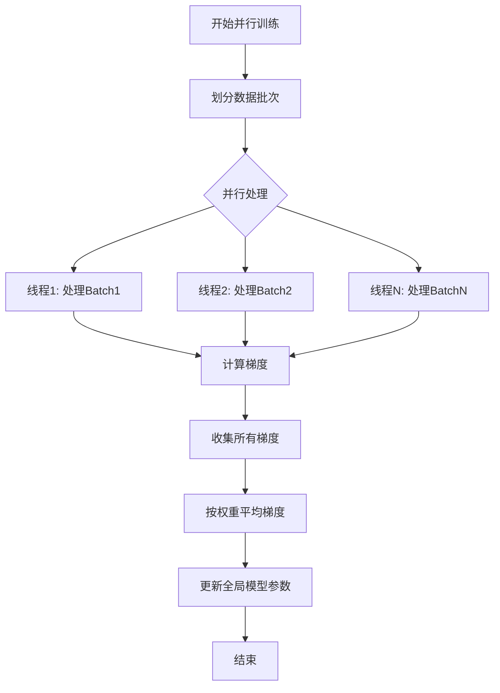

# 开发计划与未来方向

<cite>
**本文档引用文件**  
- [README.md](file://README.md)
- [Word2Vec.java](file://src/main/java/io/leavesfly/tinydl/modality/nlp/Word2Vec.java)
- [Transformer.java](file://src/main/java/io/leavesfly/tinydl/nnet/block/transformer/Transformer.java)
- [Encoder.java](file://src/main/java/io/leavesfly/tinydl/nnet/block/seq2seq/Encoder.java)
- [Decoder.java](file://src/main/java/io/leavesfly/tinydl/nnet/block/seq2seq/Decoder.java)
- [Trainer.java](file://src/main/java/io/leavesfly/tinydl/mlearning/Trainer.java)
</cite>

## 目录
1. [简介](#简介)
2. [TinyDL 0.02 版本规划](#tinydl-002-版本规划)
3. [已完成特性](#已完成特性)
4. [待完成特性](#待完成特性)
5. [长期愿景与技术路径](#长期愿景与技术路径)
6. [结语](#结语)

## 简介
本路线图基于项目 README.md 中的“开发计划”部分，旨在清晰阐述 TinyDL 框架的未来发展方向。文档详细列出 TinyDL 0.02 版本的规划特性，涵盖已完成和待完成的功能，并为每项功能提供技术描述与应用场景。同时，探讨框架的长期优化方向，鼓励社区贡献者参与核心功能的开发与实现。

## TinyDL 0.02 版本规划
TinyDL 0.02 版本将重点拓展自然语言处理（NLP）领域的模型支持，并提升框架的训练效率。该版本的开发计划已明确列出，部分功能已完成，其余功能正在规划中。

## 已完成特性

### 高维 NdArray 支持
**技术描述**：`NdArray` 类已扩展以支持更高维度的数据结构，为处理图像、视频和序列数据提供了基础支持。该类实现了标量、向量、矩阵及多维张量的统一表示与操作。
**应用场景**：支持卷积神经网络（CNN）处理图像数据，以及循环神经网络（RNN）处理时间序列数据。

### CNN 支持
**技术描述**：框架已实现 `ConvLayer`（卷积层）、`PoolingLayer`（池化层）等核心组件，并通过 `SimpleConvNet` 示例验证了其功能。
**应用场景**：计算机视觉任务，如手写数字识别（MNIST）、图像分类等。

### RNN 支持
**技术描述**：框架已实现 `SimpleRnnLayer` 和 `LstmLayer`，并提供了 `RnnCosExam` 示例，展示了其在序列预测任务中的应用。
**应用场景**：时间序列预测、语音识别、文本生成等需要处理序列数据的任务。

**Section sources**
- [README.md](file://README.md#L170-L173)

## 待完成特性

### Word2Vec 支持
**技术描述**：`Word2Vec` 类已在 `modality.nlp` 包中创建，继承自 `SequentialBlock`，目前处于待实现状态（`//todo`）。该模型将实现词嵌入（Word Embedding）功能，将离散的词汇映射到连续的向量空间。
**应用场景**：作为 NLP 任务的基础组件，用于文本分类、情感分析、机器翻译等，提升模型对语义的理解能力。
**Section sources**
- [Word2Vec.java](file://src/main/java/io/leavesfly/tinydl/modality/nlp/Word2Vec.java#L8-L13)

### Attention 机制
**技术描述**：Attention 机制尚未在代码库中实现。计划在 `nnet.block` 包中新增 `AttentionLayer`，用于计算输入序列中不同位置的重要性权重，从而实现对关键信息的关注。
**应用场景**：显著提升序列到序列（Seq2Seq）模型的性能，广泛应用于机器翻译、文本摘要等任务。

### Transformer 支持
**技术描述**：`Transformer` 类已在 `nnet.block.transformer` 包中定义，其结构基于编码器-解码器（Encoder-Decoder）架构。该类已集成 `Encoder` 和 `Decoder` 抽象类，但具体实现（如多头注意力、位置编码）仍为空（`//todo`）。
**应用场景**：作为现代 NLP 的基石，支持 BERT、GPT 等大型语言模型的构建，适用于问答系统、文本生成、代码生成等复杂任务。
**Section sources**
- [Transformer.java](file://src/main/java/io/leavesfly/tinydl/nnet/block/transformer/Transformer.java#L17-L46)
- [Encoder.java](file://src/main/java/io/leavesfly/tinydl/nnet/block/seq2seq/Encoder.java#L1-L14)
- [Decoder.java](file://src/main/java/io/leavesfly/tinydl/nnet/block/seq2seq/Decoder.java#L1-L19)

### GPT-2 支持
**技术描述**：GPT-2 模型的支持尚未开始。计划基于已实现的 `Transformer` 框架，构建一个仅包含解码器（Decoder-only）的自回归语言模型。
**应用场景**：高质量的文本生成，如文章续写、故事创作、对话系统等。

## 长期愿景与技术路径

### 训练效率优化与并行训练
**愿景**：提升框架的训练效率，支持并行训练，以应对更大规模的数据集和更复杂的模型。

**技术路径分析**：
1.  **多线程并行**：在 `Trainer` 类中，`parallelTrain` 方法已预留接口，计划实现按批次（batch）的并行训练。通过 Java 的多线程机制（如 `ExecutorService`），将不同批次的数据分发到多个线程进行前向传播和梯度计算，最后将梯度按权重平均后进行参数更新。
2.  **JNI 调用原生库**：为追求极致性能，可考虑通过 Java Native Interface (JNI) 调用高度优化的 C/C++ 或 CUDA 库（如 BLAS、cuDNN）来加速 `NdArray` 的底层计算，特别是矩阵乘法（`matMul`）和卷积操作。
3.  **分布式训练**：长远来看，可探索基于消息传递（如 MPI）或参数服务器架构的分布式训练方案，以支持跨多台机器的模型训练。

**Diagram sources**
- [Trainer.java](file://src/main/java/io/leavesfly/tinydl/mlearning/Trainer.java#L58-L61)

**Section sources**
- [Trainer.java](file://src/main/java/io/leavesfly/tinydl/mlearning/Trainer.java#L58-L61)

## 结语
TinyDL 的发展路线图清晰地展示了从基础功能到前沿模型的演进路径。我们诚挚邀请社区开发者参与到 Word2Vec、Attention、Transformer 等核心功能的实现中来。您的贡献将不仅加速 TinyDL 的成长，也将为 Java 生态中的深度学习研究和教育提供一个宝贵的工具。让我们携手共建一个更强大、更高效的轻量级深度学习框架。