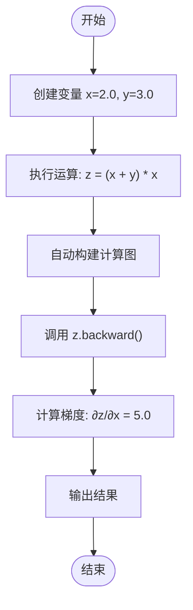
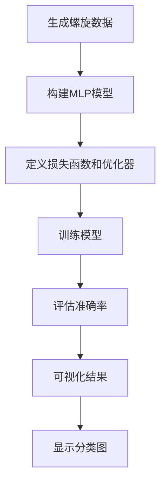

# 快速入门

<cite>
**本文档中引用的文件**  
- [pom.xml](file://pom.xml)
- [README.md](file://README.md)
- [Variable.java](file://src/main/java/io/leavesfly/tinydl/func/Variable.java)
- [Add.java](file://src/main/java/io/leavesfly/tinydl/func/base/Add.java)
- [Mul.java](file://src/main/java/io/leavesfly/tinydl/func/base/Mul.java)
- [Function.java](file://src/main/java/io/leavesfly/tinydl/func/Function.java)
- [SpiralMlpExam.java](file://src/main/java/io/leavesfly/tinydl/example/classify/SpiralMlpExam.java)
- [LineExam.java](file://src/main/java/io/leavesfly/tinydl/example/regress/LineExam.java)
- [Plot.java](file://src/main/java/io/leavesfly/tinydl/utils/Plot.java)
</cite>

## 目录
1. [环境准备](#环境准备)
2. [项目依赖配置](#项目依赖配置)
3. [编译与运行指令](#编译与运行指令)
4. [第一个示例：理解自动微分](#第一个示例理解自动微分)
5. [进阶示例：螺旋数据分类](#进阶示例螺旋数据分类)
6. [关键概念预览](#关键概念预览)

## 环境准备

在开始使用 TinyDL 之前，请确保您的开发环境已安装以下软件：
- **Java 8 或更高版本**：该框架基于 Java 8 构建，确保 `java` 和 `javac` 命令可用。
- **Maven 3.6 或更高版本**：用于项目依赖管理和构建。

您可以通过以下命令验证环境是否就绪：
```bash
java -version
mvn -version
```

**Section sources**
- [README.md](file://README.md#L25-L28)

## 项目依赖配置

TinyDL 的依赖通过 `pom.xml` 文件管理。您需要确保项目中已包含以下两个核心依赖：

1. **JFreeChart**：用于结果可视化。
2. **JUnit**：用于单元测试（仅测试阶段使用）。

以下是 `pom.xml` 中的相关配置片段：

```xml
<dependencies>
    <dependency>
        <groupId>jfree</groupId>
        <artifactId>jfreechart</artifactId>
        <version>1.0.7</version>
    </dependency>
    <dependency>
        <groupId>junit</groupId>
        <artifactId>junit</artifactId>
        <version>4.13.2</version>
        <scope>test</scope>
    </dependency>
</dependencies>
```

这些依赖已在项目中预配置，您无需手动修改，除非需要升级版本。

**Section sources**
- [pom.xml](file://pom.xml#L10-L28)

## 编译与运行指令

使用 Maven 可以轻松编译和运行项目。以下是常用命令：

```bash
# 编译项目
mvn clean compile

# 打包项目（生成 JAR）
mvn package

# 运行特定示例（以 SpiralMlpExam 为例）
java -cp target/classes io.leavesfly.tinydl.example.classify.SpiralMlpExam
```

编译成功后，`target/classes` 目录将包含所有编译后的 `.class` 文件，可直接通过 `java -cp` 命令运行。

**Section sources**
- [README.md](file://README.md#L190-L198)

## 第一个示例：理解自动微分

本示例将帮助您理解 TinyDL 的核心机制——**自动微分**。我们将创建变量、执行基本运算并调用 `backward()` 计算梯度。

### 核心代码流程

1. **创建变量**：使用 `NdArray` 封装数值，并通过 `Variable` 包装以支持梯度计算。
2. **执行运算**：如加法 (`add`) 和乘法 (`mul`)，这些操作会自动构建计算图。
3. **反向传播**：调用 `backward()` 自动计算所有输入变量的梯度。

例如，计算表达式 `z = (x + y) * x` 的梯度：

```java
Variable x = new Variable(new NdArray(2.0f)).setName("x");
Variable y = new Variable(new NdArray(3.0f)).setName("y");
Variable z = x.add(y).mul(x);
z.backward();
System.out.println("x的梯度: " + x.getGrad()); // 输出: 5.0
```

此过程展示了 **NdArray**（多维数组）、**Variable**（可微变量）和 **Function**（运算函数，如 `Add`、`Mul`）的协同工作。



**Diagram sources**
- [Variable.java](file://src/main/java/io/leavesfly/tinydl/func/Variable.java#L150-L170)
- [Add.java](file://src/main/java/io/leavesfly/tinydl/func/base/Add.java#L10-L30)
- [Mul.java](file://src/main/java/io/leavesfly/tinydl/func/base/Mul.java#L10-L25)

**Section sources**
- [Variable.java](file://src/main/java/io/leavesfly/tinydl/func/Variable.java#L1-L339)
- [LineExam.java](file://src/main/java/io/leavesfly/tinydl/example/regress/LineExam.java#L0-L79)

## 进阶示例：螺旋数据分类

接下来，我们将运行 `SpiralMlpExam.java` 示例，它展示了从数据生成到模型训练和可视化的完整流程。

### 运行指令

```bash
java -cp target/classes io.leavesfly.tinydl.example.classify.SpiralMlpExam
```

### 流程解析

1. **数据生成**：`SpiralDateSet` 生成三类螺旋分布的数据点。
2. **模型构建**：使用 `MlpBlock` 构建多层感知机（MLP），包含输入层、隐藏层和输出层。
3. **训练过程**：
   - 使用 `SGD` 优化器更新模型参数。
   - 损失函数为 `SoftmaxCrossEntropy`。
   - 每轮训练后计算准确率。
4. **可视化**：训练完成后，使用 `Plot` 类绘制原始数据和模型预测的分类边界。

### 预期输出

程序将输出每 30 轮的损失和准确率，例如：
```
i=0, loss:1.0986124 acc: 0.33333334
i=30, loss:1.0472249 acc: 0.36666667
...
i=299, loss:0.18432128 acc: 0.98333335
```

最终将弹出一个图表，显示原始螺旋数据（训练集）和模型预测的分类区域。



**Diagram sources**
- [SpiralMlpExam.java](file://src/main/java/io/leavesfly/tinydl/example/classify/SpiralMlpExam.java#L0-L130)
- [Plot.java](file://src/main/java/io/leavesfly/tinydl/utils/Plot.java#L1-L50)

**Section sources**
- [SpiralMlpExam.java](file://src/main/java/io/leavesfly/tinydl/example/classify/SpiralMlpExam.java#L0-L130)

## 关键概念预览

在本快速入门中，您首次接触了以下核心概念，它们将在后续深入学习中扮演重要角色：

- **NdArray**：多维数组的基础数据结构，支持各种数学运算。
- **Variable**：封装 `NdArray` 并支持自动微分的变量，是计算图的基本单元。
- **Layer**：神经网络的层，如全连接层、卷积层等。
- **Block**：由多个 `Layer` 组成的网络块，如 `MlpBlock`。
- **Trainer**：管理模型训练流程的组件，负责迭代、优化和评估。

这些概念构成了 TinyDL 的核心架构，后续章节将逐一深入解析。

**Section sources**
- [README.md](file://README.md#L35-L50)
- [SpiralMlpExam.java](file://src/main/java/leavesfly/tinydl/example/classify/SpiralMlpExam.java#L50-L100)
- [Variable.java](file://src/main/java/io/leavesfly/tinydl/func/Variable.java#L1-L339)