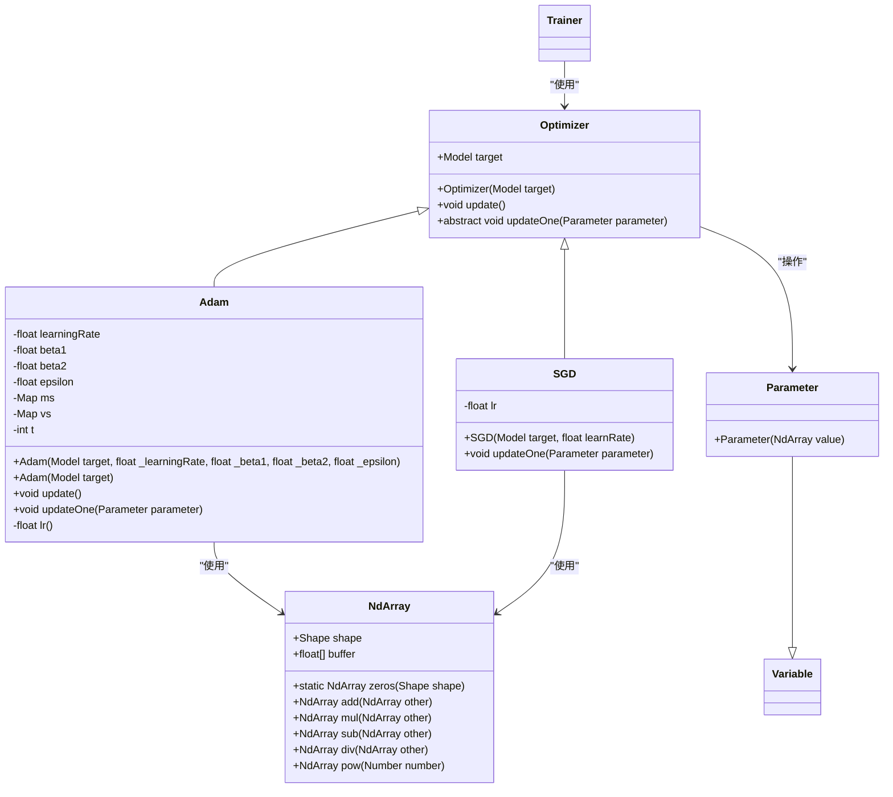
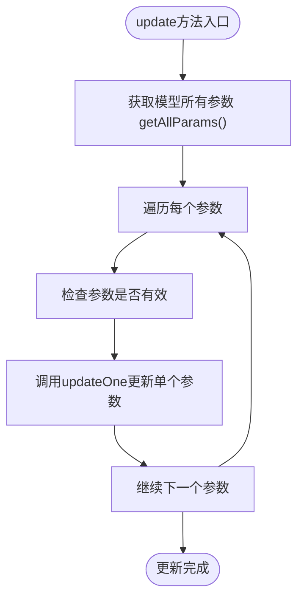
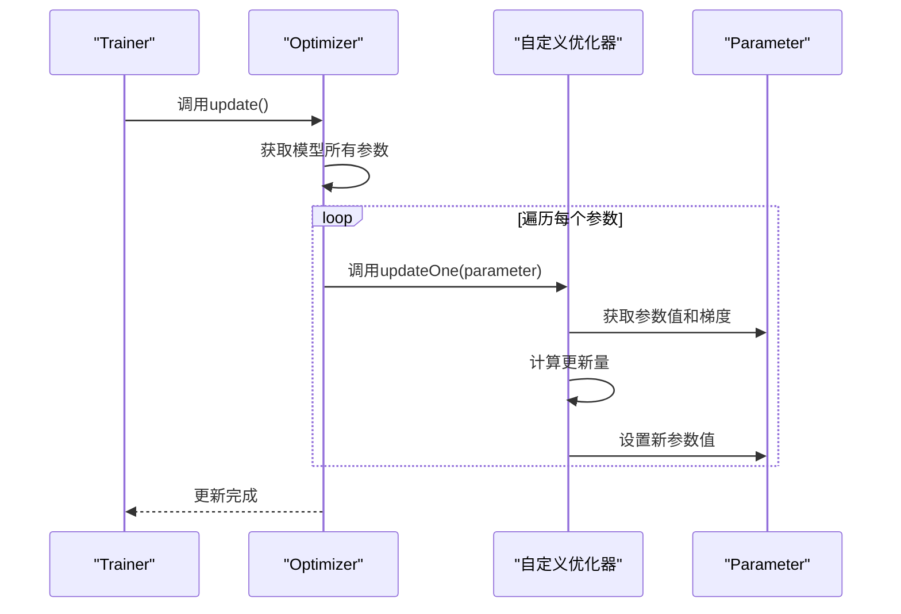
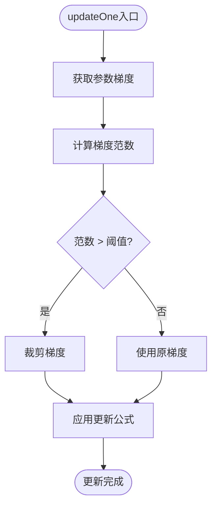

# 自定义优化器

<cite>
**本文档引用的文件**
- [Optimizer.java](file://src/main/java/io/leavesfly/tinydl/mlearning/optimize/Optimizer.java)
- [Adam.java](file://src/main/java/io/leavesfly/tinydl/mlearning/optimize/Adam.java)
- [SGD.java](file://src/main/java/io/leavesfly/tinydl/mlearning/optimize/SGD.java)
- [Parameter.java](file://src/main/java/io/leavesfly/tinydl/nnet/Parameter.java)
- [NdArray.java](file://src/main/java/io/leavesfly/tinydl/ndarr/NdArray.java)
- [Trainer.java](file://src/main/java/io/leavesfly/tinydl/mlearning/Trainer.java)
</cite>

## 目录
1. [简介](#简介)
2. [优化器架构概述](#优化器架构概述)
3. [核心组件分析](#核心组件分析)
4. [自定义优化器实现指南](#自定义优化器实现指南)
5. [RMSprop实现模板](#rmsprop实现模板)
6. [Adagrad实现思路](#adagrad实现思路)
7. [高级优化技巧集成](#高级优化技巧集成)
8. [常见陷阱与解决方案](#常见陷阱与解决方案)
9. [结论](#结论)

## 简介
本文档旨在为开发者提供详细的指导，说明如何通过继承`Optimizer`抽象类来实现新的优化算法，如RMSprop或Adagrad。文档将深入解析`update`方法的核心逻辑，展示如何遍历模型参数并根据其梯度和历史信息更新参数值。通过分析Adam优化器的实现，阐明如何管理多个状态变量（如一阶和二阶矩估计），并强调学习率调度、梯度裁剪等通用优化技巧的集成方式。同时，指出实现过程中可能遇到的常见陷阱，如状态变量初始化不当或更新公式中的数值不稳定问题。

## 优化器架构概述



**图示来源**
- [Optimizer.java](file://src/main/java/io/leavesfly/tinydl/mlearning/optimize/Optimizer.java#L1-L28)
- [Adam.java](file://src/main/java/io/leavesfly/tinydl/mlearning/optimize/Adam.java#L1-L70)
- [SGD.java](file://src/main/java/io/leavesfly/tinydl/mlearning/optimize/SGD.java#L1-L22)
- [Parameter.java](file://src/main/java/io/leavesfly/tinydl/nnet/Parameter.java#L1-L13)
- [NdArray.java](file://src/main/java/io/leavesfly/tinydl/ndarr/NdArray.java#L1-L800)

**本节来源**
- [Optimizer.java](file://src/main/java/io/leavesfly/tinydl/mlearning/optimize/Optimizer.java#L1-L28)
- [Adam.java](file://src/main/java/io/leavesfly/tinydl/mlearning/optimize/Adam.java#L1-L70)
- [SGD.java](file://src/main/java/io/leavesfly/tinydl/mlearning/optimize/SGD.java#L1-L22)

## 核心组件分析

### Optimizer抽象类
`Optimizer`是所有优化算法的基类，定义了优化器的基本行为和接口。它通过持有`Model`对象来访问需要优化的参数，并提供`update`方法作为优化过程的入口点。



**图示来源**
- [Optimizer.java](file://src/main/java/io/leavesfly/tinydl/mlearning/optimize/Optimizer.java#L15-L25)

**本节来源**
- [Optimizer.java](file://src/main/java/io/leavesfly/tinydl/mlearning/optimize/Optimizer.java#L1-L28)

### Parameter参数类
`Parameter`类继承自`Variable`，代表神经网络中需要训练的参数。它封装了参数值（`NdArray`）和梯度信息，是优化器操作的基本单位。

**本节来源**
- [Parameter.java](file://src/main/java/io/leavesfly/tinydl/nnet/Parameter.java#L1-L13)

### NdArray数值数组
`NdArray`类提供了多维数组的存储和基本数学运算支持，是参数值和梯度的实际载体。它支持加、减、乘、除、幂运算等基本操作，为优化算法的实现提供了基础。

**本节来源**
- [NdArray.java](file://src/main/java/io/leavesfly/tinydl/ndarr/NdArray.java#L1-L800)

## 自定义优化器实现指南

### 继承Optimizer抽象类
要实现新的优化算法，首先需要创建一个继承自`Optimizer`的类。子类必须实现`updateOne`抽象方法，该方法定义了单个参数的更新逻辑。



**图示来源**
- [Optimizer.java](file://src/main/java/io/leavesfly/tinydl/mlearning/optimize/Optimizer.java#L15-L25)
- [Adam.java](file://src/main/java/io/leavesfly/tinydl/mlearning/optimize/Adam.java#L50-L70)

**本节来源**
- [Optimizer.java](file://src/main/java/io/leavesfly/tinydl/mlearning/optimize/Optimizer.java#L1-L28)
- [Adam.java](file://src/main/java/io/leavesfly/tinydl/mlearning/optimize/Adam.java#L1-L70)

### updateOne方法核心逻辑
`updateOne`方法是优化算法的核心，负责根据参数的梯度和历史信息计算新的参数值。基本流程包括：
1. 获取参数的当前值和梯度
2. 根据优化算法的公式计算更新量
3. 更新参数值

**本节来源**
- [Optimizer.java](file://src/main/java/io/leavesfly/tinydl/mlearning/optimize/Optimizer.java#L27)
- [Adam.java](file://src/main/java/io/leavesfly/tinydl/mlearning/optimize/Adam.java#L50-L70)

## RMSprop实现模板

### RMSprop算法原理
RMSprop通过维护梯度平方的移动平均来调整学习率，使得在梯度较大的方向上学习率较小，在梯度较小的方向上学习率较大，从而加速收敛。

### 实现代码框架
```java
public class RMSprop extends Optimizer {
    private float learningRate;
    private float decayRate;
    private float epsilon;
    private Map<Integer, NdArray> squareGrads;
    private int t;

    public RMSprop(Model target, float lr, float decay, float eps) {
        super(target);
        learningRate = lr;
        decayRate = decay;
        epsilon = eps;
        squareGrads = new HashMap<>();
        t = 0;
    }

    @Override
    public void update() {
        t++;
        super.update();
    }

    @Override
    public void updateOne(Parameter parameter) {
        int key = parameter.hashCode();
        if (!squareGrads.containsKey(key)) {
            squareGrads.put(key, NdArray.zeros(parameter.getValue().getShape()));
        }
        
        NdArray squareGrad = squareGrads.get(key);
        NdArray grad = parameter.getGrad();

        // 更新梯度平方的移动平均
        squareGrad = squareGrad.mulNum(decayRate)
                .add(grad.mul(grad).mulNum(1 - decayRate));
        squareGrads.put(key, squareGrad);

        // 计算更新量
        NdArray delta = grad.mulNum(learningRate)
                .div(squareGrad.pow(0.5f).add(NdArray.like(squareGrad.getShape(), epsilon)));
        
        // 更新参数
        parameter.setValue(parameter.getValue().sub(delta));
    }
}
```

**本节来源**
- [Adam.java](file://src/main/java/io/leavesfly/tinydl/mlearning/optimize/Adam.java#L50-L70)
- [NdArray.java](file://src/main/java/io/leavesfly/tinydl/ndarr/NdArray.java#L1-L800)

## Adagrad实现思路

### Adagrad算法特点
Adagrad为每个参数维护一个独立的学习率，该学习率与历史梯度的平方和的平方根成反比。随着训练进行，频繁更新的参数学习率会逐渐减小，而稀疏更新的参数学习率保持较大。

### 关键实现步骤
1. 为每个参数维护一个累积梯度平方和
2. 在每次更新时，使用累积值调整学习率
3. 注意累积值会持续增长，可能导致学习率过早衰减

**本节来源**
- [Adam.java](file://src/main/java/io/leavesfly/tinydl/mlearning/optimize/Adam.java#L50-L70)
- [NdArray.java](file://src/main/java/io/leavesfly/tinydl/ndarr/NdArray.java#L1-L800)

## 高级优化技巧集成

### 学习率调度
学习率调度可以通过在`update`方法中动态调整`learningRate`字段来实现。例如，可以实现指数衰减、余弦退火等策略。

### 梯度裁剪
梯度裁剪可以在`updateOne`方法中实现，通过检查梯度的范数并在超过阈值时进行缩放。



**图示来源**
- [Adam.java](file://src/main/java/io/leavesfly/tinydl/mlearning/optimize/Adam.java#L50-L70)

**本节来源**
- [Adam.java](file://src/main/java/io/leavesfly/tinydl/mlearning/optimize/Adam.java#L50-L70)
- [NdArray.java](file://src/main/java/io/leavesfly/tinydl/ndarr/NdArray.java#L1-L800)

## 常见陷阱与解决方案

### 状态变量初始化
状态变量（如动量、梯度平方和）应在首次访问时初始化为零数组，形状与对应参数相同。

### 数值稳定性
在涉及除法的操作中，应添加小的常数（如`epsilon`）以避免除零错误。同时，注意浮点数精度问题可能导致的数值溢出或下溢。

### 线程安全
如果在多线程环境中使用，需要确保状态变量的访问是线程安全的。

**本节来源**
- [Adam.java](file://src/main/java/io/leavesfly/tinydl/mlearning/optimize/Adam.java#L50-L70)
- [NdArray.java](file://src/main/java/io/leavesfly/tinydl/ndarr/NdArray.java#L1-L800)

## 结论
通过继承`Optimizer`抽象类，开发者可以灵活地实现各种优化算法。关键在于正确实现`updateOne`方法，合理管理状态变量，并注意数值稳定性和性能优化。结合学习率调度和梯度裁剪等技巧，可以进一步提升模型的训练效果。