# 自定义数据集

<cite>
**本文档中引用的文件**   
- [DataSet.java](file://src/main/java/io/leavesfly/tinydl/mlearning/dataset/DataSet.java)
- [ArrayDataset.java](file://src/main/java/io/leavesfly/tinydl/mlearning/dataset/ArrayDataset.java)
- [StreamDataset.java](file://src/main/java/io/leavesfly/tinydl/mlearning/dataset/StreamDataset.java)
- [Batch.java](file://src/main/java/io/leavesfly/tinydl/mlearning/dataset/Batch.java)
- [MnistDataSet.java](file://src/main/java/io/leavesfly/tinydl/mlearning/dataset/simple/MnistDataSet.java)
- [NdArray.java](file://src/main/java/io/leavesfly/tinydl/ndarr/NdArray.java)
- [Variable.java](file://src/main/java/io/leavesfly/tinydl/func/Variable.java)
- [Util.java](file://src/main/java/io/leavesfly/tinydl/utils/Util.java)
</cite>

## 目录
1. [简介](#简介)
2. [核心组件](#核心组件)
3. [继承DataSet抽象类](#继承dataset抽象类)
4. [实现核心方法](#实现核心方法)
5. [CSV回归数据集实现模板](#csv回归数据集实现模板)
6. [与Batch和DataLoader协同工作](#与batch和dataloader协同工作)
7. [数据预处理与内存管理](#数据预处理与内存管理)
8. [流式数据集与内存数据集对比](#流式数据集与内存数据集对比)
9. [大数据场景实现策略](#大数据场景实现策略)
10. [常见问题与解决方案](#常见问题与解决方案)

## 简介
本文档详细指导开发者如何通过继承DataSet抽象类来加载自定义数据集。文档涵盖了需要实现的核心方法，如size()返回样本总数，get(int index)返回单个样本的NdArray数据，以及如何与Batch和DataLoader协同工作。提供了一个从CSV文件加载回归数据的实现模板，展示了如何解析文本、转换为NdArray并封装为Variable。结合MnistDataSet.java的实现，解释了数据预处理（如归一化）和内存管理的最佳实践。讨论了流式数据集（StreamDataset）与内存数据集的区别，并指导在大数据场景下的实现策略。最后指出常见问题，如数据维度不一致或批处理时的随机采样偏差。

**Section sources**
- [DataSet.java](file://src/main/java/io/leavesfly/tinydl/mlearning/dataset/DataSet.java#L1-L62)

## 核心组件

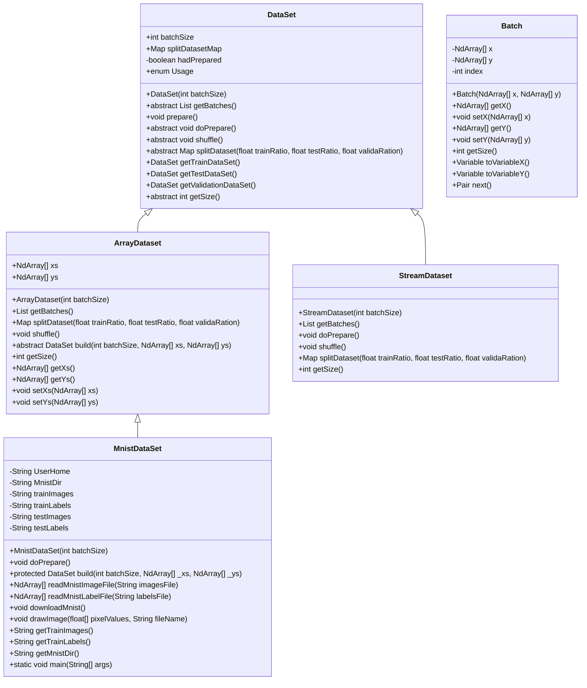

**Diagram sources**
- [DataSet.java](file://src/main/java/io/leavesfly/tinydl/mlearning/dataset/DataSet.java#L1-L62)
- [ArrayDataset.java](file://src/main/java/io/leavesfly/tinydl/mlearning/dataset/ArrayDataset.java#L1-L116)
- [StreamDataset.java](file://src/main/java/io/leavesfly/tinydl/mlearning/dataset/StreamDataset.java#L1-L37)
- [Batch.java](file://src/main/java/io/leavesfly/tinydl/mlearning/dataset/Batch.java#L1-L68)
- [MnistDataSet.java](file://src/main/java/io/leavesfly/tinydl/mlearning/dataset/simple/MnistDataSet.java#L1-L181)

**Section sources**
- [DataSet.java](file://src/main/java/io/leavesfly/tinydl/mlearning/dataset/DataSet.java#L1-L62)
- [ArrayDataset.java](file://src/main/java/io/leavesfly/tinydl/mlearning/dataset/ArrayDataset.java#L1-L116)
- [StreamDataset.java](file://src/main/java/io/leavesfly/tinydl/mlearning/dataset/StreamDataset.java#L1-L37)
- [Batch.java](file://src/main/java/io/leavesfly/tinydl/mlearning/dataset/Batch.java#L1-L68)
- [MnistDataSet.java](file://src/main/java/io/leavesfly/tinydl/mlearning/dataset/simple/MnistDataSet.java#L1-L181)

## 继承DataSet抽象类

要创建自定义数据集，开发者需要继承DataSet抽象类并实现其抽象方法。DataSet类提供了数据集的基本框架，包括批量大小、数据准备、数据打散、数据集分割等功能。ArrayDataset是DataSet的一个具体实现，适用于可以完全加载到内存中的数据集，而StreamDataset则用于处理无法一次性加载到内存的大型数据集。

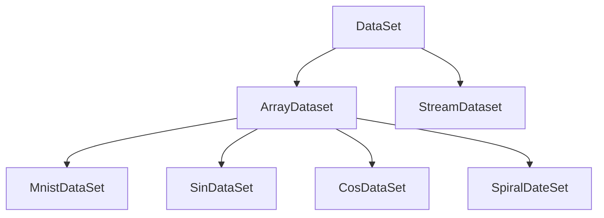

**Diagram sources**
- [DataSet.java](file://src/main/java/io/leavesfly/tinydl/mlearning/dataset/DataSet.java#L1-L62)
- [ArrayDataset.java](file://src/main/java/io/leavesfly/tinydl/mlearning/dataset/ArrayDataset.java#L1-L116)
- [StreamDataset.java](file://src/main/java/io/leavesfly/tinydl/mlearning/dataset/StreamDataset.java#L1-L37)
- [MnistDataSet.java](file://src/main/java/io/leavesfly/tinydl/mlearning/dataset/simple/MnistDataSet.java#L1-L181)

**Section sources**
- [DataSet.java](file://src/main/java/io/leavesfly/tinydl/mlearning/dataset/DataSet.java#L1-L62)
- [ArrayDataset.java](file://src/main/java/io/leavesfly/tinydl/mlearning/dataset/ArrayDataset.java#L1-L116)
- [StreamDataset.java](file://src/main/java/io/leavesfly/tinydl/mlearning/dataset/StreamDataset.java#L1-L37)

## 实现核心方法

### size()方法
size()方法用于返回数据集中的样本总数。在ArrayDataset中，该方法直接返回xs数组的长度。

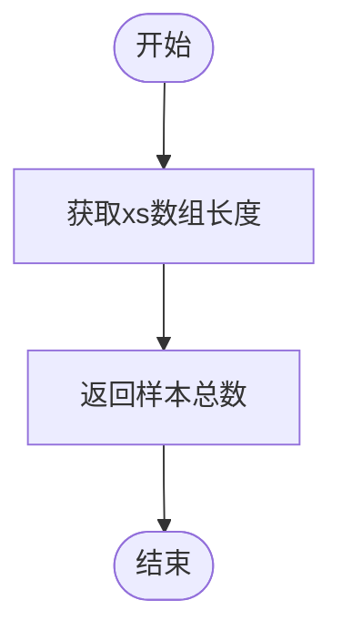

**Diagram sources**
- [ArrayDataset.java](file://src/main/java/io/leavesfly/tinydl/mlearning/dataset/ArrayDataset.java#L100-L103)

### get(int index)方法
get(int index)方法用于返回指定索引处的样本数据。在ArrayDataset中，该方法返回xs和ys数组中对应索引的NdArray对象。

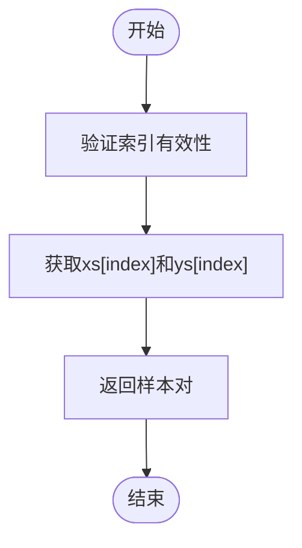

**Diagram sources**
- [ArrayDataset.java](file://src/main/java/io/leavesfly/tinydl/mlearning/dataset/ArrayDataset.java#L105-L114)

**Section sources**
- [ArrayDataset.java](file://src/main/java/io/leavesfly/tinydl/mlearning/dataset/ArrayDataset.java#L82-L115)

## CSV回归数据集实现模板

以下是一个从CSV文件加载回归数据的实现模板：

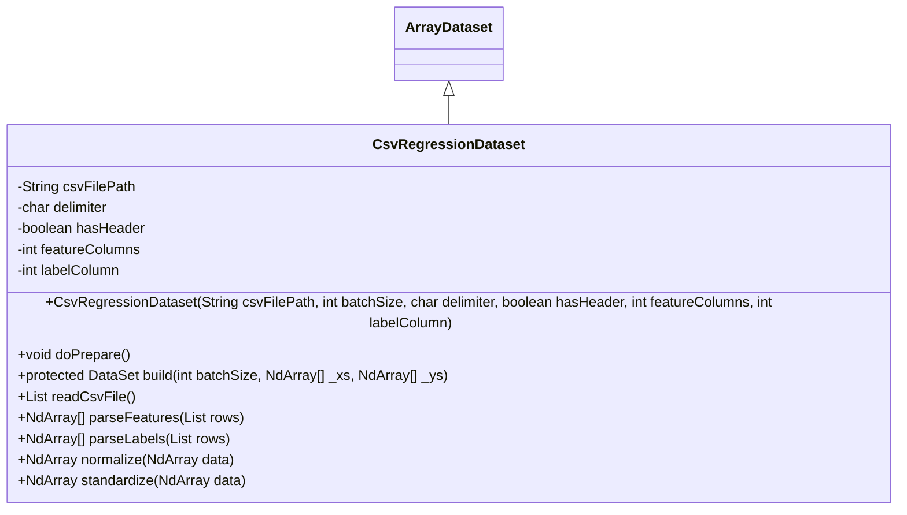

**Diagram sources**
- [ArrayDataset.java](file://src/main/java/io/leavesfly/tinydl/mlearning/dataset/ArrayDataset.java#L1-L116)

## 与Batch和DataLoader协同工作

### Batch类
Batch类用于封装一批数据，包含输入数据x和标签数据y。Batch类提供了toVariableX()和toVariableY()方法，将NdArray数组转换为Variable对象，以便在神经网络中使用。

```mermaid
classDiagram
class Batch {
-NdArray[] x
-NdArray[] y
-int index
+Batch(NdArray[] x, NdArray[] y)
+NdArray[] getX()
+void setX(NdArray[] x)
+NdArray[] getY()
+void setY(NdArray[] y)
+int getSize()
+Variable toVariableX()
+Variable toVariableY()
+Pair<NdArray, NdArray> next()
}
class Variable {
-String name
-NdArray value
-NdArray grad
-Function creator
-boolean requireGrad
+Variable(NdArray _value)
+Variable(Number number)
+Variable(NdArray _value, String _name)
+Variable(NdArray _value, String _name, boolean _requireGrad)
+void backward()
+void unChainBackward()
+void clearGrad()
+NdArray getValue()
+NdArray getGrad()
+Function getCreator()
+String getName()
+Variable setName(String name)
+Variable add(Variable other)
+Variable sub(Variable other)
+Variable mul(Variable other)
+Variable div(Variable other)
+Variable neg()
+Variable squ()
+Variable pow(float pow)
+Variable exp()
+Variable sin()
+Variable cos()
+Variable log()
+Variable tanh()
+Variable softMax()
+Variable clip(float min, float max)
+Variable max(int _axis, boolean _keepdims)
+Variable min(int _axis, boolean _keepdims)
+Variable broadcastTo(Shape shape)
+Variable matMul(Variable other)
+Variable reshape(Shape shape)
+Variable sum()
+Variable sumTo(Shape shape)
+Variable transpose()
+Variable linear(Variable w, Variable b)
+Variable getItem(int[] _rowSlices, int[] _colSlices)
+Variable meanSquaredError(Variable other)
+Variable softmaxCrossEntropy(Variable other)
}
class NdArray {
-Shape shape
-float[] buffer
+NdArray()
+NdArray(Number number)
+NdArray(float[] data, Shape shape)
+NdArray(float[] data)
+NdArray(float[][] data)
+NdArray(float[][][] data)
+NdArray(float[][][][] data)
+NdArray(Shape _shape)
+static NdArray zeros(Shape shape)
+static NdArray ones(Shape _shape)
+static NdArray eye(Shape _shape)
+static NdArray like(Shape _shape, Number number)
+NdArray like(Number number)
+static NdArray likeRandomN(Shape _shape)
+static NdArray likeRandom(float min, float max, Shape _shape)
+static NdArray linSpace(float min, float max, int num)
+NdArray add(NdArray other)
+NdArray sub(NdArray other)
+NdArray mul(NdArray other)
+NdArray mulNum(Number number)
+NdArray div(NdArray other)
+NdArray divNum(Number number)
+NdArray neg()
+NdArray abs()
+NdArray eq(NdArray other)
+NdArray gt(NdArray other)
+NdArray lt(NdArray other)
+boolean isLar(NdArray other)
+NdArray pow(Number number)
+NdArray square()
+NdArray sqrt()
+NdArray exp()
+NdArray sin()
+NdArray cos()
+NdArray tanh()
+NdArray sigmoid()
+NdArray log()
+NdArray softMax()
+NdArray maximum(Number number)
+NdArray mask(Number number)
+NdArray transpose()
+NdArray transpose(int... order)
+NdArray reshape(Shape _shape)
+NdArray flatten()
+NdArray mean(int axis)
+NdArray var(int axis)
+NdArray sum()
+NdArray sum(int axis)
}
Batch --> Variable : "转换为"
Batch --> NdArray : "包含"
Variable --> NdArray : "包含"
```

**Diagram sources**
- [Batch.java](file://src/main/java/io/leavesfly/tinydl/mlearning/dataset/Batch.java#L1-L68)
- [Variable.java](file://src/main/java/io/leavesfly/tinydl/func/Variable.java#L1-L338)
- [NdArray.java](file://src/main/java/io/leavesfly/tinydl/ndarr/NdArray.java#L1-L1351)

**Section sources**
- [Batch.java](file://src/main/java/io/leavesfly/tinydl/mlearning/dataset/Batch.java#L1-L68)
- [Variable.java](file://src/main/java/io/leavesfly/tinydl/func/Variable.java#L1-L338)
- [NdArray.java](file://src/main/java/io/leavesfly/tinydl/ndarr/NdArray.java#L1-L1351)

## 数据预处理与内存管理

### 数据预处理
在MnistDataSet中，数据预处理包括下载MNIST数据集、读取图像和标签文件、归一化像素值等步骤。归一化是将像素值从0-255范围缩放到0-1范围，这有助于提高模型训练的稳定性和收敛速度。

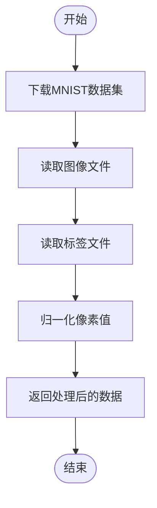

**Diagram sources**
- [MnistDataSet.java](file://src/main/java/io/leavesfly/tinydl/mlearning/dataset/simple/MnistDataSet.java#L47-L72)

### 内存管理
ArrayDataset将所有数据加载到内存中，适用于小型数据集。对于大型数据集，应使用StreamDataset逐批加载数据，以避免内存溢出。

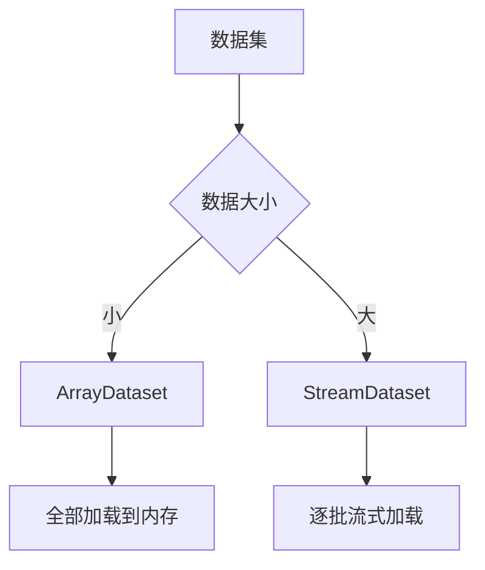

**Diagram sources**
- [ArrayDataset.java](file://src/main/java/io/leavesfly/tinydl/mlearning/dataset/ArrayDataset.java#L1-L116)
- [StreamDataset.java](file://src/main/java/io/leavesfly/tinydl/mlearning/dataset/StreamDataset.java#L1-L37)

**Section sources**
- [MnistDataSet.java](file://src/main/java/io/leavesfly/tinydl/mlearning/dataset/simple/MnistDataSet.java#L47-L72)
- [ArrayDataset.java](file://src/main/java/io/leavesfly/tinydl/mlearning/dataset/ArrayDataset.java#L1-L116)
- [StreamDataset.java](file://src/main/java/io/leavesfly/tinydl/mlearning/dataset/StreamDataset.java#L1-L37)

## 流式数据集与内存数据集对比

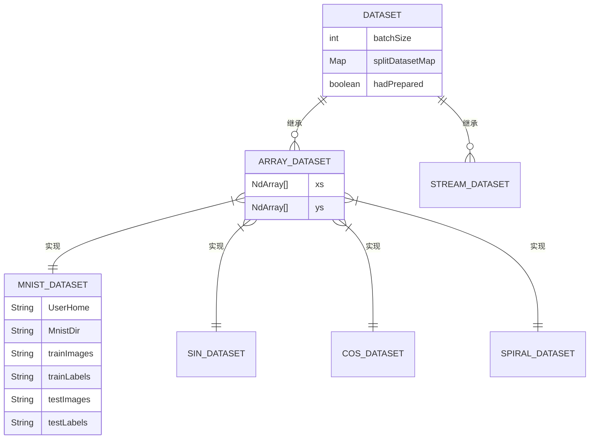

**Diagram sources**
- [DataSet.java](file://src/main/java/io/leavesfly/tinydl/mlearning/dataset/DataSet.java#L1-L62)
- [ArrayDataset.java](file://src/main/java/io/leavesfly/tinydl/mlearning/dataset/ArrayDataset.java#L1-L116)
- [StreamDataset.java](file://src/main/java/io/leavesfly/tinydl/mlearning/dataset/StreamDataset.java#L1-L37)
- [MnistDataSet.java](file://src/main/java/io/leavesfly/tinydl/mlearning/dataset/simple/MnistDataSet.java#L1-L181)

## 大数据场景实现策略

在处理大数据场景时，应采用流式数据集（StreamDataset）策略，逐批加载数据，避免内存溢出。同时，可以结合数据预取和缓存机制，提高数据加载效率。

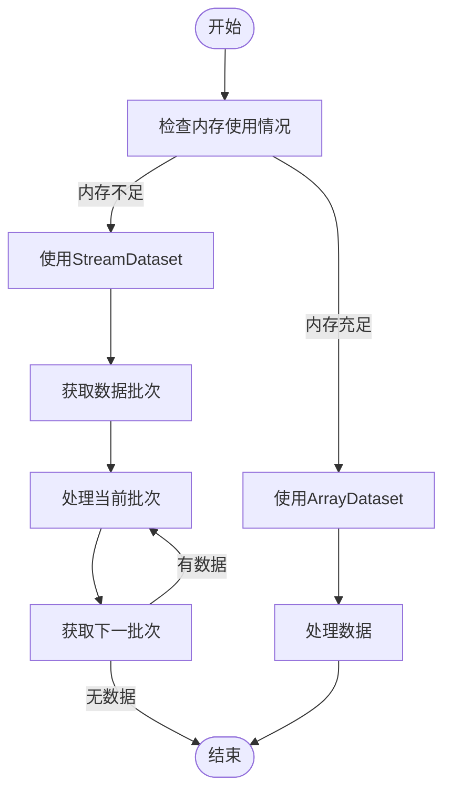

**Diagram sources**
- [ArrayDataset.java](file://src/main/java/io/leavesfly/tinydl/mlearning/dataset/ArrayDataset.java#L1-L116)
- [StreamDataset.java](file://src/main/java/io/leavesfly/tinydl/mlearning/dataset/StreamDataset.java#L1-L37)

## 常见问题与解决方案

### 数据维度不一致
确保输入数据和标签数据的维度一致，特别是在处理多维数据时。

### 批处理时的随机采样偏差
使用shuffle()方法对数据进行随机打散，避免批处理时的采样偏差。

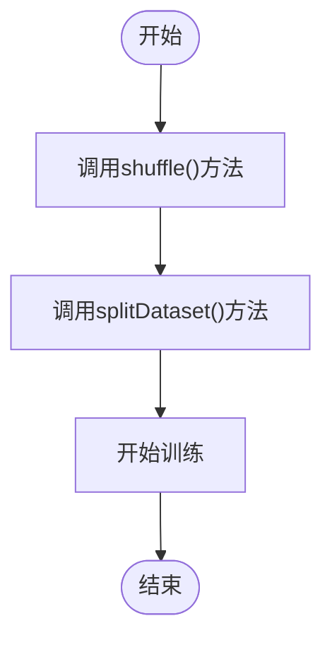

**Diagram sources**
- [ArrayDataset.java](file://src/main/java/io/leavesfly/tinydl/mlearning/dataset/ArrayDataset.java#L78-L81)

**Section sources**
- [ArrayDataset.java](file://src/main/java/io/leavesfly/tinydl/mlearning/dataset/ArrayDataset.java#L78-L81)
- [Util.java](file://src/main/java/io/leavesfly/tinydl/utils/Util.java#L25-L30)