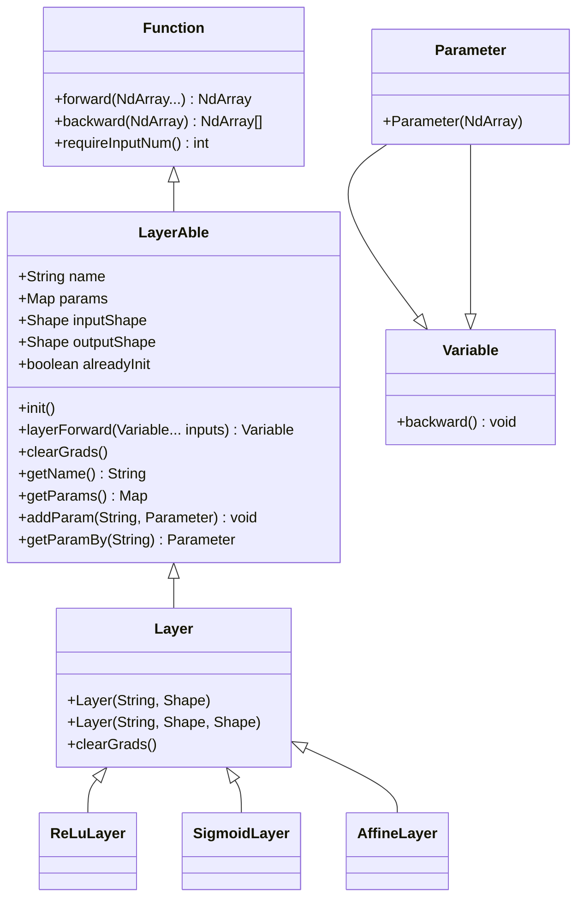

# 自定义神经网络层

<cite>
**本文档中引用的文件**  
- [LayerAble.java](file://src/main/java/io/leavesfly/tinydl/nnet/LayerAble.java)
- [Layer.java](file://src/main/java/io/leavesfly/tinydl/nnet/Layer.java)
- [ReLuLayer.java](file://src/main/java/io/leavesfly/tinydl/nnet/layer/activate/ReLuLayer.java)
- [SigmoidLayer.java](file://src/main/java/io/leavesfly/tinydl/nnet/layer/activate/SigmoidLayer.java)
- [AffineLayer.java](file://src/main/java/io/leavesfly/tinydl/nnet/layer/dnn/AffineLayer.java)
- [Parameter.java](file://src/main/java/io/leavesfly/tinydl/nnet/Parameter.java)
- [Variable.java](file://src/main/java/io/leavesfly/tinydl/func/Variable.java)
- [Function.java](file://src/main/java/io/leavesfly/tinydl/func/Function.java)
</cite>

## 目录
1. [引言](#引言)
2. [核心接口与类结构](#核心接口与类结构)
3. [实现LayerAble接口](#实现layerable接口)
4. [前向传播与反向传播](#前向传播与反向传播)
5. [参数管理与注册](#参数管理与注册)
6. [自定义Swish激活层示例](#自定义swish激活层示例)
7. [梯度验证方法](#梯度验证方法)
8. [常见错误与最佳实践](#常见错误与最佳实践)
9. [结论](#结论)

## 引言
在TinyDL框架中，开发者可以通过实现`LayerAble`接口来自定义神经网络层。本指南详细说明如何正确实现自定义层，包括前向传播、反向传播、参数管理以及梯度验证等关键环节。通过参考现有实现如`ReLuLayer`，开发者可以快速掌握最佳实践并避免常见错误。

## 核心接口与类结构



**图示来源**  
- [LayerAble.java](file://src/main/java/io/leavesfly/tinydl/nnet/LayerAble.java#L13-L82)
- [Layer.java](file://src/main/java/io/leavesfly/tinydl/nnet/Layer.java#L0-L33)
- [Parameter.java](file://src/main/java/io/leavesfly/tinydl/nnet/Parameter.java#L0-L12)

**本节来源**  
- [LayerAble.java](file://src/main/java/io/leavesfly/tinydl/nnet/LayerAble.java#L0-L82)
- [Layer.java](file://src/main/java/io/leavesfly/tinydl/nnet/Layer.java#L0-L33)

## 实现LayerAble接口

`LayerAble`是所有神经网络层的抽象基类，继承自`Function`，并定义了层的基本行为。开发者应继承`Layer`类（而非直接实现`LayerAble`），因为`Layer`已提供了参数管理和初始化的基础实现。

关键方法包括：
- `init()`：初始化层的参数，仅在首次调用时执行
- `layerForward(Variable... inputs)`：执行前向传播，返回输出变量
- `clearGrads()`：清除所有参数的梯度

```java
public abstract class Layer extends LayerAble {
    public Layer(String _name, Shape _inputShape) {
        name = _name;
        this.params = new HashMap<>();
        inputShape = _inputShape;
    }
}
```

**本节来源**  
- [LayerAble.java](file://src/main/java/io/leavesfly/tinydl/nnet/LayerAble.java#L13-L82)
- [Layer.java](file://src/main/java/io/leavesfly/tinydl/nnet/Layer.java#L0-L33)

## 前向传播与反向传播

### 前向传播
`layerForward`方法接收输入`Variable`对象，执行计算并返回输出`Variable`。输入不包含内部参数，参数通过`addParam`注册。

```java
@Override
public Variable layerForward(Variable... inputs) {
    return new ReLu().call(inputs[0]);
}
```

### 反向传播
反向传播由框架自动通过`Variable.backward()`触发。开发者无需重写`backward`方法，但必须确保前向传播中保留必要的中间变量，以便自动微分系统正确计算梯度。

例如，`ReLuLayer`通过调用`new ReLu().call()`构建计算图，框架会自动调用`ReLu`的`backward`方法。

**本节来源**  
- [ReLuLayer.java](file://src/main/java/io/leavesfly/tinydl/nnet/layer/activate/ReLuLayer.java#L0-L51)
- [Function.java](file://src/main/java/io/leavesfly/tinydl/func/Function.java#L63-L71)
- [Variable.java](file://src/main/java/io/leavesfly/tinydl/func/Variable.java#L88-L112)

## 参数管理与注册

自定义层中的可训练参数必须声明为`Parameter`类型，并通过`addParam`方法注册到参数列表中。`Parameter`继承自`Variable`，表示需要梯度更新的张量。

```java
public class AffineLayer extends Layer {
    private Parameter wParam;
    private Parameter bParam;

    @Override
    public void init() {
        if (!alreadyInit) {
            wParam = new Parameter(initWeight);
            wParam.setName("w");
            addParam(wParam.getName(), wParam);

            if (needBias) {
                bParam = new Parameter(zeros);
                bParam.setName("b");
                addParam(bParam.getName(), bParam);
            }
            alreadyInit = true;
        }
    }
}
```

注册后，优化器（如SGD、Adam）可通过`getParams()`获取所有参数并进行更新。

**本节来源**  
- [AffineLayer.java](file://src/main/java/io/leavesfly/tinydl/nnet/layer/dnn/AffineLayer.java#L0-L51)
- [Parameter.java](file://src/main/java/io/leavesfly/tinydl/nnet/Parameter.java#L0-L12)
- [LayerAble.java](file://src/main/java/io/leavesfly/tinydl/nnet/LayerAble.java#L50-L55)

## 自定义Swish激活层示例

Swish激活函数定义为：f(x) = x * sigmoid(x)。以下是其实现模板：

```java
public class SwishLayer extends Layer {

    public SwishLayer(String name) {
        super(name, null, null);
    }

    @Override
    public void init() {
        // 无内部参数，无需初始化
    }

    @Override
    public Variable layerForward(Variable... inputs) {
        Variable x = inputs[0];
        Variable sigmoidX = new Sigmoid().call(x);
        return x.mul(sigmoidX); // f(x) = x * sigmoid(x)
    }

    @Override
    public int requireInputNum() {
        return 1;
    }
}
```

该实现结合了`Sigmoid`函数和乘法操作，构建了完整的计算图，支持自动微分。

**本节来源**  
- [SigmoidLayer.java](file://src/main/java/io/leavesfly/tinydl/nnet/layer/activate/SigmoidLayer.java#L0-L42)
- [ReLuLayer.java](file://src/main/java/io/leavesfly/tinydl/nnet/layer/activate/ReLuLayer.java#L0-L51)
- [Function.java](file://src/main/java/io/leavesfly/tinydl/func/Function.java#L63-L71)

## 梯度验证方法

为确保自定义层的反向传播正确，建议使用**数值梯度检查**方法：

1. 对某个参数添加微小扰动 ε（如1e-5）
2. 计算前向传播的输出变化 ΔL
3. 数值梯度 ≈ ΔL / (2ε)
4. 与反向传播得到的解析梯度比较，两者应接近

例如，可编写测试用例，对`SwishLayer`的输入施加扰动，验证梯度是否一致。

**本节来源**  
- [TestLayer.java](file://src/test/java/io/leavesfly/tinydl/test/TestLayer.java#L0-L7)
- [Variable.java](file://src/main/java/io/leavesfly/tinydl/func/Variable.java#L88-L112)

## 常见错误与最佳实践

### 常见错误
- **忘记保留中间变量**：在`layerForward`中未返回依赖链，导致反向传播无法追溯
- **参数未注册**：声明了`Parameter`但未调用`addParam`，导致优化器无法更新
- **形状不匹配**：输入/输出`Shape`未正确设置，引发运行时错误

### 最佳实践
- 继承`Layer`而非直接实现`LayerAble`
- 在`init()`中完成参数初始化和注册
- 利用现有`Function`（如`Sigmoid`、`Mul`）构建计算图
- 为`Parameter`设置有意义的名称以便调试

**本节来源**  
- [AffineLayer.java](file://src/main/java/io/leavesfly/tinydl/nnet/layer/dnn/AffineLayer.java#L0-L51)
- [ConvLayer.java](file://src/main/java/io/leavesfly/tinydl/nnet/layer/cnn/ConvLayer.java#L0-L98)
- [ReLuLayer.java](file://src/main/java/io/leavesfly/tinydl/nnet/layer/activate/ReLuLayer.java#L0-L51)

## 结论
通过继承`Layer`类并实现`layerForward`方法，开发者可以轻松创建自定义神经网络层。关键在于正确管理`Parameter`对象、构建可微分的计算图，并通过数值方法验证梯度正确性。参考`ReLuLayer`等现有实现，遵循最佳实践，可有效避免常见错误，提升开发效率。