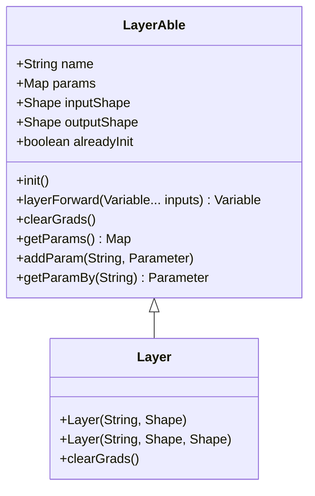
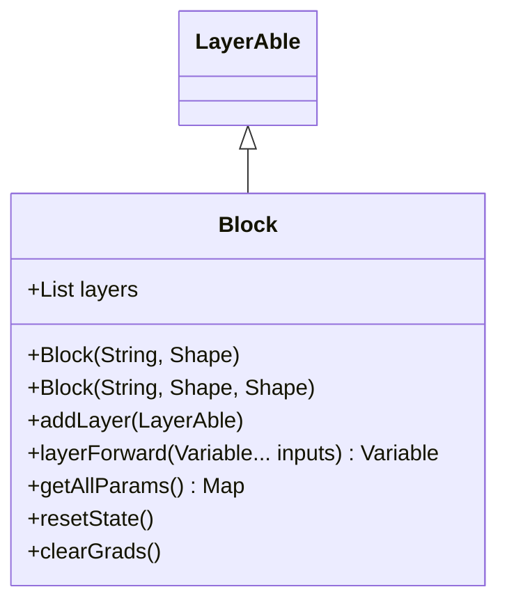
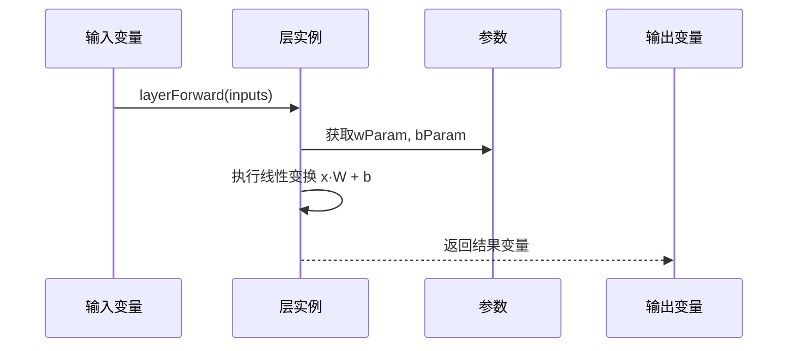
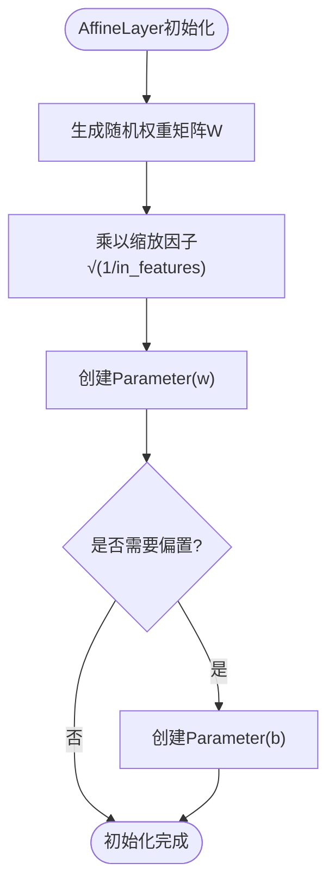
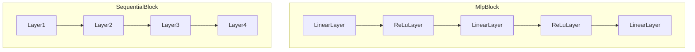

# Layer与Block

<cite>
**本文档引用文件**  
- [LayerAble.java](file://src/main/java/io/leavesfly/tinydl/nnet/LayerAble.java)
- [Layer.java](file://src/main/java/io/leavesfly/tinydl/nnet/Layer.java)
- [Block.java](file://src/main/java/io/leavesfly/tinydl/nnet/Block.java)
- [Parameter.java](file://src/main/java/io/leavesfly/tinydl/nnet/Parameter.java)
- [AffineLayer.java](file://src/main/java/io/leavesfly/tinydl/nnet/layer/dnn/AffineLayer.java)
- [ReLuLayer.java](file://src/main/java/io/leavesfly/tinydl/nnet/layer/activate/ReLuLayer.java)
- [MlpBlock.java](file://src/main/java/io/leavesfly/tinydl/nnet/block/MlpBlock.java)
- [SequentialBlock.java](file://src/main/java/io/leavesfly/tinydl/nnet/block/SequentialBlock.java)
</cite>

## 目录
1. [引言](#引言)
2. [Layer设计原理](#layer设计原理)
3. [Block架构优势](#block架构优势)
4. [参数管理与前向传播](#参数管理与前向传播)
5. [典型层实现分析](#典型层实现分析)
6. [模块化组合模式](#模块化组合模式)
7. [自定义Layer开发指南](#自定义layer开发指南)
8. [层间数据流控制](#层间数据流控制)
9. [嵌套组合能力](#嵌套组合能力)
10. [总结](#总结)

## 引言
在深度学习框架中，Layer（层）作为最小可学习的变换单元，是构建神经网络的基础构件。Block（块）则通过组合多个LayerAble对象，实现复杂网络结构的模块化设计。本文深入剖析Layer与Block的设计理念与实现机制，为开发者提供构建深度神经网络的理论指导与实践路径。

## Layer设计原理
Layer作为神经网络中的基本计算单元，继承自LayerAble抽象类，实现了统一的调用接口。LayerAble定义了神经网络层的核心行为，包括参数管理、前向传播和梯度清零等操作。

**图示来源**  
- [LayerAble.java](file://src/main/java/io/leavesfly/tinydl/nnet/LayerAble.java#L1-L83)
- [Layer.java](file://src/main/java/io/leavesfly/tinydl/nnet/Layer.java#L1-L34)

**本节来源**  
- [LayerAble.java](file://src/main/java/io/leavesfly/tinydl/nnet/LayerAble.java#L1-L83)
- [Layer.java](file://src/main/java/io/leavesfly/tinydl/nnet/Layer.java#L1-L34)

## Block架构优势
Block作为可组合的模块，通过聚合多个LayerAble对象，实现了复杂网络结构的构建。其核心优势在于模块化、可复用性和层次化设计，使得网络结构更加清晰且易于维护。

**图示来源**  
- [Block.java](file://src/main/java/io/leavesfly/tinydl/nnet/Block.java#L1-L90)

**本节来源**  
- [Block.java](file://src/main/java/io/leavesfly/tinydl/nnet/Block.java#L1-L90)

## 参数管理与前向传播
参数（Parameter）是神经网络中需要训练的变量，封装了NdArray数据并支持梯度计算。Layer通过addParam方法注册参数，实现统一管理。前向传播通过layerForward方法完成，输入变量经过层的变换生成输出。

**图示来源**  
- [AffineLayer.java](file://src/main/java/io/leavesfly/tinydl/nnet/layer/dnn/AffineLayer.java#L1-L52)
- [Parameter.java](file://src/main/java/io/leavesfly/tinydl/nnet/Parameter.java#L1-L13)

**本节来源**  
- [AffineLayer.java](file://src/main/java/io/leavesfly/tinydl/nnet/layer/dnn/AffineLayer.java#L1-L52)
- [Parameter.java](file://src/main/java/io/leavesfly/tinydl/nnet/Parameter.java#L1-L13)

## 典型层实现分析
### AffineLayer全连接层
AffineLayer实现线性变换y = xW + b，支持偏置项。其init方法采用Xavier初始化策略，使用√(1/in_features)缩放随机权重，有助于缓解梯度消失问题。

### ReLuLayer激活函数层
ReLuLayer封装ReLU激活函数，无内部参数，前向传播直接调用ReLu函数。其设计体现了无参层的简洁性与高效性。

**图示来源**  
- [AffineLayer.java](file://src/main/java/io/leavesfly/tinydl/nnet/layer/dnn/AffineLayer.java#L1-L52)
- [ReLuLayer.java](file://src/main/java/io/leavesfly/tinydl/nnet/layer/activate/ReLuLayer.java#L1-L51)

**本节来源**  
- [AffineLayer.java](file://src/main/java/io/leavesfly/tinydl/nnet/layer/dnn/AffineLayer.java#L1-L52)
- [ReLuLayer.java](file://src/main/java/io/leavesfly/tinydl/nnet/layer/activate/ReLuLayer.java#L1-L51)

## 模块化组合模式
### MlpBlock多层感知机块
MlpBlock通过组合LinearLayer与激活层（ReLU或Sigmoid），构建标准的MLP结构。其构造函数接受层尺寸数组，自动堆叠全连接层与激活函数。

### SequentialBlock序列化块
SequentialBlock提供线性堆叠能力，通过addLayer方法按顺序添加层，实现层的序列化执行。它是构建深度网络的基础容器。

**图示来源**  
- [MlpBlock.java](file://src/main/java/io/leavesfly/tinydl/nnet/block/MlpBlock.java#L1-L42)
- [SequentialBlock.java](file://src/main/java/io/leavesfly/tinydl/nnet/block/SequentialBlock.java#L1-L21)

**本节来源**  
- [MlpBlock.java](file://src/main/java/io/leavesfly/tinydl/nnet/block/MlpBlock.java#L1-L42)
- [SequentialBlock.java](file://src/main/java/io/leavesfly/tinydl/nnet/block/SequentialBlock.java#L1-L21)

## 自定义Layer开发指南
开发自定义Layer需继承Layer类，重写init和layerForward方法：
1. 在构造函数中设置名称与形状
2. 在init中初始化参数并调用addParam注册
3. 在layerForward中定义前向计算逻辑
4. 确保参数命名唯一性（建议使用layerName.paramName格式）

## 层间数据流控制
Block通过layerForward方法实现层间数据流动。输入变量依次通过各层的前向传播，形成链式调用。每一层接收前一层输出作为输入，最终返回整个块的输出结果，确保数据流的连贯性与正确性。

## 嵌套组合能力
Block不仅可包含Layer，还可嵌套其他Block，形成层次化结构。这种能力支持构建如ResNet的残差连接、Transformer的编码器-解码器等复杂架构，极大提升了框架的表达能力与灵活性。

## 总结
Layer与Block的设计体现了"组合优于继承"的软件工程原则。Layer作为原子操作单元，保证了计算的精确性；Block作为组合容器，提供了构建复杂模型的灵活性。二者协同工作，为深度学习模型的开发提供了坚实的基础架构。