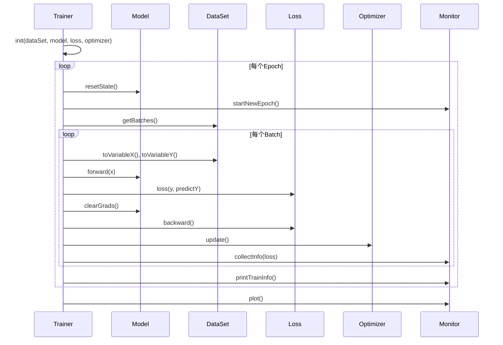
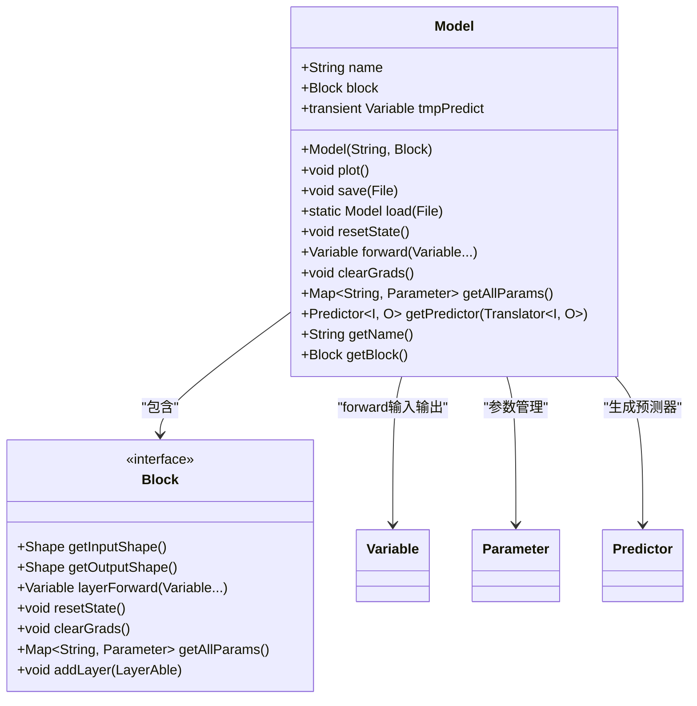
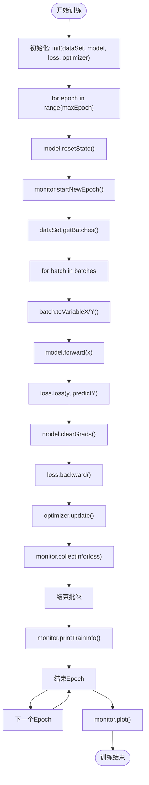
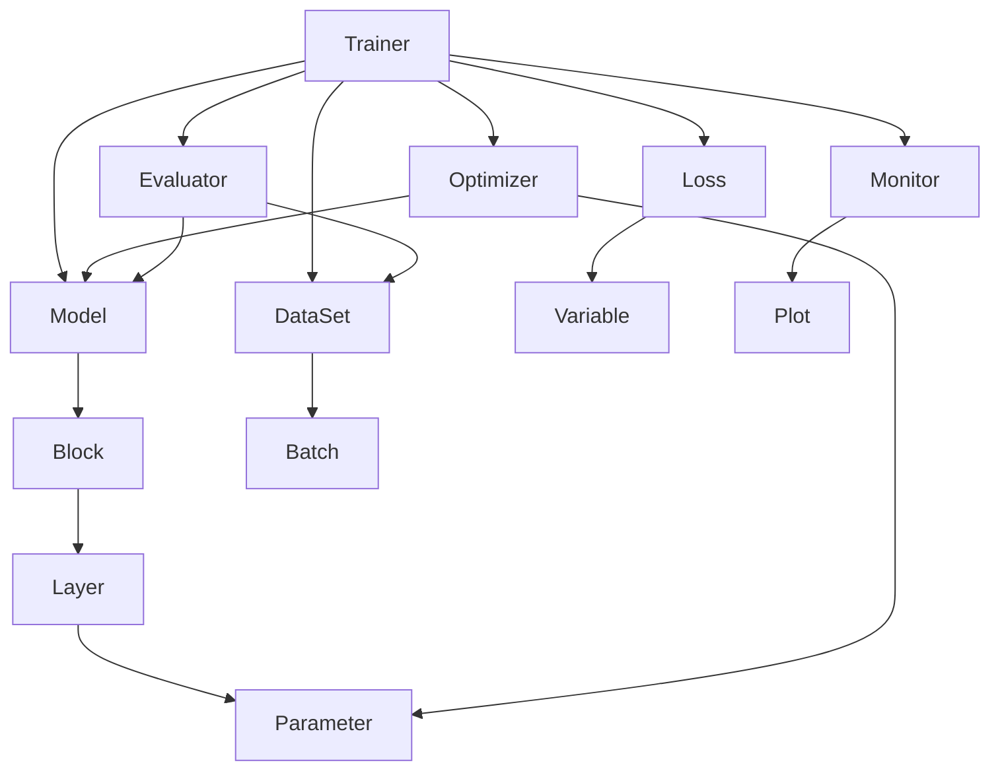

# Model与Trainer

<cite>
**本文档引用文件**  
- [Model.java](file://src/main/java/io/leavesfly/tinydl/mlearning/Model.java)
- [Trainer.java](file://src/main/java/io/leavesfly/tinydl/mlearning/Trainer.java)
- [DataSet.java](file://src/main/java/io/leavesfly/tinydl/mlearning/dataset/DataSet.java)
- [Loss.java](file://src/main/java/io/leavesfly/tinydl/mlearning/loss/Loss.java)
- [Optimizer.java](file://src/main/java/io/leavesfly/tinydl/mlearning/optimize/Optimizer.java)
- [Evaluator.java](file://src/main/java/io/leavesfly/tinydl/mlearning/evaluator/Evaluator.java)
- [Monitor.java](file://src/main/java/io/leavesfly/tinydl/mlearning/Monitor.java)
- [MlpBlock.java](file://src/main/java/io/leavesfly/tinydl/nnet/block/MlpBlock.java)
- [Batch.java](file://src/main/java/io/leavesfly/tinydl/mlearning/dataset/Batch.java)
- [Variable.java](file://src/main/java/io/leavesfly/tinydl/func/Variable.java)
</cite>

## 目录
1. [简介](#简介)
2. [项目结构](#项目结构)
3. [核心组件](#核心组件)
4. [架构概述](#架构概述)
5. [详细组件分析](#详细组件分析)
6. [依赖分析](#依赖分析)
7. [性能考虑](#性能考虑)
8. [故障排除指南](#故障排除指南)
9. [结论](#结论)

## 简介
本文档系统性地描述了TinyDL框架中`Model`类如何封装神经网络`Block`并提供高层`forward`接口，实现端到端的预测逻辑。重点解析`Trainer`类如何协调`Model`、`DataSet`、`Loss`、`Optimizer`和`Evaluator`等核心组件，构建完整的训练循环。详细说明训练流程中的数据迭代、前向传播、损失计算、反向传播、参数更新及周期性评估机制。通过代码示例展示`Trainer`的配置（如epoch、batch_size）、监控（Monitor）和回调机制，涵盖训练状态管理、学习率调度、早停策略，以及模型性能调优与结果分析方法，为用户执行实际训练任务提供完整指南。

## 项目结构
TinyDL项目采用模块化设计，主要分为功能函数、神经网络组件、机器学习核心模块和数据集处理等部分。`Model`和`Trainer`位于`mlearning`包中，作为高层API协调底层神经网络块（Block）和训练流程。

```mermaid
graph TD
subgraph "核心机器学习模块"
Model[Model]
Trainer[Trainer]
Loss[Loss]
Optimizer[Optimizer]
Evaluator[Evaluator]
Monitor[Monitor]
DataSet[DataSet]
end
subgraph "神经网络组件"
Block[Block]
Layer[Layer]
MlpBlock[MlpBlock]
end
subgraph "数据与变量"
Variable[Variable]
NdArray[NdArray]
Batch[Batch]
end
Model --> Block : "封装"
Trainer --> Model : "使用"
Trainer --> DataSet : "输入数据"
Trainer --> Loss : "计算损失"
Trainer --> Optimizer : "更新参数"
Trainer --> Evaluator : "评估性能"
Trainer --> Monitor : "监控训练"
DataSet --> Batch : "生成批次"
Model --> Variable : "前向传播"
Loss --> Variable : "计算损失值"
```

**图示来源**  
- [Model.java](file://src/main/java/io/leavesfly/tinydl/mlearning/Model.java)
- [Trainer.java](file://src/main/java/io/leavesfly/tinydl/mlearning/Trainer.java)
- [DataSet.java](file://src/main/java/io/leavesfly/tinydl/mlearning/dataset/DataSet.java)
- [Loss.java](file://src/main/java/io/leavesfly/tinydl/mlearning/loss/Loss.java)
- [Optimizer.java](file://src/main/java/io/leavesfly/tinydl/mlearning/optimize/Optimizer.java)
- [Evaluator.java](file://src/main/java/io/leavesfly/tinydl/mlearning/evaluator/Evaluator.java)
- [Monitor.java](file://src/main/java/io/leavesfly/tinydl/mlearning/Monitor.java)
- [MlpBlock.java](file://src/main/java/io/leavesfly/tinydl/nnet/block/MlpBlock.java)
- [Batch.java](file://src/main/java/io/leavesfly/tinydl/mlearning/dataset/Batch.java)
- [Variable.java](file://src/main/java/io/leavesfly/tinydl/func/Variable.java)

**本节来源**  
- [Model.java](file://src/main/java/io/leavesfly/tinydl/mlearning/Model.java)
- [Trainer.java](file://src/main/java/io/leavesfly/tinydl/mlearning/Trainer.java)

## 核心组件
`Model`类作为神经网络的高层封装，将`Block`（如`MlpBlock`）包装为可训练和预测的模型实体。它提供`forward`接口用于前向传播，`clearGrads`用于梯度清零，`save`/`load`用于模型持久化，并通过`getPredictor`支持推理功能。`Trainer`类则作为训练引擎，协调数据、模型、损失函数、优化器和评估器，执行完整的训练循环。

**本节来源**  
- [Model.java](file://src/main/java/io/leavesfly/tinydl/mlearning/Model.java#L1-L86)
- [Trainer.java](file://src/main/java/io/leavesfly/tinydl/mlearning/Trainer.java#L1-L106)

## 架构概述
`Trainer`通过`init`方法初始化训练所需组件，包括数据集、模型、损失函数和优化器。在`train`方法中，遍历每个epoch，对训练数据进行前向传播、损失计算、反向传播和参数更新，并通过`Monitor`记录损失变化。训练结束后可调用`evaluate`方法进行模型评估。



**图示来源**  
- [Trainer.java](file://src/main/java/io/leavesfly/tinydl/mlearning/Trainer.java#L1-L106)
- [Model.java](file://src/main/java/io/leavesfly/tinydl/mlearning/Model.java#L1-L86)
- [DataSet.java](file://src/main/java/io/leavesfly/tinydl/mlearning/dataset/DataSet.java#L1-L62)
- [Loss.java](file://src/main/java/io/leavesfly/tinydl/mlearning/loss/Loss.java#L1-L10)
- [Optimizer.java](file://src/main/java/io/leavesfly/tinydl/mlearning/optimize/Optimizer.java#L1-L28)
- [Monitor.java](file://src/main/java/io/leavesfly/tinydl/mlearning/Monitor.java#L1-L41)

## 详细组件分析

### Model分析
`Model`类封装了神经网络`Block`，提供统一的模型接口。其`forward`方法调用`Block`的`layerForward`实现前向传播，`clearGrads`清零所有参数梯度，`getAllParams`获取所有可训练参数。`plot`方法利用`Uml`工具可视化计算图，`save`/`load`支持模型序列化。



**图示来源**  
- [Model.java](file://src/main/java/io/leavesfly/tinydl/mlearning/Model.java#L1-L86)
- [Block.java](file://src/main/java/io/leavesfly/tinydl/nnet/Block.java)

**本节来源**  
- [Model.java](file://src/main/java/io/leavesfly/tinydl/mlearning/Model.java#L1-L86)

### Trainer分析
`Trainer`是训练流程的核心控制器。它在`train`方法中实现标准训练循环：对每个epoch重置模型状态，遍历数据批次，执行前向传播计算预测值，调用`Loss`计算损失，反向传播梯度，通过`Optimizer`更新参数，并由`Monitor`收集和打印训练信息。



**图示来源**  
- [Trainer.java](file://src/main/java/io/leavesfly/tinydl/mlearning/Trainer.java#L1-L106)

**本节来源**  
- [Trainer.java](file://src/main/java/io/leavesfly/tinydl/mlearning/Trainer.java#L1-L106)

## 依赖分析
`Trainer`依赖于`Model`、`DataSet`、`Loss`、`Optimizer`、`Monitor`和`Evaluator`等多个组件，形成完整的训练闭环。`Model`依赖`Block`实现网络结构，`Block`由`Layer`构成。`Loss`和`Optimizer`分别依赖`Variable`的自动微分和`Parameter`的梯度更新。



**图示来源**  
- [Trainer.java](file://src/main/java/io/leavesfly/tinydl/mlearning/Trainer.java#L1-L106)
- [Model.java](file://src/main/java/io/leavesfly/tinydl/mlearning/Model.java#L1-L86)
- [DataSet.java](file://src/main/java/io/leavesfly/tinydl/mlearning/dataset/DataSet.java#L1-L62)
- [Loss.java](file://src/main/java/io/leavesfly/tinydl/mlearning/loss/Loss.java#L1-L10)
- [Optimizer.java](file://src/main/java/io/leavesfly/tinydl/mlearning/optimize/Optimizer.java#L1-L28)
- [Monitor.java](file://src/main/java/io/leavesfly/tinydl/mlearning/Monitor.java#L1-L41)
- [Evaluator.java](file://src/main/java/io/leavesfly/tinydl/mlearning/evaluator/Evaluator.java#L1-L16)

**本节来源**  
- [Trainer.java](file://src/main/java/io/leavesfly/tinydl/mlearning/Trainer.java#L1-L106)
- [Model.java](file://src/main/java/io/leavesfly/tinydl/mlearning/Model.java#L1-L86)
- [Optimizer.java](file://src/main/java/io/leavesfly/tinydl/mlearning/optimize/Optimizer.java#L1-L28)

## 性能考虑
`Trainer`目前仅实现单线程训练，`parallelTrain`方法留作扩展。性能瓶颈主要在`Variable`的自动微分计算和`NdArray`的数值运算。建议使用GPU加速（`NdArrayGpu`）以提升大规模模型训练效率。`Monitor`的实时绘图可能影响训练速度，可选择性启用。

## 故障排除指南
- **训练不收敛**：检查学习率、数据归一化、网络初始化。
- **内存溢出**：减小`batchSize`或使用流式数据集`StreamDataset`。
- **梯度爆炸/消失**：使用`BatchNorm`、`Dropout`或调整激活函数。
- **损失为NaN**：检查数据中是否存在异常值，降低学习率。
- **模型保存失败**：确保`Model`及其`Block`实现`Serializable`接口。

**本节来源**  
- [Model.java](file://src/main/java/io/leavesfly/tinydl/mlearning/Model.java#L1-L86)
- [Trainer.java](file://src/main/java/io/leavesfly/tinydl/mlearning/Trainer.java#L1-L106)
- [Monitor.java](file://src/main/java/io/leavesfly/tinydl/mlearning/Monitor.java#L1-L41)

## 结论
`Model`与`Trainer`构成了TinyDL框架的核心训练体系。`Model`通过封装`Block`提供统一的模型接口，`Trainer`则协调各组件实现完整的训练流程。该设计实现了高内聚、低耦合，便于扩展和维护。用户可通过配置`Trainer`的`Monitor`和`Evaluator`实现训练过程的可视化与性能评估，为模型调优提供有力支持。