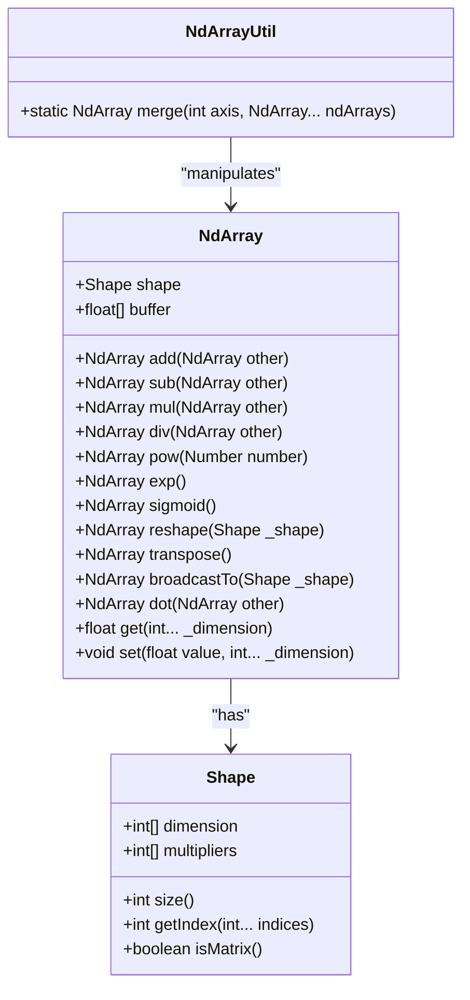
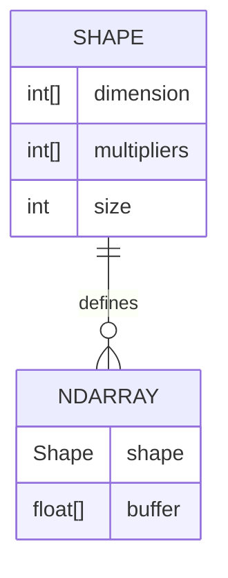
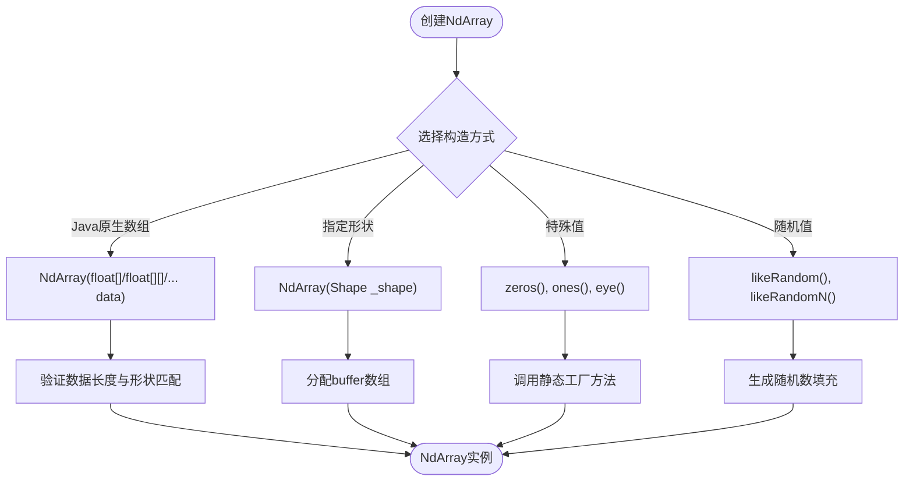
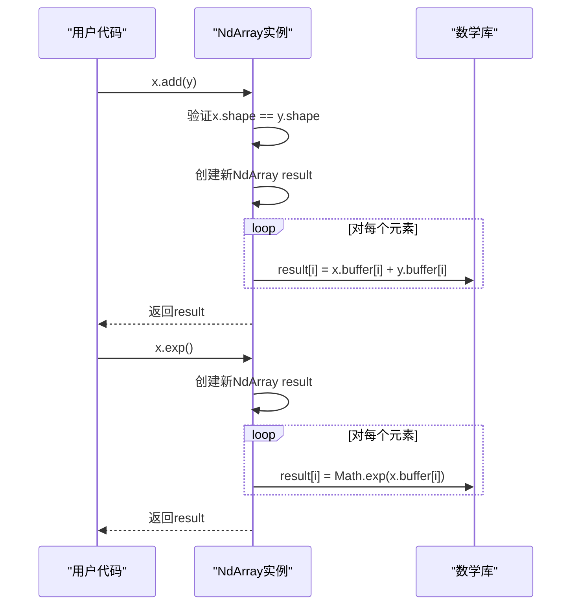
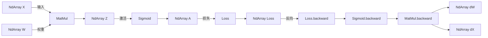

# NdArray与Shape

<cite>
**本文档中引用的文件**  
- [NdArray.java](file://src/main/java/io/leavesfly/tinydl/ndarr/NdArray.java)
- [Shape.java](file://src/main/java/io/leavesfly/tinydl/ndarr/Shape.java)
- [NdArrayUtil.java](file://src/main/java/io/leavesfly/tinydl/ndarr/NdArrayUtil.java)
- [NdArrayGpu.java](file://src/main/java/io/leavesfly/tinydl/ndarr/NdArrayGpu.java)
- [TestNdArray2.java](file://src/test/java/io/leavesfly/tinydl/test/TestNdArray2.java)
</cite>

## 目录
1. [引言](#引言)
2. [NdArray核心作用与设计](#ndarray核心作用与设计)
3. [Shape类与维度管理](#shape类与维度管理)
4. [NdArray的构造与初始化](#ndarray的构造与初始化)
5. [数据访问与互操作性](#数据访问与互操作性)
6. [基本数学运算与逻辑操作](#基本数学运算与逻辑操作)
7. [张量变形与广播机制](#张量变形与广播机制)
8. [NdArrayUtil辅助方法](#ndarrayutil辅助方法)
9. [CPU与GPU后端支持](#cpu与gpu后端支持)
10. [计算图中的数据流动](#计算图中的数据流动)
11. [性能考量与内存布局](#性能考量与内存布局)
12. [常见使用错误与优化建议](#常见使用错误与优化建议)
13. [总结](#总结)

## 引言

NdArray是TinyDL框架中所有张量数据的基础载体，作为多维数组的核心实现，它不仅封装了底层数据存储，还提供了丰富的数学运算和变形操作。NdArray与Shape类协同工作，精确描述数组的维度结构，支持从标量、向量到高维张量的统一表示。本文档将深入解析NdArray的设计原理、功能特性及其在深度学习计算中的关键作用。

**Section sources**
- [NdArray.java](file://src/main/java/io/leavesfly/tinydl/ndarr/NdArray.java#L1-L1351)
- [Shape.java](file://src/main/java/io/leavesfly/tinydl/ndarr/Shape.java#L1-L101)

## NdArray核心作用与设计

NdArray作为TinyDL框架的数据基石，承担着所有张量数据的存储与计算任务。其设计目标是提供一个高效、灵活且易于使用的多维数组抽象，支持从简单的标量运算到复杂的神经网络前向与反向传播。NdArray通过`float[] buffer`字段以行优先（row-major）顺序存储数据，确保内存访问的局部性，提升计算性能。`Shape`对象则精确描述了数组的维度信息，使得NdArray能够统一处理任意维度的数据。

NdArray的设计体现了深度学习框架对数据抽象的核心需求：一方面，它需要与底层硬件（如CPU、GPU）高效交互；另一方面，它必须为上层算法提供简洁的编程接口。通过封装基本的四则运算、数学函数和张量操作，NdArray成为连接模型定义与数值计算的桥梁。



**Diagram sources**
- [NdArray.java](file://src/main/java/io/leavesfly/tinydl/ndarr/NdArray.java#L11-L1351)
- [Shape.java](file://src/main/java/io/leavesfly/tinydl/ndarr/Shape.java#L1-L101)
- [NdArrayUtil.java](file://src/main/java/io/leavesfly/tinydl/ndarr/NdArrayUtil.java#L1-L54)

**Section sources**
- [NdArray.java](file://src/main/java/io/leavesfly/tinydl/ndarr/NdArray.java#L11-L1351)
- [Shape.java](file://src/main/java/io/leavesfly/tinydl/ndarr/Shape.java#L1-L101)

## Shape类与维度管理

Shape类是NdArray的维度描述器，负责管理多维数组的形状信息。它通过`int[] dimension`数组存储各维度的大小，并利用`int[] multipliers`数组实现多维索引到一维缓冲区的高效映射。multipliers数组的计算基于行优先顺序，每个元素表示对应维度的步长（stride），从而通过`getIndex(int... indices)`方法将多维坐标转换为一维数组的线性索引。

例如，对于一个形状为[2, 3, 4]的三维数组，其multipliers为[12, 4, 1]，表示第一维每增加1，索引增加12；第二维每增加1，索引增加4；第三维每增加1，索引增加1。这种设计使得NdArray可以在不改变底层数据的情况下，通过改变Shape对象来实现视图（view）操作，如reshape和transpose，极大地提高了内存使用效率。



**Diagram sources**
- [Shape.java](file://src/main/java/io/leavesfly/tinydl/ndarr/Shape.java#L1-L101)
- [NdArray.java](file://src/main/java/io/leavesfly/tinydl/ndarr/NdArray.java#L11-L1351)

**Section sources**
- [Shape.java](file://src/main/java/io/leavesfly/tinydl/ndarr/Shape.java#L1-L101)

## NdArray的构造与初始化

NdArray提供了多种构造方法，支持从不同形式的数据源创建实例。用户可以直接传入Java原生数组（如`float[]`, `float[][]`等），或通过指定Shape对象来创建未初始化的数组。此外，NdArray还提供了一系列静态工厂方法，用于创建特殊值的数组，如全零数组（`zeros`）、全一数组（`ones`）、单位矩阵（`eye`）以及随机数组（`likeRandom`, `likeRandomN`）。

这些构造方法确保了NdArray的灵活性和易用性。例如，`NdArray(float[][] data)`构造函数会将二维Java数组按行优先顺序展平并复制到buffer中，同时创建一个对应的Shape对象。而`zeros(Shape shape)`方法则创建一个指定形状的全零数组，常用于权重初始化或梯度累加。



**Diagram sources**
- [NdArray.java](file://src/main/java/io/leavesfly/tinydl/ndarr/NdArray.java#L11-L1351)

**Section sources**
- [NdArray.java](file://src/main/java/io/leavesfly/tinydl/ndarr/NdArray.java#L11-L1351)

## 数据访问与互操作性

NdArray提供了丰富的数据访问接口，支持按多维索引读写单个元素，以及将整个数组转换为Java原生多维数组。`get(int... _dimension)`和`set(float value, int... _dimension)`方法允许用户通过可变参数指定多维坐标，访问或修改特定位置的元素。这些方法内部调用Shape的`getIndex`方法计算线性索引，确保了访问的正确性。

为了与Java生态系统互操作，NdArray提供了`getMatrix()`, `get3dArray()`, `get4dArray()`等方法，将内部的一维buffer转换为对应的Java多维数组。这些转换方法在需要与外部库交互或进行数据可视化时非常有用。同时，`toString()`方法提供了友好的字符串表示，便于调试和日志记录。

**Section sources**
- [NdArray.java](file://src/main/java/io/leavesfly/tinydl/ndarr/NdArray.java#L11-L1351)

## 基本数学运算与逻辑操作

NdArray实现了丰富的数学运算，分为四则运算、逻辑运算和基本数学函数三类。四则运算（`add`, `sub`, `mul`, `div`）要求两个操作数的Shape完全相同，执行按元素（element-wise）的计算。对于与标量的运算，提供了`mulNum`, `divNum`等方法。

逻辑运算如`eq`, `gt`, `lt`返回一个由0和1组成的NdArray，表示比较结果。`isLar`方法则判断一个数组是否在所有元素上都大于另一个数组。基本数学函数包括`pow`, `exp`, `log`, `sin`, `cos`, `tanh`等，均按元素应用。特别地，`sigmoid`方法通过`tanh`函数的恒等变换高效实现，而`softMax`方法则对矩阵的每一行进行归一化，使其元素和为1。



**Diagram sources**
- [NdArray.java](file://src/main/java/io/leavesfly/tinydl/ndarr/NdArray.java#L11-L1351)

**Section sources**
- [NdArray.java](file://src/main/java/io/leavesfly/tinydl/ndarr/NdArray.java#L11-L1351)

## 张量变形与广播机制

张量变形是NdArray的核心功能之一，包括`reshape`, `transpose`, `flatten`等操作。`reshape(Shape _shape)`方法在保持元素总数不变的前提下改变数组的形状，内部通过复制buffer实现，创建一个新的NdArray实例。`transpose()`方法交换矩阵的行和列，而`transpose(int... order)`支持任意维度顺序的转置。

广播（broadcasting）机制允许形状不同的数组进行运算。`broadcastTo(Shape _shape)`方法将当前数组扩展到目标形状，通过重复元素实现。例如，一个形状为[1, 3]的数组可以广播到[2, 3]，使其在第一维上重复。`sumTo(Shape _shape)`方法则执行反向的压缩求和，常用于反向传播中梯度的维度匹配。

```mermaid
flowchart LR
A[NdArray [2,3]] --> B[reshape [3,2]]
A --> C[transpose [3,2]]
D[NdArray [1,3]] --> E[broadcastTo [2,3]]
F[NdArray [2,3]] --> G[sumTo [1,3]]
B --> H["新NdArray [3,2]"]
C --> H
E --> I["新NdArray [2,3]"]
G --> J["新NdArray [1,3]"]
```

**Diagram sources**
- [NdArray.java](file://src/main/java/io/leavesfly/tinydl/ndarr/NdArray.java#L11-L1351)

**Section sources**
- [NdArray.java](file://src/main/java/io/leavesfly/tinydl/ndarr/NdArray.java#L11-L1351)

## NdArrayUtil辅助方法

NdArrayUtil类提供了静态辅助方法，用于更复杂的数组操作。`merge(int axis, NdArray... ndArrays)`方法支持沿指定轴（axis）合并多个NdArray。当`axis=0`时，按行合并；当`axis=1`时，按列合并。该方法在处理批量数据或构建复杂张量时非常有用。

例如，在数据加载器中，可以将多个样本的特征向量沿第一维（batch dimension）合并，形成一个批次的输入张量。NdArrayUtil的设计体现了工具类的职责分离原则，将不直接属于NdArray核心功能但又常用的算法集中管理。

**Section sources**
- [NdArrayUtil.java](file://src/main/java/io/leavesfly/tinydl/ndarr/NdArrayUtil.java#L1-L54)

## CPU与GPU后端支持

NdArray的设计支持多后端计算。当前实现主要针对CPU，使用Java的`float[]`数组进行数据存储和计算。`NdArrayGpu`类作为占位符存在，预示了未来对GPU加速的支持。通过定义统一的接口，TinyDL可以在不改变上层API的情况下，将计算从CPU无缝迁移到GPU。

这种架构设计遵循了现代深度学习框架的通用模式：前端提供一致的编程模型，后端负责具体的硬件优化。未来，`NdArrayGpu`将利用CUDA或OpenCL等技术，在GPU上执行高效的并行计算，显著提升大规模矩阵运算的性能。

**Section sources**
- [NdArray.java](file://src/main/java/io/leavesfly/tinydl/ndarr/NdArray.java#L11-L1351)
- [NdArrayGpu.java](file://src/main/java/io/leavesfly/tinydl/ndarr/NdArrayGpu.java#L1-L11)

## 计算图中的数据流动

在TinyDL的计算图中，NdArray作为数据流动的基本单元，贯穿前向传播和反向传播的全过程。每个`Function`节点接收一个或多个NdArray作为输入，执行计算后输出新的NdArray。在反向传播中，梯度以NdArray的形式沿计算图反向传递，通过`backward`方法更新参数。

例如，`MatMul`函数接收两个NdArray，执行矩阵乘法`dot`操作，输出结果NdArray。其反向方法则根据链式法则，计算输入的梯度。NdArray的不可变性（大多数操作返回新实例）确保了计算图的纯函数式特性，简化了梯度计算的复杂性。



**Diagram sources**
- [NdArray.java](file://src/main/java/io/leavesfly/tinydl/ndarr/NdArray.java#L11-L1351)

**Section sources**
- [NdArray.java](file://src/main/java/io/leavesfly/tinydl/ndarr/NdArray.java#L11-L1351)

## 性能考量与内存布局

NdArray的性能关键在于内存布局和访问模式。采用行优先的连续内存布局，确保了在遍历数组时具有良好的缓存局部性。然而，频繁的数组创建和拷贝（如`reshape`、`add`等操作）可能导致内存分配开销。

在前向传播中，中间结果的NdArray会占用显存/内存；在反向传播中，梯度的累加需要额外的存储空间。因此，优化内存使用是提升性能的关键。建议在可能的情况下复用NdArray实例，或使用原地（in-place）操作来减少内存分配。

**Section sources**
- [NdArray.java](file://src/main/java/io/leavesfly/tinydl/ndarr/NdArray.java#L11-L1351)

## 常见使用错误与优化建议

常见错误包括：Shape不匹配导致的异常、对高维数组使用不支持的方法（如`getMatrix`）、以及在循环中频繁创建临时NdArray造成内存压力。优化建议如下：
1. **避免频繁拷贝**：尽量复用NdArray实例，或使用视图操作（如`reshape`的返回值）而非创建新数据。
2. **合理使用视图**：`reshape`和`transpose`返回新实例，但若后续操作不修改数据，可考虑设计API以支持真正的视图（共享buffer）。
3. **批量处理**：利用广播和向量化操作替代循环，提高计算效率。
4. **及时释放**：虽然Java有GC，但在处理大型张量时，应尽早释放不再使用的引用。

**Section sources**
- [NdArray.java](file://src/main/java/io/leavesfly/tinydl/ndarr/NdArray.java#L11-L1351)
- [TestNdArray2.java](file://src/test/java/io/leavesfly/tinydl/test/TestNdArray2.java#L1-L181)

## 总结

NdArray作为TinyDL框架的核心数据结构，成功地将多维数组的存储、访问和计算抽象为一个统一的接口。通过与Shape类的紧密结合，它能够精确描述任意维度的数据结构。丰富的数学运算和变形操作使其能够支持复杂的深度学习模型。尽管当前主要面向CPU后端，但其设计为未来的GPU支持留下了扩展空间。理解NdArray的原理和最佳实践，是高效使用TinyDL进行深度学习开发的关键。