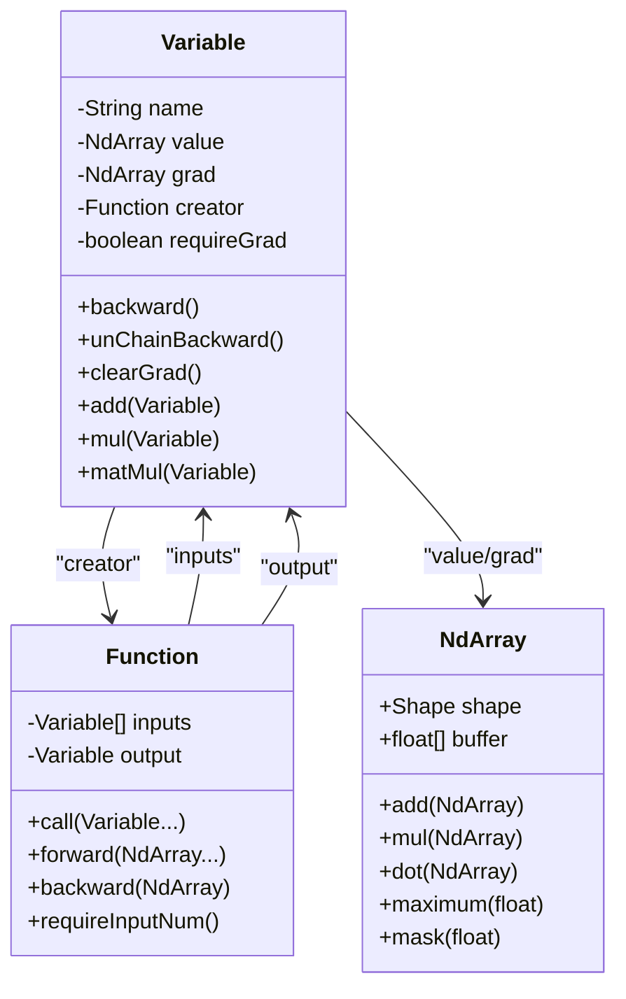
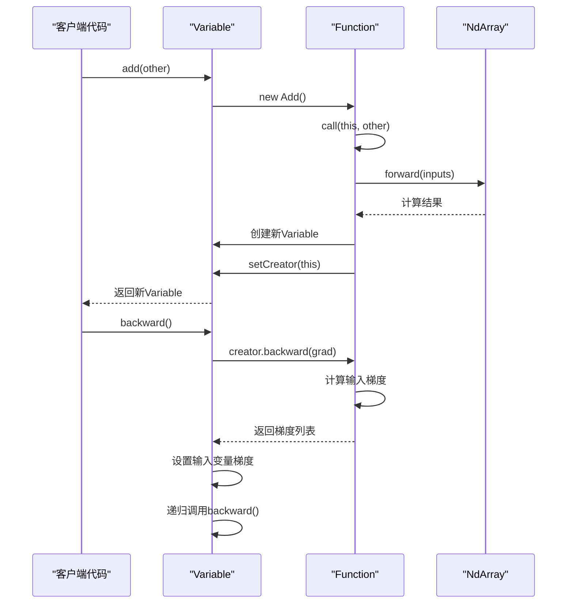
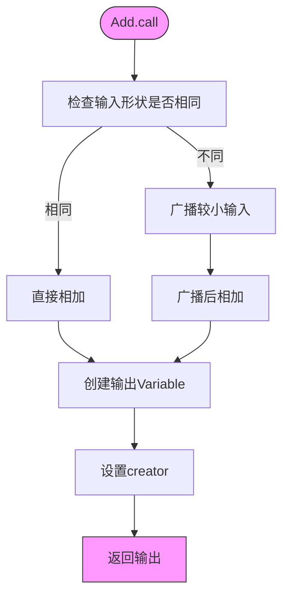
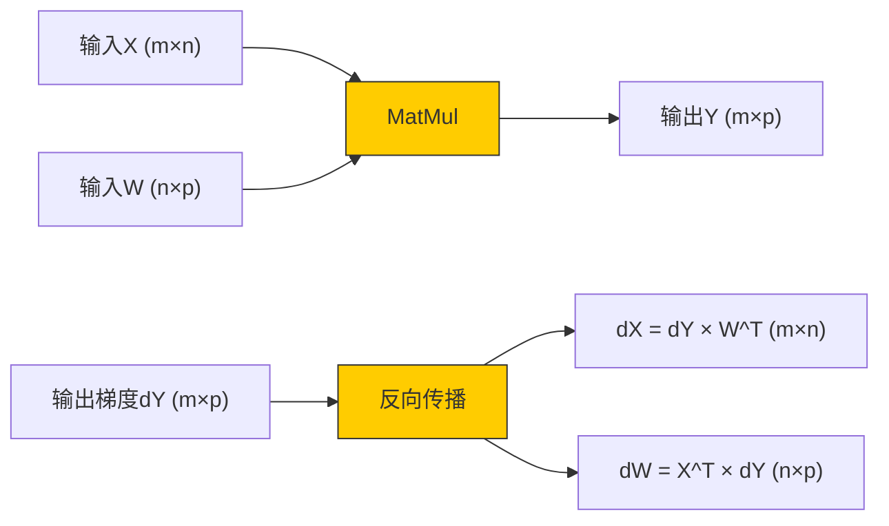
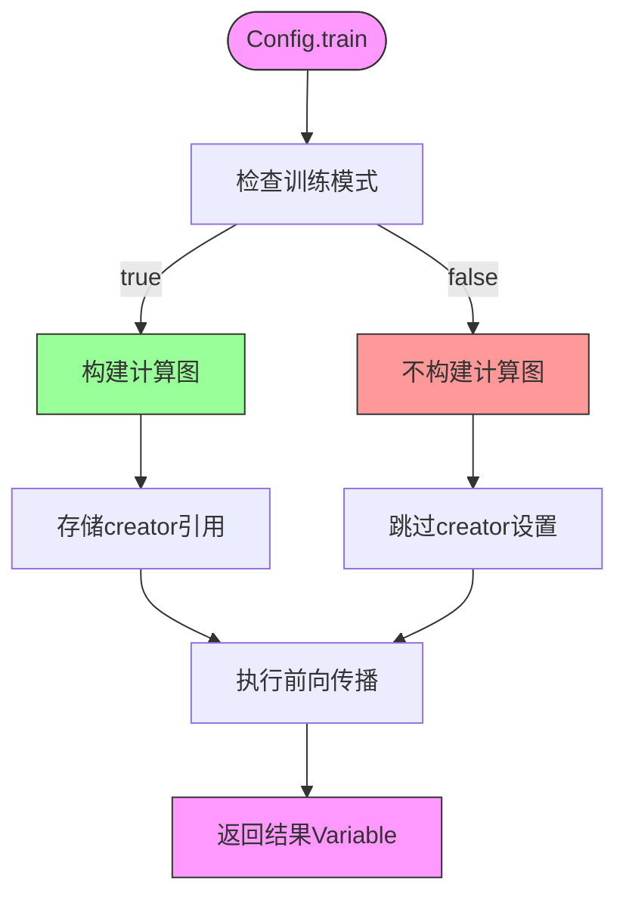
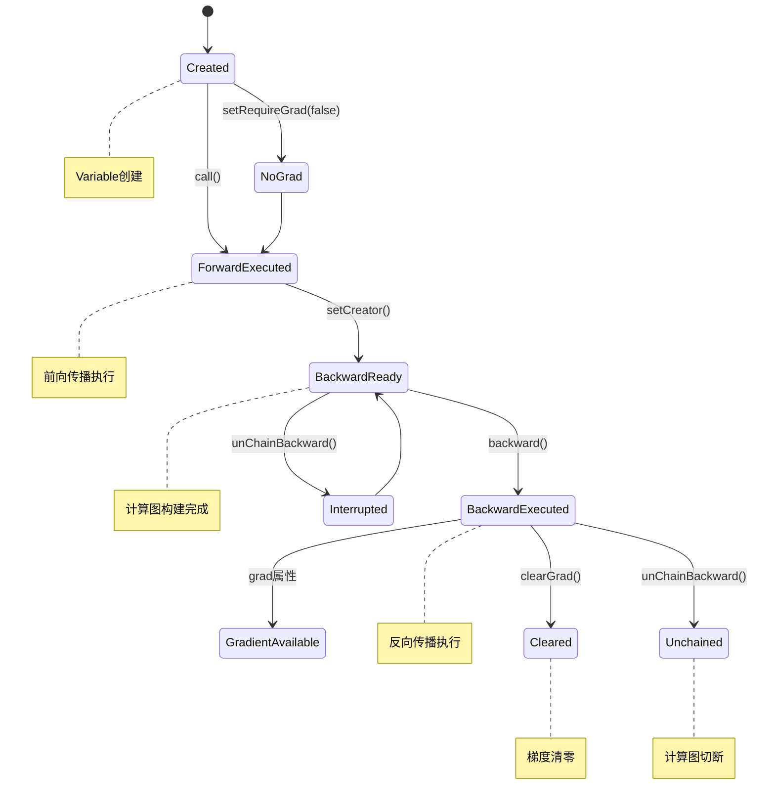

# Variable与自动微分

<cite>
**本文档引用的文件**   
- [Variable.java](file://src/main/java/io/leavesfly/tinydl/func/Variable.java)
- [Function.java](file://src/main/java/io/leavesfly/tinydl/func/Function.java)
- [NdArray.java](file://src/main/java/io/leavesfly/tinydl/ndarr/NdArray.java)
- [Add.java](file://src/main/java/io/leavesfly/tinydl/func/base/Add.java)
- [Mul.java](file://src/main/java/io/leavesfly/tinydl/func/base/Mul.java)
- [MatMul.java](file://src/main/java/io/leavesfly/tinydl/func/matrix/MatMul.java)
- [ReLu.java](file://src/main/java/io/leavesfly/tinydl/func/math/ReLu.java)
- [Config.java](file://src/main/java/io/leavesfly/tinydl/utils/Config.java)
</cite>

## 目录
1. [简介](#简介)
2. [核心组件](#核心组件)
3. [计算图构建机制](#计算图构建机制)
4. [前向与反向传播接口](#前向与反向传播接口)
5. [具体函数实现分析](#具体函数实现分析)
6. [梯度传播与链式法则](#梯度传播与链式法则)
7. [内存优化与no_grad模式](#内存优化与no_grad模式)
8. [计算图生命周期管理](#计算图生命周期管理)
9. [常见问题与调试](#常见问题与调试)
10. [结论](#结论)

## 简介
本文档深入解析TinyDL框架中Variable类如何封装NdArray并构建动态计算图以实现自动微分。通过分析Variable类、Function基类以及具体函数实现，全面阐述自动微分系统的内部工作原理。文档重点讲解计算图的构建、前向与反向传播机制、梯度计算以及内存优化策略，为开发者提供深入理解框架核心功能的理论基础和实践指导。

## 核心组件

Variable类是TinyDL框架中实现自动微分的核心组件，它封装了NdArray并提供了计算图构建和梯度计算功能。Function基类定义了前向和反向传播的接口，所有具体函数都继承自该基类。NdArray类提供了多维数组的基本操作，是Variable类的数据载体。

**Section sources**
- [Variable.java](file://src/main/java/io/leavesfly/tinydl/func/Variable.java#L1-L338)
- [Function.java](file://src/main/java/io/leavesfly/tinydl/func/Function.java#L1-L92)
- [NdArray.java](file://src/main/java/io/leavesfly/tinydl/ndarr/NdArray.java#L1-L1351)

## 计算图构建机制



**Diagram sources**
- [Variable.java](file://src/main/java/io/leavesfly/tinydl/func/Variable.java#L15-L30)
- [Function.java](file://src/main/java/io/leavesfly/tinydl/func/Function.java#L10-L25)

**Section sources**
- [Variable.java](file://src/main/java/io/leavesfly/tinydl/func/Variable.java#L1-L338)
- [Function.java](file://src/main/java/io/leavesfly/tinydl/func/Function.java#L1-L92)

## 前向与反向传播接口



**Diagram sources**
- [Variable.java](file://src/main/java/io/leavesfly/tinydl/func/Variable.java#L150-L180)
- [Function.java](file://src/main/java/io/leavesfly/tinydl/func/Function.java#L40-L60)

**Section sources**
- [Variable.java](file://src/main/java/io/leavesfly/tinydl/func/Variable.java#L150-L180)
- [Function.java](file://src/main/java/io/leavesfly/tinydl/func/Function.java#L40-L60)

## 具体函数实现分析

### Add函数实现

Add函数实现了两个Variable的加法操作，支持广播机制。在前向传播中，如果两个输入的形状不同，则对较小的输入进行广播；在反向传播中，梯度直接传递给两个输入，如果存在广播，则需要对梯度进行sumTo操作以匹配原始形状。



**Diagram sources**
- [Add.java](file://src/main/java/io/leavesfly/tinydl/func/base/Add.java#L12-L36)

**Section sources**
- [Add.java](file://src/main/java/io/leavesfly/tinydl/func/base/Add.java#L1-L37)

### Mul函数实现

Mul函数实现了两个Variable的逐元素乘法操作。在前向传播中，直接调用NdArray的mul方法进行逐元素相乘；在反向传播中，根据乘法的导数规则，一个输入的梯度等于输出梯度乘以另一个输入的值。

```mermaid
classDiagram
class Mul {
+forward(NdArray...)
+backward(NdArray)
+requireInputNum()
}
Mul --> Function : "继承"
Mul --> NdArray : "使用"
note right of Mul
前向 : y = x1 * x2
反向 : dx1 = dy * x2
dx2 = dy * x1
end note
```

**Diagram sources**
- [Mul.java](file://src/main/java/io/leavesfly/tinydl/func/base/Mul.java#L9-L27)

**Section sources**
- [Mul.java](file://src/main/java/io/leavesfly/tinydl/func/base/Mul.java#L1-L28)

### MatMul函数实现

MatMul函数实现了矩阵乘法操作。在前向传播中，调用NdArray的dot方法进行矩阵乘法；在反向传播中，根据矩阵乘法的导数规则，第一个输入的梯度等于输出梯度乘以第二个输入的转置，第二个输入的梯度等于第一个输入的转置乘以输出梯度。



**Diagram sources**
- [MatMul.java](file://src/main/java/io/leavesfly/tinydl/func/matrix/MatMul.java#L11-L32)

**Section sources**
- [MatMul.java](file://src/main/java/io/leavesfly/tinydl/func/matrix/MatMul.java#L1-L33)

### ReLu函数实现

ReLu函数实现了线性整流激活函数。在前向传播中，将输入中小于0的元素置为0；在反向传播中，小于0的输入对应的梯度置为0，大于等于0的输入对应的梯度保持不变。

```mermaid
stateDiagram-v2
[*] --> Forward
Forward --> "输入x"
"输入x" --> "输出max(0,x)"
"输出max(0,x)" --> Backward
Backward --> "梯度dy"
"梯度dy" --> "dx = dy * (x>0)"
"dx = dy * (x>0)" --> [*]
note right of Forward
前向传播 :
y = max(0, x)
end note
note right of Backward
反向传播 :
dx = dy if x > 0
dx = 0 if x ≤ 0
end note
```

**Diagram sources**
- [ReLu.java](file://src/main/java/io/leavesfly/tinydl/func/math/ReLu.java#L8-L23)

**Section sources**
- [ReLu.java](file://src/main/java/io/leavesfly/tinydl/func/math/ReLu.java#L1-L24)

## 梯度传播与链式法则

```mermaid
graph TD
A[输入x] --> B[Add]
C[常数c] --> B
B --> D[Mul]
E[权重w] --> D
D --> F[ReLu]
F --> G[损失L]
H[∂L/∂L=1] --> I[ReLu.backward]
I --> J[∂L/∂D]
J --> K[Mul.backward]
K --> L[∂L/∂B]
L --> M[Add.backward]
M --> N[∂L/∂x]
M --> O[∂L/∂c]
K --> P[∂L/∂w]
style A fill:#ccf,stroke:#333
style G fill:#f99,stroke:#333
style H fill:#9f9,stroke:#333
style N fill:#9f9,stroke:#333
style P fill:#9f9,stroke:#333
note right of G
损失函数输出
end note
note left of H
初始梯度
end note
```

**Diagram sources**
- [Variable.java](file://src/main/java/io/leavesfly/tinydl/func/Variable.java#L150-L180)
- [Add.java](file://src/main/java/io/leavesfly/tinydl/func/base/Add.java#L12-L36)
- [Mul.java](file://src/main/java/io/leavesfly/tinydl/func/base/Mul.java#L9-L27)
- [ReLu.java](file://src/main/java/io/leavesfly/tinydl/func/math/ReLu.java#L8-L23)

**Section sources**
- [Variable.java](file://src/main/java/io/leavesfly/tinydl/func/Variable.java#L150-L180)

## 内存优化与no_grad模式



**Diagram sources**
- [Function.java](file://src/main/java/io/leavesfly/tinydl/func/Function.java#L40-L60)
- [Config.java](file://src/main/java/io/leavesfly/tinydl/utils/Config.java#L3-L5)

**Section sources**
- [Function.java](file://src/main/java/io/leavesfly/tinydl/func/Function.java#L40-L60)
- [Config.java](file://src/main/java/io/leavesfly/tinydl/utils/Config.java#L3-L5)

## 计算图生命周期管理



**Diagram sources**
- [Variable.java](file://src/main/java/io/leavesfly/tinydl/func/Variable.java#L150-L200)
- [Variable.java](file://src/main/java/io/leavesfly/tinydl/func/Variable.java#L210-L230)

**Section sources**
- [Variable.java](file://src/main/java/io/leavesfly/tinydl/func/Variable.java#L150-L230)

## 常见问题与调试

### 梯度消失问题

当网络层数较深时，梯度在反向传播过程中可能会逐渐变小，最终趋近于零，导致网络参数无法有效更新。这通常发生在使用Sigmoid或Tanh等激活函数的深层网络中。

### 计算图断裂问题

计算图断裂通常发生在以下情况：
1. 使用unChainBackward()方法主动切断计算图
2. 在no_grad模式下执行操作，不构建计算图
3. 直接操作NdArray而不是Variable
4. 使用requireGrad=false的Variable

### 调试建议

1. 检查Variable的creator属性是否正确设置
2. 验证grad属性是否在backward()调用后正确计算
3. 确认requireGrad标志的设置是否符合预期
4. 使用clearGrad()方法在每次迭代前清零梯度
5. 在复杂计算中分步验证梯度计算的正确性

**Section sources**
- [Variable.java](file://src/main/java/io/leavesfly/tinydl/func/Variable.java#L150-L230)
- [Function.java](file://src/main/java/io/leavesfly/tinydl/func/Function.java#L40-L60)

## 结论

TinyDL框架通过Variable类和Function基类的协同工作，实现了高效的自动微分系统。Variable类封装了NdArray并提供了计算图构建和梯度计算功能，而Function基类定义了前向和反向传播的统一接口。通过Add、Mul、MatMul和ReLu等具体函数的实现，展示了如何应用链式法则沿计算图反向传播梯度。框架还提供了no_grad模式等内存优化策略，以及计算图生命周期管理机制，为深度学习模型的训练提供了坚实的基础。理解这些核心机制有助于开发者更好地使用框架，并在需要时进行定制和优化。