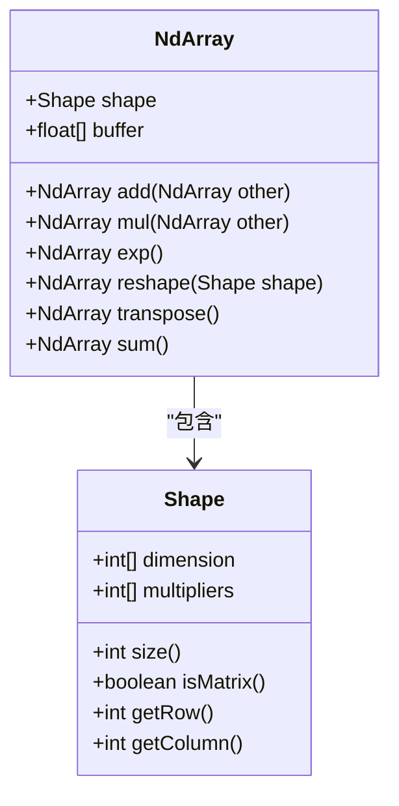
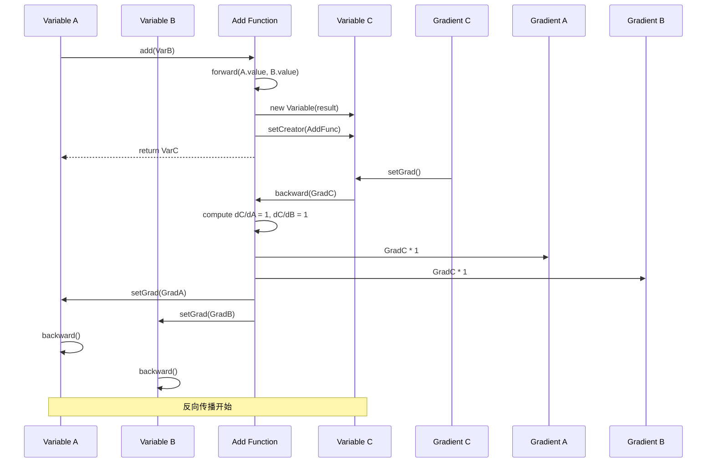
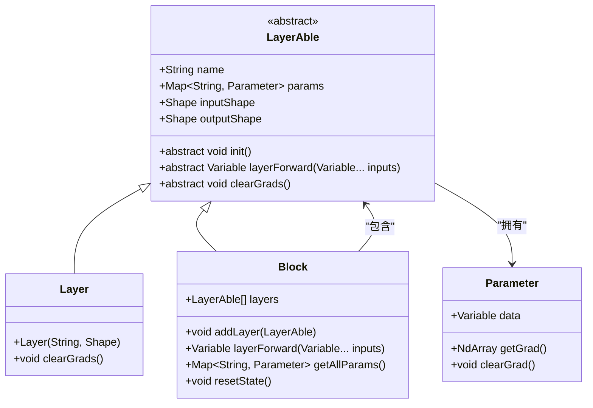
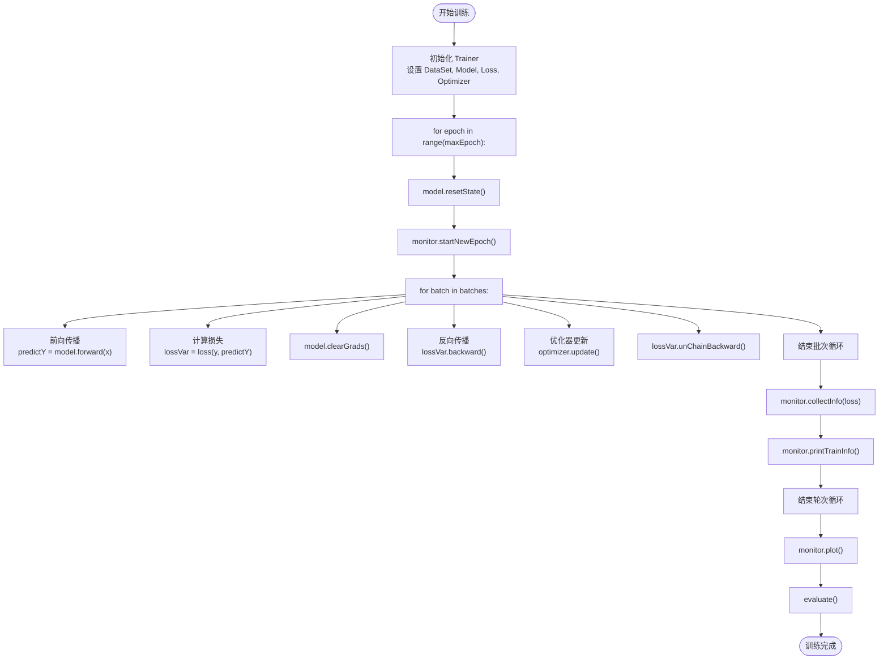

# 核心概念详解

<cite>
**本文档引用的文件**  
- [NdArray.java](file://src/main/java/io/leavesfly/tinydl/ndarr/NdArray.java)
- [Shape.java](file://src/main/java/io/leavesfly/tinydl/ndarr/Shape.java)
- [Variable.java](file://src/main/java/io/leavesfly/tinydl/func/Variable.java)
- [Function.java](file://src/main/java/io/leavesfly/tinydl/func/Function.java)
- [Add.java](file://src/main/java/io/leavesfly/tinydl/func/base/Add.java)
- [Layer.java](file://src/main/java/io/leavesfly/tinydl/nnet/Layer.java)
- [Block.java](file://src/main/java/io/leavesfly/tinydl/nnet/Block.java)
- [LayerAble.java](file://src/main/java/io/leavesfly/tinydl/nnet/LayerAble.java)
- [Model.java](file://src/main/java/io/leavesfly/tinydl/mlearning/Model.java)
- [Trainer.java](file://src/main/java/io/leavesfly/tinydl/mlearning/Trainer.java)
</cite>

## 目录
1. [NdArray：多维数据载体](#ndarray多维数据载体)  
2. [Variable：计算图与自动微分](#variable计算图与自动微分)  
3. [Layer与Block：可组合的神经网络模块](#layer与block可组合的神经网络模块)  
4. [Model与Trainer：模型封装与训练流程](#model与trainer模型封装与训练流程)  

## NdArray：多维数据载体

`NdArray` 是 TinyDL 框架中所有数据的基础载体，用于表示标量、向量、矩阵乃至更高维度的张量。它通过 `Shape` 类精确描述数据的维度结构，并在底层使用一维 `float` 数组存储实际数据，实现高效的内存访问与计算。

`Shape` 类定义了 `dimension` 数组来表示各维度的大小，并通过 `multipliers` 数组优化多维索引到一维缓冲区的映射。例如，一个形状为 `[3, 4, 5]` 的 `NdArray` 表示一个 3×4×5 的三维张量，其 `size()` 方法返回总元素数 60。

`NdArray` 提供了丰富的创建方法，如 `zeros()`、`ones()`、`eye()`（单位矩阵）、`likeRandom()`（随机初始化）等，支持从基本数据类型或 Java 多维数组直接构造。它还实现了基础的四则运算（`add`, `sub`, `mul`, `div`）、数学函数（`exp`, `log`, `sin`, `cos`, `tanh`, `sigmoid`）和张量变形操作（`reshape`, `transpose`, `flatten`）。这些操作均返回新的 `NdArray` 实例，保证了数据的不可变性。

**Diagram sources**  
- [NdArray.java](file://src/main/java/io/leavesfly/tinydl/ndarr/NdArray.java#L1-L799)
- [Shape.java](file://src/main/java/io/leavesfly/tinydl/ndarr/Shape.java#L1-L100)

**Section sources**  
- [NdArray.java](file://src/main/java/io/leavesfly/tinydl/ndarr/NdArray.java#L1-L799)
- [Shape.java](file://src/main/java/io/leavesfly/tinydl/ndarr/Shape.java#L1-L100)

## Variable：计算图与自动微分

`Variable` 类是 TinyDL 实现自动微分的核心。它封装了一个 `NdArray`，并引入了 `creator` 字段来记录生成该变量的 `Function`，从而构建动态计算图。当调用 `backward()` 方法时，框架会沿着 `creator` 链路反向传播梯度，实现链式法则。

`Variable` 重载了常见的数学运算符。例如，执行 `varA.add(varB)` 时，会创建一个 `Add` 函数实例，并调用其 `call()` 方法。`call()` 方法首先执行前向传播（`forward()`）计算输出值，然后将输入变量与自身关联，并将输出包装为新的 `Variable`，同时设置其 `creator` 为当前函数，完成计算图的连接。

`Function` 是所有数学函数的抽象基类，定义了 `forward()` 和 `backward()` 两个核心方法。以 `Add` 函数为例，其 `forward()` 方法执行两个输入 `NdArray` 的逐元素相加。`backward()` 方法则根据加法的导数规则（对每个输入的偏导数均为 1），将上游梯度 `yGrad` 直接传递给两个输入变量。如果存在广播（broadcast），`backward()` 还会调用 `sumTo()` 将梯度累加回原始形状。

**Diagram sources**  
- [Variable.java](file://src/main/java/io/leavesfly/tinydl/func/Variable.java#L1-L338)
- [Function.java](file://src/main/java/io/leavesfly/tinydl/func/Function.java#L1-L92)
- [Add.java](file://src/main/java/io/leavesfly/tinydl/func/base/Add.java#L1-L37)

**Section sources**  
- [Variable.java](file://src/main/java/io/leavesfly/tinydl/func/Variable.java#L1-L338)
- [Function.java](file://src/main/java/io/leavesfly/tinydl/func/Function.java#L1-L92)
- [Add.java](file://src/main/java/io/leavesfly/tinydl/func/base/Add.java#L1-L37)

## Layer与Block：可组合的神经网络模块

`Layer` 和 `Block` 是构建神经网络的两个关键抽象。`Layer` 代表网络中的最小变换单元，如全连接层（`AffineLayer`）、卷积层（`ConvLayer`）或激活层（`ReLuLayer`）。`Block` 则是一个可组合的容器，可以包含多个 `Layer` 或其他 `Block`，用于构建复杂的网络结构，如 `SequentialBlock` 或 `LstmBlock`。

两者都继承自 `LayerAble` 接口。`LayerAble` 统一了模型组件的接口，定义了 `layerForward()` 方法用于执行前向传播，`clearGrads()` 方法用于清零梯度，以及 `params` 字典用于管理可学习参数（`Parameter`）。`Parameter` 本质上是带有梯度的 `Variable`。

`Block` 的核心在于其组合能力。通过 `addLayer()` 方法，可以将多个 `LayerAble` 组件按顺序添加。其 `layerForward()` 方法会依次调用每个子组件的 `layerForward()`，实现数据的流水线处理。`getAllParams()` 方法则递归地收集所有子组件的参数，为优化器提供统一的参数视图。

**Diagram sources**  
- [LayerAble.java](file://src/main/java/io/leavesfly/tinydl/nnet/LayerAble.java#L1-L83)
- [Layer.java](file://src/main/java/io/leavesfly/tinydl/nnet/Layer.java#L1-L34)
- [Block.java](file://src/main/java/io/leavesfly/tinydl/nnet/Block.java#L1-L90)

**Section sources**  
- [LayerAble.java](file://src/main/java/io/leavesfly/tinydl/nnet/LayerAble.java#L1-L83)
- [Layer.java](file://src/main/java/io/leavesfly/tinydl/nnet/Layer.java#L1-L34)
- [Block.java](file://src/main/java/io/leavesfly/tinydl/nnet/Block.java#L1-L90)

## Model与Trainer：模型封装与训练流程

`Model` 类将 `Block` 封装成一个完整的机器学习模型，提供了高层接口。它实现了 `Serializable`，支持模型的保存（`save()`）与加载（`load()`）。`forward()` 方法直接委托给内部 `Block` 的 `layerForward()`。`plot()` 方法利用 `Uml` 工具可视化模型的计算图，便于调试和理解。

`Trainer` 类负责协调整个训练过程。它接收 `DataSet`（数据集）、`Model`（模型）、`Loss`（损失函数）和 `Optimizer`（优化器）作为核心组件。`train()` 方法实现了标准的训练循环：遍历数据集的每个批次（`Batch`），执行前向传播计算预测值，计算损失，反向传播梯度，然后调用优化器的 `update()` 方法更新模型参数。`Monitor` 用于监控训练过程（如记录损失），`Evaluator` 用于在训练后评估模型性能。

**Diagram sources**  
- [Model.java](file://src/main/java/io/leavesfly/tinydl/mlearning/Model.java#L1-L86)
- [Trainer.java](file://src/main/java/io/leavesfly/tinydl/mlearning/Trainer.java#L1-L106)

**Section sources**  
- [Model.java](file://src/main/java/io/leavesfly/tinydl/mlearning/Model.java#L1-L86)
- [Trainer.java](file://src/main/java/io/leavesfly/tinydl/mlearning/Trainer.java#L1-L106)