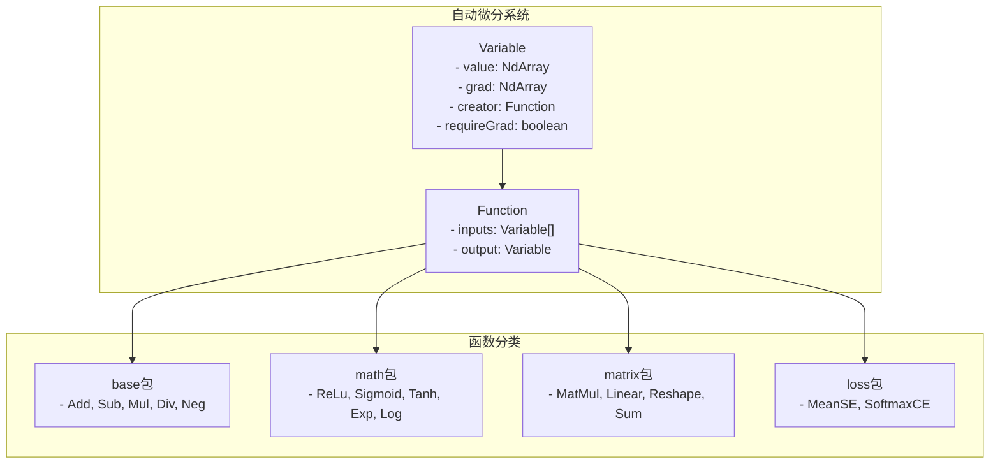
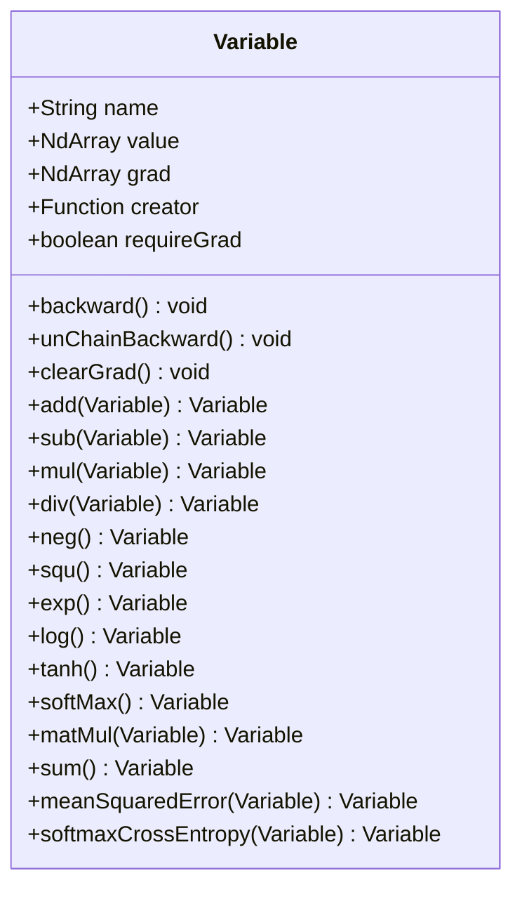
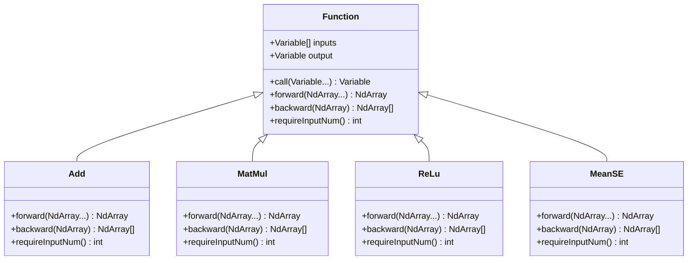
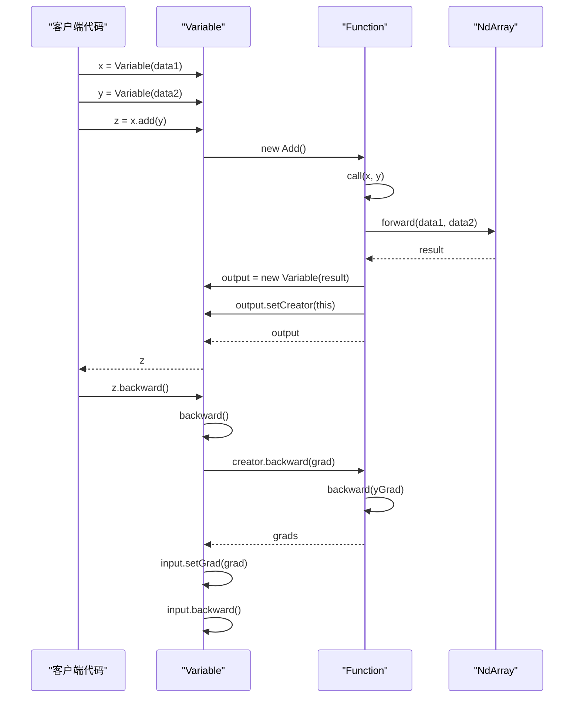
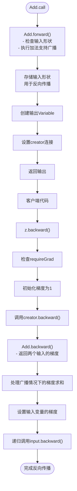
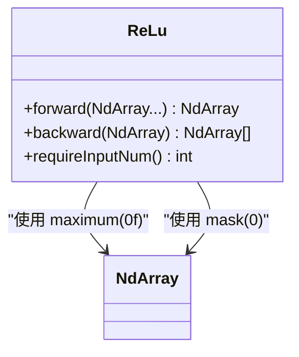
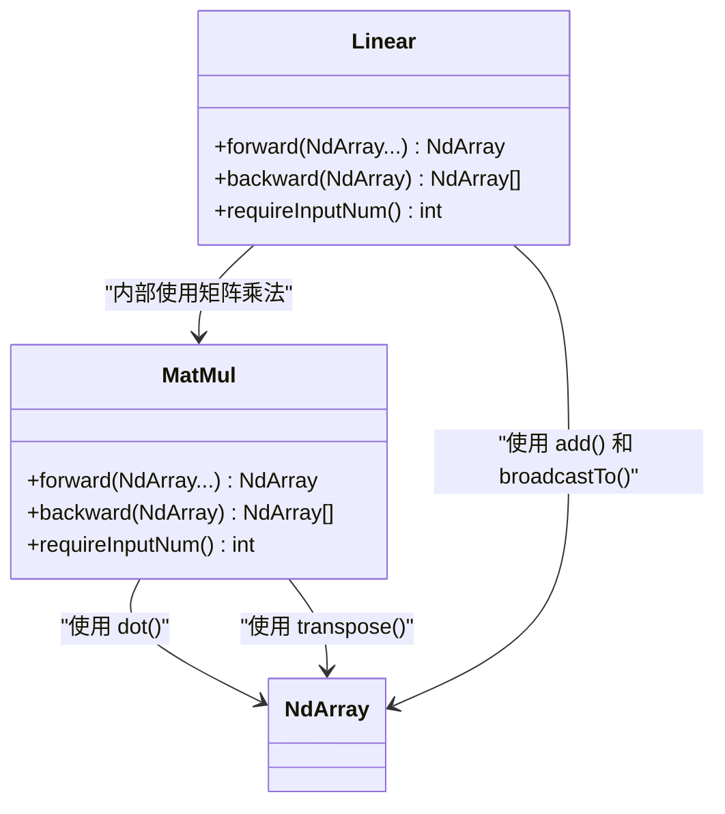
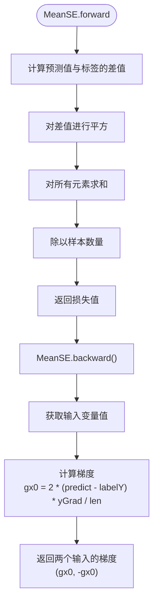

# func模块

<cite>
**本文档中引用的文件**
- [Variable.java](file://src/main/java/io/leavesfly/tinydl/func/Variable.java)
- [Function.java](file://src/main/java/io/leavesfly/tinydl/func/Function.java)
- [Add.java](file://src/main/java/io/leavesfly/tinydl/func/base/Add.java)
- [MatMul.java](file://src/main/java/io/leavesfly/tinydl/func/matrix/MatMul.java)
- [ReLu.java](file://src/main/java/io/leavesfly/tinydl/func/math/ReLu.java)
- [MeanSE.java](file://src/main/java/io/leavesfly/tinydl/func/loss/MeanSE.java)
- [Linear.java](file://src/main/java/io/leavesfly/tinydl/func/matrix/Linear.java)
- [Sum.java](file://src/main/java/io/leavesfly/tinydl/func/matrix/Sum.java)
- [Mul.java](file://src/main/java/io/leavesfly/tinydl/func/base/Mul.java)
- [NdArray.java](file://src/main/java/io/leavesfly/tinydl/ndarr/NdArray.java)
</cite>

## 目录
1. [简介](#简介)
2. [核心组件](#核心组件)
3. [架构概览](#架构概览)
4. [详细组件分析](#详细组件分析)
5. [依赖分析](#依赖分析)
6. [性能考量](#性能考量)
7. [故障排除指南](#故障排除指南)
8. [结论](#结论)

## 简介
`func`模块是TinyDL自动微分系统的核心，实现了基于动态计算图的可微分函数系统。该模块通过`Variable`类封装数值数据并记录计算历史，通过`Function`抽象类定义前向与反向传播接口，共同构建了一个支持反向传播的自动微分框架。系统采用动态构建计算图的方式，在每次函数调用时生成`Function`实例并连接`Variable`形成有向无环图（DAG），从而支持灵活的模型构建和梯度计算。

## 核心组件

`func`模块的核心由`Variable`和`Function`两个类构成，它们共同实现了自动微分系统的基础架构。`Variable`类作为数据载体，不仅存储数值，还记录了生成它的函数（即`creator`），从而形成计算图的节点。`Function`类则定义了可微分函数的统一接口，包括前向传播和反向传播方法。

**Section sources**
- [Variable.java](file://src/main/java/io/leavesfly/tinydl/func/Variable.java#L1-L338)
- [Function.java](file://src/main/java/io/leavesfly/tinydl/func/Function.java#L1-L92)

## 架构概览



**Diagram sources**
- [Variable.java](file://src/main/java/io/leavesfly/tinydl/func/Variable.java#L1-L338)
- [Function.java](file://src/main/java/io/leavesfly/tinydl/func/Function.java#L1-L92)

## 详细组件分析

### Variable类分析

`Variable`类是TinyDL中数学变量的抽象，封装了`NdArray`并记录了计算历史以支持反向传播。每个`Variable`实例都包含值（value）、梯度（grad）、生成它的函数（creator）以及是否需要计算梯度的标志（requireGrad）。



**Diagram sources**
- [Variable.java](file://src/main/java/io/leavesfly/tinydl/func/Variable.java#L1-L338)

**Section sources**
- [Variable.java](file://src/main/java/io/leavesfly/tinydl/func/Variable.java#L1-L338)

### Function类分析

`Function`是所有可微分函数的抽象基类，定义了前向传播（forward）和反向传播（backward）的统一接口。`call`方法是函数执行的入口，它在执行前向传播的同时构建计算图，将输入变量与输出变量连接起来。



**Diagram sources**
- [Function.java](file://src/main/java/io/leavesfly/tinydl/func/Function.java#L1-L92)
- [Add.java](file://src/main/java/io/leavesfly/tinydl/func/base/Add.java#L1-L37)
- [MatMul.java](file://src/main/java/io/leavesfly/tinydl/func/matrix/MatMul.java#L1-L33)
- [ReLu.java](file://src/main/java/io/leavesfly/tinydl/func/math/ReLu.java#L1-L24)
- [MeanSE.java](file://src/main/java/io/leavesfly/tinydl/func/loss/MeanSE.java#L1-L40)

**Section sources**
- [Function.java](file://src/main/java/io/leavesfly/tinydl/func/Function.java#L1-L92)

### 计算图构建与反向传播流程



**Diagram sources**
- [Variable.java](file://src/main/java/io/leavesfly/tinydl/func/Variable.java#L1-L338)
- [Function.java](file://src/main/java/io/leavesfly/tinydl/func/Function.java#L1-L92)

### 基础运算实现模式

`base`包中的基础运算（如Add、Mul等）实现了基本的四则运算。以`Add`类为例，其前向传播处理了广播机制，反向传播则根据输入形状返回相应的梯度。



**Diagram sources**
- [Add.java](file://src/main/java/io/leavesfly/tinydl/func/base/Add.java#L1-L37)
- [Variable.java](file://src/main/java/io/leavesfly/tinydl/func/Variable.java#L1-L338)

**Section sources**
- [Add.java](file://src/main/java/io/leavesfly/tinydl/func/base/Add.java#L1-L37)

### 非线性函数实现模式

`math`包中的非线性函数（如ReLu、Sigmoid等）实现了常见的激活函数。以`ReLu`为例，其前向传播使用`maximum`方法实现，反向传播则通过`mask`方法生成梯度掩码。



**Diagram sources**
- [ReLu.java](file://src/main/java/io/leavesfly/tinydl/func/math/ReLu.java#L1-L24)
- [NdArray.java](file://src/main/java/io/leavesfly/tinydl/ndarr/NdArray.java#L1-L799)

**Section sources**
- [ReLu.java](file://src/main/java/io/leavesfly/tinydl/func/math/ReLu.java#L1-L24)

### 矩阵操作实现模式

`matrix`包中的矩阵操作（如MatMul、Linear等）实现了神经网络中的关键运算。`MatMul`实现了矩阵乘法，`Linear`则实现了线性变换（可选偏置）。



**Diagram sources**
- [MatMul.java](file://src/main/java/io/leavesfly/tinydl/func/matrix/MatMul.java#L1-L33)
- [Linear.java](file://src/main/java/io/leavesfly/tinydl/func/matrix/Linear.java#L1-L38)
- [NdArray.java](file://src/main/java/io/leavesfly/tinydl/ndarr/NdArray.java#L1-L799)

**Section sources**
- [MatMul.java](file://src/main/java/io/leavesfly/tinydl/func/matrix/MatMul.java#L1-L33)
- [Linear.java](file://src/main/java/io/leavesfly/tinydl/func/matrix/Linear.java#L1-L38)

### 损失函数实现模式

`loss`包中的损失函数（如MeanSE、SoftmaxCE等）实现了常见的损失计算。以`MeanSE`为例，其前向传播计算均方误差，反向传播则计算相对于预测值和标签的梯度。



**Diagram sources**
- [MeanSE.java](file://src/main/java/io/leavesfly/tinydl/func/loss/MeanSE.java#L1-L40)
- [NdArray.java](file://src/main/java/io/leavesfly/tinydl/ndarr/NdArray.java#L1-L799)

**Section sources**
- [MeanSE.java](file://src/main/java/io/leavesfly/tinydl/func/loss/MeanSE.java#L1-L40)

## 依赖分析

```mermaid
graph TD
Variable --> Function : "creator"
Function --> NdArray : "inputs/outputs"
Variable --> NdArray : "value/grad"
Add --> NdArray : "使用 add(), broadcastTo()"
Mul --> NdArray : "使用 mul()"
MatMul --> NdArray : "使用 dot(), transpose()"
ReLu --> NdArray : "使用 maximum(), mask()"
MeanSE --> NdArray : "使用 sub(), square(), sum(), divNum()"
Linear --> NdArray : "使用 dot(), add(), broadcastTo(), sumTo()"
Sum --> NdArray : "使用 sum(), broadcastTo()"
```

**Diagram sources**
- [Variable.java](file://src/main/java/io/leavesfly/tinydl/func/Variable.java#L1-L338)
- [Function.java](file://src/main/java/io/leavesfly/tinydl/func/Function.java#L1-L92)
- [Add.java](file://src/main/java/io/leavesfly/tinydl/func/base/Add.java#L1-L37)
- [Mul.java](file://src/main/java/io/leavesfly/tinydl/func/base/Mul.java#L1-L28)
- [MatMul.java](file://src/main/java/io/leavesfly/tinydl/func/matrix/MatMul.java#L1-L33)
- [ReLu.java](file://src/main/java/io/leavesfly/tinydl/func/math/ReLu.java#L1-L24)
- [MeanSE.java](file://src/main/java/io/leavesfly/tinydl/func/loss/MeanSE.java#L1-L40)
- [Linear.java](file://src/main/java/io/leavesfly/tinydl/func/matrix/Linear.java#L1-L38)
- [Sum.java](file://src/main/java/io/leavesfly/tinydl/func/matrix/Sum.java#L1-L32)
- [NdArray.java](file://src/main/java/io/leavesfly/tinydl/ndarr/NdArray.java#L1-L799)

**Section sources**
- [Variable.java](file://src/main/java/io/leavesfly/tinydl/func/Variable.java#L1-L338)
- [Function.java](file://src/main/java/io/leavesfly/tinydl/func/Function.java#L1-L92)

## 性能考量

`func`模块在设计上考虑了内存效率与灵活性的权衡。计算图的动态构建机制提供了极大的灵活性，允许在运行时构建复杂的模型结构。然而，这种动态性也带来了额外的内存开销，因为每个`Variable`都需要存储对`creator`的引用。

反向传播采用递归实现，虽然代码简洁，但在深层网络中可能导致栈溢出。代码注释中提到"为了效率可用堆栈循环"，表明这是一个已知的优化点。

此外，系统通过`Config.train`标志来控制是否构建计算图，实现了训练与推理模式的分离，从而在推理时节省内存。

## 故障排除指南

当遇到梯度计算问题时，应首先检查`requireGrad`标志是否正确设置。如果某个变量的`requireGrad`为`false`，则不会计算其梯度。

在调试计算图时，可以利用`creator`字段来追踪变量的来源。如果出现形状不匹配的错误，通常是在广播操作或矩阵运算中输入形状不兼容。

对于反向传播中的梯度消失或爆炸问题，应检查非线性函数的实现，特别是`ReLu`等可能导致梯度为零的激活函数。

**Section sources**
- [Variable.java](file://src/main/java/io/leavesfly/tinydl/func/Variable.java#L1-L338)
- [Function.java](file://src/main/java/io/leavesfly/tinydl/func/Function.java#L1-L92)

## 结论

`func`模块通过`Variable`和`Function`的协同工作，实现了一个高效且灵活的自动微分系统。`Variable`类封装了数据和计算历史，`Function`类定义了可微分函数的统一接口。系统采用动态计算图的方式，在每次函数调用时构建计算图，支持灵活的模型构建。

该设计在内存效率与灵活性之间取得了良好的平衡。虽然动态构建计算图带来了额外的内存开销，但通过`Config.train`标志实现了训练与推理的分离。递归式的反向传播实现简洁但有栈溢出风险，未来可优化为迭代实现。

各个函数包（base、math、matrix、loss）的实现模式一致，都遵循了前向传播计算输出、反向传播计算梯度的设计原则，体现了良好的代码复用性和可扩展性。