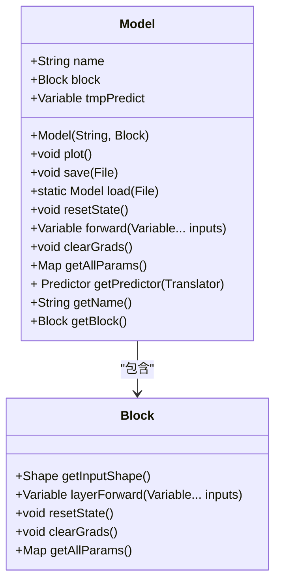
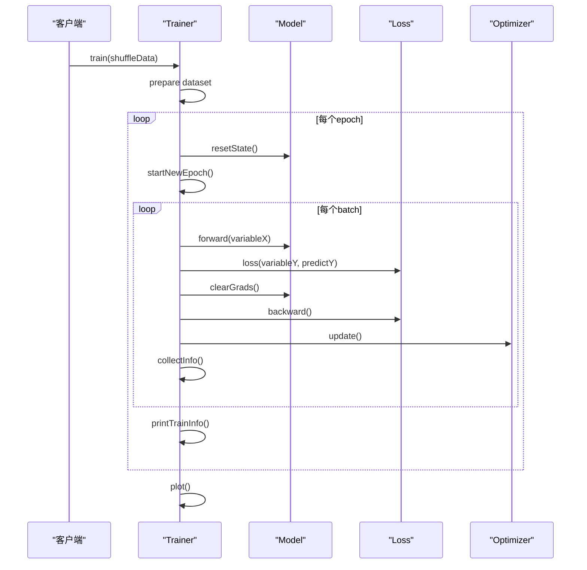
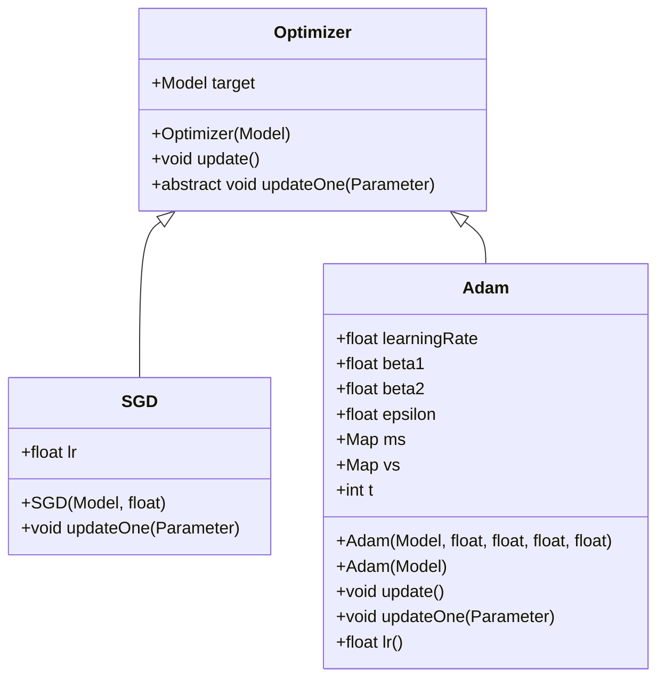
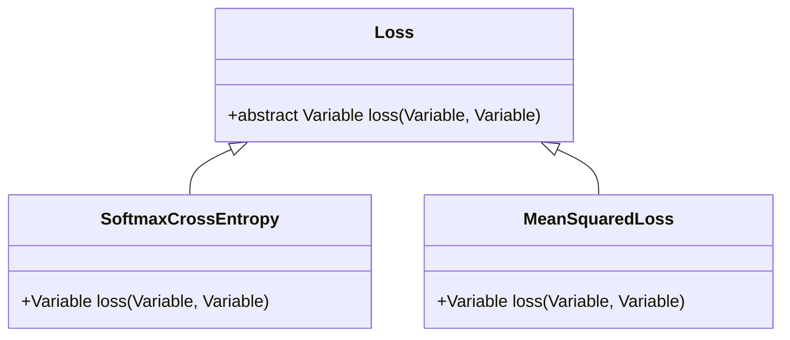
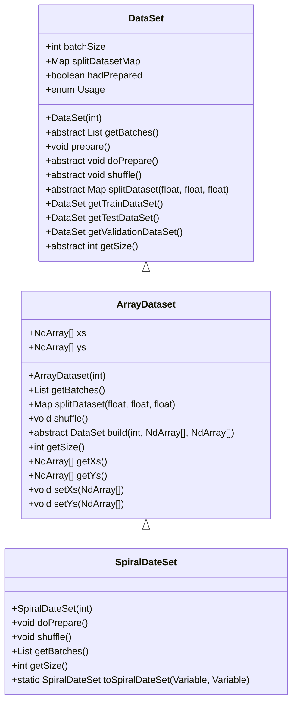
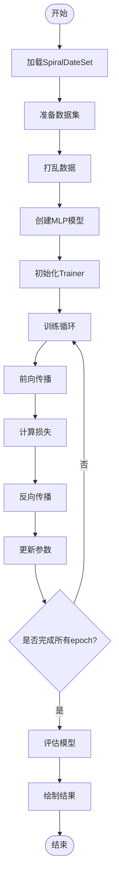

# mlearning模块

<cite>
**本文档中引用的文件**  
- [Model.java](file://src/main/java/io/leavesfly/tinydl/mlearning/Model.java)
- [Trainer.java](file://src/main/java/io/leavesfly/tinydl/mlearning/Trainer.java)
- [Loss.java](file://src/main/java/io/leavesfly/tinydl/mlearning/loss/Loss.java)
- [SoftmaxCrossEntropy.java](file://src/main/java/io/leavesfly/tinydl/mlearning/loss/SoftmaxCrossEntropy.java)
- [MeanSquaredLoss.java](file://src/main/java/io/leavesfly/tinydl/mlearning/loss/MeanSquaredLoss.java)
- [Optimizer.java](file://src/main/java/io/leavesfly/tinydl/mlearning/optimize/Optimizer.java)
- [SGD.java](file://src/main/java/io/leavesfly/tinydl/mlearning/optimize/SGD.java)
- [Adam.java](file://src/main/java/io/leavesfly/tinydl/mlearning/optimize/Adam.java)
- [DataSet.java](file://src/main/java/io/leavesfly/tinydl/mlearning/dataset/DataSet.java)
- [ArrayDataset.java](file://src/main/java/io/leavesfly/tinydl/mlearning/dataset/ArrayDataset.java)
- [SpiralDateSet.java](file://src/main/java/io/leavesfly/tinydl/mlearning/dataset/simple/SpiralDateSet.java)
- [SpiralMlpExam.java](file://src/main/java/io/leavesfly/tinydl/example/classify/SpiralMlpExam.java)
</cite>

## 目录
1. [简介](#简介)
2. [核心组件](#核心组件)
3. [模型封装与统一接口](#模型封装与统一接口)
4. [训练器设计与训练循环](#训练器设计与训练循环)
5. [优化器抽象与具体实现](#优化器抽象与具体实现)
6. [损失函数接口与实现](#损失函数接口与实现)
7. [数据集抽象与加载机制](#数据集抽象与加载机制)
8. [完整控制流图示例](#完整控制流图示例)
9. [可扩展性与用户友好性分析](#可扩展性与用户友好性分析)
10. [结论](#结论)

## 简介
mlearning模块是TinyDL框架中高层机器学习工作流的集成中心，提供了一套简洁而强大的API用于构建、训练和评估深度学习模型。该模块通过Model、Trainer、Optimizer、Loss和DataSet等核心类，实现了从数据加载到模型评估的完整机器学习流程。本文档将系统性地解析这些组件的设计与实现，重点阐述其在可扩展性和用户友好性方面的考量。

## 核心组件
mlearning模块的核心组件包括Model、Trainer、Optimizer、Loss和DataSet。这些组件共同构成了一个完整的机器学习工作流，使得用户可以方便地进行模型训练和评估。每个组件都有明确的职责，通过接口和抽象类实现灵活的扩展性。

**本节来源**  
- [Model.java](file://src/main/java/io/leavesfly/tinydl/mlearning/Model.java)
- [Trainer.java](file://src/main/java/io/leavesfly/tinydl/mlearning/Trainer.java)
- [Loss.java](file://src/main/java/io/leavesfly/tinydl/mlearning/loss/Loss.java)
- [Optimizer.java](file://src/main/java/io/leavesfly/tinydl/mlearning/optimize/Optimizer.java)
- [DataSet.java](file://src/main/java/io/leavesfly/tinydl/mlearning/dataset/DataSet.java)

## 模型封装与统一接口
Model类是mlearning模块中的核心组件之一，负责封装nnet模块中的Block并提供统一的forward接口。通过将Block作为内部组件，Model实现了对底层神经网络结构的抽象，使得用户无需关心具体的网络实现细节。

**图示来源**  
- [Model.java](file://src/main/java/io/leavesfly/tinydl/mlearning/Model.java#L1-L86)
- [Block.java](file://src/main/java/io/leavesfly/tinydl/nnet/Block.java)

**本节来源**  
- [Model.java](file://src/main/java/io/leavesfly/tinydl/mlearning/Model.java#L1-L86)

## 训练器设计与训练循环
Trainer类负责管理整个训练过程，包括数据迭代、前向传播、损失计算、反向传播和参数更新。其训练循环设计简洁高效，支持单线程和并行训练模式。

**图示来源**  
- [Trainer.java](file://src/main/java/io/leavesfly/tinydl/mlearning/Trainer.java#L1-L106)

**本节来源**  
- [Trainer.java](file://src/main/java/io/leavesfly/tinydl/mlearning/Trainer.java#L1-L106)

## 优化器抽象与具体实现
Optimizer抽象类定义了参数更新的基本框架，具体的优化算法如SGD和Adam通过继承该抽象类实现。这种设计模式使得添加新的优化算法变得非常简单。

**图示来源**  
- [Optimizer.java](file://src/main/java/io/leavesfly/tinydl/mlearning/optimize/Optimizer.java#L1-L28)
- [SGD.java](file://src/main/java/io/leavesfly/tinydl/mlearning/optimize/SGD.java#L1-L22)
- [Adam.java](file://src/main/java/io/leavesfly/tinydl/mlearning/optimize/Adam.java#L1-L70)

**本节来源**  
- [Optimizer.java](file://src/main/java/io/leavesfly/tinydl/mlearning/optimize/Optimizer.java#L1-L28)
- [SGD.java](file://src/main/java/io/leavesfly/tinydl/mlearning/optimize/SGD.java#L1-L22)
- [Adam.java](file://src/main/java/io/leavesfly/tinydl/mlearning/optimize/Adam.java#L1-L70)

## 损失函数接口与实现
Loss接口定义了损失函数的基本行为，具体的损失函数如SoftmaxCrossEntropy和MeanSquaredLoss通过实现该接口提供分类和回归任务的支持。

**图示来源**  
- [Loss.java](file://src/main/java/io/leavesfly/tinydl/mlearning/loss/Loss.java#L1-L10)
- [SoftmaxCrossEntropy.java](file://src/main/java/io/leavesfly/tinydl/mlearning/loss/SoftmaxCrossEntropy.java#L1-L11)
- [MeanSquaredLoss.java](file://src/main/java/io/leavesfly/tinydl/mlearning/loss/MeanSquaredLoss.java#L1-L14)

**本节来源**  
- [Loss.java](file://src/main/java/io/leavesfly/tinydl/mlearning/loss/Loss.java#L1-L10)
- [SoftmaxCrossEntropy.java](file://src/main/java/io/leavesfly/tinydl/mlearning/loss/SoftmaxCrossEntropy.java#L1-L11)
- [MeanSquaredLoss.java](file://src/main/java/io/leavesfly/tinydl/mlearning/loss/MeanSquaredLoss.java#L1-L14)

## 数据集抽象与加载机制
DataSet抽象类定义了数据集的基本行为，具体的实现如ArrayDataset和SpiralDateSet提供了不同类型数据集的加载机制。

**图示来源**  
- [DataSet.java](file://src/main/java/io/leavesfly/tinydl/mlearning/dataset/DataSet.java#L1-L62)
- [ArrayDataset.java](file://src/main/java/io/leavesfly/tinydl/mlearning/dataset/ArrayDataset.java#L1-L116)
- [SpiralDateSet.java](file://src/main/java/io/leavesfly/tinydl/mlearning/dataset/simple/SpiralDateSet.java)

**本节来源**  
- [DataSet.java](file://src/main/java/io/leavesfly/tinydl/mlearning/dataset/DataSet.java#L1-L62)
- [ArrayDataset.java](file://src/main/java/io/leavesfly/tinydl/mlearning/dataset/ArrayDataset.java#L1-L116)
- [SpiralDateSet.java](file://src/main/java/io/leavesfly/tinydl/mlearning/dataset/simple/SpiralDateSet.java)

## 完整控制流图示例
结合SpiralMlpExam示例，绘制从数据加载到模型评估的完整控制流图。

**图示来源**  
- [SpiralMlpExam.java](file://src/main/java/io/leavesfly/tinydl/example/classify/SpiralMlpExam.java#L1-L130)

**本节来源**  
- [SpiralMlpExam.java](file://src/main/java/io/leavesfly/tinydl/example/classify/SpiralMlpExam.java#L1-L130)

## 可扩展性与用户友好性分析
mlearning模块在设计上充分考虑了可扩展性和用户友好性。通过使用抽象类和接口，使得添加新的优化算法、损失函数和数据集变得非常简单。同时，提供了一套简洁的API，使得用户可以方便地进行模型训练和评估。

**本节来源**  
- [Model.java](file://src/main/java/io/leavesfly/tinydl/mlearning/Model.java#L1-L86)
- [Trainer.java](file://src/main/java/io/leavesfly/tinydl/mlearning/Trainer.java#L1-L106)
- [Optimizer.java](file://src/main/java/io/leavesfly/tinydl/mlearning/optimize/Optimizer.java#L1-L28)
- [Loss.java](file://src/main/java/io/leavesfly/tinydl/mlearning/loss/Loss.java#L1-L10)
- [DataSet.java](file://src/main/java/io/leavesfly/tinydl/mlearning/dataset/DataSet.java#L1-L62)

## 结论
mlearning模块作为TinyDL框架的高层机器学习工作流集成中心，通过精心设计的组件和接口，实现了从数据加载到模型评估的完整机器学习流程。其在可扩展性和用户友好性方面的设计考量，使得该模块既强大又易于使用。