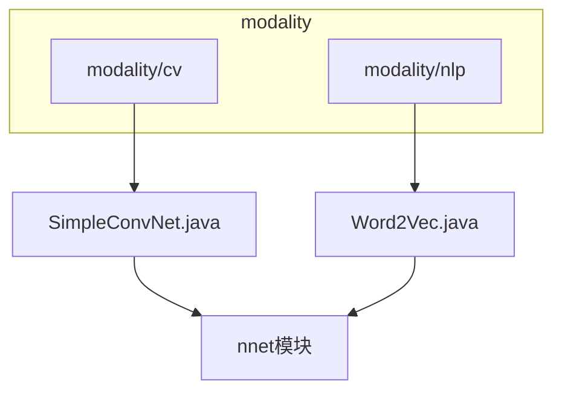
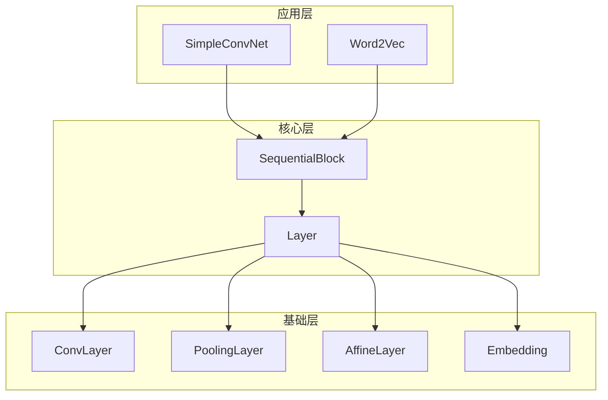
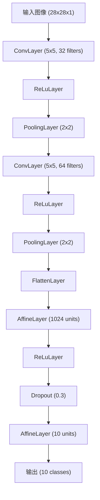
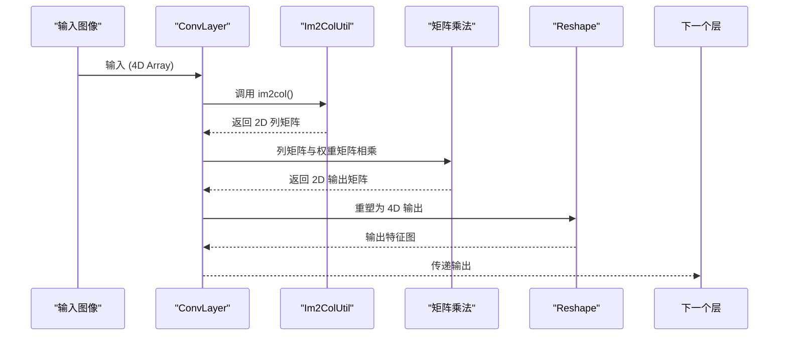
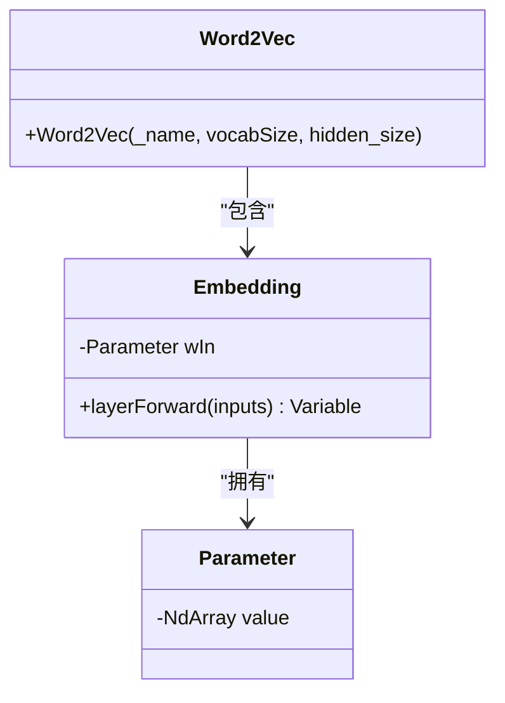
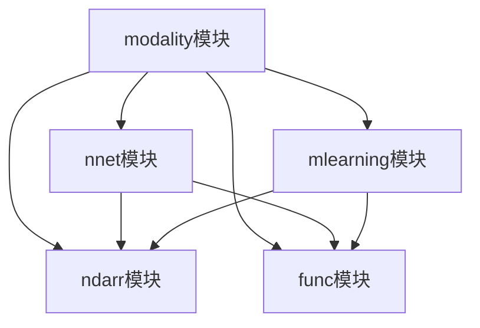

# modality模块

<cite>
**本文档中引用的文件**   
- [SimpleConvNet.java](file://src/main/java/io/leavesfly/tinydl/modality/cv/SimpleConvNet.java)
- [Word2Vec.java](file://src/main/java/io/leavesfly/tinydl/modality/nlp/Word2Vec.java)
- [ConvLayer.java](file://src/main/java/io/leavesfly/tinydl/nnet/layer/cnn/ConvLayer.java)
- [PoolingLayer.java](file://src/main/java/io/leavesfly/tinydl/nnet/layer/cnn/PoolingLayer.java)
- [AffineLayer.java](file://src/main/java/io/leavesfly/tinydl/nnet/layer/dnn/AffineLayer.java)
- [Embedding.java](file://src/main/java/io/leavesfly/tinydl/nnet/layer/embedd/Embedding.java)
- [Im2ColUtil.java](file://src/main/java/io/leavesfly/tinydl/nnet/layer/cnn/Im2ColUtil.java)
- [Col2ImUtil.java](file://src/main/java/io/leavesfly/tinydl/nnet/layer/cnn/Col2ImUtil.java)
</cite>

## 目录
1. [简介](#简介)
2. [项目结构](#项目结构)
3. [核心组件](#核心组件)
4. [架构概述](#架构概述)
5. [详细组件分析](#详细组件分析)
6. [依赖分析](#依赖分析)
7. [性能考虑](#性能考虑)
8. [故障排除指南](#故障排除指南)
9. [结论](#结论)

## 简介
`modality`模块是TinyDL框架中用于实现特定领域应用的核心模块，主要包含计算机视觉（CV）和自然语言处理（NLP）两大方向的模型实现。该模块通过继承和组合`nnet`模块中的基础层（Layer）和块（Block），构建出适用于具体任务的神经网络结构。本文档将详细解析`SimpleConvNet`如何整合卷积层、池化层和全连接层构建经典的卷积神经网络，以及`Word2Vec`如何利用嵌入层和负采样技术学习词向量表示。同时，探讨该模块作为框架应用示例的示范意义和扩展模板作用。

## 项目结构
`modality`模块位于`src/main/java/io/leavesfly/tinydl/modality`目录下，采用功能划分的组织方式，分为`cv`（计算机视觉）和`nlp`（自然语言处理）两个子包。每个子包包含一个或多个具体的模型实现类，这些类均继承自`nnet`模块中的`SequentialBlock`，体现了模块化和可复用的设计思想。

**图示来源**
- [SimpleConvNet.java](file://src/main/java/io/leavesfly/tinydl/modality/cv/SimpleConvNet.java)
- [Word2Vec.java](file://src/main/java/io/leavesfly/tinydl/modality/nlp/Word2Vec.java)

**本节来源**
- [SimpleConvNet.java](file://src/main/java/io/leavesfly/tinydl/modality/cv/SimpleConvNet.java)
- [Word2Vec.java](file://src/main/java/io/leavesfly/tinydl/modality/nlp/Word2Vec.java)

## 核心组件
`modality`模块的核心组件包括`SimpleConvNet`和`Word2Vec`两个类，分别代表了计算机视觉和自然语言处理领域的典型应用。`SimpleConvNet`通过组合`ConvLayer`、`PoolingLayer`和`AffineLayer`等基础层，构建了一个用于图像分类任务的卷积神经网络。`Word2Vec`则通过`Embedding`层和特定的训练策略，实现了词向量的学习。这两个组件都充分展示了如何利用底层核心模块（`ndarr`, `func`, `nnet`）来解决实际问题。

**本节来源**
- [SimpleConvNet.java](file://src/main/java/io/leavesfly/tinydl/modality/cv/SimpleConvNet.java#L15-L74)
- [Word2Vec.java](file://src/main/java/io/leavesfly/tinydl/modality/nlp/Word2Vec.java#L8-L13)

## 架构概述
`modality`模块的架构设计遵循了分层和模块化的原则。上层是具体的模型实现（如`SimpleConvNet`和`Word2Vec`），它们负责定义网络的整体结构和前向传播流程。下层是`nnet`模块提供的基础构建块（如`Layer`和`Block`），它们封装了具体的计算逻辑和参数管理。`modality`模块通过继承和组合这些基础构建块，实现了高层次的应用逻辑，同时保持了与底层核心模块的松耦合。

**图示来源**
- [SimpleConvNet.java](file://src/main/java/io/leavesfly/tinydl/modality/cv/SimpleConvNet.java)
- [Word2Vec.java](file://src/main/java/io/leavesfly/tinydl/modality/nlp/Word2Vec.java)
- [ConvLayer.java](file://src/main/java/io/leavesfly/tinydl/nnet/layer/cnn/ConvLayer.java)
- [PoolingLayer.java](file://src/main/java/io/leavesfly/tinydl/nnet/layer/cnn/PoolingLayer.java)
- [AffineLayer.java](file://src/main/java/io/leavesfly/tinydl/nnet/layer/dnn/AffineLayer.java)
- [Embedding.java](file://src/main/java/io/leavesfly/tinydl/nnet/layer/embedd/Embedding.java)

## 详细组件分析

### SimpleConvNet 分析
`SimpleConvNet`类旨在构建一个经典的卷积神经网络，用于计算机视觉任务，如MNIST手写数字识别。该网络结构设计遵循了典型的“卷积-激活-池化”重复模式，最后接全连接层进行分类。尽管当前代码中的`builtConvNet`方法被注释并返回`null`，但从注释的代码片段可以清晰地看出其设计意图。

#### 网络结构设计
`SimpleConvNet`的网络结构设计如下：
1.  **第一组卷积块**：一个`ConvLayer`（5x5卷积核，32个滤波器，SAME填充）后接`ReLuLayer`激活函数和`PoolingLayer`（2x2池化窗口）。
2.  **第二组卷积块**：另一个`ConvLayer`（5x5卷积核，64个滤波器，SAME填充）后接`ReLuLayer`和`PoolingLayer`。
3.  **展平层**：使用`FlattenLayer`将多维特征图展平为一维向量。
4.  **全连接层**：一个`AffineLayer`（1024个隐藏单元）后接`ReLuLayer`和`Dropout`层（丢弃率0.3）以防止过拟合。
5.  **输出层**：最终的`AffineLayer`（10个输出单元，对应10个类别）。

**图示来源**
- [SimpleConvNet.java](file://src/main/java/io/leavesfly/tinydl/modality/cv/SimpleConvNet.java#L15-L74)
- [ConvLayer.java](file://src/main/java/io/leavesfly/tinydl/nnet/layer/cnn/ConvLayer.java)
- [PoolingLayer.java](file://src/main/java/io/leavesfly/tinydl/nnet/layer/cnn/PoolingLayer.java)
- [AffineLayer.java](file://src/main/java/io/leavesfly/tinydl/nnet/layer/dnn/AffineLayer.java)
- [FlattenLayer.java](file://src/main/java/io/leavesfly/tinydl/nnet/layer/norm/FlattenLayer.java)
- [Dropout.java](file://src/main/java/io/leavesfly/tinydl/nnet/layer/norm/Dropout.java)

#### 前向传播流程
`SimpleConvNet`本身不直接实现前向传播，而是通过其父类`SequentialBlock`来管理。`SequentialBlock`会按顺序调用其内部添加的各个`Layer`的`layerForward`方法。对于`ConvLayer`，其前向传播的核心是`im2col`操作，它将输入图像的局部区域展开成列向量，然后与卷积核的权重进行矩阵乘法，从而高效地实现卷积运算。

**图示来源**
- [ConvLayer.java](file://src/main/java/io/leavesfly/tinydl/nnet/layer/cnn/ConvLayer.java#L78-L95)
- [Im2ColUtil.java](file://src/main/java/io/leavesfly/tinydl/nnet/layer/cnn/Im2ColUtil.java)

#### 与mlearning模块的集成
`SimpleConvNet`作为`Model`的一种具体实现，可以无缝集成到`mlearning`模块的训练和评估流程中。用户可以将`SimpleConvNet`的实例传递给`Trainer`，并配合`MnistDataSet`数据集、`SoftmaxCrossEntropy`损失函数和`Adam`优化器，完成整个模型的训练、验证和预测过程。

**本节来源**
- [SimpleConvNet.java](file://src/main/java/io/leavesfly/tinydl/modality/cv/SimpleConvNet.java#L15-L74)
- [ConvLayer.java](file://src/main/java/io/leavesfly/tinydl/nnet/layer/cnn/ConvLayer.java)
- [Im2ColUtil.java](file://src/main/java/io/leavesfly/tinydl/nnet/layer/cnn/Im2ColUtil.java)
- [mlearning模块](file://src/main/java/io/leavesfly/tinydl/mlearning/)

### Word2Vec 分析
`Word2Vec`类旨在实现词向量学习模型，如Skip-gram或CBOW。尽管当前代码仅包含一个空的构造函数和一个待实现的注释，但其设计基础已经明确。

#### 实现基础
`Word2Vec`继承自`SequentialBlock`，这表明它将通过组合多个`Layer`来构建。其核心是`Embedding`层，该层负责将离散的词索引映射为连续的向量表示。

#### Embedding层解析
`Embedding`层的实现非常直接。它内部持有一个`Parameter`对象`wIn`，其形状为`(vocabSize, hidden_size)`，即词汇表大小乘以词向量维度。在前向传播时，`layerForward`方法接收一个包含词索引的输入变量，然后使用`getItem`方法从`wIn`中提取对应的词向量。

**图示来源**
- [Word2Vec.java](file://src/main/java/io/leavesfly/tinydl/modality/nlp/Word2Vec.java)
- [Embedding.java](file://src/main/java/io/leavesfly/tinydl/nnet/layer/embedd/Embedding.java)

#### 负采样技术
虽然代码中未直接体现，但`Word2Vec`模型通常会采用负采样（Negative Sampling）技术来优化训练过程。这需要在损失函数中实现，通过采样少量的负例（非上下文词）来近似计算softmax，从而大幅降低计算复杂度。这通常在`mlearning`模块的损失函数中实现。

**本节来源**
- [Word2Vec.java](file://src/main/java/io/leavesfly/tinydl/modality/nlp/Word2Vec.java#L8-L13)
- [Embedding.java](file://src/main/java/io/leavesfly/tinydl/nnet/layer/embedd/Embedding.java)

## 依赖分析
`modality`模块的依赖关系清晰地展示了其在框架中的位置。它直接依赖于`nnet`模块来获取神经网络的构建块，依赖于`ndarr`模块进行底层的多维数组操作，依赖于`func`模块进行自动微分和变量管理。同时，它也与`mlearning`模块紧密集成，为模型的训练和评估提供支持。

**图示来源**
- [SimpleConvNet.java](file://src/main/java/io/leavesfly/tinydl/modality/cv/SimpleConvNet.java)
- [Word2Vec.java](file://src/main/java/io/leavesfly/tinydl/modality/nlp/Word2Vec.java)
- [ConvLayer.java](file://src/main/java/io/leavesfly/tinydl/nnet/layer/cnn/ConvLayer.java)
- [Embedding.java](file://src/main/java/io/leavesfly/tinydl/nnet/layer/embedd/Embedding.java)

**本节来源**
- [SimpleConvNet.java](file://src/main/java/io/leavesfly/tinydl/modality/cv/SimpleConvNet.java)
- [Word2Vec.java](file://src/main/java/io/leavesfly/tinydl/modality/nlp/Word2Vec.java)

## 性能考虑
`SimpleConvNet`中`im2col`和`col2im`操作虽然能将卷积高效地转化为矩阵乘法，但会显著增加内存占用，因为`im2col`会将输入数据展开成一个巨大的二维矩阵。对于大型网络或高分辨率图像，这可能成为内存瓶颈。`Word2Vec`的性能则主要取决于词汇表的大小和负采样的实现效率。

## 故障排除指南
如果`SimpleConvNet`在训练时出现维度不匹配错误，请检查输入数据的形状是否与网络期望的输入形状（如28x28x1）一致。如果`Word2Vec`的训练效果不佳，应检查词索引是否在`Embedding`层的词汇表范围内，并确认负采样策略是否正确实现。

**本节来源**
- [ConvLayer.java](file://src/main/java/io/leavesfly/tinydl/nnet/layer/cnn/ConvLayer.java#L45-L55)
- [Embedding.java](file://src/main/java/io/leavesfly/tinydl/nnet/layer/embedd/Embedding.java#L35-L40)

## 结论
`modality`模块作为TinyDL框架的应用层实现，成功地展示了如何利用底层核心模块（`ndarr`, `func`, `nnet`）构建复杂的深度学习模型。`SimpleConvNet`和`Word2Vec`虽然当前实现尚不完整，但其设计模式具有很强的示范意义。它们为开发者提供了一个清晰的模板：通过继承`SequentialBlock`并组合基础`Layer`，可以快速构建出适用于新领域的模型。这种模块化的设计极大地提高了代码的可复用性和可维护性，是框架扩展性的关键所在。