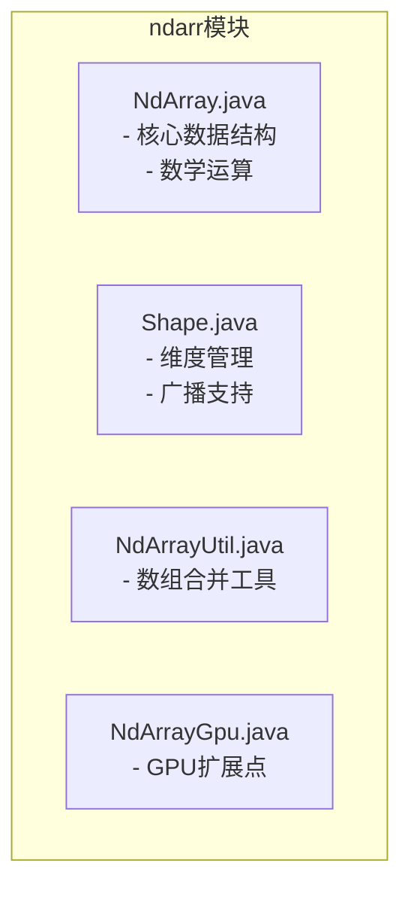
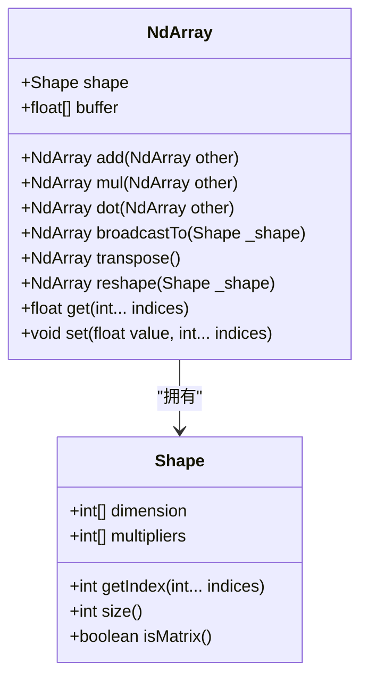
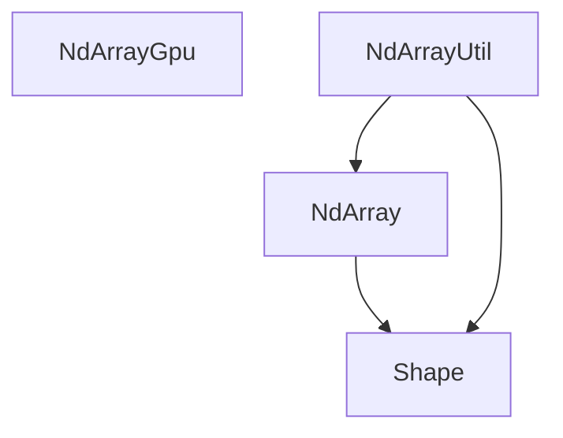

# ndarr模块

<cite>
**本文档中引用的文件**   
- [NdArray.java](file://src/main/java/io/leavesfly/tinydl/ndarr/NdArray.java)
- [Shape.java](file://src/main/java/io/leavesfly/tinydl/ndarr/Shape.java)
- [NdArrayUtil.java](file://src/main/java/io/leavesfly/tinydl/ndarr/NdArrayUtil.java)
- [NdArrayGpu.java](file://src/main/java/io/leavesfly/tinydl/ndarr/NdArrayGpu.java)
</cite>

## 目录
1. [简介](#简介)
2. [项目结构](#项目结构)
3. [核心组件](#核心组件)
4. [架构概述](#架构概述)
5. [详细组件分析](#详细组件分析)
6. [依赖分析](#依赖分析)
7. [性能考虑](#性能考虑)
8. [故障排除指南](#故障排除指南)
9. [结论](#结论)

## 简介
ndarr模块是TinyDL框架的核心计算引擎，提供了一个高效的多维数组（NdArray）实现，用于支持深度学习中的各种数值计算任务。该模块设计简洁，专注于CPU上的基本张量操作，为上层神经网络和机器学习功能提供了坚实的基础。NdArray类是该模块的核心，它封装了N维数据的存储、形状管理和数学运算。Shape类负责精确描述和操作数组的维度信息，是实现广播（broadcasting）和形状变换等高级功能的关键。NdArrayUtil类提供了一系列实用的数组操作工具，如数组合并。尽管NdArrayGpu类目前为空，但它为未来的GPU加速扩展预留了接口，体现了模块的前瞻性设计。本架构文档将深入剖析这些组件的设计与实现，阐明它们如何协同工作以支持TinyDL的计算图执行。

## 项目结构
ndarr模块位于`src/main/java/io/leavesfly/tinydl/ndarr`目录下，结构清晰，仅包含四个核心Java类文件，体现了其作为底层计算引擎的精简性。该模块不依赖于外部数学库，所有计算均通过Java原生代码实现。其设计目标是为TinyDL提供一个轻量级、自包含的张量操作基础，因此没有复杂的子包结构。模块的四个类文件分工明确：NdArray是主要的数据结构和计算载体，Shape是维度管理的核心，NdArrayUtil提供辅助工具方法，而NdArrayGpu则作为未来扩展的占位符。这种扁平且专注的结构使得代码易于理解和维护。



**图源**
- [NdArray.java](file://src/main/java/io/leavesfly/tinydl/ndarr/NdArray.java)
- [Shape.java](file://src/main/java/io/leavesfly/tinydl/ndarr/Shape.java)
- [NdArrayUtil.java](file://src/main/java/io/leavesfly/tinydl/ndarr/NdArrayUtil.java)
- [NdArrayGpu.java](file://src/main/java/io/leavesfly/tinydl/ndarr/NdArrayGpu.java)

**节源**
- [NdArray.java](file://src/main/java/io/leavesfly/tinydl/ndarr/NdArray.java)
- [Shape.java](file://src/main/java/io/leavesfly/tinydl/ndarr/Shape.java)

## 核心组件
ndarr模块的核心由`NdArray`和`Shape`两个类构成。`NdArray`类是N维数组的主体，它通过`float[] buffer`字段以一维数组的形式存储所有数据元素，并通过`Shape shape`字段来管理其多维结构。这种设计将数据存储与逻辑形状分离，既保证了内存访问的连续性和效率，又提供了灵活的维度操作能力。`Shape`类是维度管理的基石，它不仅存储了各维度的大小（`dimension`数组），还预先计算了用于快速索引转换的乘数数组（`multipliers`）。这两个类的紧密协作使得`NdArray`能够高效地执行诸如`get`和`set`等基于多维坐标的操作。`NdArrayUtil`类提供了`merge`等静态工具方法，扩展了核心功能。`NdArrayGpu`类目前为空，但其存在为未来实现CPU/GPU统一接口的异构计算奠定了基础。

**节源**
- [NdArray.java](file://src/main/java/io/leavesfly/tinydl/ndarr/NdArray.java#L1-L50)
- [Shape.java](file://src/main/java/io/leavesfly/tinydl/ndarr/Shape.java#L1-L20)
- [NdArrayUtil.java](file://src/main/java/io/leavesfly/tinydl/ndarr/NdArrayUtil.java#L1-L10)

## 架构概述
ndarr模块的架构围绕`NdArray`类构建，它依赖于`Shape`类进行维度计算，并通过`NdArrayUtil`类扩展功能。`NdArray`是所有计算的中心，它直接持有数据缓冲区和形状信息。当执行如`add`、`mul`等运算时，`NdArray`会创建一个新的`NdArray`实例作为结果。对于涉及维度变化的操作，如`broadcastTo`和`reshape`，`NdArray`会调用`Shape`对象的方法来验证或计算新的维度。`NdArrayUtil`作为一个独立的工具类，提供不直接属于`NdArray`实例的通用操作。整个模块目前是纯CPU实现，`NdArrayGpu`类的存在暗示了未来可能通过继承或接口实现来支持GPU后端，从而形成一个统一的张量API。

```mermaid
graph TD
subgraph "ndarr模块"
NdArray["NdArray"]
Shape["Shape"]
NdArrayUtil["NdArrayUtil"]
NdArrayGpu["NdArrayGpu"]
end
NdArray --> Shape : "使用"
NdArrayUtil --> NdArray : "创建"
NdArrayUtil --> Shape : "查询"
```

**图源**
- [NdArray.java](file://src/main/java/io/leavesfly/tinydl/ndarr/NdArray.java)
- [Shape.java](file://src/main/java/io/leavesfly/tinydl/ndarr/Shape.java)
- [NdArrayUtil.java](file://src/main/java/io/leavesfly/tinydl/ndarr/NdArrayUtil.java)

## 详细组件分析
本节将对ndarr模块的各个关键组件进行深入分析，探讨其设计原理和实现细节。

### NdArray类分析
`NdArray`类是TinyDL中所有数值数据的载体，其设计体现了简洁与效率的平衡。

#### 内存布局与数据存储
`NdArray`采用一维`float[] buffer`数组来存储所有数据，这保证了内存的连续性，有利于CPU缓存的高效利用。多维逻辑结构由`Shape`对象管理。当通过`get(int... indices)`方法访问元素时，`NdArray`会调用`shape.getIndex(indices)`将多维坐标转换为一维数组的索引。`Shape`类中的`multipliers`数组（步长数组）使得这个转换过程非常高效，时间复杂度为O(n)，其中n是维度数。例如，对于一个形状为[2, 3, 4]的数组，坐标(1, 2, 3)对应的索引计算为`1*multipliers[0] + 2*multipliers[1] + 3*multipliers[2]`。这种设计避免了在`NdArray`内部进行复杂的索引计算，将维度相关的逻辑完全委托给`Shape`类，实现了关注点分离。



**图源**
- [NdArray.java](file://src/main/java/io/leavesfly/tinydl/ndarr/NdArray.java#L1-L100)
- [Shape.java](file://src/main/java/io/leavesfly/tinydl/ndarr/Shape.java#L1-L50)

#### 基础数学运算实现
`NdArray`实现了丰富的基础数学运算，主要分为四类：四则运算、逻辑运算、数学函数和归约操作。
- **四则运算**：`add`, `sub`, `mul`, `div`等方法要求两个操作数的`shape`完全相同。实现方式是创建一个新的`NdArray`，然后通过单层循环遍历`buffer`数组，对对应位置的元素进行逐元素（element-wise）计算。
- **逻辑运算**：`eq`, `gt`, `lt`等方法同样基于逐元素比较，返回一个由0.0f（假）和1.0f（真）组成的`NdArray`。
- **数学函数**：`exp`, `log`, `sin`, `cos`, `tanh`等方法对每个元素应用相应的数学函数。`sigmoid`函数通过`tanh`函数的恒等式`sigmoid(x) = 0.5 * (tanh(0.5*x) + 1)`来实现，这是一种数值上更稳定的计算方式。
- **归约操作**：`sum`, `mean`, `max`, `min`等方法沿着指定的轴（axis）进行计算。例如，`sum(0)`会沿着行方向对每一列的元素求和，返回一个行向量。

**节源**
- [NdArray.java](file://src/main/java/io/leavesfly/tinydl/ndarr/NdArray.java#L150-L500)

### Shape类分析
`Shape`类在ndarr模块中扮演着至关重要的角色，它是实现广播和形状变换的核心。

#### 维度管理与索引计算
`Shape`类的核心是`dimension`数组，它存储了每个维度的大小。`init`方法在构造时被调用，用于计算`multipliers`数组。`multipliers[i]`表示在第i维上移动一个单位，需要在`buffer`数组中跳过的元素个数。例如，对于一个二维数组[3, 4]，`multipliers`为[4, 1]，意味着在行方向移动一行需要跳过4个元素，在列方向移动一列需要跳过1个元素。`getIndex`方法利用`multipliers`数组，将多维坐标高效地转换为一维索引。

#### 广播机制
广播（broadcasting）允许形状不同的数组进行算术运算。`NdArray`的`broadcastTo(Shape _shape)`方法实现了这一功能。其核心思想是将较小的数组“拉伸”到与目标形状相同。实现上，它通过取模运算`i % this.shape.getRow()`和`j % this.shape.getColumn()`来循环访问源数组的元素，从而填充到更大的目标数组中。例如，一个形状为[1, 3]的数组可以被广播到[2, 3]，第一行和第二行的数据将完全相同。`Shape`类通过`isMatrix()`方法和`getRow()`/`getColumn()`方法为广播逻辑提供了必要的维度信息。

#### 形状变换
`NdArray`提供了`reshape`和`transpose`方法来改变数组的形状。
- **reshape**：`reshape(Shape _shape)`方法要求新旧形状的总元素数量（`size()`）必须相等。它创建一个具有新`Shape`的新`NdArray`实例，并将原`buffer`的引用或副本赋给它。数据的物理顺序不变，但逻辑解释发生了变化。
- **transpose**：`transpose()`方法专门用于二维矩阵，交换行和列。`transpose(int... order)`方法支持更高维度的任意轴转置，它通过重新排列索引来实现。

**节源**
- [Shape.java](file://src/main/java/io/leavesfly/tinydl/ndarr/Shape.java)
- [NdArray.java](file://src/main/java/io/leavesfly/tinydl/ndarr/NdArray.java#L600-L800)

### NdArrayUtil类分析
`NdArrayUtil`类提供了一个静态工具方法`merge`，用于沿指定轴合并多个`NdArray`。

#### 数组合并与性能优化
`merge(int axis, NdArray... ndArrays)`方法可以将多个形状兼容的数组沿行（axis=0）或列（axis=1）方向堆叠。其实现策略体现了对内存布局的深刻理解：
- **按行合并 (axis=0)**：这是最简单的情况，只需将所有输入数组的`buffer`按顺序复制到一个更大的`buffer`中即可，因为数据在内存中是连续存储的。
- **按列合并 (axis=1)**：这需要更复杂的交错复制。方法通过计算`level`（每“层”在最后一个维度上的元素数）来确定复制的粒度，然后交替地从每个输入数组复制一行（或一个切片）的数据。这种实现避免了逐个元素的随机访问，尽可能利用了内存的局部性，是一种有效的性能优化策略。

**节源**
- [NdArrayUtil.java](file://src/main/java/io/leavesfly/tinydl/ndarr/NdArrayUtil.java)

### NdArrayGpu类分析
`NdArrayGpu`类目前是一个空的占位符，仅包含一个`//todo`注释。

#### 扩展点与统一调用
该类的存在明确指出了模块未来的扩展方向——GPU加速。为了实现CPU与GPU后端的统一调用，一个可行的设计是引入一个`NdArrayBackend`接口，该接口定义所有核心操作（如`add`, `dot`等）。然后，`NdArray`可以持有一个`NdArrayBackend`的实例，其具体实现可以是`CpuBackend`或未来的`GpuBackend`。`NdArrayGpu`类可以作为`GpuBackend`实现的一部分，或者直接实现`NdArrayBackend`接口。这样，上层代码只需操作`NdArray`对象，而无需关心底层是CPU还是GPU在执行计算，从而实现了后端的透明切换。

**节源**
- [NdArrayGpu.java](file://src/main/java/io/leavesfly/tinydl/ndarr/NdArrayGpu.java)

## 依赖分析
ndarr模块的依赖关系非常简单。`NdArray`类直接依赖于`Shape`类，用于管理维度和计算索引。`NdArrayUtil`类依赖于`NdArray`和`Shape`类，以查询形状信息和创建新的数组实例。`NdArrayGpu`类目前没有依赖。该模块对外部库没有依赖，保持了其核心计算引擎的独立性。从项目结构看，`func`包中的各种函数（如`Add`, `MatMul`）和`nnet`包中的层（如`AffineLayer`）都依赖于`NdArray`来进行实际的数值计算，这表明ndarr模块是整个TinyDL框架的底层基石。



**图源**
- [NdArray.java](file://src/main/java/io/leavesfly/tinydl/ndarr/NdArray.java)
- [Shape.java](file://src/main/java/io/leavesfly/tinydl/ndarr/Shape.java)
- [NdArrayUtil.java](file://src/main/java/io/leavesfly/tinydl/ndarr/NdArrayUtil.java)
- [NdArrayGpu.java](file://src/main/java/io/leavesfly/tinydl/ndarr/NdArrayGpu.java)

**节源**
- [NdArray.java](file://src/main/java/io/leavesfly/tinydl/ndarr/NdArray.java)
- [Shape.java](file://src/main/java/io/leavesfly/tinydl/ndarr/Shape.java)

## 性能考虑
ndarr模块的性能特点如下：
- **优势**：内存布局连续，有利于CPU缓存；核心运算（如逐元素加法）通过简单的for循环实现，开销小；`Shape`类的`multipliers`数组优化了索引计算。
- **瓶颈**：
    1. **缺乏BLAS集成**：最显著的性能瓶颈是矩阵乘法`dot`方法。其实现是纯Java的三重嵌套循环，没有利用高度优化的本地BLAS库（如OpenBLAS或Intel MKL），这在处理大型矩阵时会非常慢。
    2. **广播效率**：`broadcastTo`方法会创建一个全新的、可能非常大的`NdArray`，这会消耗大量内存。更高效的实现可以使用“虚拟广播”，即不实际复制数据，而是在计算时动态计算索引。
    3. **缺少惰性求值**：所有操作都是立即执行的，这可能导致不必要的中间数组创建。引入计算图和惰性求值可以优化内存使用和执行效率。
- **未来方向**：除了实现GPU支持，还可以考虑集成Java的BLAS绑定（如Netlib-java），以大幅提升线性代数运算的性能。

## 故障排除指南
- **Shape错误**：在进行二元运算（如`add`, `dot`）时，如果出现`"Shape error!"`或`"NdArray add method shape error!"`，请检查两个操作数的`shape`是否兼容。对于逐元素运算，`shape`必须完全相同；对于矩阵乘法，第一个矩阵的列数必须等于第二个矩阵的行数。
- **索引越界**：在调用`get`或`set`方法时，如果传入的维度坐标超出了`shape`的范围，会抛出`ArrayIndexOutOfBoundsException`。请确保坐标值在`[0, dimension[i])`范围内。
- **维度不匹配**：许多方法（如`transpose`, `sum`）仅对二维矩阵实现。如果对高维数组调用这些方法，会抛出`"not matrix !"`的运行时异常。应先使用`reshape`或`flatten`将高维数组转换为二维矩阵。

**节源**
- [NdArray.java](file://src/main/java/io/leavesfly/tinydl/ndarr/NdArray.java)
- [Shape.java](file://src/main/java/io/leavesfly/tinydl/ndarr/Shape.java)

## 结论
ndarr模块成功地为TinyDL构建了一个功能完整、设计清晰的底层多维数组计算引擎。`NdArray`和`Shape`类的组合设计巧妙地分离了数据存储和维度逻辑，支持了从标量到高维张量的灵活表示。模块实现了包括四则运算、数学函数、广播、形状变换在内的核心功能，满足了深度学习框架的基本需求。`NdArrayUtil`提供了实用的工具方法，而`NdArrayGpu`则为未来的性能扩展指明了方向。当前的主要局限在于计算性能，特别是缺乏对优化线性代数库的集成。未来的工作应集中在性能优化上，包括集成BLAS库、实现GPU后端以及探索惰性求值和自动微分，以将ndarr模块从一个教学演示系统发展为一个高性能的生产级计算引擎。