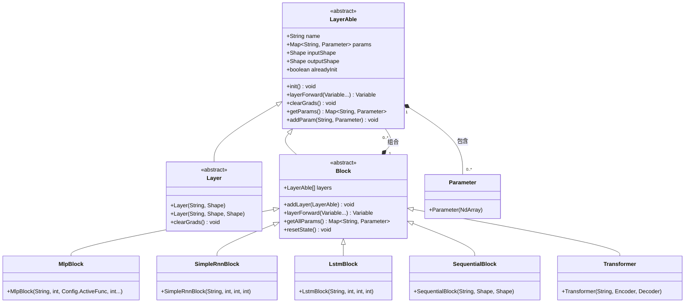

# nnet模块

<cite>
**本文档引用的文件**
- [LayerAble.java](file://src/main/java/io/leavesfly/tinydl/nnet/LayerAble.java)
- [Layer.java](file://src/main/java/io/leavesfly/tinydl/nnet/Layer.java)
- [Block.java](file://src/main/java/io/leavesfly/tinydl/nnet/Block.java)
- [Parameter.java](file://src/main/java/io/leavesfly/tinydl/nnet/Parameter.java)
- [MlpBlock.java](file://src/main/java/io/leavesfly/tinydl/nnet/block/MlpBlock.java)
- [SimpleRnnBlock.java](file://src/main/java/io/leavesfly/tinydl/nnet/block/SimpleRnnBlock.java)
- [LstmBlock.java](file://src/main/java/io/leavesfly/tinydl/nnet/block/LstmBlock.java)
- [SequentialBlock.java](file://src/main/java/io/leavesfly/tinydl/nnet/block/SequentialBlock.java)
- [Transformer.java](file://src/main/java/io/leavesfly/tinydl/nnet/block/transformer/Transformer.java)
</cite>

## 目录
1. [引言](#引言)
2. [分层架构设计](#分层架构设计)
3. [Layer接口与Layer类](#layer接口与layer类)
4. [Block容器设计](#block容器设计)
5. [预定义Block结构对比](#预定义block结构对比)
6. [SequentialBlock与Transformer实现](#sequentialblock与transformer实现)
7. [UML类图](#uml类图)
8. [组件组合示例](#组件组合示例)
9. [设计权衡分析](#设计权衡分析)
10. [结论](#结论)

## 引言
nnet模块是TinyDL框架中神经网络构建的核心组件，提供了一套分层、模块化的神经网络设计范式。该模块通过定义清晰的抽象接口和可组合的构建块，支持从简单全连接网络到复杂序列模型的灵活构建。本文档深入分析其架构设计、核心组件及组合机制。

## 分层架构设计
nnet模块采用分层抽象设计，构建了从基础单元到复杂网络的完整层次结构。最底层是`Parameter`类，封装可训练参数；其上是`LayerAble`接口，定义神经网络层的基本契约；`Layer`类在此基础上实现具体变换；`Block`类作为容器，通过组合多个`LayerAble`实例构建复杂网络拓扑。这种设计实现了关注点分离，提升了代码复用性和扩展性。

**Section sources**
- [LayerAble.java](file://src/main/java/io/leavesfly/tinydl/nnet/LayerAble.java#L13-L82)
- [Layer.java](file://src/main/java/io/leavesfly/tinydl/nnet/Layer.java#L11-L33)
- [Block.java](file://src/main/java/io/leavesfly/tinydl/nnet/Block.java#L14-L89)
- [Parameter.java](file://src/main/java/io/leavesfly/tinydl/nnet/Parameter.java#L1-L13)

## Layer接口与Layer类
`LayerAble`是所有神经网络层的抽象基类，继承自`Function`并定义了`layerForward`、`init`、`clearGrads`等核心方法。它通过`params`字段管理内部参数，并提供`addParam`、`getParamBy`等方法进行参数注册与访问。`Layer`类继承`LayerAble`，作为具体层的基类，初始化参数映射并实现梯度清零逻辑。具体层如`AffineLayer`或`ReLuLayer`继承`Layer`，实现特定的数学变换。

**Section sources**
- [LayerAble.java](file://src/main/java/io/leavesfly/tinydl/nnet/LayerAble.java#L13-L82)
- [Layer.java](file://src/main/java/io/leavesfly/tinydl/nnet/Layer.java#L11-L33)

## Block容器设计
`Block`类是网络子结构的容器，同样继承`LayerAble`，使其可作为更大网络的一部分。它通过`layers`列表管理内部的`LayerAble`组件，并重写`layerForward`方法实现链式前向传播。`addLayer`方法在添加组件时自动调用其`init`方法。`getAllParams`递归收集所有子组件的参数，`resetState`方法则用于RNN类模型的状态重置，体现了对序列模型的支持。

**Section sources**
- [Block.java](file://src/main/java/io/leavesfly/tinydl/nnet/Block.java#L14-L89)

## 预定义Block结构对比
nnet模块提供了多种预定义的`Block`实现，以满足不同网络架构的需求。

- **MlpBlock**：实现多层感知机，接收层尺寸数组，自动构建全连接层与激活函数的交替序列，支持ReLU或Sigmoid激活。
- **SimpleRnnBlock**：构建简单的循环神经网络，包含一个`SimpleRnnlayer`和一个`LinearLayer`，适用于基础序列建模。
- **LstmBlock**：基于LSTM单元，结构与`SimpleRnnBlock`类似，但使用`LstmLayer`，能更好地捕捉长期依赖。

这些预定义块通过组合基础层，简化了常见网络的构建过程。

**Section sources**
- [MlpBlock.java](file://src/main/java/io/leavesfly/tinydl/nnet/block/MlpBlock.java#L16-L41)
- [SimpleRnnBlock.java](file://src/main/java/io/leavesfly/tinydl/nnet/block/SimpleRnnBlock.java#L11-L38)
- [LstmBlock.java](file://src/main/java/io/leavesfly/tinydl/nnet/block/LstmBlock.java#L8-L36)

## SequentialBlock与Transformer实现
`SequentialBlock`是`Block`的直接子类，不添加额外逻辑，其`layerForward`继承自父类，按顺序执行添加的层。这种设计提供了最基础的链式调用机制，是构建深度网络的通用方式。

`Transformer`块则实现了更复杂的编码器-解码器架构。它包含`Encoder`和`Decoder`两个子块，在`layerForward`中先执行编码器，然后将编码状态传递给解码器进行初始化，最后执行解码。这种设计清晰地表达了Transformer模型的数据流和状态依赖。

**Section sources**
- [SequentialBlock.java](file://src/main/java/io/leavesfly/tinydl/nnet/block/SequentialBlock.java#L9-L20)
- [Transformer.java](file://src/main/java/io/leavesfly/tinydl/nnet/block/transformer/Transformer.java#L17-L46)

## UML类图

**Diagram sources**
- [LayerAble.java](file://src/main/java/io/leavesfly/tinydl/nnet/LayerAble.java#L13-L82)
- [Layer.java](file://src/main/java/io/leavesfly/tinydl/nnet/Layer.java#L11-L33)
- [Block.java](file://src/main/java/io/leavesfly/tinydl/nnet/Block.java#L14-L89)
- [Parameter.java](file://src/main/java/io/leavesfly/tinydl/nnet/Parameter.java#L1-L13)

## 组件组合示例
通过组合`Layer`和`Block`，可以构建任意复杂的神经网络。例如，一个图像分类模型可以由`ConvLayer`、`PoolingLayer`和`MlpBlock`串联而成；一个机器翻译模型则可以由`Embedding`层、`Transformer`块和`SoftMaxLayer`组合。`Model`类通过持有`Block`的引用来封装整个网络，实现了训练和推理的统一接口。

**Section sources**
- [MlpBlock.java](file://src/main/java/io/leavesfly/tinydl/nnet/block/MlpBlock.java#L16-L41)
- [Transformer.java](file://src/main/java/io/leavesfly/tinydl/nnet/block/transformer/Transformer.java#L17-L46)
- [Model.java](file://src/main/java/io/leavesfly/tinydl/mlearning/Model.java#L21-L21)

## 设计权衡分析
nnet模块在灵活性与易用性之间取得了良好平衡。通过`LayerAble`接口和`Block`容器，用户可以自由组合组件，实现高度定制化的网络。同时，预定义的`Block`如`MlpBlock`和`LstmBlock`降低了常见模型的构建门槛。然而，`Block`的`layerForward`默认实现为简单链式调用，对于非顺序网络（如残差连接）需要重写该方法，这在一定程度上牺牲了通用性以换取实现的简洁性。

## 结论
nnet模块通过分层抽象和组合设计，为神经网络的构建提供了强大而灵活的框架。`Layer`和`Block`的继承与组合关系清晰，参数管理和前向传播机制统一。该设计不仅支持从简单到复杂的各种网络架构，还保持了代码的可维护性和可扩展性，是TinyDL框架的核心优势之一。