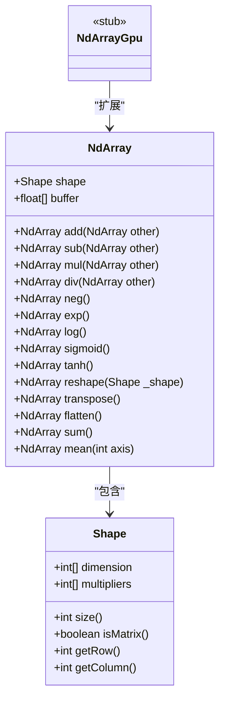
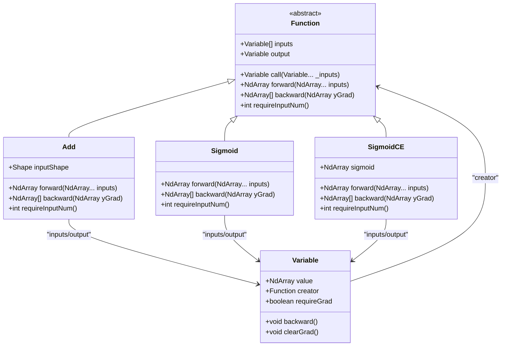
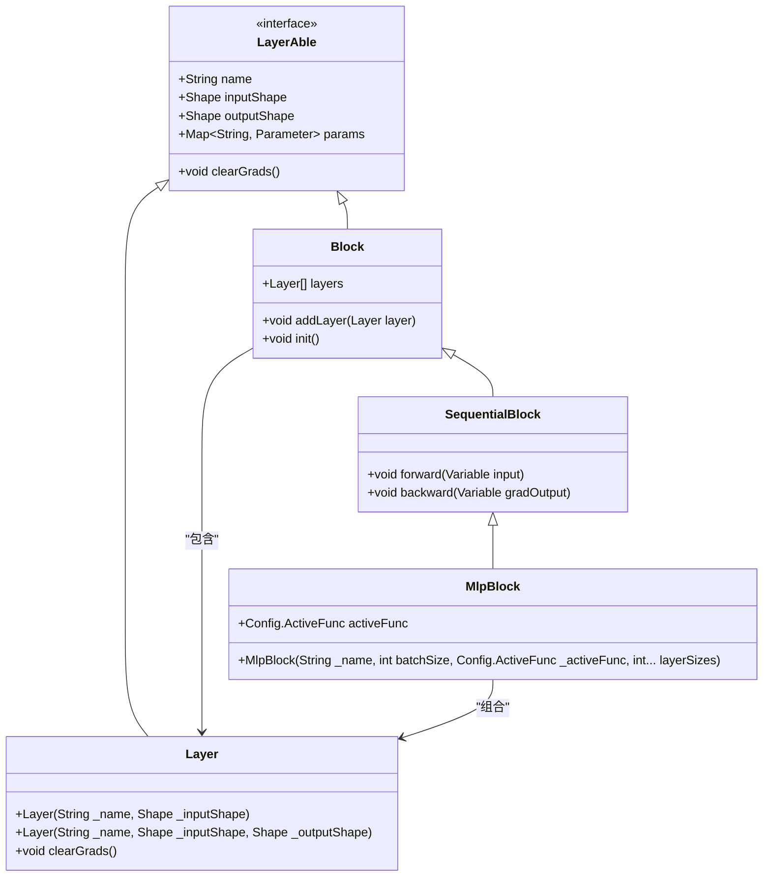
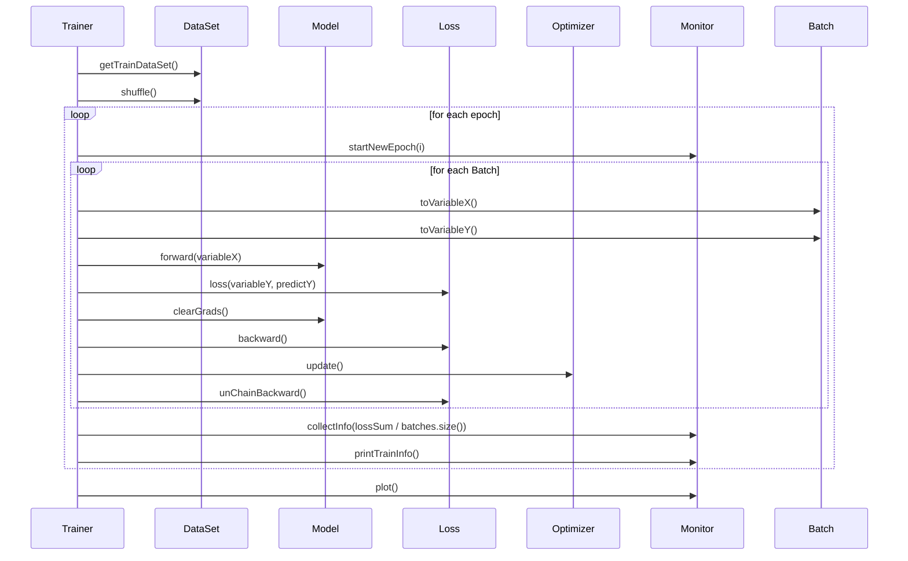
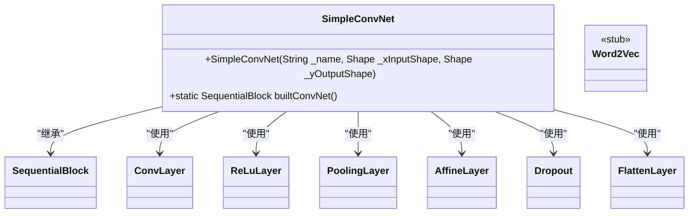

# 核心模块技术设计

<cite>
**本文档中引用的文件**  
- [NdArray.java](file://src/main/java/io/leavesfly/tinydl/ndarr/NdArray.java)
- [NdArrayGpu.java](file://src/main/java/io/leavesfly/tinydl/ndarr/NdArrayGpu.java)
- [Function.java](file://src/main/java/io/leavesfly/tinydl/func/Function.java)
- [Add.java](file://src/main/java/io/leavesfly/tinydl/func/base/Add.java)
- [Sigmoid.java](file://src/main/java/io/leavesfly/tinydl/func/math/Sigmoid.java)
- [SigmoidCE.java](file://src/main/java/io/leavesfly/tinydl/func/loss/SigmoidCE.java)
- [Layer.java](file://src/main/java/io/leavesfly/tinydl/nnet/Layer.java)
- [MlpBlock.java](file://src/main/java/io/leavesfly/tinydl/nnet/block/MlpBlock.java)
- [Trainer.java](file://src/main/java/io/leavesfly/tinydl/mlearning/Trainer.java)
- [SimpleConvNet.java](file://src/main/java/io/leavesfly/tinydl/modality/cv/SimpleConvNet.java)
</cite>

## 目录
1. [ndarr模块：底层计算引擎](#ndarr模块底层计算引擎)
2. [func模块：自动微分系统](#func模块自动微分系统)
3. [nnet模块：神经网络分层架构](#nnet模块神经网络分层架构)
4. [mlearning模块：高层训练API](#mlearning模块高层训练api)
5. [modality模块：应用层集成](#modality模块应用层集成)

## ndarr模块：底层计算引擎

`ndarr` 模块是TinyDL的底层计算核心，负责所有张量数据的存储与基础运算。其核心类 `NdArray` 采用一维 `float[]` 数组存储多维数据，并通过 `Shape` 类管理维度信息，实现了高效的内存布局与访问策略。

`NdArray` 支持多种初始化方式，包括从标量、一维至四维数组、以及通过 `Shape` 对象创建。它提供了丰富的基础运算，如四则运算、逻辑比较、数学函数（`exp`, `log`, `sin`, `cos`, `tanh`, `sigmoid`）和张量变形（`reshape`, `transpose`, `flatten`）。所有运算均基于元素级（element-wise）操作，确保了计算的通用性与可预测性。

该模块的设计权衡在于性能与功能的平衡。通过使用 `float32` 数据类型，它在精度和内存占用之间取得了良好折衷。`NdArray` 的运算实现直接在 `buffer` 数组上进行，避免了不必要的对象创建，提升了性能。然而，这种设计也意味着所有运算都是显式创建新 `NdArray` 对象，无法进行原地（in-place）修改，这在某些场景下可能带来额外的内存开销。

未来，`NdArrayGpu` 类的预留为GPU加速提供了明确的扩展点。通过继承或组合 `NdArray` 的接口，并将底层 `buffer` 替换为GPU内存指针，可以实现无缝的硬件加速，同时保持对上层模块的API兼容性。

**图示来源**
- [NdArray.java](file://src/main/java/io/leavesfly/tinydl/ndarr/NdArray.java#L1-L799)
- [NdArrayGpu.java](file://src/main/java/io/leavesfly/tinydl/ndarr/NdArrayGpu.java#L1-L11)
- [Shape.java](file://src/main/java/io/leavesfly/tinydl/ndarr/Shape.java)

**本节来源**
- [NdArray.java](file://src/main/java/io/leavesfly/tinydl/ndarr/NdArray.java#L1-L799)

## func模块：自动微分系统

`func` 模块是TinyDL的自动微分引擎，其核心是基于动态计算图的反向传播机制。该系统以 `Function` 抽象类为核心，所有数学运算（如加法、乘法、激活函数、损失函数）都作为其具体实现。

`Function` 类通过 `call` 方法执行前向传播（`forward`），并在此过程中动态构建计算图。当 `Config.train` 标志开启时，`call` 方法会将输入 `Variable` 和当前 `Function` 实例关联起来，并将输出 `Variable` 的 `creator` 指针指向该 `Function`，从而形成一个从输出到输入的有向无环图（DAG）。这种延迟构建的策略优化了性能，避免了在推理模式下不必要的图结构开销。

`Function` 的抽象接口设计清晰地分离了前向和后向逻辑。`forward` 方法定义了函数的计算逻辑，而 `backward` 方法则定义了梯度计算规则。例如，`Sigmoid` 函数的 `backward` 方法利用了其导数 `sigmoid(x) * (1 - sigmoid(x))` 的特性，直接使用前向传播中缓存的输出值 `y` 来高效计算梯度。`requireInputNum` 方法则强制约束了每个函数的输入参数数量，保证了计算图的正确性。

该模块的函数被组织在不同的包中：`base` 包含基础四则运算，`math` 包含基本数学函数，`matrix` 包含矩阵操作（如 `MatMul`, `SoftMax`），`loss` 包含损失函数（如 `SigmoidCE`）。这种分类组织方式使得代码结构清晰，易于维护和扩展。

**图示来源**
- [Function.java](file://src/main/java/io/leavesfly/tinydl/func/Function.java#L1-L93)
- [Add.java](file://src/main/java/io/leavesfly/tinydl/func/base/Add.java#L1-L38)
- [Sigmoid.java](file://src/main/java/io/leavesfly/tinydl/func/math/Sigmoid.java#L1-L26)
- [SigmoidCE.java](file://src/main/java/io/leavesfly/tinydl/func/loss/SigmoidCE.java#L1-L67)

**本节来源**
- [Function.java](file://src/main/java/io/leavesfly/tinydl/func/Function.java#L1-L93)
- [Add.java](file://src/main/java/io/leavesfly/tinydl/func/base/Add.java#L1-L38)
- [Sigmoid.java](file://src/main/java/io/leavesfly/tinydl/func/math/Sigmoid.java#L1-L26)
- [SigmoidCE.java](file://src/main/java/io/leavesfly/tinydl/func/loss/SigmoidCE.java#L1-L67)

## nnet模块：神经网络分层架构

`nnet` 模块采用分层设计，将神经网络分解为可复用的组件。其核心是 `Layer` 和 `Block` 两个抽象类，分别代表网络中的基本单元和复合单元，通过继承与组合关系构建复杂的网络结构。

`Layer` 类是所有神经网络层的基类，继承自 `LayerAble`。它封装了层的名称、输入/输出形状以及参数（`params`，一个 `HashMap`）。`Layer` 的子类（如 `AffineLayer`, `ConvLayer`, `ReLuLayer`）负责实现具体的前向和后向传播逻辑。`Layer` 的设计体现了单一职责原则，每个层只关注自身的计算。

`Block` 类则代表一个由多个 `Layer` 或其他 `Block` 组成的网络块。`SequentialBlock` 是 `Block` 的一个具体实现，它维护一个 `Layer` 列表，并按顺序执行它们的前向和后向传播。这种设计模式（组合模式）允许用户像搭积木一样构建网络。例如，`MlpBlock` 类通过在构造函数中按顺序添加 `LinearLayer` 和激活层（`ReLuLayer` 或 `SigmoidLayer`），实现了多层感知机（MLP）的快速构建。

`Layer` 和 `Block` 的继承与组合关系是该模块的关键。`Layer` 通过继承 `LayerAble` 获得基础能力，而 `Block` 通过组合 `Layer` 实例来构建复杂结构。这种设计既保证了代码的复用性，又提供了极大的灵活性，使得构建从简单MLP到复杂Transformer模型成为可能。

**图示来源**
- [Layer.java](file://src/main/java/io/leavesfly/tinydl/nnet/Layer.java#L1-L35)
- [Block.java](file://src/main/java/io/leavesfly/tinydl/nnet/Block.java)
- [SequentialBlock.java](file://src/main/java/io/leavesfly/tinydl/nnet/block/SequentialBlock.java)
- [MlpBlock.java](file://src/main/java/io/leavesfly/tinydl/nnet/block/MlpBlock.java#L1-L43)

**本节来源**
- [Layer.java](file://src/main/java/io/leavesfly/tinydl/nnet/Layer.java#L1-L35)
- [MlpBlock.java](file://src/main/java/io/leavesfly/tinydl/nnet/block/MlpBlock.java#L1-L43)

## mlearning模块：高层训练API

`mlearning` 模块作为高层API，封装了模型训练的完整流程，其核心是 `Trainer` 类。`Trainer` 负责协调数据集、模型、损失函数、优化器和监控器，执行一个标准的训练循环。

`Trainer` 的训练循环设计清晰且可扩展。`train` 方法首先准备数据集并进行洗牌，然后进入主训练循环。在每个epoch中，它遍历数据集的每一个 `Batch`，执行以下步骤：1) 将输入和标签转换为 `Variable`；2) 执行模型前向传播得到预测值；3) 计算损失值；4) 调用 `clearGrads` 清除旧梯度；5) 执行损失的反向传播（`backward`）以计算梯度；6) 调用优化器的 `update` 方法更新模型参数；7) 解除计算图的后向连接以释放内存。这个循环简洁地实现了监督学习的核心逻辑。

`Optimizer` 的参数更新策略由具体的子类实现，如 `SGD` 和 `Adam`。`Trainer` 通过依赖注入的方式接收一个 `Optimizer` 实例，这使得更换优化算法变得非常容易，体现了依赖倒置原则。`Loss` 类（如 `MeanSquaredLoss`, `SoftmaxCrossEntropy`）负责计算损失值并提供其梯度，`backward` 方法的调用会触发整个计算图的梯度回传。

`DataSet` 的数据加载机制通过 `Batch` 类实现。`DataSet` 被划分为训练集、验证集和测试集，并能生成 `Batch` 对象。`Batch` 封装了当前批次的数据和标签，`Trainer` 在训练循环中迭代这些批次，实现了小批量（mini-batch）梯度下降。

**图示来源**
- [Trainer.java](file://src/main/java/io/leavesfly/tinydl/mlearning/Trainer.java#L1-L107)
- [DataSet.java](file://src/main/java/io/leavesfly/tinydl/mlearning/dataset/DataSet.java)
- [Model.java](file://src/main/java/io/leavesfly/tinydl/mlearning/Model.java)
- [Loss.java](file://src/main/java/io/leavesfly/tinydl/mlearning/loss/Loss.java)
- [Optimizer.java](file://src/main/java/io/leavesfly/tinydl/mlearning/optimize/Optimizer.java)

**本节来源**
- [Trainer.java](file://src/main/java/io/leavesfly/tinydl/mlearning/Trainer.java#L1-L107)

## modality模块：应用层集成

`modality` 模块作为应用层，展示了如何整合底层组件来解决特定领域的机器学习问题。它通过具体的模型实现，如 `SimpleConvNet`（计算机视觉）和 `Word2Vec`（自然语言处理），为用户提供了一个即用的解决方案。

`SimpleConvNet` 类是 `SequentialBlock` 的一个具体实例，旨在解决图像分类问题。其设计思想是将卷积层（`ConvLayer`）、激活层（`ReLuLayer`）、池化层（`PoolingLayer`）和全连接层（`AffineLayer`）按特定顺序堆叠起来。`builtConvNet` 静态方法提供了一个构建典型卷积神经网络的蓝图，它首先使用卷积和池化层提取图像的空间特征，然后通过 `FlattenLayer` 将特征图展平，最后使用全连接层进行分类。`Dropout` 层的引入则有助于防止过拟合。这个类清晰地展示了如何利用 `nnet` 模块的 `Layer` 和 `Block` 组件来构建一个完整的、可训练的CV模型。

虽然 `Word2Vec` 类的实现细节未在上下文中提供，但可以推断其设计模式与 `SimpleConvNet` 类似。它会利用 `nnet` 模块中的 `Embedding` 层来将离散的词索引映射为稠密的向量表示，并可能结合 `RnnLayer` 或 `LinearLayer` 来学习词与词之间的上下文关系。`func` 模块中的 `SigmoidCE` 损失函数非常适合用于Word2Vec的负采样训练任务。

`modality` 模块的定位是“应用层”，它不引入新的底层机制，而是作为最佳实践的集合，指导用户如何将 `ndarr`, `func`, `nnet`, `mlearning` 四个核心模块协同工作，从而快速构建和训练针对CV和NLP任务的深度学习模型。

**图示来源**
- [SimpleConvNet.java](file://src/main/java/io/leavesfly/tinydl/modality/cv/SimpleConvNet.java#L1-L76)
- [Word2Vec.java](file://src/main/java/io/leavesfly/tinydl/modality/nlp/Word2Vec.java)

**本节来源**
- [SimpleConvNet.java](file://src/main/java/io/leavesfly/tinydl/modality/cv/SimpleConvNet.java#L1-L76)