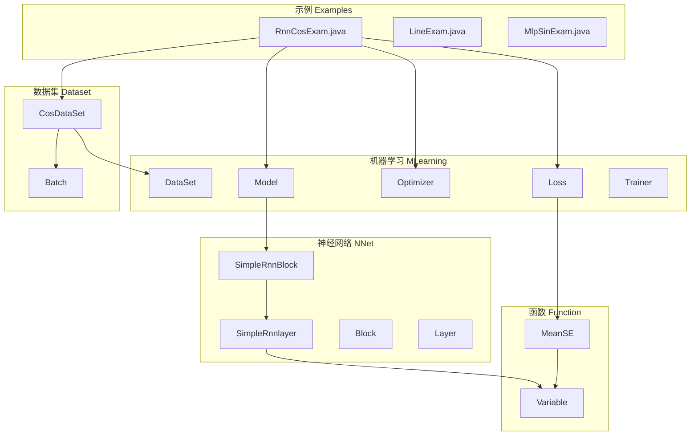
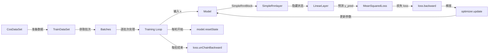
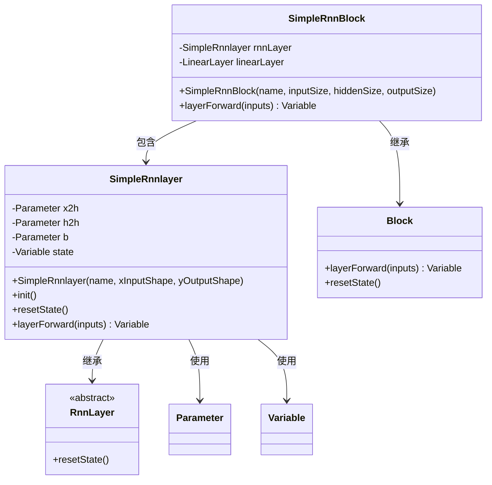
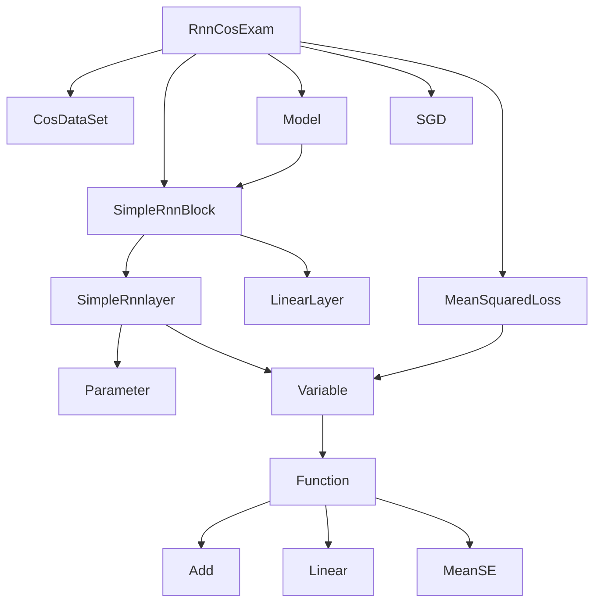

# RNN序列预测

<cite>
**本文档中引用的文件**   
- [RnnCosExam.java](file://src/main/java/io/leavesfly/tinydl/example/regress/RnnCosExam.java)
- [CosDataSet.java](file://src/main/java/io/leavesfly/tinydl/mlearning/dataset/simple/CosDataSet.java)
- [SimpleRnnBlock.java](file://src/main/java/io/leavesfly/tinydl/nnet/block/SimpleRnnBlock.java)
- [SimpleRnnlayer.java](file://src/main/java/io/leavesfly/tinydl/nnet/layer/rnn/SimpleRnnlayer.java)
- [Model.java](file://src/main/java/io/leavesfly/tinydl/mlearning/Model.java)
- [Variable.java](file://src/main/java/io/leavesfly/tinydl/func/Variable.java)
- [MeanSquaredLoss.java](file://src/main/java/io/leavesfly/tinydl/mlearning/loss/MeanSquaredLoss.java)
- [Batch.java](file://src/main/java/io/leavesfly/tinydl/mlearning/dataset/Batch.java)
</cite>

## 目录
1. [简介](#简介)
2. [项目结构](#项目结构)
3. [核心组件](#核心组件)
4. [架构概述](#架构概述)
5. [详细组件分析](#详细组件分析)
6. [依赖分析](#依赖分析)
7. [性能考量](#性能考量)
8. [故障排除指南](#故障排除指南)
9. [结论](#结论)

## 简介
本文档深度解析 `RnnCosExam.java` 示例，阐明如何使用 `SimpleRnnBlock` 对余弦序列进行时间序列预测。重点分析 `CosDataSet` 如何将连续的余弦波数据构造成适合 RNN 训练的序列批次（batches），并解释 BPTT（随时间反向传播）长度的含义。文档详细描述 RNN 模型的有状态特性，以及为何在每个训练轮次开始时需要调用 `model.resetState()` 来重置隐藏状态。同时，分析代码中如何对批次内的每个时间步进行循环处理，构建动态计算图，并在每个批次结束后调用 `loss.unChainBackward()` 来切断历史连接以控制内存消耗。此外，解释如何将多个时间步的损失累加并进行反向传播，并讨论学习率、隐藏层大小等参数对序列预测效果的影响，指出该示例作为 RNN 基础应用的教学价值。

## 项目结构
本项目采用分层模块化设计，主要分为示例（example）、功能（func）、机器学习（mlearning）、模态（modality）、多维数组（ndarr）、神经网络（nnet）和工具（utils）等核心模块。时间序列预测的核心逻辑位于 `example/regress` 包下的 `RnnCosExam.java`，数据集处理由 `mlearning/dataset/simple` 包中的 `CosDataSet.java` 实现，而 RNN 模型的核心组件则定义在 `nnet/block` 和 `nnet/layer/rnn` 包中。



**Diagram sources**
- [RnnCosExam.java](file://src/main/java/io/leavesfly/tinydl/example/regress/RnnCosExam.java)
- [CosDataSet.java](file://src/main/java/io/leavesfly/tinydl/mlearning/dataset/simple/CosDataSet.java)
- [SimpleRnnBlock.java](file://src/main/java/io/leavesfly/tinydl/nnet/block/SimpleRnnBlock.java)
- [SimpleRnnlayer.java](file://src/main/java/io/leavesfly/tinydl/nnet/layer/rnn/SimpleRnnlayer.java)
- [Model.java](file://src/main/java/io/leavesfly/tinydl/mlearning/Model.java)
- [Variable.java](file://src/main/java/io/leavesfly/tinydl/func/Variable.java)

**Section sources**
- [RnnCosExam.java](file://src/main/java/io/leavesfly/tinydl/example/regress/RnnCosExam.java)
- [CosDataSet.java](file://src/main/java/io/leavesfly/tinydl/mlearning/dataset/simple/CosDataSet.java)

## 核心组件
本示例的核心组件包括 `CosDataSet`、`SimpleRnnBlock`、`Model` 和训练循环。`CosDataSet` 负责生成和准备用于训练和测试的正弦和余弦波数据序列。`SimpleRnnBlock` 是 RNN 模型的主体，由 `SimpleRnnlayer` 和一个线性输出层构成。`Model` 类封装了模型的前向传播、状态管理和梯度更新等操作。训练循环则实现了完整的训练流程，包括状态重置、损失计算、反向传播和优化器更新。

**Section sources**
- [RnnCosExam.java](file://src/main/java/io/leavesfly/tinydl/example/regress/RnnCosExam.java#L44-L75)
- [SimpleRnnBlock.java](file://src/main/java/io/leavesfly/tinydl/nnet/block/SimpleRnnBlock.java#L18-L36)
- [CosDataSet.java](file://src/main/java/io/leavesfly/tinydl/mlearning/dataset/simple/CosDataSet.java#L20-L48)

## 架构概述
该示例实现了一个典型的基于 RNN 的时间序列预测架构。数据流从 `CosDataSet` 开始，经过 `Batch` 批处理后，输入到由 `SimpleRnnBlock` 构成的 `Model` 中。模型通过前向传播生成预测值，计算与真实值之间的均方误差（MSE），然后进行反向传播以更新模型参数。整个过程在训练循环中迭代执行。



**Diagram sources**
- [RnnCosExam.java](file://src/main/java/io/leavesfly/tinydl/example/regress/RnnCosExam.java#L44-L75)
- [SimpleRnnBlock.java](file://src/main/java/io/leavesfly/tinydl/nnet/block/SimpleRnnBlock.java#L18-L36)
- [SimpleRnnlayer.java](file://src/main/java/io/leavesfly/tinydl/nnet/layer/rnn/SimpleRnnlayer.java#L50-L65)
- [Model.java](file://src/main/java/io/leavesfly/tinydl/mlearning/Model.java#L60-L70)
- [Variable.java](file://src/main/java/io/leavesfly/tinydl/func/Variable.java#L100-L130)

## 详细组件分析

### CosDataSet 数据集分析
`CosDataSet` 类继承自 `ArrayDataset`，其核心功能在 `doPrepare` 方法中实现。它首先生成一个包含 1001 个点的线性空间 `tmp`，然后分别用 `sin` 和 `cos` 函数构造训练集和测试集。训练集使用 `sin` 波，而测试集使用 `cos` 波。数据构造的关键在于将序列错位：`_xs` 取序列的前 1000 个点，`_ys` 取序列从第 2 个点开始的后 1000 个点。这使得模型的任务是根据当前时刻的值 `x_t` 预测下一时刻的值 `y_{t+1}`，从而学习序列的动态变化规律。`build` 方法将这些数组封装成 `DataSet` 对象。

**Section sources**
- [CosDataSet.java](file://src/main/java/io/leavesfly/tinydl/mlearning/dataset/simple/CosDataSet.java#L20-L48)

### SimpleRnnBlock 与 SimpleRnnlayer 模型分析
`SimpleRnnBlock` 是一个复合组件，它包含一个 `SimpleRnnlayer` 和一个 `LinearLayer`。`SimpleRnnlayer` 是 RNN 的核心，实现了最简单的递归神经网络单元。其 `init` 方法初始化了三个关键参数：`x2h`（输入到隐藏层的权重）、`h2h`（隐藏层到隐藏层的权重）和 `b`（偏置）。`layerForward` 方法实现了 RNN 的核心计算逻辑：`state = tanh(x * x2h + b + state * h2h)`。这里的 `state` 变量是模型的隐藏状态，它在时间步之间传递，赋予了模型记忆能力。



**Diagram sources**
- [SimpleRnnBlock.java](file://src/main/java/io/leavesfly/tinydl/nnet/block/SimpleRnnBlock.java#L18-L36)
- [SimpleRnnlayer.java](file://src/main/java/io/leavesfly/tinydl/nnet/layer/rnn/SimpleRnnlayer.java#L18-L65)
- [RnnLayer.java](file://src/main/java/io/leavesfly/tinydl/nnet/RnnLayer.java#L1-L14)

### 训练循环与状态管理分析
训练循环是理解 RNN 有状态特性的关键。在每个训练轮次（epoch）开始时，调用 `model.resetState()`。该方法会递归调用 `block.resetState()`，最终到达 `SimpleRnnlayer` 的 `resetState()` 方法，将 `state` 变量置为 `null`。这确保了每个轮次都从一个“干净”的初始状态开始，避免了不同轮次之间的状态干扰。

在处理每个 `Batch` 时，代码通过一个内层循环遍历批次中的每个时间步。对于每个时间步 `j`，它创建输入 `x` 和目标 `y` 的 `Variable` 对象，通过 `model.forward(x)` 进行前向传播得到预测值，然后计算损失并累加到 `loss` 变量中。这种逐时间步的处理方式构建了一个跨越多个时间步的动态计算图。

```mermaid
sequenceDiagram
participant Epoch as 训练轮次
participant Batch as 数据批次
participant TimeStep as 时间步循环
participant Forward as 前向传播
participant Loss as 损失计算
participant Backward as 反向传播
participant Opt as 优化器
Epoch->>Epoch : for i in range(maxEpoch) :
Epoch->>Model : model.resetState()
Epoch->>Batch : for batch in batches :
Batch->>TimeStep : for j in range(batch.size) :
TimeStep->>Forward : Variable predict = model.forward(x)
Forward->>Forward : SimpleRnnlayer.layerForward()
Forward->>Forward : state = tanh(...)
TimeStep->>Loss : loss = loss.add(MSE(y, predict))
TimeStep-->>TimeStep : 累加损失
Batch->>Backward : model.clearGrads()
Batch->>Backward : loss.backward()
Backward->>Backward : 反向传播计算梯度
Batch->>Opt : optimizer.update()
Opt->>Opt : 更新模型参数
Batch->>Batch : loss.unChainBackward()
Batch-->>Batch : 切断计算图
Epoch-->>Epoch : 打印平均损失
```

**Diagram sources**
- [RnnCosExam.java](file://src/main/java/io/leavesfly/tinydl/example/regress/RnnCosExam.java#L55-L75)
- [Model.java](file://src/main/java/io/leavesfly/tinydl/mlearning/Model.java#L60-L70)
- [Variable.java](file://src/main/java/io/leavesfly/tinydl/func/Variable.java#L100-L130)

### 损失计算与内存管理分析
在每个批次处理完毕后，代码执行 `loss.backward()` 进行反向传播，计算所有参数的梯度，然后调用 `optimizer.update()` 更新参数。紧接着，调用 `loss.unChainBackward()` 方法。该方法递归地将 `loss` 变量及其所有上游 `Variable` 的 `creator`（即生成它们的函数）引用置为 `null`，从而切断了整个计算图的历史连接。这是控制内存消耗的关键步骤，因为它允许 Java 的垃圾回收器回收这些不再需要的中间计算节点，防止内存泄漏，尤其是在处理长序列时。

**Section sources**
- [RnnCosExam.java](file://src/main/java/io/leavesfly/tinydl/example/regress/RnnCosExam.java#L70-L75)
- [Variable.java](file://src/main/java/io/leavesfly/tinydl/func/Variable.java#L132-L145)

## 依赖分析
该示例的依赖关系清晰地展示了各组件间的协作。`RnnCosExam` 作为主入口，直接依赖 `CosDataSet`、`SimpleRnnBlock`、`Model`、`SGD` 和 `MeanSquaredLoss`。`Model` 依赖 `SimpleRnnBlock`，而 `SimpleRnnBlock` 又依赖 `SimpleRnnlayer` 和 `LinearLayer`。`MeanSquaredLoss` 通过 `Variable` 的 `meanSquaredError` 方法间接依赖 `MeanSE` 函数。`Variable` 类是整个计算图的核心，被几乎所有组件所依赖。



**Diagram sources**
- [RnnCosExam.java](file://src/main/java/io/leavesfly/tinydl/example/regress/RnnCosExam.java)
- [SimpleRnnBlock.java](file://src/main/java/io/leavesfly/tinydl/nnet/block/SimpleRnnBlock.java)
- [SimpleRnnlayer.java](file://src/main/java/io/leavesfly/tinydl/nnet/layer/rnn/SimpleRnnlayer.java)
- [MeanSquaredLoss.java](file://src/main/java/io/leavesfly/tinydl/mlearning/loss/MeanSquaredLoss.java)
- [Variable.java](file://src/main/java/io/leavesfly/tinydl/func/Variable.java)

**Section sources**
- [RnnCosExam.java](file://src/main/java/io/leavesfly/tinydl/example/regress/RnnCosExam.java)
- [SimpleRnnBlock.java](file://src/main/java/io/leavesfly/tinydl/nnet/block/SimpleRnnBlock.java)

## 性能考量
BPTT（随时间反向传播）的长度在此示例中由 `CosDataSet` 的 `batchSize` 参数隐式控制。虽然代码中 `bpttLength` 被注释为“比较特殊表示RNN的隐藏层的大小，和batchSize得一致”，但实际的 BPTT 长度更接近于 `batch.getSize()`，即批次中时间步的数量。较长的 BPTT 可以让模型学习更长的依赖关系，但会增加内存消耗和计算时间，并可能导致梯度消失或爆炸。隐藏层大小 `hiddenSize` 决定了模型的容量，更大的隐藏层可以学习更复杂的模式，但也更容易过拟合。学习率 `learnRate` 控制参数更新的步长，过大的学习率可能导致训练不稳定，过小则收敛缓慢。`loss.unChainBackward()` 是关键的内存管理措施，确保了训练过程的可持续性。

## 故障排除指南
- **训练不收敛**：检查学习率是否过大或过小，尝试调整 `learnRate`。检查数据是否正确生成，确认 `CosDataSet` 的 `doPrepare` 方法逻辑无误。
- **内存溢出**：确保 `loss.unChainBackward()` 在每个批次后被正确调用。如果序列过长，考虑减小批次大小或实现梯度裁剪。
- **预测结果无意义**：确认 `model.resetState()` 在每个轮次开始时被调用。检查 `SimpleRnnlayer` 的 `layerForward` 方法中 `state` 的更新逻辑是否正确。
- **维度不匹配错误**：检查 `inputSize`、`hiddenSize` 和 `outputSize` 的设置是否与数据维度一致。

**Section sources**
- [RnnCosExam.java](file://src/main/java/io/leavesfly/tinydl/example/regress/RnnCosExam.java#L55-L75)
- [SimpleRnnlayer.java](file://src/main/java/io/leavesfly/tinydl/nnet/layer/rnn/SimpleRnnlayer.java#L50-L65)
- [Variable.java](file://src/main/java/io/leavesfly/tinydl/func/Variable.java#L132-L145)

## 结论
`RnnCosExam.java` 示例是一个优秀的 RNN 入门教学案例。它清晰地展示了如何使用 `SimpleRnnBlock` 进行时间序列预测，从数据准备、模型构建到训练循环的完整流程。文档深入分析了 `CosDataSet` 如何构造序列数据，阐明了 BPTT 的概念，并详细解释了 RNN 的有状态特性以及 `model.resetState()` 和 `loss.unChainBackward()` 的重要作用。该示例不仅实现了基本的预测功能，还通过合理的代码结构和内存管理，为理解更复杂的 RNN 模型（如 LSTM）奠定了坚实的基础。