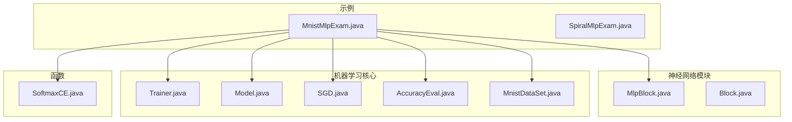
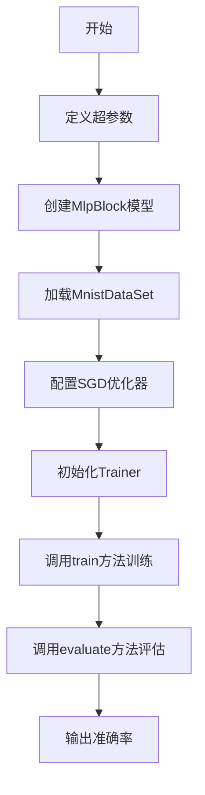
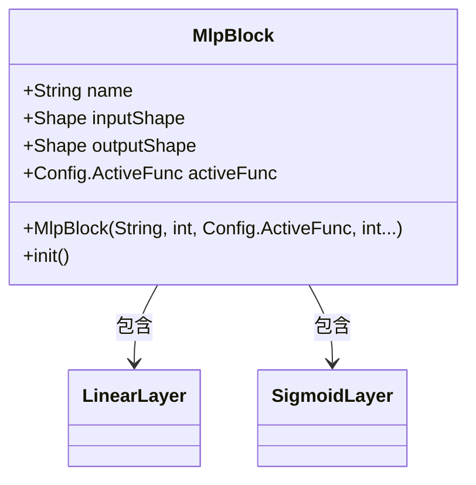
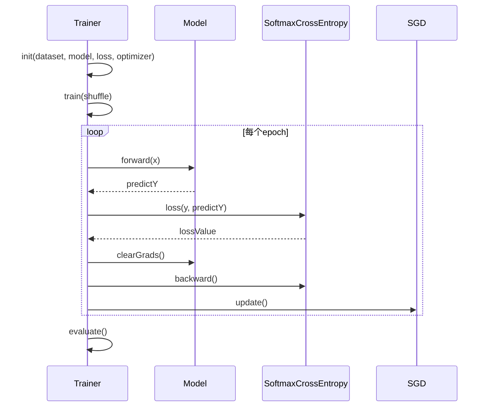
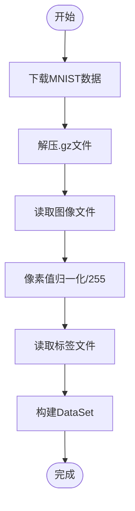
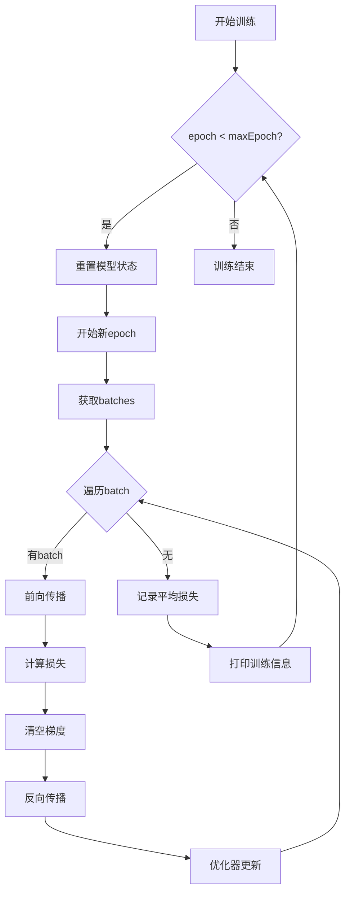
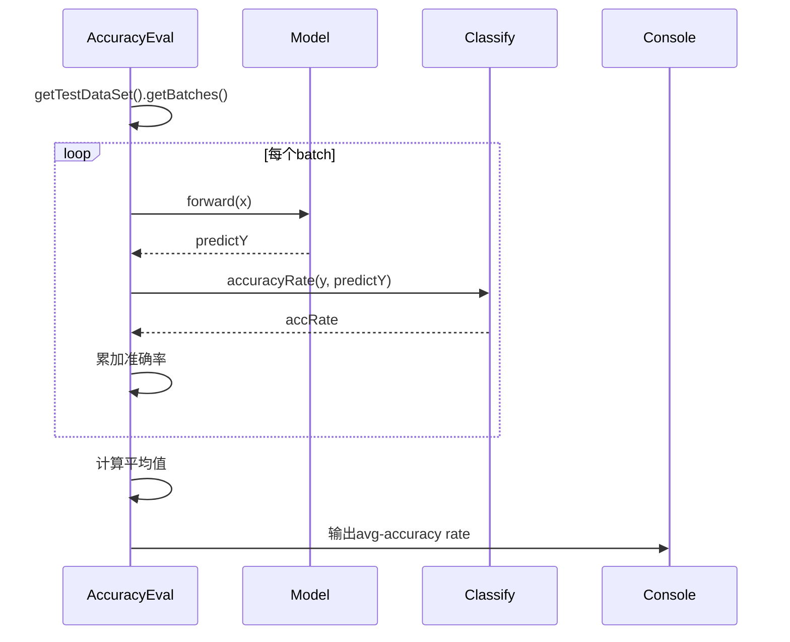
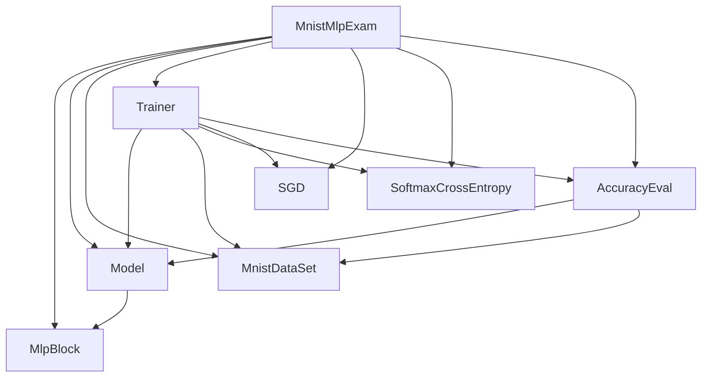

# 手写数字识别

<cite>
**本文档引用的文件**
- [MnistMlpExam.java](file://src/main/java/io/leavesfly/tinydl/example/classify/MnistMlpExam.java)
- [MlpBlock.java](file://src/main/java/io/leavesfly/tinydl/nnet/block/MlpBlock.java)
- [Trainer.java](file://src/main/java/io/leavesfly/tinydl/mlearning/Trainer.java)
- [MnistDataSet.java](file://src/main/java/io/leavesfly/tinydl/mlearning/dataset/simple/MnistDataSet.java)
- [SoftmaxCE.java](file://src/main/java/io/leavesfly/tinydl/func/loss/SoftmaxCE.java)
- [SGD.java](file://src/main/java/io/leavesfly/tinydl/mlearning/optimize/SGD.java)
- [Model.java](file://src/main/java/io/leavesfly/tinydl/mlearning/Model.java)
- [AccuracyEval.java](file://src/main/java/io/leavesfly/tinydl/mlearning/evaluator/AccuracyEval.java)
</cite>

## 目录
1. [简介](#简介)
2. [项目结构](#项目结构)
3. [核心组件](#核心组件)
4. [架构概述](#架构概述)
5. [详细组件分析](#详细组件分析)
6. [依赖分析](#依赖分析)
7. [性能考量](#性能考量)
8. [故障排除指南](#故障排除指南)
9. [结论](#结论)

## 简介
本示例 `MnistMlpExam.java` 演示了如何使用 TinyDL 框架构建一个用于手写数字识别的多层感知机（MLP）模型。该模型基于经典的 MNIST 数据集，通过定义网络结构、配置损失函数与优化器，并利用训练器自动化完成训练与评估流程。本文将深入分析其数据加载、模型构建、训练过程及性能表现。

## 项目结构
项目采用模块化设计，主要分为示例（example）、函数（func）、机器学习核心（mlearning）、神经网络模块（nnet）、多维数组（ndarr）等包。分类任务示例位于 `example/classify` 路径下，其中 `MnistMlpExam.java` 是本分析的核心。



**图示来源**
- [MnistMlpExam.java](file://src/main/java/io/leavesfly/tinydl/example/classify/MnistMlpExam.java#L1-L70)
- [MlpBlock.java](file://src/main/java/io/leavesfly/tinydl/nnet/block/MlpBlock.java#L1-L43)
- [Trainer.java](file://src/main/java/io/leavesfly/tinydl/mlearning/Trainer.java#L1-L107)

**本节来源**
- [MnistMlpExam.java](file://src/main/java/io/leavesfly/tinydl/example/classify/MnistMlpExam.java#L1-L70)
- [project_structure](file://#L1-L200)

## 核心组件
本示例涉及多个关键组件：`MnistDataSet` 负责数据加载与预处理；`MlpBlock` 构建 MLP 网络结构；`SoftmaxCrossEntropy` 作为分类损失函数；`SGD` 实现梯度更新；`Trainer` 控制训练流程；`AccuracyEval` 评估模型准确率。

**本节来源**
- [MnistMlpExam.java](file://src/main/java/io/leavesfly/tinydl/example/classify/MnistMlpExam.java#L1-L70)
- [MlpBlock.java](file://src/main/java/io/leavesfly/tinydl/nnet/block/MlpBlock.java#L1-L43)
- [Trainer.java](file://src/main/java/io/leavesfly/tinydl/mlearning/Trainer.java#L1-L107)

## 架构概述
系统整体流程为：数据准备 → 模型定义 → 训练器初始化 → 模型训练 → 效果评估。各组件协同工作，形成端到端的机器学习流水线。



**图示来源**
- [MnistMlpExam.java](file://src/main/java/io/leavesfly/tinydl/example/classify/MnistMlpExam.java#L1-L70)
- [Trainer.java](file://src/main/java/io/leavesfly/tinydl/mlearning/Trainer.java#L1-L107)

## 详细组件分析

### MnistMlpExam 主流程分析
该类是整个示例的入口，通过 `main` 方法串联所有组件。

#### 超参数定义
```java
int maxEpoch = 50;
int batchSize = 100;
float learRate = 0.1f;
```
- `maxEpoch`: 训练轮数，控制模型迭代次数。
- `batchSize`: 批量大小，影响内存使用和梯度稳定性。
- `learRate`: 学习率，决定参数更新步长。

**本节来源**
- [MnistMlpExam.java](file://src/main/java/io/leavesfly/tinydl/example/classify/MnistMlpExam.java#L15-L25)

#### 模型构建
使用 `MlpBlock` 构建三层全连接网络：
- 输入层：784 维（28×28 像素展平）
- 隐藏层1：100 神经元
- 隐藏层2：100 神经元
- 输出层：10 维（对应 0-9 数字）

激活函数为 Sigmoid。



**图示来源**
- [MlpBlock.java](file://src/main/java/io/leavesfly/tinydl/nnet/block/MlpBlock.java#L1-L43)
- [MnistMlpExam.java](file://src/main/java/io/leavesfly/tinydl/example/classify/MnistMlpExam.java#L35-L36)

#### 损失函数与优化器
- **损失函数**：`SoftmaxCrossEntropy`，适用于多分类任务。
- **优化器**：`SGD`，使用学习率 0.1 更新模型参数。



**图示来源**
- [Trainer.java](file://src/main/java/io/leavesfly/tinydl/mlearning/Trainer.java#L1-L107)
- [SoftmaxCE.java](file://src/main/java/io/leavesfly/tinydl/func/loss/SoftmaxCE.java#L1-L61)
- [SGD.java](file://src/main/java/io/leavesfly/tinydl/mlearning/optimize/SGD.java#L1-L23)

### 数据加载与预处理
`MnistDataSet` 类负责自动下载、解压并读取 MNIST 数据。

#### 数据预处理流程
1. 下载压缩文件（`.gz`）并解压。
2. 读取图像文件：将字节流转换为 `[0,1]` 归一化的浮点数组。
3. 读取标签文件：转换为整数标签。
4. 构建训练集与测试集。



**图示来源**
- [MnistDataSet.java](file://src/main/java/io/leavesfly/tinydl/mlearning/dataset/simple/MnistDataSet.java#L1-L182)

**本节来源**
- [MnistDataSet.java](file://src/main/java/io/leavesfly/tinydl/mlearning/dataset/simple/MnistDataSet.java#L1-L182)

### 训练流程分析
`Trainer` 的 `train` 方法实现完整训练循环。

#### 训练步骤
1. 准备训练数据集（可选打乱）。
2. 迭代 `maxEpoch` 轮。
3. 每轮遍历所有 batch：
   - 前向传播得到预测值。
   - 计算损失。
   - 反向传播计算梯度。
   - 优化器更新参数。
4. 收集并打印损失信息。



**图示来源**
- [Trainer.java](file://src/main/java/io/leavesfly/tinydl/mlearning/Trainer.java#L1-L107)

**本节来源**
- [Trainer.java](file://src/main/java/io/leavesfly/tinydl/mlearning/Trainer.java#L1-L107)

### 模型评估分析
`AccuracyEval` 类实现分类准确率评估。

#### 评估逻辑
1. 获取测试集的所有 batch。
2. 关闭训练模式（`Config.train = false`）。
3. 对每个 batch：
   - 前向传播。
   - 使用 `Classify.accuracyRate` 计算准确率。
4. 输出平均准确率。



**图示来源**
- [AccuracyEval.java](file://src/main/java/io/leavesfly/tinydl/mlearning/evaluator/AccuracyEval.java#L1-L41)

**本节来源**
- [AccuracyEval.java](file://src/main/java/io/leavesfly/tinydl/mlearning/evaluator/AccuracyEval.java#L1-L41)

## 依赖分析
各组件之间存在明确的依赖关系，形成清晰的调用链。



**图示来源**
- [MnistMlpExam.java](file://src/main/java/io/leavesfly/tinydl/example/classify/MnistMlpExam.java#L1-L70)
- [Trainer.java](file://src/main/java/io/leavesfly/tinydl/mlearning/Trainer.java#L1-L107)

**本节来源**
- [MnistMlpExam.java](file://src/main/java/io/leavesfly/tinydl/example/classify/MnistMlpExam.java#L1-L70)
- [Trainer.java](file://src/main/java/io/leavesfly/tinydl/mlearning/Trainer.java#L1-L107)

## 性能考量
从日志输出可见：
```
epoch = 0, loss:1.8379626
epoch = 1, loss:0.70686436
...
avg-accuracy rate is :0.9143001
```
- 损失值从 1.84 快速下降至 0.23，表明模型有效学习。
- 最终测试准确率达到 **91.43%**，在简单 MLP 模型中表现良好。
- 使用 Sigmoid 激活函数可能导致梯度消失，可尝试 ReLU 提升性能。

## 故障排除指南
- **数据下载失败**：检查网络连接或手动下载 MNIST 文件至 `~/mnist/` 目录。
- **内存不足**：减小 `batchSize`。
- **训练不收敛**：调整学习率或尝试 Adam 优化器。
- **准确率低**：增加隐藏层维度或层数，或更换激活函数。

**本节来源**
- [MnistDataSet.java](file://src/main/java/io/leavesfly/tinydl/mlearning/dataset/simple/MnistDataSet.java#L1-L182)
- [Trainer.java](file://src/main/java/io/leavesfly/tinydl/mlearning/Trainer.java#L1-L107)
- [MnistMlpExam.java](file://src/main/java/io/leavesfly/tinydl/example/classify/MnistMlpExam.java#L1-L70)

## 结论
`MnistMlpExam.java` 成功展示了如何使用 TinyDL 构建和训练一个 MLP 模型进行手写数字识别。通过模块化设计，实现了数据加载、模型构建、训练与评估的全流程自动化。当前模型在 MNIST 上达到 91.43% 的准确率，具备良好的基础性能。未来可通过引入更先进的网络结构（如 CNN）、优化激活函数或使用更复杂的优化器进一步提升效果。