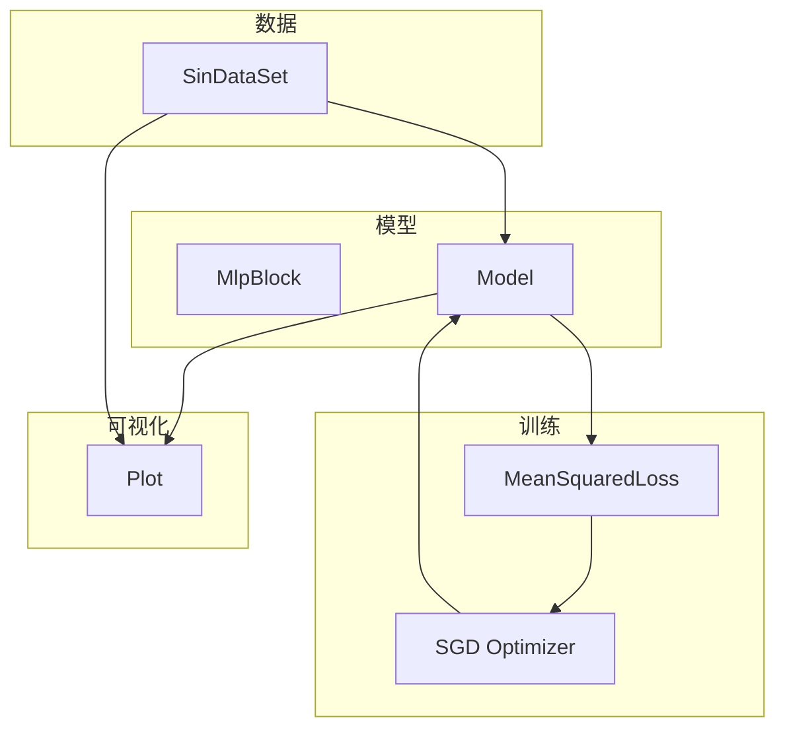
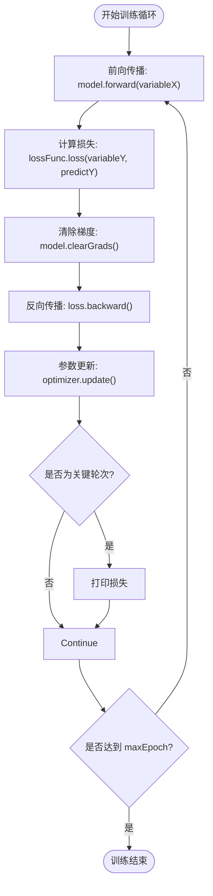
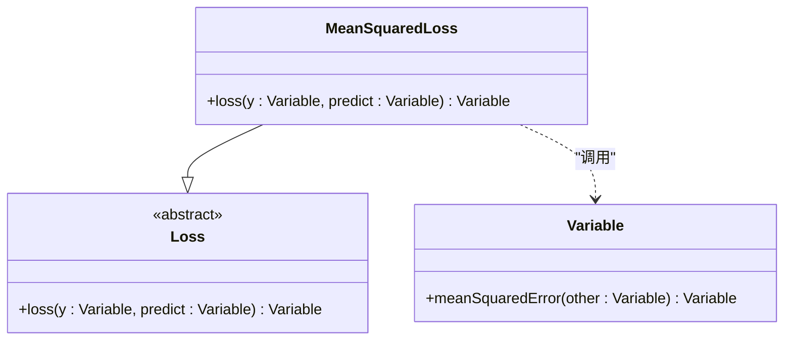
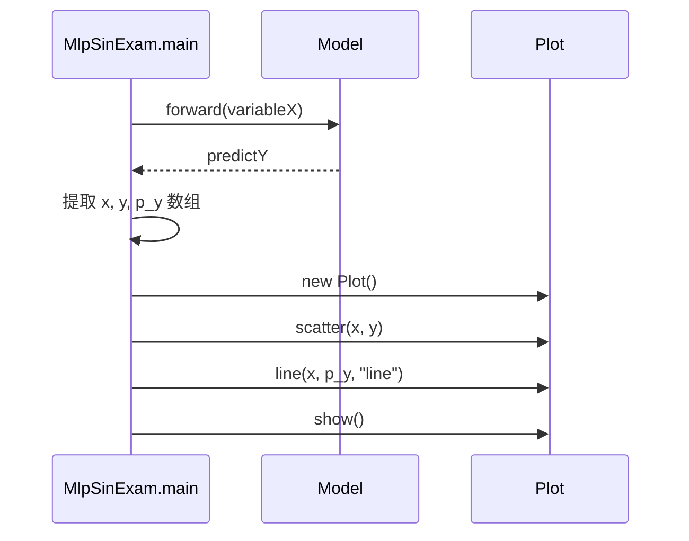
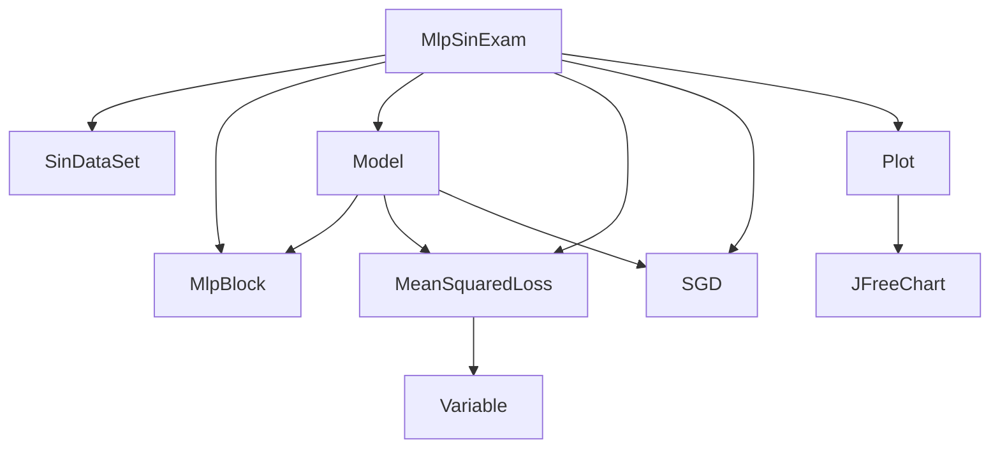

# 曲线拟合

<cite>
**本文档中引用的文件**   
- [MlpSinExam.java](file://src/main/java/io/leavesfly/tinydl/example/regress/MlpSinExam.java)
- [MeanSquaredLoss.java](file://src/main/java/io/leavesfly/tinydl/mlearning/loss/MeanSquaredLoss.java)
- [Plot.java](file://src/main/java/io/leavesfly/tinydl/utils/Plot.java)
- [MlpBlock.java](file://src/main/java/io/leavesfly/tinydl/nnet/block/MlpBlock.java)
- [Variable.java](file://src/main/java/io/leavesfly/tinydl/func/Variable.java)
- [Model.java](file://src/main/java/io/leavesfly/tinydl/mlearning/Model.java)
- [SinDataSet.java](file://src/main/java/io/leavesfly/tinydl/mlearning/dataset/simple/SinDataSet.java)
</cite>

## 目录
1. [简介](#简介)
2. [项目结构](#项目结构)
3. [核心组件](#核心组件)
4. [架构概述](#架构概述)
5. [详细组件分析](#详细组件分析)
6. [依赖分析](#依赖分析)
7. [性能考量](#性能考量)
8. [故障排除指南](#故障排除指南)
9. [结论](#结论)

## 简介
本文档全面解析 `MlpSinExam.java` 示例程序，该程序演示了如何使用单隐藏层多层感知机（MLP）对带有噪声的正弦波数据进行回归拟合。文档将详细说明数据生成、模型构建、损失函数、训练循环以及结果可视化的全过程，旨在为理解非线性函数拟合提供一个完整的实践案例。

## 项目结构
该项目遵循典型的机器学习项目分层结构，将示例、模型、损失函数、优化器和数据集等模块清晰地组织在不同的包中。`regress` 包下的 `MlpSinExam.java` 是本次分析的核心，它依赖于 `nnet`、`mlearning` 和 `utils` 等核心模块来完成神经网络的构建、训练和可视化。

**Section sources**
- [MlpSinExam.java](file://src/main/java/io/leavesfly/tinydl/example/regress/MlpSinExam.java)

## 核心组件
本节分析 `MlpSinExam.java` 中的关键组件，包括数据集生成、MLP模型定义、均方误差损失函数、SGD优化器以及训练循环的实现。

**Section sources**
- [MlpSinExam.java](file://src/main/java/io/leavesfly/tinydl/example/regress/MlpSinExam.java)
- [SinDataSet.java](file://src/main/java/io/leavesfly/tinydl/mlearning/dataset/simple/SinDataSet.java)
- [MlpBlock.java](file://src/main/java/io/leavesfly/tinydl/nnet/block/MlpBlock.java)
- [MeanSquaredLoss.java](file://src/main/java/io/leavesfly/tinydl/mlearning/loss/MeanSquaredLoss.java)

## 架构概述
该示例程序的架构遵循标准的监督学习流程：准备数据 -> 构建模型 -> 定义损失 -> 训练模型 -> 可视化结果。数据流从 `SinDataSet` 开始，经过 `Model` 进行前向传播，计算 `MeanSquaredLoss`，然后通过反向传播更新模型参数，最终由 `Plot` 组件将结果可视化。



**Diagram sources **
- [MlpSinExam.java](file://src/main/java/io/leavesfly/tinydl/example/regress/MlpSinExam.java)
- [SinDataSet.java](file://src/main/java/io/leavesfly/tinydl/mlearning/dataset/simple/SinDataSet.java)
- [Model.java](file://src/main/java/io/leavesfly/tinydl/mlearning/Model.java)
- [MeanSquaredLoss.java](file://src/main/java/io/leavesfly/tinydl/mlearning/loss/MeanSquaredLoss.java)
- [Plot.java](file://src/main/java/io/leavesfly/tinydl/utils/Plot.java)

## 详细组件分析
本节将深入分析每个关键组件的具体实现。

### MlpSinExam 分析
`MlpSinExam` 类的 `main` 方法是整个程序的入口，它协调了数据、模型、损失和优化器的交互。

#### 数据生成与模型初始化
程序首先创建一个 `SinDataSet` 实例来生成带有噪声的正弦波数据点。接着，它构建了一个 `MlpBlock`，其结构为 1-10-1，即输入层1个神经元，隐藏层10个神经元（使用Sigmoid激活函数），输出层1个神经元。这个 `MlpBlock` 被封装进一个 `Model` 对象中，同时初始化了 `SGD` 优化器和 `MeanSquaredLoss` 损失函数。

```mermaid
sequenceDiagram
participant Main as MlpSinExam.main
participant DS as SinDataSet
participant MB as MlpBlock
participant Model as Model
participant Loss as MeanSquaredLoss
participant Opt as SGD
Main->>DS : new SinDataSet(batchSize)
Main->>DS : prepare()
Main->>MB : new MlpBlock("MlpBlock", batchSize, Sigmoid, 1, 10, 1)
Main->>Model : new Model("MlpSinExam", block)
Main->>Loss : new MeanSquaredLoss()
Main->>Opt : new SGD(model, 0.2f)
```

**Diagram sources **
- [MlpSinExam.java](file://src/main/java/io/leavesfly/tinydl/example/regress/MlpSinExam.java#L15-L30)
- [SinDataSet.java](file://src/main/java/io/leavesfly/tinydl/mlearning/dataset/simple/SinDataSet.java)
- [MlpBlock.java](file://src/main/java/io/leavesfly/tinydl/nnet/block/MlpBlock.java)

#### 手动训练循环分析
训练循环是程序的核心，它手动实现了前向传播、损失计算、反向传播和参数更新的完整流程。



**Diagram sources **
- [MlpSinExam.java](file://src/main/java/io/leavesfly/tinydl/example/regress/MlpSinExam.java#L40-L60)

#### 均方误差损失函数分析
`MeanSquaredLoss` 类继承自抽象的 `Loss` 类，并实现了 `loss` 方法。其核心是调用 `Variable` 对象的 `meanSquaredError` 方法，该方法最终会创建一个 `MeanSE` 函数节点，将预测值和真实值的差的平方进行平均，从而得到标量损失值。



**Diagram sources **
- [MeanSquaredLoss.java](file://src/main/java/io/leavesfly/tinydl/mlearning/loss/MeanSquaredLoss.java)
- [Loss.java](file://src/main/java/io/leavesfly/tinydl/mlearning/loss/Loss.java)
- [Variable.java](file://src/main/java/io/leavesfly/tinydl/func/Variable.java)

#### 结果可视化分析
训练完成后，程序使用 `Plot` 工具将真实数据点和模型预测的连续曲线绘制在同一图表中。`scatter` 方法用于绘制带噪声的真实数据点（散点图），而 `line` 方法则用于绘制模型学习到的平滑正弦曲线（折线图）。`show` 方法最终启动一个JFreeChart窗口来显示图表。



**Diagram sources **
- [MlpSinExam.java](file://src/main/java/io/leavesfly/tinydl/example/regress/MlpSinExam.java#L62-L70)
- [Plot.java](file://src/main/java/io/leavesfly/tinydl/utils/Plot.java)

## 依赖分析
该示例程序的依赖关系清晰，核心依赖集中在 `mlearning` 和 `nnet` 包。`Model` 依赖于 `Block`（如 `MlpBlock`）来定义网络结构，依赖于 `Loss` 和 `Optimizer` 来完成训练。`Plot` 作为一个独立的工具类，依赖于JFreeChart库进行可视化。



**Diagram sources **
- [MlpSinExam.java](file://src/main/java/io/leavesfly/tinydl/example/regress/MlpSinExam.java)
- [Model.java](file://src/main/java/io/leavesfly/tinydl/mlearning/Model.java)

## 性能考量
训练轮数（`maxEpoch=10000`）是一个关键的超参数。轮数过少，模型可能无法充分学习数据的模式；轮数过多，则可能导致过拟合或训练时间过长。学习率（`0.2f`）同样至关重要，过高的学习率可能导致训练过程不稳定，损失值震荡甚至发散；过低的学习率则会使收敛速度非常缓慢。在实际应用中，需要通过实验来调整这些超参数以达到最佳的拟合效果。

## 故障排除指南
如果模型拟合效果不佳，可以检查以下几点：
1.  **数据问题**：确认 `SinDataSet` 生成的数据噪声水平是否合理。
2.  **模型结构**：1-10-1的结构对于正弦波拟合通常是足够的，但可以尝试增加隐藏层神经元数量。
3.  **超参数**：调整学习率和训练轮数。可以尝试更小的学习率（如0.01或0.1）和不同的训练轮次。
4.  **梯度问题**：确保 `model.clearGrads()` 在每次反向传播前被正确调用，以避免梯度累积。
5.  **可视化**：利用 `Plot` 功能检查训练过程中的损失曲线，观察其是否平稳下降。

**Section sources**
- [MlpSinExam.java](file://src/main/java/io/leavesfly/tinydl/example/regress/MlpSinExam.java)
- [Plot.java](file://src/main/java/io/leavesfly/tinydl/utils/Plot.java)

## 结论
通过对 `MlpSinExam.java` 的全面分析，我们了解了如何使用一个简单的MLP模型来解决非线性回归问题。该示例清晰地展示了从数据生成、模型构建、损失计算、手动训练循环到结果可视化的完整机器学习流程。`MeanSquaredLoss` 作为回归任务的标准损失函数，有效地指导了模型参数的优化方向。`Plot` 工具的使用使得模型的拟合效果能够被直观地评估。这个示例为理解深度学习的基本原理和实现细节提供了一个优秀的实践范例。