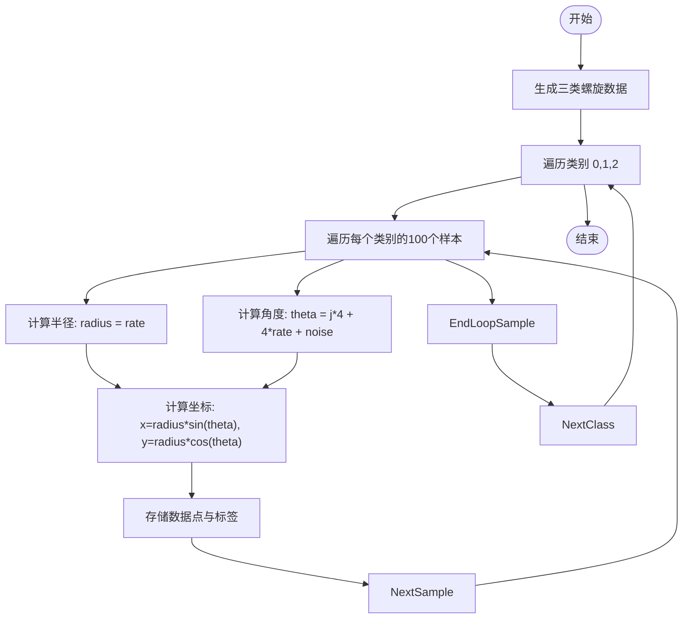
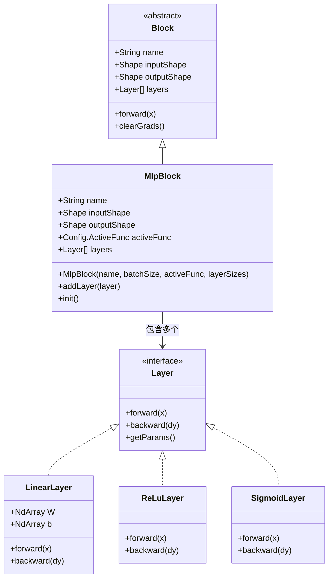
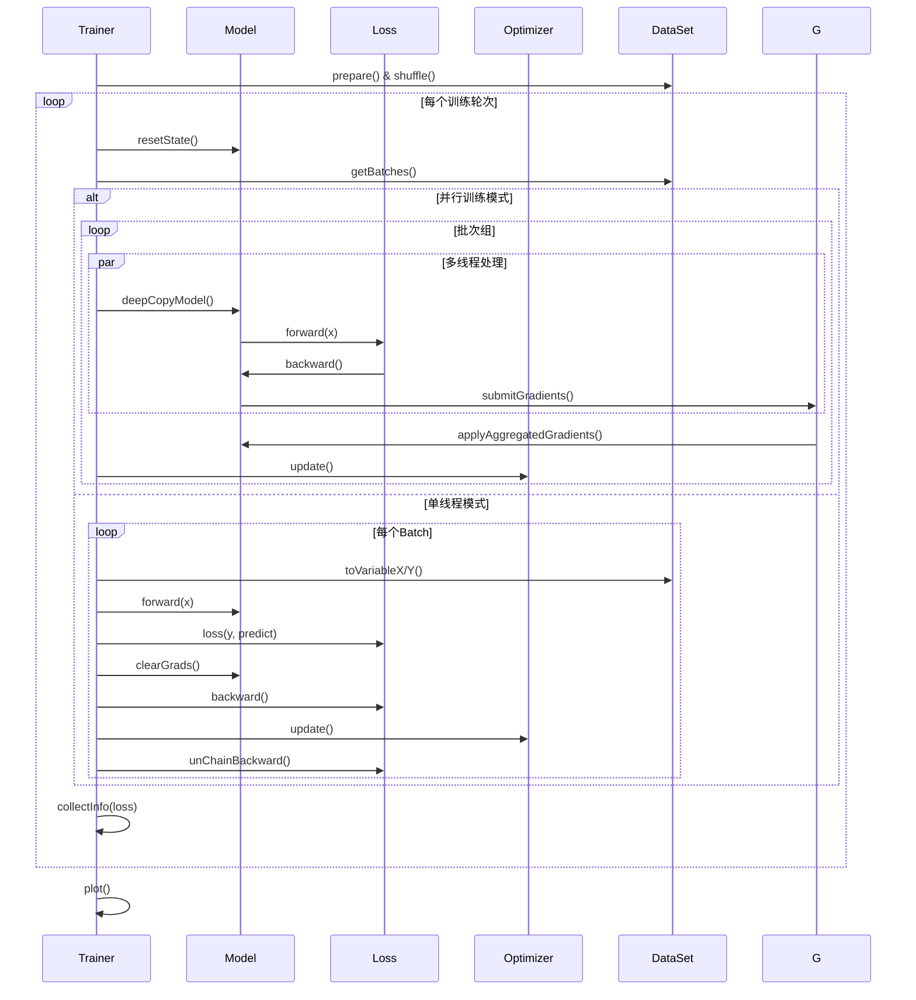

# 螺旋数据分类

<cite>
**本文档引用的文件**  
- [SpiralMlpExam.java](file://src/main/java/io/leavesfly/tinydl/example/classify/SpiralMlpExam.java) - *更新了训练流程*
- [MlpBlock.java](file://src/main/java/io/leavesfly/tinydl/nnet/block/MlpBlock.java) - *修改了激活函数配置逻辑*
- [Trainer.java](file://src/main/java/io/leavesfly/tinydl/mlearning/Trainer.java) - *新增并行训练功能*
- [SoftmaxCrossEntropy.java](file://src/main/java/io/leavesfly/tinydl/mlearning/loss/SoftmaxCrossEntropy.java)
- [SGD.java](file://src/main/java/io/leavesfly/tinydl/mlearning/optimize/SGD.java)
- [AccuracyEval.java](file://src/main/java/io/leavesfly/tinydl/mlearning/evaluator/AccuracyEval.java)
- [Plot.java](file://src/main/java/io/leavesfly/tinydl/utils/Plot.java)
- [SpiralDateSet.java](file://src/main/java/io/leavesfly/tinydl/mlearning/dataset/simple/SpiralDateSet.java)
</cite>

## 更新摘要
**已做更改**   
- 更新了MLP模型构建部分，反映`MlpBlock`中激活函数配置的变更
- 新增并行训练功能说明，涵盖`Trainer`类的新特性
- 更新训练流程与优化器章节，包含并行训练模式
- 修正手动训练循环中的参数更新细节
- 增强调参建议，加入并行训练相关参数说明

## 目录
1. [项目结构](#项目结构)
2. [核心组件](#核心组件)
3. [螺旋数据集生成](#螺旋数据集生成)
4. [MLP模型构建](#mlp模型构建)
5. [训练流程与优化器](#训练流程与优化器)
6. [手动训练循环详解](#手动训练循环详解)
7. [模型评估与可视化](#模型评估与可视化)
8. [调参建议](#调参建议)

## 项目结构

本项目采用模块化设计，主要分为示例、神经网络模块、机器学习核心组件、函数操作与工具类。`SpiralMlpExam.java`位于`example/classify`目录下，用于演示非线性可分螺旋数据的分类任务。

**Section sources**
- [SpiralMlpExam.java](file://src/main/java/io/leavesfly/tinydl/example/classify/SpiralMlpExam.java)

## 核心组件

系统由数据集、模型、损失函数、优化器、训练器和评估器构成。`SpiralMlpExam`作为入口，调用`SpiralDateSet`生成数据，`MlpBlock`构建网络，`SoftmaxCrossEntropy`计算损失，`SGD`更新参数，`Trainer`控制训练流程，`AccuracyEval`评估性能，`Plot`实现可视化。

**Section sources**
- [SpiralMlpExam.java](file://src/main/java/io/leavesfly/tinydl/example/classify/SpiralMlpExam.java)
- [Trainer.java](file://src/main/java/io/leavesfly/tinydl/mlearning/Trainer.java)
- [AccuracyEval.java](file://src/main/java/io/leavesfly/tinydl/mlearning/evaluator/AccuracyEval.java)

## 螺旋数据集生成

`SpiralDateSet`类生成三类螺旋分布的数据点，每类100个样本，共300个。通过极坐标变换生成非线性可分的螺旋形状，加入高斯噪声增强泛化性。数据维度为2，类别数为3，适用于多分类任务。



**Diagram sources**
- [SpiralDateSet.java](file://src/main/java/io/leavesfly/tinydl/mlearning/dataset/simple/SpiralDateSet.java#L20-L50)

**Section sources**
- [SpiralDateSet.java](file://src/main/java/io/leavesfly/tinydl/mlearning/dataset/simple/SpiralDateSet.java#L1-L80)

## MLP模型构建

`MlpBlock`实现多层感知机，支持任意数量的隐藏层。输入层大小为2（二维坐标），两个隐藏层均为30个神经元，输出层为3（三分类）。构造函数接受`Config.ActiveFunc`类型的激活函数参数，当指定为`ReLU`时使用ReLU激活函数，否则默认使用Sigmoid激活函数。



**Diagram sources**
- [MlpBlock.java](file://src/main/java/io/leavesfly/tinydl/nnet/block/MlpBlock.java#L1-L43)
- [LinearLayer.java](file://src/main/java/io/leavesfly/tinydl/nnet/layer/dnn/LinearLayer.java)
- [ReLuLayer.java](file://src/main/java/io/leavesfly/tinydl/nnet/layer/activate/ReLuLayer.java)
- [SigmoidLayer.java](file://src/main/java/io/leavesfly/tinydl/nnet/layer/activate/SigmoidLayer.java)

**Section sources**
- [MlpBlock.java](file://src/main/java/io/leavesfly/tinydl/nnet/block/MlpBlock.java#L1-L43)

## 训练流程与优化器

系统采用`SoftmaxCrossEntropy`作为损失函数，结合`SGD`优化器进行参数更新。`Trainer`封装训练流程，支持自动训练模式，包含监控、评估与绘图功能。新增并行训练能力，可通过构造函数或`configureParallelTraining`方法启用。



**Diagram sources**
- [Trainer.java](file://src/main/java/io/leavesfly/tinydl/mlearning/Trainer.java#L50-L100)
- [SoftmaxCrossEntropy.java](file://src/main/java/io/leavesfly/tinydl/mlearning/loss/SoftmaxCrossEntropy.java)
- [SGD.java](file://src/main/java/io/leavesfly/tinydl/mlearning/optimize/SGD.java)
- [ParallelTrainingUtils.java](file://src/main/java/io/leavesfly/tinydl/mlearning/parallel/ParallelTrainingUtils.java)
- [GradientAggregator.java](file://src/main/java/io/leavesfly/tinydl/mlearning/parallel/GradientAggregator.java)

**Section sources**
- [Trainer.java](file://src/main/java/io/leavesfly/tinydl/mlearning/Trainer.java#L1-L107)
- [SoftmaxCrossEntropy.java](file://src/main/java/io/leavesfly/tinydl/mlearning/loss/SoftmaxCrossEntropy.java#L1-L12)
- [SGD.java](file://src/main/java/io/leavesfly/tinydl/mlearning/optimize/SGD.java#L1-L23)

## 手动训练循环详解

`test1()`方法展示了手动实现的完整训练循环，包括前向传播、损失计算、反向传播和参数更新四个核心步骤。该实现提供了对训练过程的精细控制。

```mermaid
flowchart TD
Start([开始训练]) --> Init["初始化超参数<br/>maxEpoch=300, batchSize=10<br/>input=2, hidden=30, output=3"])
Init --> LoadData["加载SpiralDateSet<br/>prepare() & shuffle()"]
LoadData --> BuildModel["构建MlpBlock模型"]
BuildModel --> InitOpt["初始化SGD优化器<br/>学习率=1.0"]
InitOpt --> EpochLoop["训练轮次循环 i=0 to 299"]
EpochLoop --> BatchLoop["遍历每个Batch"]
BatchLoop --> Forward["前向传播: model.forward(x)"]
Forward --> ComputeLoss["计算损失: lossFunc.loss(y, predict)"]
ComputeLoss --> ComputeAcc["计算准确率: classify.accuracyRate()"]
ComputeAcc --> ClearGrad["清除梯度: model.clearGrads()"]
ClearGrad --> Backward["反向传播: loss.backward()"]
Backward --> Update["参数更新: optimizer.update()"]
Update --> Accumulate["累加损失与准确率"]
Accumulate --> NextBatch
NextBatch --> BatchLoop
BatchLoop --> AvgMetrics["计算平均损失与准确率"]
AvgMetrics --> StoreMetrics["存储lossArray[i], accArray[i]"]
StoreMetrics --> PrintInfo["每30轮打印一次结果"]
PrintInfo --> NextEpoch
NextEpoch --> EpochLoop
EpochLoop --> EndTrain
EndTrain --> Predict["使用模型预测新数据"]
Predict --> Visualize["调用Plot绘制结果"]
Visualize --> End([结束])
```

**Diagram sources**
- [SpiralMlpExam.java](file://src/main/java/io/leavesfly/tinydl/example/classify/SpiralMlpExam.java#L50-L130)

**Section sources**
- [SpiralMlpExam.java](file://src/main/java/io/leavesfly/tinydl/example/classify/SpiralMlpExam.java#L50-L130)

## 模型评估与可视化

`AccuracyEval`在测试集上评估模型准确率，`Plot`类利用JFreeChart绘制训练曲线和决策边界。原始数据点与模型预测结果以不同颜色散点图形式展示，直观反映分类效果。

```mermaid
graph TB
subgraph "可视化组件"
P[Plot]
D1[SpiralDateSet - 原始数据]
D2[SpiralDateSet - 预测结果]
L1[lossArray]
L2[accArray]
end
P --> D1 : scatter()
P --> D2 : scatter()
P --> L1 : line()
P --> L2 : line()
P --> JFC[JFreeChart]
JFC --> JFrame
JFrame --> Display[显示图表窗口]
```

**Diagram sources**
- [Plot.java](file://src/main/java/io/leavesfly/tinydl/utils/Plot.java#L1-L180)
- [AccuracyEval.java](file://src/main/java/io/leavesfly/tinydl/mlearning/evaluator/AccuracyEval.java#L1-L41)

**Section sources**
- [Plot.java](file://src/main/java/io/leavesfly/tinydl/utils/Plot.java#L1-L180)
- [AccuracyEval.java](file://src/main/java/io/leavesfly/tinydl/mlearning/evaluator/AccuracyEval.java#L1-L41)

## 调参建议

合理设置超参数对模型性能至关重要。以下为关键参数的影响分析：

| 参数 | 推荐范围 | 影响说明 |
|------|----------|----------|
| 学习率 (learRate) | 0.1 - 1.0 | 过高导致震荡，过低收敛慢 |
| 隐藏层大小 (hiddenSize) | 10 - 100 | 过小欠拟合，过大过拟合 |
| 训练轮数 (maxEpoch) | 100 - 500 | 过少欠拟合，过多过拟合 |
| 批量大小 (batchSize) | 10 - 30 | 影响梯度稳定性与内存占用 |
| 并行线程数 | 1 - CPU核心数 | 提升训练速度，但存在通信开销 |

建议采用学习率衰减策略，在训练后期降低学习率以提高收敛精度。可通过观察`Plot`生成的损失曲线判断是否收敛。对于并行训练，应确保模型可序列化，并根据实际硬件配置合适的线程数。

**Section sources**
- [SpiralMlpExam.java](file://src/main/java/io/leavesfly/tinydl/example/classify/SpiralMlpExam.java#L50-L130)
- [Trainer.java](file://src/main/java/io/leavesfly/tinydl/mlearning/Trainer.java#L351-L372)