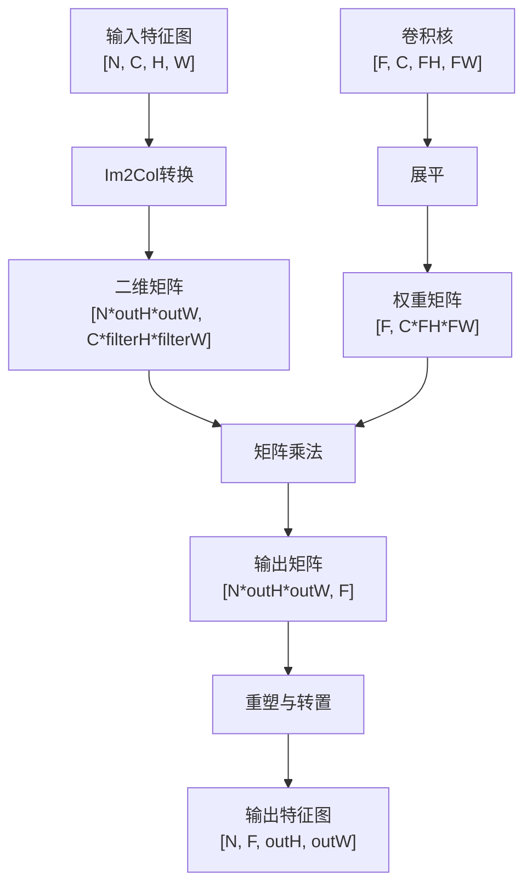
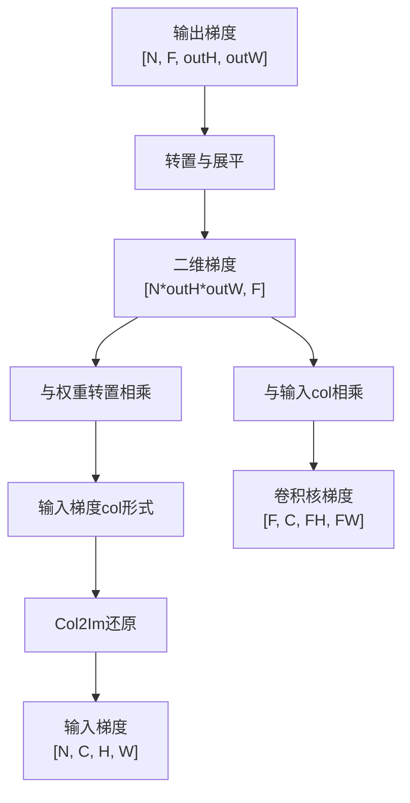
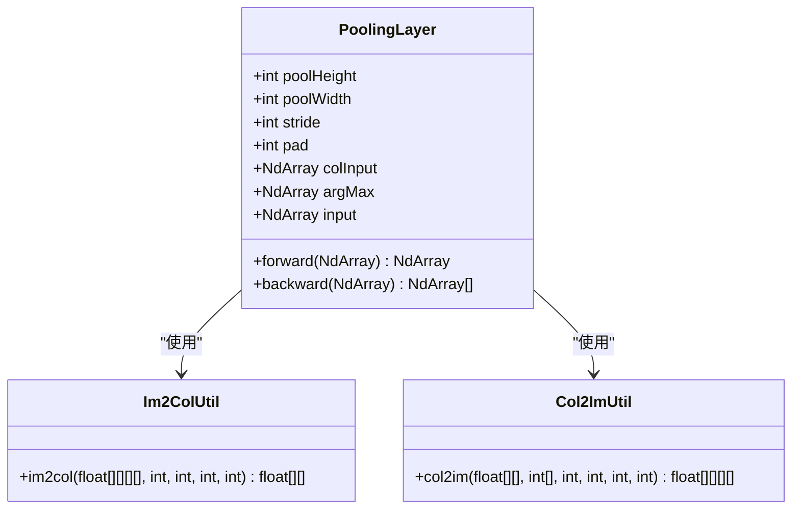
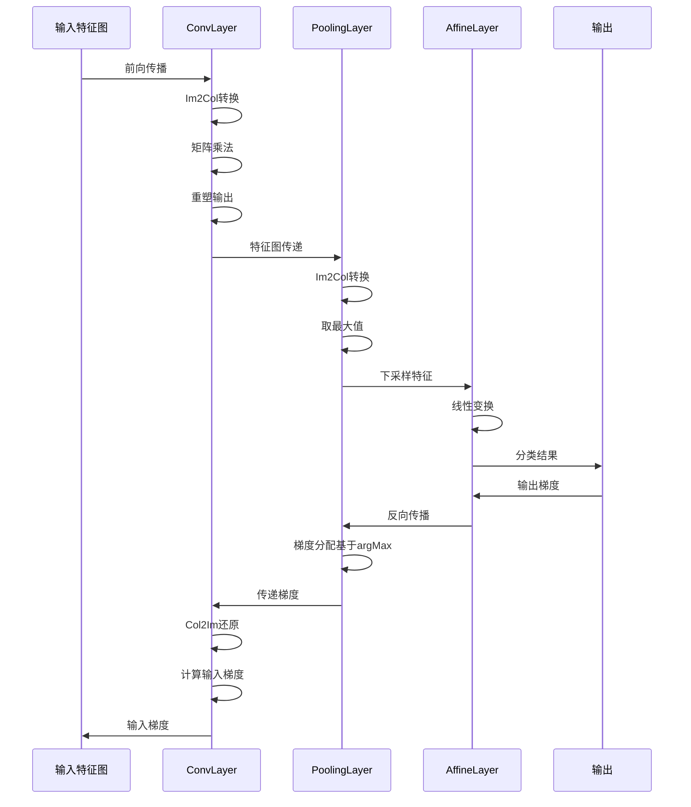
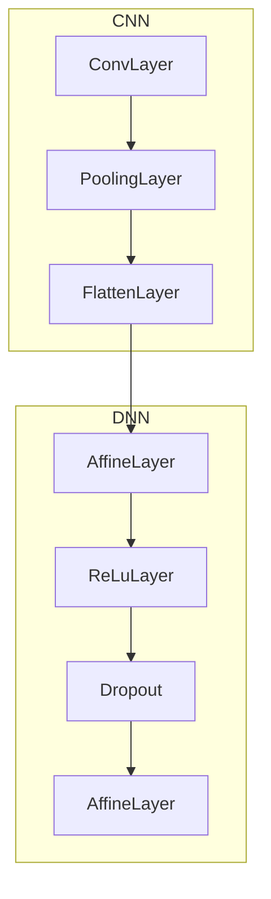

# CNN层

<cite>
**本文档引用文件**  
- [ConvLayer.java](file://src/main/java/io/leavesfly/tinydl/nnet/layer/cnn/ConvLayer.java)
- [Im2ColUtil.java](file://src/main/java/io/leavesfly/tinydl/nnet/layer/cnn/Im2ColUtil.java)
- [Col2ImUtil.java](file://src/main/java/io/leavesfly/tinydl/nnet/layer/cnn/Col2ImUtil.java)
- [PoolingLayer.java](file://src/main/java/io/leavesfly/tinydl/nnet/layer/cnn/PoolingLayer.java)
- [SimpleConvNet.java](file://src/main/java/io/leavesfly/tinydl/modality/cv/SimpleConvNet.java)
- [AffineLayer.java](file://src/main/java/io/leavesfly/tinydl/nnet/layer/dnn/AffineLayer.java)
</cite>

## 目录
1. [引言](#引言)
2. [卷积层实现原理](#卷积层实现原理)
3. [Im2Col与矩阵乘法优化](#im2col与矩阵乘法优化)
4. [反向传播与Col2Im还原](#反向传播与col2im还原)
5. [池化层实现机制](#池化层实现机制)
6. [前向与反向传播流程图](#前向与反向传播流程图)
7. [与全连接层的连接方式](#与全连接层的连接方式)
8. [SimpleConvNet示例分析](#simpleconvnet示例分析)
9. [总结](#总结)

## 引言
卷积神经网络（CNN）在图像识别任务中表现出色，其核心在于卷积层（ConvLayer）和池化层（PoolingLayer）的设计。本文深入分析TinyDL框架中CNN核心层的实现原理，重点讲解卷积操作如何通过Im2Col技术转换为矩阵乘法以提升计算效率，解析步长（stride）、填充（padding）等参数的处理逻辑，并结合SimpleConvNet示例说明其在实际模型中的堆叠使用模式。

## 卷积层实现原理

卷积层 `ConvLayer` 是CNN的核心组件，负责从输入特征图中提取局部特征。其构造函数接收输入形状、卷积核数量、高度、宽度、步长和填充参数，并据此计算输出形状。

卷积运算的数学表达如下：
```
output[n][f][h][w] = sum_{c,hf,wf} input[n][c][h*stride+hf-pad][w*stride+wf-pad] * filter[f][c][hf][wf]
```

其中：
- `n`：样本索引
- `f`：卷积核索引
- `c`：通道索引
- `h,w`：输出空间位置
- `hf,wf`：卷积核内位置

该层通过滑动窗口机制遍历输入特征图，每个窗口与卷积核进行逐元素乘法并求和，生成输出特征图的一个像素值。

**Section sources**
- [ConvLayer.java](file://src/main/java/io/leavesfly/tinydl/nnet/layer/cnn/ConvLayer.java#L25-L45)

## Im2Col与矩阵乘法优化

为提高卷积运算效率，`ConvLayer` 使用 `Im2ColUtil` 工具类将卷积操作转化为矩阵乘法。这一过程称为 **im2col**（image to column）。

`Im2ColUtil.im2col` 方法将四维输入数组 `[N, C, H, W]` 转换为二维矩阵，其行数为 `N*outH*outW`，列数为 `C*filterH*filterW`。每一行对应一个卷积窗口展开后的向量。

转换后，卷积运算变为：
```
output_2d = col_input @ filter_reshaped
```
其中 `@` 表示矩阵乘法，`filter_reshaped` 是将卷积核展平为 `[filterNum, C*filterH*filterW]` 的矩阵。

此优化利用高度优化的BLAS库执行矩阵乘法，显著提升计算速度，尤其适用于批量处理。



**Diagram sources**
- [Im2ColUtil.java](file://src/main/java/io/leavesfly/tinydl/nnet/layer/cnn/Im2ColUtil.java#L10-L68)
- [ConvLayer.java](file://src/main/java/io/leavesfly/tinydl/nnet/layer/cnn/ConvLayer.java#L70-L85)

## 反向传播与Col2Im还原

在反向传播阶段，`ConvLayer` 需要计算输入梯度和卷积核梯度。输出梯度首先通过转置和重塑转换为二维形式，然后分别与权重和输入的col形式相乘。

关键步骤是将梯度从二维col形式还原为原始四维形状，这由 `Col2ImUtil.col2im` 方法完成。该方法遍历每个卷积窗口位置，将对应的梯度值累加回原始输入位置。由于多个卷积窗口可能覆盖同一输入位置，因此采用累加而非直接赋值。

`col2im` 还处理了填充区域的裁剪，确保最终梯度形状与原始输入一致。



**Diagram sources**
- [Col2ImUtil.java](file://src/main/java/io/leavesfly/tinydl/nnet/layer/cnn/Col2ImUtil.java#L10-L92)
- [ConvLayer.java](file://src/main/java/io/leavesfly/tinydl/nnet/layer/cnn/ConvLayer.java#L90-L110)

**Section sources**
- [ConvLayer.java](file://src/main/java/io/leavesfly/tinydl/nnet/layer/cnn/ConvLayer.java#L90-L120)
- [Col2ImUtil.java](file://src/main/java/io/leavesfly/tinydl/nnet/layer/cnn/Col2ImUtil.java#L10-L92)

## 池化层实现机制

`PoolingLayer` 实现最大池化或平均池化操作，用于下采样和特征降维。与卷积层类似，它也使用 `Im2ColUtil` 将输入转换为col形式。

前向传播中，输入被划分为不重叠或重叠的池化窗口（由步长决定），每个窗口内取最大值（最大池化）或平均值（平均池化）。最大池化还需记录每个窗口中最大值的位置（`argMax`），用于反向传播。

反向传播时，梯度仅传递给前向传播中产生最大值的位置，其余位置梯度为零。这通过 `argMax` 索引实现稀疏梯度分配。



**Diagram sources**
- [PoolingLayer.java](file://src/main/java/io/leavesfly/tinydl/nnet/layer/cnn/PoolingLayer.java#L20-L40)
- [Im2ColUtil.java](file://src/main/java/io/leavesfly/tinydl/nnet/layer/cnn/Im2ColUtil.java#L10-L68)
- [Col2ImUtil.java](file://src/main/java/io/leavesfly/tinydl/nnet/layer/cnn/Col2ImUtil.java#L10-L92)

**Section sources**
- [PoolingLayer.java](file://src/main/java/io/leavesfly/tinydl/nnet/layer/cnn/PoolingLayer.java#L50-L100)

## 前向与反向传播流程图



**Diagram sources**
- [ConvLayer.java](file://src/main/java/io/leavesfly/tinydl/nnet/layer/cnn/ConvLayer.java#L70-L120)
- [PoolingLayer.java](file://src/main/java/io/leavesfly/tinydl/nnet/layer/cnn/PoolingLayer.java#L70-L110)
- [AffineLayer.java](file://src/main/java/io/leavesfly/tinydl/nnet/layer/dnn/AffineLayer.java#L30-L50)

## 与全连接层的连接方式

卷积网络通常在最后几层连接全连接层（`AffineLayer`）进行分类。由于卷积和池化层输出为四维张量 `[N, C, H, W]`，而全连接层期望二维输入 `[N, D]`，因此需要 `FlattenLayer` 进行形状转换。

`AffineLayer` 实现标准的线性变换 `y = xW + b`，其中权重矩阵 `W` 和偏置向量 `b` 为可学习参数。它通过高效的矩阵乘法完成前向计算，并在反向传播中计算梯度。



**Diagram sources**
- [AffineLayer.java](file://src/main/java/io/leavesfly/tinydl/nnet/layer/dnn/AffineLayer.java#L10-L50)
- [SimpleConvNet.java](file://src/main/java/io/leavesfly/tinydl/modality/cv/SimpleConvNet.java#L20-L70)

## SimpleConvNet示例分析

`SimpleConvNet` 类展示了CNN的典型堆叠结构。尽管当前实现为空，但从其设计意图可看出标准的CNN架构模式：

1. 多个卷积-激活-池化模块堆叠，逐步提取高层特征
2. 使用ReLU激活函数引入非线性
3. 通过池化层降低空间维度，增强平移不变性
4. 末端使用Flatten层展平特征图
5. 接若干全连接层完成分类任务
6. 使用Dropout防止过拟合

这种分层结构实现了从局部特征检测到全局语义理解的层次化特征学习。

**Section sources**
- [SimpleConvNet.java](file://src/main/java/io/leavesfly/tinydl/modality/cv/SimpleConvNet.java#L20-L70)

## 总结
本文详细解析了TinyDL框架中CNN核心层的实现机制。通过Im2Col/Col2Im技术，卷积运算被高效地转化为矩阵乘法，显著提升了计算性能。卷积层和池化层协同工作，实现特征提取与降维。最终通过与全连接层的连接，构建出完整的图像识别网络。这些设计体现了深度学习框架在计算效率与模型表达力之间的精巧平衡。