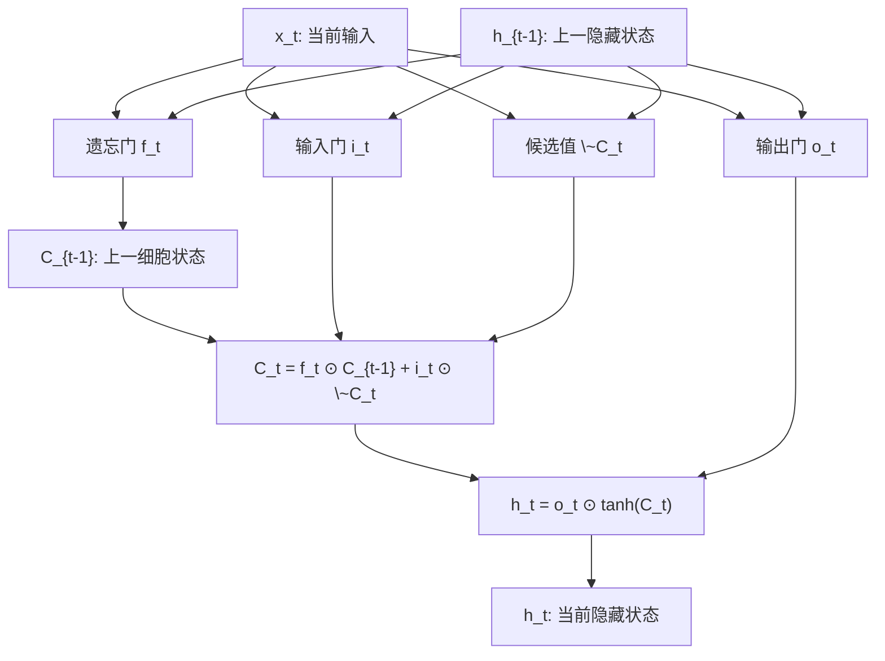
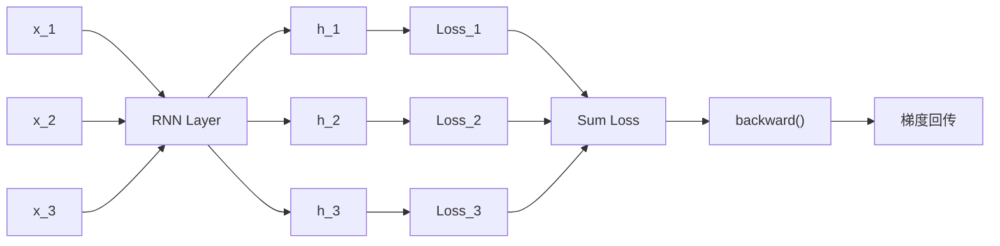

# RNN层

<cite>
**本文档中引用的文件**  
- [SimpleRnnlayer.java](file://src/main/java/io/leavesfly/tinydl/nnet/layer/rnn/SimpleRnnlayer.java)
- [LstmLayer.java](file://src/main/java/io/leavesfly/tinydl/nnet/layer/rnn/LstmLayer.java)
- [Variable.java](file://src/main/java/io/leavesfly/tinydl/func/Variable.java)
- [RnnCosExam.java](file://src/main/java/io/leavesfly/tinydl/example/regress/RnnCosExam.java)
- [RnnLayer.java](file://src/main/java/io/leavesfly/tinydl/nnet/RnnLayer.java)
- [SimpleRnnBlock.java](file://src/main/java/io/leavesfly/tinydl/nnet/block/SimpleRnnBlock.java)
- [LstmBlock.java](file://src/main/java/io/leavesfly/tinydl/nnet/block/LstmBlock.java)
</cite>

## 目录
1. [简介](#简介)
2. [SimpleRnnlayer的循环结构](#simplernnlayer的循环结构)
3. [LstmLayer的门控机制](#lstmlayer的门控机制)
4. [基于Variable的动态计算图构建](#基于variable的动态计算图构建)
5. [SimpleRNN与LSTM的对比分析](#simplernn与lstm的对比分析)
6. [RnnCosExam中的时间序列预测配置与调用](#rnncosexam中的时间序列预测配置与调用)
7. [结论](#结论)

## 简介
循环神经网络（RNN）是处理序列数据的核心模型之一，其通过维护隐藏状态实现对时间依赖性的建模。在本项目中，`SimpleRnnlayer` 和 `LstmLayer` 分别实现了基础RNN和长短期记忆网络（LSTM）两种结构。本文将深入剖析其实现机制，涵盖前向传播、状态更新、梯度计算以及在变长序列下的动态图构建方式，并结合 `RnnCosExam` 示例说明其在时间序列预测任务中的具体应用。

## SimpleRnnlayer的循环结构

`SimpleRnnlayer` 是标准RNN层的实现，其核心在于隐藏状态的递归更新机制。该层继承自抽象类 `RnnLayer`，具备状态管理能力，允许跨时间步传递信息。

### 隐藏状态更新公式
在每个时间步 $t$，隐藏状态 $h_t$ 的计算遵循以下公式：
$$
h_t = \tanh(W_{hh} \cdot h_{t-1} + W_{xh} \cdot x_t + b)
$$
其中：
- $x_t$：当前时间步的输入向量
- $h_{t-1}$：上一时间步的隐藏状态
- $W_{xh}$：输入到隐藏状态的权重矩阵
- $W_{hh}$：隐藏状态到隐藏状态的权重矩阵
- $b$：偏置项
- $\tanh$：激活函数，用于引入非线性并限制输出范围

此公式在 `layerForward` 方法中实现，通过 `Variable` 的 `linear` 和 `tanh` 操作完成计算。

### 时间步展开机制
在训练过程中，RNN通过时间步展开（Unrolling Through Time）将循环结构转化为等效的前馈网络。每一时间步调用 `layerForward` 方法，输入当前时刻的数据 $x_t$，并与上一时刻的状态 $h_{t-1}$ 结合生成新的状态 $h_t$。这种展开方式使得网络能够处理任意长度的序列。

### BPTT实现挑战
梯度沿时间反向传播（Backpropagation Through Time, BPTT）是训练RNN的关键算法。然而，由于梯度在多个时间步间连续传递，容易出现梯度消失或爆炸问题。在代码层面，`Variable` 类通过 `backward()` 方法递归执行反向传播，构建完整的计算图。但由于 `SimpleRnnlayer` 共享参数（$W_{hh}, W_{xh}$），梯度会累积，若不加以控制，可能导致训练不稳定。

**Section sources**
- [SimpleRnnlayer.java](file://src/main/java/io/leavesfly/tinydl/nnet/layer/rnn/SimpleRnnlayer.java#L50-L65)
- [Variable.java](file://src/main/java/io/leavesfly/tinydl/func/Variable.java#L200-L230)

## LstmLayer的门控机制

为缓解长期依赖问题，`LstmLayer` 实现了LSTM单元，引入了复杂的门控机制来精细控制信息流动。

### 核心组件与更新逻辑
LSTM包含三个门和一个细胞状态：
- **遗忘门（Forget Gate）**：决定从细胞状态中丢弃哪些信息
- **输入门（Input Gate）**：决定哪些新信息将被存储到细胞状态中
- **输出门（Output Gate）**：决定基于细胞状态输出什么信息
- **细胞状态（Cell State）**：长期记忆的载体，贯穿整个序列

其数学表达如下：
1. 遗忘门：$f_t = \sigma(W_{xf} \cdot x_t + W_{hf} \cdot h_{t-1})$
2. 输入门：$i_t = \sigma(W_{xi} \cdot x_t + W_{hi} \cdot h_{t-1})$
3. 候选值：$\tilde{C}_t = \tanh(W_{xu} \cdot x_t + W_{hu} \cdot h_{t-1})$
4. 细胞状态更新：$C_t = f_t \odot C_{t-1} + i_t \odot \tilde{C}_t$
5. 输出门：$o_t = \sigma(W_{xo} \cdot x_t + W_{ho} \cdot h_{t-1})$
6. 隐藏状态：$h_t = o_t \odot \tanh(C_t)$

其中 $\sigma$ 为Sigmoid函数，$\odot$ 表示逐元素乘法。

### 缓解长期依赖问题
LSTM通过细胞状态的线性传递和门控机制有效缓解了梯度消失问题。细胞状态在时间上传递时仅受加法和乘法门控影响，避免了重复的非线性变换，从而允许梯度更稳定地流动。这使得模型能够学习跨越多个时间步的长期依赖关系。

**Diagram sources**
- [LstmLayer.java](file://src/main/java/io/leavesfly/tinydl/nnet/layer/rnn/LstmLayer.java#L100-L130)

**Section sources**
- [LstmLayer.java](file://src/main/java/io/leavesfly/tinydl/nnet/layer/rnn/LstmLayer.java#L100-L130)

## 基于Variable的动态计算图构建

在处理变长序列时，RNN需动态构建计算图。`Variable` 类作为计算图的基本单元，记录其创建函数（`creator`）和输入变量，形成可追溯的计算路径。

### 动态图构建过程
在 `RnnCosExam` 示例中，每一批次数据按时间步依次输入模型。每个时间步的输出 `predict` 与真实值 `y` 计算损失，损失累加后执行 `backward()`。此时，`Variable` 从最终损失节点出发，沿 `creator` 指针递归调用各函数的 `backward` 方法，完成梯度回传。

### 状态管理与计算图切断
由于RNN具有状态性，连续训练需重置状态以避免跨批次干扰。`resetState()` 方法将 `state` 置为 `null`，确保每个序列独立处理。此外，在每批数据处理完毕后调用 `loss.unChainBackward()` 切断计算图，防止内存泄漏和梯度污染。

**Diagram sources**
- [Variable.java](file://src/main/java/io/leavesfly/tinydl/func/Variable.java#L200-L230)
- [RnnCosExam.java](file://src/main/java/io/leavesfly/tinydl/example/regress/RnnCosExam.java#L60-L80)

**Section sources**
- [Variable.java](file://src/main/java/io/leavesfly/tinydl/func/Variable.java#L200-L230)
- [RnnCosExam.java](file://src/main/java/io/leavesfly/tinydl/example/regress/RnnCosExam.java#L60-L80)

## SimpleRNN与LSTM的对比分析

| 特性 | SimpleRNN | LSTM |
|------|-----------|------|
| **表达能力** | 有限，难以捕捉长期依赖 | 强大，通过门控机制有效建模长期依赖 |
| **梯度稳定性** | 易出现梯度消失/爆炸 | 更稳定，细胞状态缓解梯度问题 |
| **参数数量** | 少，仅 $W_{hh}, W_{xh}, b$ | 多，包含四组权重矩阵和偏置 |
| **计算开销** | 低 | 高，涉及多个门控运算 |
| **适用场景** | 短期依赖任务 | 长期依赖任务，如语言建模、时间序列预测 |

从实现角度看，`SimpleRnnlayer` 结构简洁，适合教学和轻量级任务；而 `LstmLayer` 虽复杂，但具备更强的泛化能力和鲁棒性。

**Section sources**
- [SimpleRnnlayer.java](file://src/main/java/io/leavesfly/tinydl/nnet/layer/rnn/SimpleRnnlayer.java)
- [LstmLayer.java](file://src/main/java/io/leavesfly/tinydl/nnet/layer/rnn/LstmLayer.java)

## RnnCosExam中的时间序列预测配置与调用

`RnnCosExam` 示例展示了如何使用 `SimpleRnnBlock` 进行余弦曲线拟合。

### 配置参数
- `maxEpoch`: 100，最大训练轮数
- `bpttLength`: 3，BPTT截断长度，控制梯度回传步数
- `inputSize`: 1，输入维度
- `hiddenSize`: 20，隐藏层大小
- `outputSize`: 1，输出维度
- `learnRate`: 0.01，学习率

### 调用流程
1. **数据准备**：使用 `CosDataSet` 生成带滑动窗口的批次数据
2. **模型构建**：创建 `SimpleRnnBlock`，封装 `SimpleRnnlayer` 和 `LinearLayer`
3. **训练循环**：
   - 每轮开始调用 `model.resetState()` 重置状态
   - 遍历批次，逐时间步前向传播并累加损失
   - 执行 `clearGrads()`、`backward()` 和 `optimizer.update()`
   - 调用 `loss.unChainBackward()` 切断计算图

关键代码路径：
- [RnnCosExam.java#L50-L90](file://src/main/java/io/leavesfly/tinydl/example/regress/RnnCosExam.java#L50-L90)
- [SimpleRnnBlock.java#L20-L35](file://src/main/java/io/leavesfly/tinydl/nnet/block/SimpleRnnBlock.java#L20-L35)

**Section sources**
- [RnnCosExam.java](file://src/main/java/io/leavesfly/tinydl/example/regress/RnnCosExam.java#L40-L90)
- [SimpleRnnBlock.java](file://src/main/java/io/leavesfly/tinydl/nnet/block/SimpleRnnBlock.java#L20-L35)

## 结论
本文详细阐述了 `SimpleRnnlayer` 和 `LstmLayer` 的实现机制，揭示了RNN在处理序列数据时的核心原理。`SimpleRNN` 以其简洁性适用于短期依赖任务，而 `LSTM` 凭借门控机制显著提升了对长期依赖的建模能力。结合 `Variable` 的动态计算图特性，系统能够高效处理变长序列，并通过 `RnnCosExam` 示例验证了其在时间序列预测中的有效性。未来可进一步优化BPTT策略，引入梯度裁剪等技术提升训练稳定性。