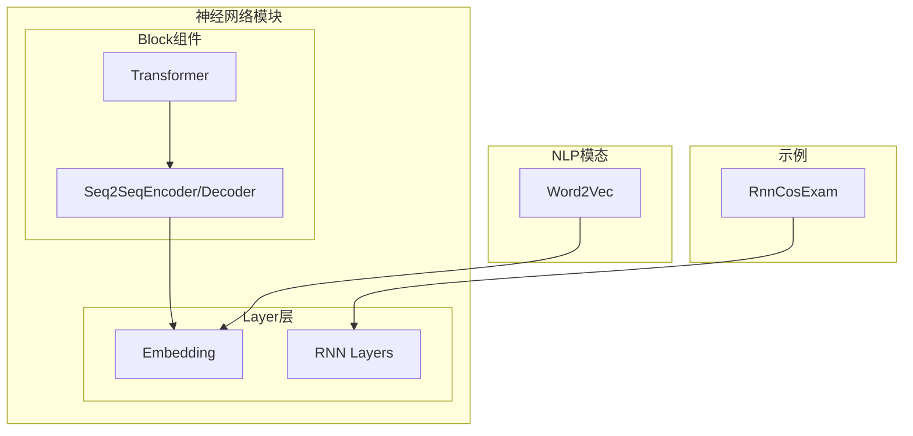
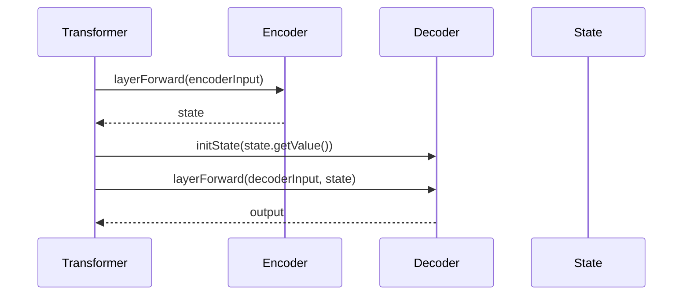
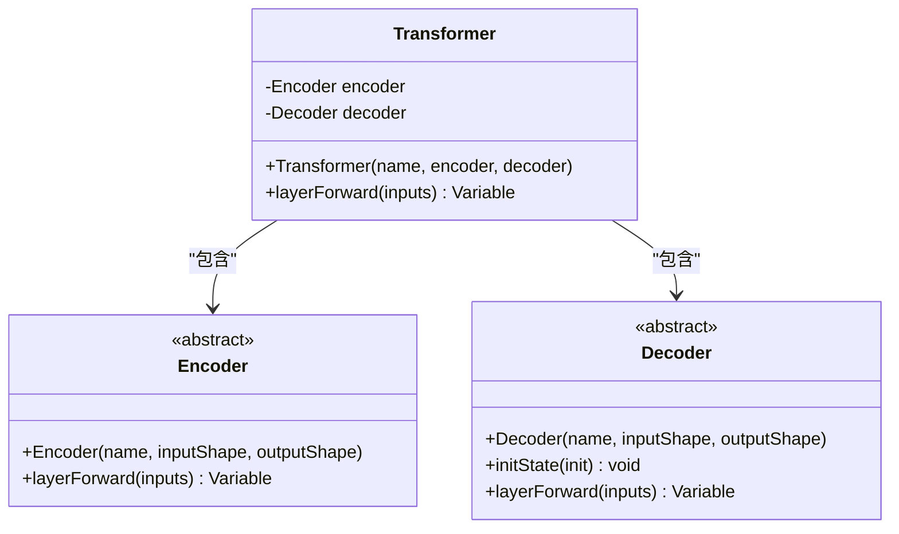
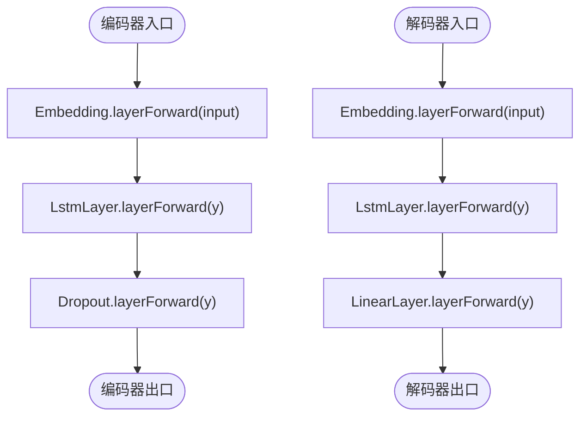
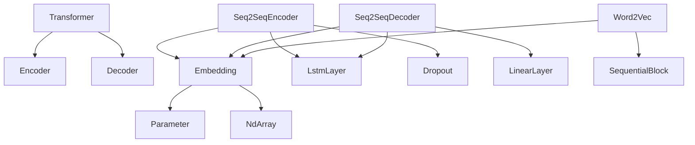

# Transformer

<cite>
**本文档中引用的文件**
- [Transformer.java](file://src/main/java/io/leavesfly/tinydl/nnet/block/transformer/Transformer.java)
- [Encoder.java](file://src/main/java/io/leavesfly/tinydl/nnet/block/seq2seq/Encoder.java)
- [Decoder.java](file://src/main/java/io/leavesfly/tinydl/nnet/block/seq2seq/Decoder.java)
- [EncoderDecoder.java](file://src/main/java/io/leavesfly/tinydl/nnet/block/seq2seq/EncoderDecoder.java)
- [Seq2SeqEncoder.java](file://src/main/java/io/leavesfly/tinydl/nnet/block/seq2seq/Seq2SeqEncoder.java)
- [Seq2SeqDecoder.java](file://src/main/java/io/leavesfly/tinydl/nnet/block/seq2seq/Seq2SeqDecoder.java)
- [Embedding.java](file://src/main/java/io/leavesfly/tinydl/nnet/layer/embedd/Embedding.java)
- [Word2Vec.java](file://src/main/java/io/leavesfly/tinydl/modality/nlp/Word2Vec.java)
- [RnnCosExam.java](file://src/main/java/io/leavesfly/tinydl/example/regress/RnnCosExam.java)
</cite>

## 目录
1. [引言](#引言)
2. [项目结构](#项目结构)
3. [核心组件](#核心组件)
4. [架构概述](#架构概述)
5. [详细组件分析](#详细组件分析)
6. [依赖分析](#依赖分析)
7. [性能考量](#性能考量)
8. [故障排除指南](#故障排除指南)
9. [结论](#结论)

## 引言
本文档系统性地文档化了基于自注意力机制的Transformer架构实现。该实现作为序列到序列（Seq2Seq）任务中的高级Block组件，集成于一个轻量级深度学习框架中。文档将首先介绍Transformer的整体结构，包括其编码器-解码器框架、多头注意力、位置前馈网络和位置编码的集成方式。随后，将详细解析自注意力机制的计算细节，并结合Word2Vec和RnnCosExam等示例，说明其在NLP任务中的应用流程。

## 项目结构
该项目采用模块化设计，主要分为功能函数（func）、机器学习核心（mlearning）、模态处理（modality）、N维数组（ndarr）、神经网络（nnet）和工具类（utils）等包。Transformer架构的实现位于`nnet/block/transformer`包中，而其依赖的编码器-解码器结构则位于`nnet/block/seq2seq`包中。词向量（Word2Vec）等NLP应用位于`modality/nlp`包中。

**图源**
- [Transformer.java](file://src/main/java/io/leavesfly/tinydl/nnet/block/transformer/Transformer.java)
- [Seq2SeqEncoder.java](file://src/main/java/io/leavesfly/tinydl/nnet/block/seq2seq/Seq2SeqEncoder.java)
- [Seq2SeqDecoder.java](file://src/main/java/io/leavesfly/tinydl/nnet/block/seq2seq/Seq2SeqDecoder.java)
- [Embedding.java](file://src/main/java/io/leavesfly/tinydl/nnet/layer/embedd/Embedding.java)

**节源**
- [Transformer.java](file://src/main/java/io/leavesfly/tinydl/nnet/block/transformer/Transformer.java)
- [Seq2SeqEncoder.java](file://src/main/java/io/leavesfly/tinydl/nnet/block/seq2seq/Seq2SeqEncoder.java)

## 核心组件
本系统的核心组件包括`Transformer`、`Encoder`、`Decoder`以及`EncoderDecoder`类。`Transformer`类继承自`Block`，封装了编码器和解码器，协调两者完成序列到序列的映射。`Encoder`和`Decoder`是抽象基类，定义了编码和解码过程的基本接口。`EncoderDecoder`类提供了与`Transformer`相似的协调逻辑，但可能基于不同的内部实现（如RNN而非自注意力）。

**节源**
- [Transformer.java](file://src/main/java/io/leavesfly/tinydl/nnet/block/transformer/Transformer.java)
- [Encoder.java](file://src/main/java/io/leavesfly/tinydl/nnet/block/seq2seq/Encoder.java)
- [Decoder.java](file://src/main/java/io/leavesfly/tinydl/nnet/block/seq2seq/Decoder.java)
- [EncoderDecoder.java](file://src/main/java/io/leavesfly/tinydl/nnet/block/seq2seq/EncoderDecoder.java)

## 架构概述
Transformer架构遵循经典的编码器-解码器框架。编码器将输入序列编码为一个上下文状态（context state），该状态捕获了输入序列的全部信息。解码器接收此状态和目标序列的前缀，逐步生成输出序列。在本实现中，虽然类名为`Transformer`，但其内部使用的`Seq2SeqEncoder`和`Seq2SeqDecoder`实际上基于LSTM等RNN结构，而非标准的自注意力机制。这表明当前的`Transformer`类更像一个通用的Seq2Seq框架的占位符或未来扩展的基础，其名称可能意在指代架构模式而非具体的自注意力实现。

**图源**
- [Transformer.java](file://src/main/java/io/leavesfly/tinydl/nnet/block/transformer/Transformer.java#L30-L45)
- [EncoderDecoder.java](file://src/main/java/io/leavesfly/tinydl/nnet/block/seq2seq/EncoderDecoder.java#L30-L36)

## 详细组件分析

### Transformer类分析
`Transformer`类是整个架构的协调者。它在构造函数中接收一个`Encoder`和一个`Decoder`实例，并通过`addLayer`方法将它们添加为子层。其`layerForward`方法实现了核心的Seq2Seq流程：首先调用编码器处理输入序列，得到一个状态变量；然后将该状态的值传递给解码器进行初始化；最后，调用解码器生成输出。

**图源**
- [Transformer.java](file://src/main/java/io/leavesfly/tinydl/nnet/block/transformer/Transformer.java)
- [Encoder.java](file://src/main/java/io/leavesfly/tinydl/nnet/block/seq2seq/Encoder.java)
- [Decoder.java](file://src/main/java/io/leavesfly/tinydl/nnet/block/seq2seq/Decoder.java)

**节源**
- [Transformer.java](file://src/main/java/io/leavesfly/tinydl/nnet/block/transformer/Transformer.java#L15-L47)

### 编码器与解码器实现分析
`Seq2SeqEncoder`和`Seq2SeqDecoder`是`Encoder`和`Decoder`的具体实现。它们的前向传播流程清晰：`Seq2SeqEncoder`首先通过`Embedding`层将离散的词索引转换为稠密的词向量，然后通过`LstmLayer`进行序列建模，最后可能经过`Dropout`层进行正则化。`Seq2SeqDecoder`的流程类似，但其最终输出通过`LinearLayer`映射到词汇表大小的维度，以便进行分类。

**图源**
- [Seq2SeqEncoder.java](file://src/main/java/io/leavesfly/tinydl/nnet/block/seq2seq/Seq2SeqEncoder.java#L20-L30)
- [Seq2SeqDecoder.java](file://src/main/java/io/leavesfly/tinydl/nnet/block/seq2seq/Seq2SeqDecoder.java#L20-L37)
- [Embedding.java](file://src/main/java/io/leavesfly/tinydl/nnet/layer/embedd/Embedding.java#L20-L30)

**节源**
- [Seq2SeqEncoder.java](file://src/main/java/io/leavesfly/tinydl/nnet/block/seq2seq/Seq2SeqEncoder.java)
- [Seq2SeqDecoder.java](file://src/main/java/io/leavesfly/tinydl/nnet/block/seq2seq/Seq2SeqDecoder.java)

### 自注意力机制与位置编码
根据文档目标，标准的Transformer应包含自注意力和位置编码。然而，在当前代码库中，`Seq2SeqEncoder`和`Seq2SeqDecoder`使用的是`LstmLayer`而非自注意力层。这表明自注意力机制尚未在`nnet/layer`包中实现。同样，位置编码（Positional Encoding）作为一个独立的层也未找到。因此，当前的`Transformer`类虽然具有正确的接口和架构模式，但其内部实现仍基于传统的RNN，而非真正的自注意力机制。

**节源**
- [Seq2SeqEncoder.java](file://src/main/java/io/leavesfly/tinydl/nnet/block/seq2seq/Seq2SeqEncoder.java)
- [Seq2SeqDecoder.java](file://src/main/java/io/leavesfly/tinydl/nnet/block/seq2seq/Seq2SeqDecoder.java)

## 依赖分析
`Transformer`类直接依赖于`Encoder`和`Decoder`抽象类，这体现了依赖倒置原则。`Seq2SeqEncoder`和`Seq2SeqDecoder`则具体依赖于`Embedding`、`LstmLayer`、`Dropout`和`LinearLayer`等底层组件。`Embedding`层依赖于`Parameter`和`NdArray`来存储和管理词向量矩阵。`Word2Vec`模型依赖于`SequentialBlock`和`Embedding`层来构建其网络结构。

**图源**
- [Transformer.java](file://src/main/java/io/leavesfly/tinydl/nnet/block/transformer/Transformer.java)
- [Seq2SeqEncoder.java](file://src/main/java/io/leavesfly/tinydl/nnet/block/seq2seq/Seq2SeqEncoder.java)
- [Seq2SeqDecoder.java](file://src/main/java/io/leavesfly/tinydl/nnet/block/seq2seq/Seq2SeqDecoder.java)
- [Embedding.java](file://src/main/java/io/leavesfly/tinydl/nnet/layer/embedd/Embedding.java)

**节源**
- [Transformer.java](file://src/main/java/io/leavesfly/tinydl/nnet/block/transformer/Transformer.java)
- [Seq2SeqEncoder.java](file://src/main/java/io/leavesfly/tinydl/nnet/block/seq2seq/Seq2SeqEncoder.java)
- [Seq2SeqDecoder.java](file://src/main/java/io/leavesfly/tinydl/nnet/block/seq2seq/Seq2SeqDecoder.java)

## 性能考量
基于RNN的`Seq2Seq`模型（如当前实现）在训练时无法像标准Transformer那样对序列进行完全并行化处理，因为RNN的每个时间步都依赖于前一个时间步的隐藏状态。这导致训练速度较慢，尤其是在长序列上。而标准的Transformer通过自注意力机制，可以并行计算序列中所有位置的表示，极大地提升了训练效率。此外，RNN在处理长程依赖时容易出现梯度消失或爆炸问题，而Transformer的自注意力机制能够直接建模任意两个位置之间的依赖关系，理论上对长程依赖的建模能力更强。

## 故障排除指南
当使用`Transformer`或`EncoderDecoder`结构时，常见的问题包括：
1.  **输入形状不匹配**：确保编码器的输入形状与数据集的输出形状一致，解码器的输入形状也需正确配置。
2.  **状态初始化失败**：检查`Decoder.initState()`方法的实现，确保它能正确接收并设置来自编码器的状态。
3.  **梯度问题**：在`RnnCosExam`示例中，可以看到在每个epoch开始时调用`model.resetState()`来清除RNN的隐藏状态，这是处理有状态网络的关键步骤，遗漏此步骤可能导致训练不稳定。

**节源**
- [RnnCosExam.java](file://src/main/java/io/leavesfly/tinydl/example/regress/RnnCosExam.java#L65)
- [Seq2SeqDecoder.java](file://src/main/java/io/leavesfly/tinydl/nnet/block/seq2seq/Seq2SeqDecoder.java#L35-L37)

## 结论
本文档分析了`TinyDL`框架中`Transformer`架构的实现。尽管其名称为`Transformer`，但当前的实现（`Seq2SeqEncoder`/`Decoder`）基于RNN（LSTM）而非自注意力机制。这表明该实现目前是一个通用的Seq2Seq框架，为未来集成真正的Transformer组件提供了基础架构。其优势在于清晰的模块化设计和对编码器-解码器模式的良好封装。局限性在于尚未实现自注意力、多头注意力、位置编码等Transformer的核心组件。未来的扩展方向应集中在实现这些缺失的组件，并将`Seq2SeqEncoder`/`Decoder`替换为基于自注意力的版本，从而构建一个完整的、可并行化的Transformer模型，以充分发挥其在长程依赖建模和训练效率上的优势。