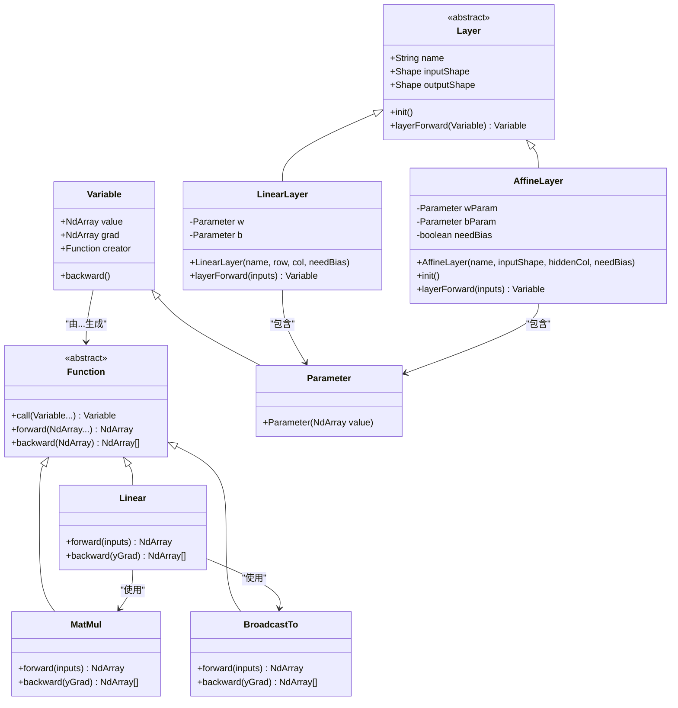
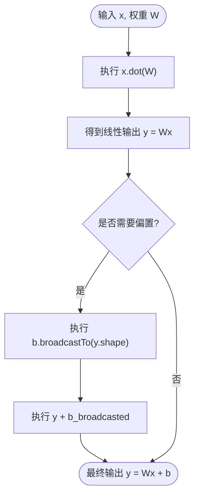
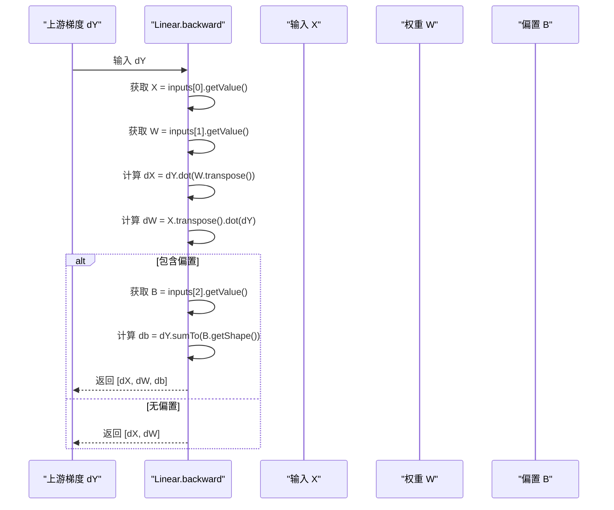

# 全连接层

<cite>
**本文档引用的文件**  
- [LinearLayer.java](file://src/main/java/io/leavesfly/tinydl/nnet/layer/dnn/LinearLayer.java)
- [AffineLayer.java](file://src/main/java/io/leavesfly/tinydl/nnet/layer/dnn/AffineLayer.java)
- [Linear.java](file://src/main/java/io/leavesfly/tinydl/func/matrix/Linear.java)
- [MatMul.java](file://src/main/java/io/leavesfly/tinydl/func/matrix/MatMul.java)
- [BroadcastTo.java](file://src/main/java/io/leavesfly/tinydl/func/matrix/BroadcastTo.java)
- [Variable.java](file://src/main/java/io/leavesfly/tinydl/func/Variable.java)
- [Function.java](file://src/main/java/io/leavesfly/tinydl/func/Function.java)
- [Parameter.java](file://src/main/java/io/leavesfly/tinydl/nnet/Parameter.java)
</cite>

## 目录
1. [引言](#引言)
2. [核心组件与架构](#核心组件与架构)
3. [前向传播机制](#前向传播机制)
4. [反向传播与梯度计算](#反向传播与梯度计算)
5. [参数初始化策略](#参数初始化策略)
6. [梯度更新流程](#梯度更新流程)
7. [在MLP模型中的应用示例](#在mlp模型中的应用示例)
8. [LinearLayer与AffineLayer对比](#linearlayer与affinelayer对比)
9. [性能优化建议](#性能优化建议)
10. [结论](#结论)

## 引言

全连接层（Fully Connected Layer）是深度神经网络中最基础且关键的组件之一，广泛应用于多层感知机（MLP）、卷积神经网络（CNN）的分类头以及循环神经网络（RNN）的输出层。本技术文档深入解析 `LinearLayer` 和 `AffineLayer` 的实现机制，涵盖从数学原理到代码实现的完整链条，重点阐述线性变换、仿射变换、前向与反向传播、参数初始化及优化策略。

**Section sources**  
- [LinearLayer.java](file://src/main/java/io/leavesfly/tinydl/nnet/layer/dnn/LinearLayer.java#L1-L54)
- [AffineLayer.java](file://src/main/java/io/leavesfly/tinydl/nnet/layer/dnn/AffineLayer.java#L1-L53)

## 核心组件与架构

全连接层的核心由 `LinearLayer` 和 `AffineLayer` 实现，二者均继承自 `Layer` 抽象类，并通过 `Variable` 和 `Function` 构建自动微分计算图。其核心依赖以下组件：

- **`Linear` 函数**：执行核心的线性或仿射变换。
- **`MatMul` 函数**：实现矩阵乘法运算。
- **`BroadcastTo` 函数**：处理偏置项的广播加法。
- **`Variable` 类**：封装张量值与梯度，支持自动求导。
- **`Parameter` 类**：表示可训练参数（权重W和偏置b）。



**Diagram sources**  
- [LinearLayer.java](file://src/main/java/io/leavesfly/tinydl/nnet/layer/dnn/LinearLayer.java#L1-L54)
- [AffineLayer.java](file://src/main/java/io/leavesfly/tinydl/nnet/layer/dnn/AffineLayer.java#L1-L53)
- [Linear.java](file://src/main/java/io/leavesfly/tinydl/func/matrix/Linear.java#L1-L38)
- [MatMul.java](file://src/main/java/io/leavesfly/tinydl/func/matrix/MatMul.java#L1-L33)
- [BroadcastTo.java](file://src/main/java/io/leavesfly/tinydl/func/matrix/BroadcastTo.java#L1-L38)
- [Variable.java](file://src/main/java/io/leavesfly/tinydl/func/Variable.java#L1-L338)
- [Parameter.java](file://src/main/java/io/leavesfly/tinydl/nnet/Parameter.java#L1-L13)

**Section sources**  
- [LinearLayer.java](file://src/main/java/io/leavesfly/tinydl/nnet/layer/dnn/LinearLayer.java#L1-L54)
- [AffineLayer.java](file://src/main/java/io/leavesfly/tinydl/nnet/layer/dnn/AffineLayer.java#L1-L53)
- [Linear.java](file://src/main/java/io/leavesfly/tinydl/func/matrix/Linear.java#L1-L38)

## 前向传播机制

全连接层的前向传播实现公式：**y = Wx + b**，其中：
- **x**：输入张量，形状为 (batch_size, input_features)
- **W**：权重矩阵，形状为 (input_features, output_features)
- **b**：偏置向量，形状为 (1, output_features)
- **y**：输出张量，形状为 (batch_size, output_features)

### 矩阵乘法 (MatMul)

`MatMul` 函数执行核心的矩阵乘法操作 `x.dot(w)`，即输入与权重的线性组合。



**Diagram sources**  
- [Linear.java](file://src/main/java/io/leavesfly/tinydl/func/matrix/Linear.java#L5-L15)
- [MatMul.java](file://src/main/java/io/leavesfly/tinydl/func/matrix/MatMul.java#L10-L18)
- [BroadcastTo.java](file://src/main/java/io/leavesfly/tinydl/func/matrix/BroadcastTo.java#L15-L25)

**Section sources**  
- [Linear.java](file://src/main/java/io/leavesfly/tinydl/func/matrix/Linear.java#L5-L15)
- [MatMul.java](file://src/main/java/io/leavesfly/tinydl/func/matrix/MatMul.java#L10-L18)
- [BroadcastTo.java](file://src/main/java/io/leavesfly/tinydl/func/matrix/BroadcastTo.java#L15-L25)

## 反向传播与梯度计算

反向传播的目标是计算损失函数对权重W和输入x的梯度，即 **dW** 和 **dX**。

### 梯度计算逻辑

根据链式法则：
- **dX = dY · Wᵀ**：输入梯度
- **dW = Xᵀ · dY**：权重梯度
- **db = sum(dY, axis=0)**：偏置梯度（沿batch维度求和）



**Diagram sources**  
- [Linear.java](file://src/main/java/io/leavesfly/tinydl/func/matrix/Linear.java#L17-L35)

**Section sources**  
- [Linear.java](file://src/main/java/io/leavesfly/tinydl/func/matrix/Linear.java#L17-L35)
- [Variable.java](file://src/main/java/io/leavesfly/tinydl/func/Variable.java#L250-L255)

## 参数初始化策略

不恰当的初始化会导致梯度消失或爆炸。本框架采用 **Xavier初始化**（也称Glorot初始化）：

- **权重W**：从均值为0、标准差为 √(1 / input_features) 的正态分布中采样。
- **偏置b**：初始化为0。

```java
NdArray initWeight = NdArray.likeRandomN(new Shape(hiddenRow, hiddenCol))
                      .mulNum(Math.sqrt((double) 1 / hiddenRow));
```

该策略确保了信号在前向传播时的方差稳定。

**Section sources**  
- [LinearLayer.java](file://src/main/java/io/leavesfly/tinydl/nnet/layer/dnn/LinearLayer.java#L15-L20)
- [AffineLayer.java](file://src/main/java/io/leavesfly/tinydl/nnet/layer/dnn/AffineLayer.java#L25-L30)

## 梯度更新流程

1. **前向传播**：计算预测值 y_pred。
2. **计算损失**：使用损失函数（如 `MeanSE` 或 `SoftmaxCE`）得到损失值 loss。
3. **反向传播**：调用 `loss.backward()`，触发计算图的梯度回传。
4. **参数更新**：优化器（如 `SGD` 或 `Adam`）根据梯度更新 `Parameter` 对象中的值。

伪代码：
```
for epoch in epochs:
    y_pred = model(x)
    loss = criterion(y_pred, y_true)
    loss.backward()           // 自动计算所有参数梯度
    optimizer.step()          // 更新参数
    optimizer.zeroGrad()      // 清空梯度
```

**Section sources**  
- [Variable.java](file://src/main/java/io/leavesfly/tinydl/func/Variable.java#L50-L80)
- [mlearning/optimize/SGD.java](file://src/main/java/io/leavesfly/tinydl/mlearning/optimize/SGD.java)

## 在MLP模型中的应用示例

典型的MLP模型由多个全连接层堆叠而成，中间夹杂激活函数。

```java
SequentialBlock mlp = new SequentialBlock("mlp");
mlp.addLayer(new LinearLayer("fc1", 784, 128, true));
mlp.addLayer(new ReLuLayer("relu1"));
mlp.addLayer(new LinearLayer("fc2", 128, 64, true));
mlp.addLayer(new ReLuLayer("relu2"));
mlp.addLayer(new LinearLayer("fc3", 64, 10, true));
mlp.addLayer(new SoftMaxLayer("softmax"));
```

此结构可用于MNIST手写数字分类任务。

**Section sources**  
- [mlearning/dataset/simple/MnistDataSet.java](file://src/main/java/io/leavesfly/tinydl/mlearning/dataset/simple/MnistDataSet.java)
- [example/classify/MnistMlpExam.java](file://src/main/java/io/leavesfly/tinydl/example/classify/MnistMlpExam.java)

## LinearLayer与AffineLayer对比

| 特性 | LinearLayer | AffineLayer |
|------|-------------|-------------|
| **偏置项** | 构造函数中显式指定 `needBias` | 构造函数中显式指定 `_needBias` |
| **初始化时机** | 构造函数内完成 | 在 `init()` 方法中延迟初始化 |
| **输入形状** | 构造时指定 `hiddenRow` 和 `hiddenCol` | 接收 `Shape` 对象，更灵活 |
| **适用场景** | 简单、直接的全连接层 | 需要延迟初始化或动态形状的场景 |

两者功能基本等价，`AffineLayer` 提供了更灵活的初始化控制。

**Section sources**  
- [LinearLayer.java](file://src/main/java/io/leavesfly/tinydl/nnet/layer/dnn/LinearLayer.java#L1-L54)
- [AffineLayer.java](file://src/main/java/io/leavesfly/tinydl/nnet/layer/dnn/AffineLayer.java#L1-L53)

## 性能优化建议

### 批量处理 (Batch Processing)
- 使用批量输入 `(batch_size, input_features)` 可以充分利用矩阵乘法的并行计算能力，显著提升GPU利用率。

### 内存布局优化
- 确保 `NdArray` 的内存布局为行优先（C-order），以优化 `dot` 运算的缓存命中率。
- 避免在训练循环中频繁创建和销毁 `Variable` 对象，考虑重用。

### 计算图优化
- 在推理模式下，可通过设置 `Config.train = false` 来禁用计算图构建，减少内存开销。

**Section sources**  
- [ndarr/NdArray.java](file://src/main/java/io/leavesfly/tinydl/ndarr/NdArray.java)
- [utils/Config.java](file://src/main/java/io/leavesfly/tinydl/utils/Config.java)

## 结论

`LinearLayer` 和 `AffineLayer` 是TinyDL框架中实现全连接层的核心组件。它们通过 `Linear`、`MatMul` 和 `BroadcastTo` 函数精确实现了 `y = Wx + b` 的仿射变换，并利用 `Variable` 系统自动完成反向传播。合理的Xavier初始化和批量处理策略是构建高效、稳定MLP模型的关键。开发者可根据具体需求选择 `LinearLayer` 或 `AffineLayer`，二者在功能上高度一致，`AffineLayer` 提供了更灵活的初始化控制。