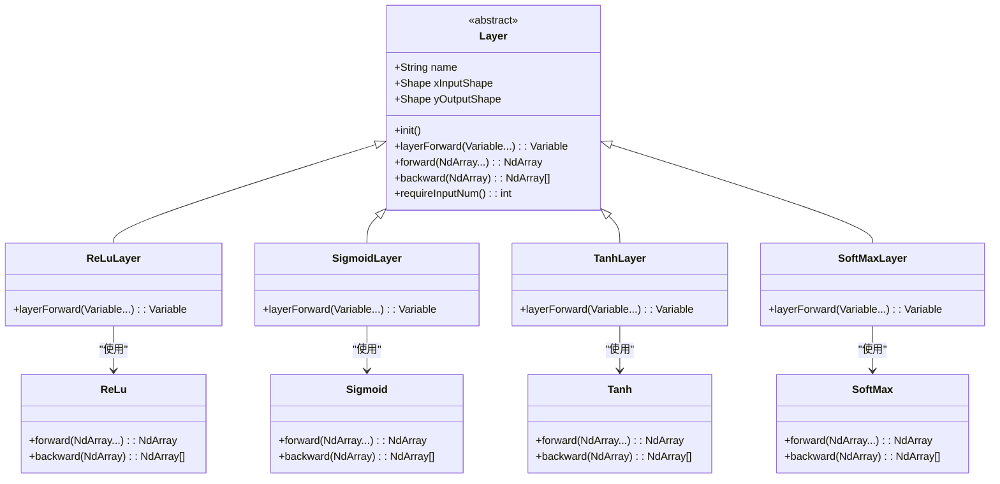
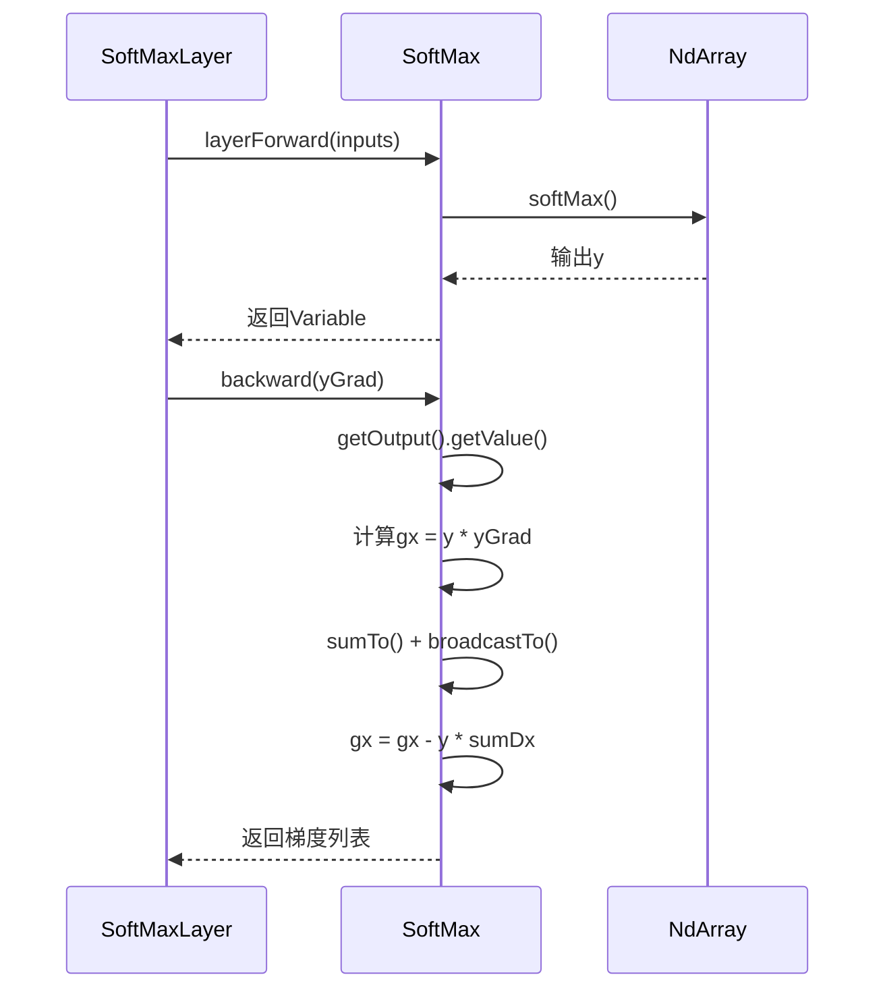

# 激活函数层

<cite>
**本文档引用的文件**  
- [ReLuLayer.java](file://src/main/java/io/leavesfly/tinydl/nnet/layer/activate/ReLuLayer.java)
- [SigmoidLayer.java](file://src/main/java/io/leavesfly/tinydl/nnet/layer/activate/SigmoidLayer.java)
- [TanhLayer.java](file://src/main/java/io/leavesfly/tinydl/nnet/layer/activate/TanhLayer.java)
- [SoftMaxLayer.java](file://src/main/java/io/leavesfly/tinydl/nnet/layer/activate/SoftMaxLayer.java)
- [ReLu.java](file://src/main/java/io/leavesfly/tinydl/func/math/ReLu.java)
- [Sigmoid.java](file://src/main/java/io/leavesfly/tinydl/func/math/Sigmoid.java)
- [Tanh.java](file://src/main/java/io/leavesfly/tinydl/func/math/Tanh.java)
- [SoftMax.java](file://src/main/java/io/leavesfly/tinydl/func/matrix/SoftMax.java)
- [NdArray.java](file://src/main/java/io/leavesfly/tinydl/ndarr/NdArray.java)
- [SoftmaxCE.java](file://src/main/java/io/leavesfly/tinydl/func/loss/SoftmaxCE.java)
- [SoftmaxCrossEntropy.java](file://src/main/java/io/leavesfly/tinydl/mlearning/loss/SoftmaxCrossEntropy.java)
</cite>

## 目录
1. [引言](#引言)
2. [激活函数层概览](#激活函数层概览)
3. [ReLU激活函数层](#relu激活函数层)
4. [Sigmoid激活函数层](#sigmoid激活函数层)
5. [Tanh激活函数层](#tanh激活函数层)
6. [SoftMax激活函数层](#softmax激活函数层)
7. [梯度特性与训练影响分析](#梯度特性与训练影响分析)
8. [SoftMax与交叉熵损失的结合使用](#softmax与交叉熵损失的结合使用)
9. [激活函数选择设计指导原则](#激活函数选择设计指导原则)
10. [结论](#结论)

## 引言

在深度神经网络中，激活函数层是打破线性模型局限性的关键组件。通过引入非线性变换，激活函数使得神经网络能够拟合复杂的函数映射关系，从而具备强大的表达能力。本文深入解析TinyDL框架中常见的激活函数层实现，包括ReLuLayer、SigmoidLayer、TanhLayer和SoftMaxLayer，阐述其数学定义、前向与反向传播机制，并分析其对训练过程的影响。

## 激活函数层概览

激活函数层位于神经网络的非线性变换核心，其主要职责是在前向传播中对输入张量进行逐元素（element-wise）的非线性函数计算，并在反向传播中计算对应的梯度以支持参数更新。所有激活函数层均继承自`Layer`基类，通过调用`func.math`或`func.matrix`包中的底层函数实现具体数学运算。

**图示来源**  
- [ReLuLayer.java](file://src/main/java/io/leavesfly/tinydl/nnet/layer/activate/ReLuLayer.java#L1-L51)
- [SigmoidLayer.java](file://src/main/java/io/leavesfly/tinydl/nnet/layer/activate/SigmoidLayer.java#L1-L42)
- [TanhLayer.java](file://src/main/java/io/leavesfly/tinydl/nnet/layer/activate/TanhLayer.java#L1-L42)
- [SoftMaxLayer.java](file://src/main/java/io/leavesfly/tinydl/nnet/layer/activate/SoftMaxLayer.java#L1-L45)
- [ReLu.java](file://src/main/java/io/leavesfly/tinydl/func/math/ReLu.java#L1-L24)
- [Sigmoid.java](file://src/main/java/io/leavesfly/tinydl/func/math/Sigmoid.java#L1-L25)
- [Tanh.java](file://src/main/java/io/leavesfly/tinydl/func/math/Tanh.java#L1-L29)
- [SoftMax.java](file://src/main/java/io/leavesfly/tinydl/func/matrix/SoftMax.java#L1-L30)

**本节来源**  
- [ReLuLayer.java](file://src/main/java/io/leavesfly/tinydl/nnet/layer/activate/ReLuLayer.java#L1-L51)
- [SigmoidLayer.java](file://src/main/java/io/leavesfly/tinydl/nnet/layer/activate/SigmoidLayer.java#L1-L42)
- [TanhLayer.java](file://src/main/java/io/leavesfly/tinydl/nnet/layer/activate/TanhLayer.java#L1-L42)
- [SoftMaxLayer.java](file://src/main/java/io/leavesfly/tinydl/nnet/layer/activate/SoftMaxLayer.java#L1-L45)

## ReLU激活函数层

ReLU（Rectified Linear Unit）激活函数的数学定义为：f(x) = max(0, x)。该函数在正区间线性增长，负区间输出为零，具有计算简单、缓解梯度消失的优点。

在`ReLuLayer`中，前向传播通过调用`ReLu`函数的`forward`方法实现，利用`NdArray.maximum(0f)`完成逐元素比较。反向传播中，梯度仅在输入大于零时通过（梯度门控），否则为零，实现为`inputs[0].getValue().mask(0).mul(yGrad)`。

**本节来源**  
- [ReLuLayer.java](file://src/main/java/io/leavesfly/tinydl/nnet/layer/activate/ReLuLayer.java#L1-L51)
- [ReLu.java](file://src/main/java/io/leavesfly/tinydl/func/math/ReLu.java#L1-L24)

## Sigmoid激活函数层

Sigmoid函数的数学定义为：f(x) = 1 / (1 + exp(-x))。其输出范围为(0,1)，常用于二分类问题的输出层。

`SigmoidLayer`通过`Sigmoid`类的`sigmoid()`方法实现前向计算。其反向传播导数为f'(x) = f(x)(1 - f(x))，在代码中通过`y.mul(NdArray.ones(...).sub(y))`实现，其中`y`为前向输出值。需注意其在输入绝对值较大时进入饱和区，导致梯度接近零，引发梯度消失问题。

**本节来源**  
- [SigmoidLayer.java](file://src/main/java/io/leavesfly/tinydl/nnet/layer/activate/SigmoidLayer.java#L1-L42)
- [Sigmoid.java](file://src/main/java/io/leavesfly/tinydl/func/math/Sigmoid.java#L1-L25)

## Tanh激活函数层

Tanh函数的数学定义为：f(x) = (exp(x) - exp(-x)) / (exp(x) + exp(-x))。其输出范围为(-1,1)，是零中心化的Sigmoid函数变体。

`TanhLayer`调用`NdArray.tanh()`完成前向传播。其导数为f'(x) = 1 - f(x)^2，在反向传播中通过`NdArray.ones(...).sub(outputValue.square())`计算。与Sigmoid类似，Tanh在输入绝对值大时也存在饱和区，但因其零中心化特性，通常比Sigmoid更利于训练。

**本节来源**  
- [TanhLayer.java](file://src/main/java/io/leavesfly/tinydl/nnet/layer/activate/TanhLayer.java#L1-L42)
- [Tanh.java](file://src/main/java/io/leavesfly/tinydl/func/math/Tanh.java#L1-L29)

## SoftMax激活函数层

SoftMax函数用于多分类问题的输出层，将K维向量转换为概率分布：f(x_i) = exp(x_i) / Σ(exp(x_j))。

`SoftMaxLayer`通过`SoftMax`类的`softMax()`方法实现前向传播。其反向传播较为复杂，涉及雅可比矩阵计算。代码中通过`y.mul(yGrad).sub(y.mul(sumDx))`实现，其中`sumDx`为梯度在类别维度上的求和并广播，确保梯度归一化。

**图示来源**  
- [SoftMaxLayer.java](file://src/main/java/io/leavesfly/tinydl/nnet/layer/activate/SoftMaxLayer.java#L1-L45)
- [SoftMax.java](file://src/main/java/io/leavesfly/tinydl/func/matrix/SoftMax.java#L1-L30)

**本节来源**  
- [SoftMaxLayer.java](file://src/main/java/io/leavesfly/tinydl/nnet/layer/activate/SoftMaxLayer.java#L1-L45)
- [SoftMax.java](file://src/main/java/io/leavesfly/tinydl/func/matrix/SoftMax.java#L1-L30)

## 梯度特性与训练影响分析

不同激活函数的梯度特性对训练过程有显著影响：

- **ReLU**：在正区间梯度恒为1，有效缓解梯度消失，但存在“死亡ReLU”问题（负梯度为零）。
- **Sigmoid**：梯度最大值为0.25，且在|x|>2时迅速衰减至接近零，易导致深层网络梯度消失。
- **Tanh**：梯度最大值为1，优于Sigmoid，但仍存在饱和区问题。
- **SoftMax**：梯度计算涉及全局归一化，对数值稳定性要求高，通常与交叉熵损失结合以简化梯度计算。

**本节来源**  
- [ReLu.java](file://src/main/java/io/leavesfly/tinydl/func/math/ReLu.java#L1-L24)
- [Sigmoid.java](file://src/main/java/io/leavesfly/tinydl/func/math/Sigmoid.java#L1-L25)
- [Tanh.java](file://src/main/java/io/leavesfly/tinydl/func/math/Tanh.java#L1-L29)
- [SoftMax.java](file://src/main/java/io/leavesfly/tinydl/func/matrix/SoftMax.java#L1-L30)

## SoftMax与交叉熵损失的结合使用

在分类任务中，`SoftMaxLayer`通常与交叉熵损失函数（如`SoftmaxCE`或`SoftmaxCrossEntropy`）结合使用。这种组合的优势在于：

1. **数值稳定性**：SoftMax的指数运算与交叉熵的对数运算可合并，避免溢出。
2. **梯度简化**：联合计算的梯度简化为预测概率与真实标签的差值，即 y_pred - y_true，极大简化反向传播。
3. **高效训练**：简化后的梯度直接用于参数更新，提升训练效率。

典型使用模式见于`MnistMlpExam.java`和`SpiralMlpExam.java`等分类示例中。

**本节来源**  
- [SoftMax.java](file://src/main/java/io/leavesfly/tinydl/func/matrix/SoftMax.java#L1-L30)
- [SoftmaxCE.java](file://src/main/java/io/leavesfly/tinydl/func/loss/SoftmaxCE.java#L1-L20)
- [SoftmaxCrossEntropy.java](file://src/main/java/io/leavesfly/tinydl/mlearning/loss/SoftmaxCrossEntropy.java#L1-L25)
- [MnistMlpExam.java](file://src/main/java/io/leavesfly/tinydl/example/classify/MnistMlpExam.java#L1-L100)
- [SpiralMlpExam.java](file://src/main/java/io/leavesfly/tinydl/example/classify/SpiralMlpExam.java#L1-L80)

## 激活函数选择设计指导原则

选择激活函数应遵循以下原则：

1. **隐藏层**：优先使用ReLU或其变体（如Leaky ReLU），因其计算高效且缓解梯度消失。
2. **输出层**：
   - 二分类：Sigmoid
   - 多分类：SoftMax
   - 回归：线性或无激活
3. **避免Sigmoid/Tanh**：在深层网络中尽量避免使用Sigmoid和Tanh，以防梯度消失。
4. **数值稳定性**：对于SoftMax，注意输入值的范围，必要时进行裁剪（Clip）或使用Log-Sum-Exp技巧。

**本节来源**  
- [ReLuLayer.java](file://src/main/java/io/leavesfly/tinydl/nnet/layer/activate/ReLuLayer.java#L1-L51)
- [SigmoidLayer.java](file://src/main/java/io/leavesfly/tinydl/nnet/layer/activate/SigmoidLayer.java#L1-L42)
- [TanhLayer.java](file://src/main/java/io/leavesfly/tinydl/nnet/layer/activate/TanhLayer.java#L1-L42)
- [SoftMaxLayer.java](file://src/main/java/io/leavesfly/tinydl/nnet/layer/activate/SoftMaxLayer.java#L1-L45)

## 结论

激活函数层是神经网络非线性建模能力的核心。本文详细解析了TinyDL中ReLU、Sigmoid、Tanh和SoftMax激活函数层的实现机制，分析了其数学定义、前向反向传播过程及梯度特性。合理选择激活函数对模型训练的稳定性和效率至关重要，推荐在隐藏层使用ReLU，在分类输出层使用SoftMax，并与交叉熵损失结合以获得最佳性能。