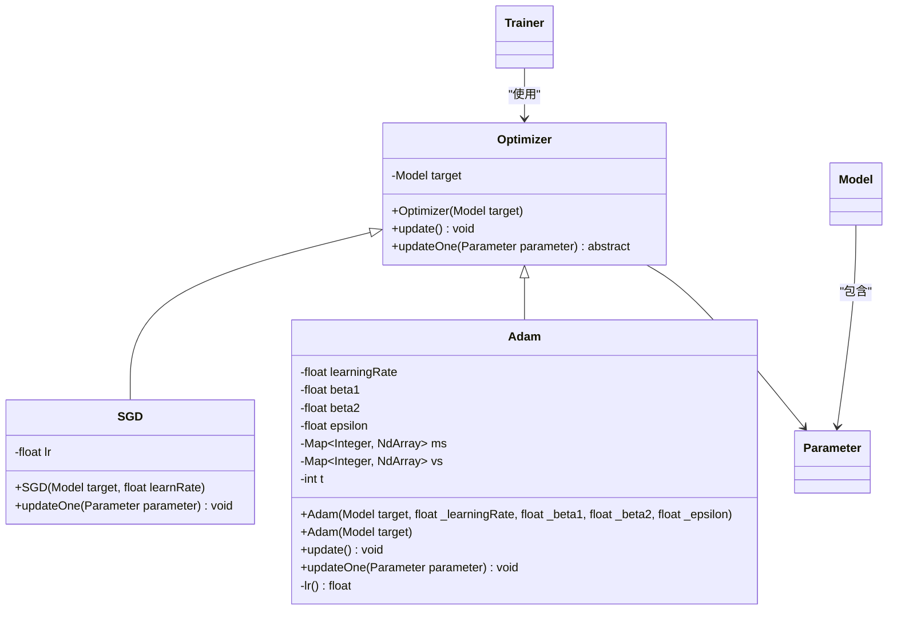
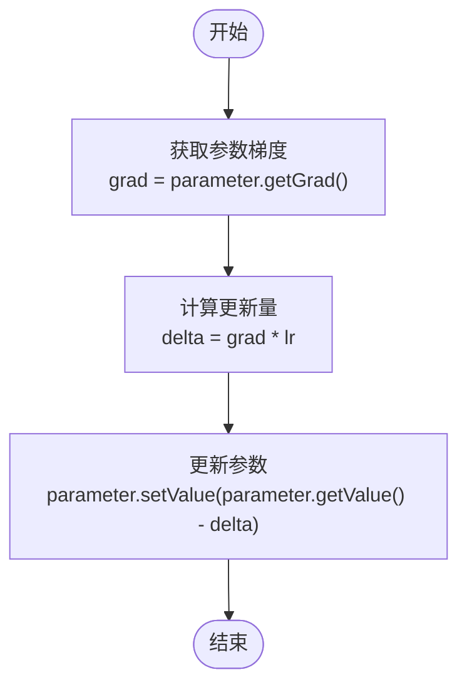
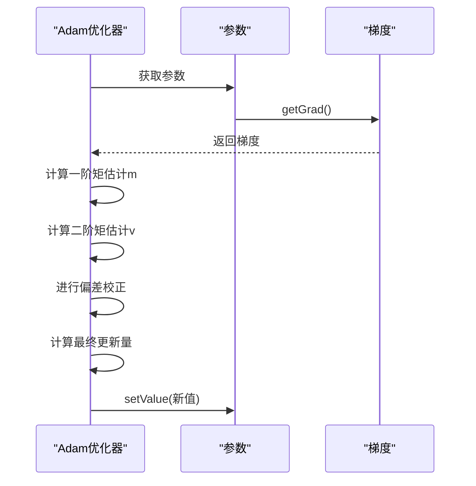
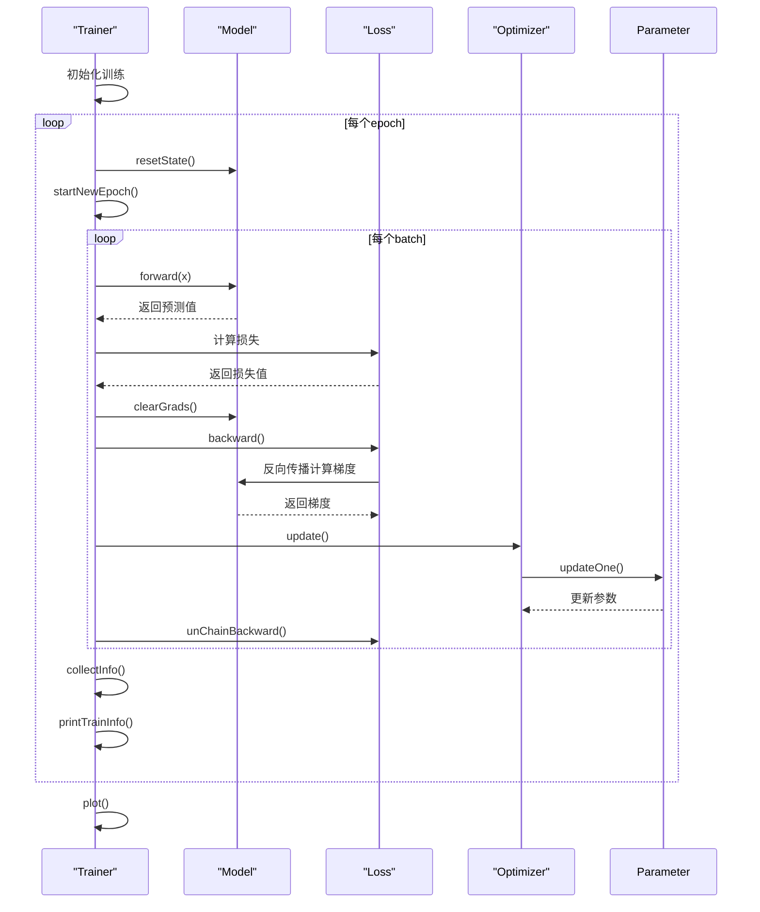
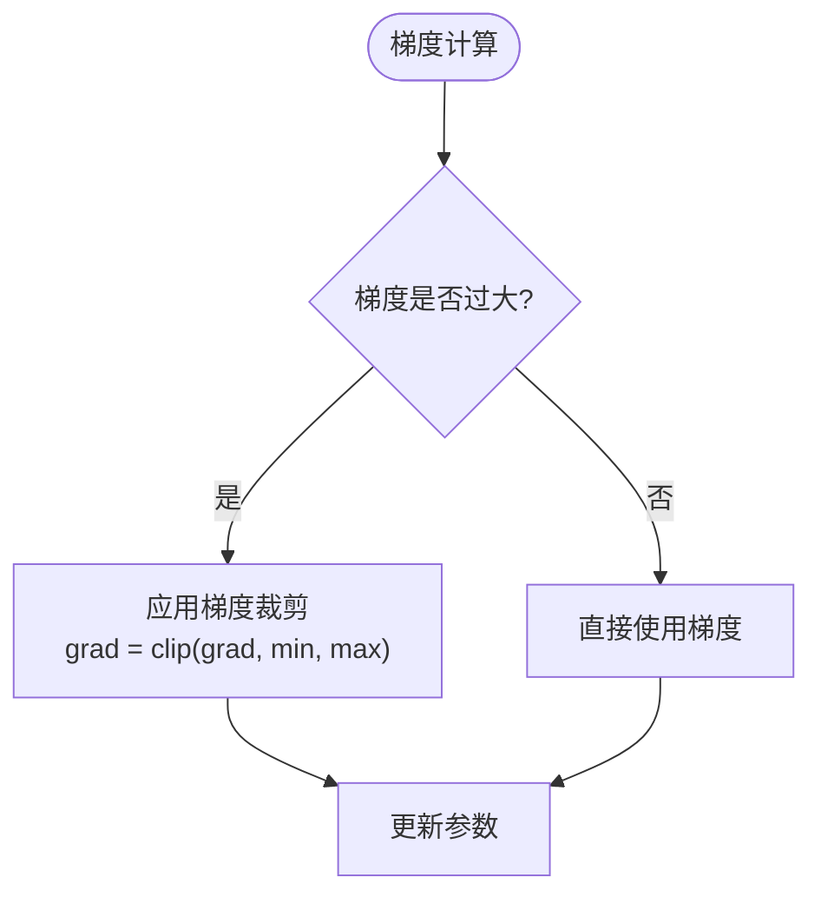

# 优化器

<cite>
**Referenced Files in This Document**   
- [Optimizer.java](file://src/main/java/io/leavesfly/tinydl/mlearning/optimize/Optimizer.java)
- [SGD.java](file://src/main/java/io/leavesfly/tinydl/mlearning/optimize/SGD.java)
- [Adam.java](file://src/main/java/io/leavesfly/tinydl/mlearning/optimize/Adam.java)
- [Parameter.java](file://src/main/java/io/leavesfly/tinydl/nnet/Parameter.java)
- [Trainer.java](file://src/main/java/io/leavesfly/tinydl/mlearning/Trainer.java)
- [Clip.java](file://src/main/java/io/leavesfly/tinydl/func/math/Clip.java)
</cite>

## 目录
1. [引言](#引言)
2. [优化器架构设计](#优化器架构设计)
3. [SGD优化算法](#sgd优化算法)
4. [Adam优化算法](#adam优化算法)
5. [超参数调优指南](#超参数调优指南)
6. [优化器与训练器的协作流程](#优化器与训练器的协作流程)
7. [常见问题与解决方案](#常见问题与解决方案)
8. [未来扩展方向](#未来扩展方向)

## 引言
本文档全面分析TinyDL框架中的优化器模块，深入探讨优化器的架构设计、核心算法实现及在训练过程中的应用。文档重点解析了SGD和Adam两种主流优化算法的实现机制，阐述了学习率、权重衰减等超参数对模型收敛的影响，并提供了调参建议。同时，文档还介绍了优化器与训练器的协作流程，以及处理梯度爆炸等常见问题的解决方案。

## 优化器架构设计

优化器模块采用抽象基类`Optimizer`的设计模式，为所有优化算法提供统一的接口和基础功能。`Optimizer`类的核心职责是管理模型参数的更新过程。

**Diagram sources**
- [Optimizer.java](file://src/main/java/io/leavesfly/tinydl/mlearning/optimize/Optimizer.java#L1-L27)
- [SGD.java](file://src/main/java/io/leavesfly/tinydl/mlearning/optimize/SGD.java#L1-L22)
- [Adam.java](file://src/main/java/io/leavesfly/tinydl/mlearning/optimize/Adam.java#L1-L70)

**Section sources**
- [Optimizer.java](file://src/main/java/io/leavesfly/tinydl/mlearning/optimize/Optimizer.java#L1-L27)

`Optimizer`基类定义了`update()`和`updateOne()`两个核心方法。`update()`方法负责遍历模型的所有参数，并调用`updateOne()`方法对每个参数进行更新。`updateOne()`方法是一个抽象方法，由具体的优化算法（如SGD、Adam）来实现。

## SGD优化算法

SGD（随机梯度下降）是最基础的优化算法，其核心思想是沿着损失函数梯度的反方向更新参数。

**Diagram sources**
- [SGD.java](file://src/main/java/io/leavesfly/tinydl/mlearning/optimize/SGD.java#L1-L22)

**Section sources**
- [SGD.java](file://src/main/java/io/leavesfly/tinydl/mlearning/optimize/SGD.java#L1-L22)

SGD算法的实现非常简洁，其`updateOne()`方法直接使用学习率`lr`乘以梯度，然后从当前参数值中减去这个更新量。尽管SGD算法简单，但在某些情况下可能会遇到收敛速度慢或陷入局部最优的问题。

## Adam优化算法

Adam（Adaptive Moment Estimation）是一种自适应学习率优化算法，结合了动量（Momentum）和RMSProp的优点。

**Diagram sources**
- [Adam.java](file://src/main/java/io/leavesfly/tinydl/mlearning/optimize/Adam.java#L1-L70)

**Section sources**
- [Adam.java](file://src/main/java/io/leavesfly/tinydl/mlearning/optimize/Adam.java#L1-L70)

Adam算法维护了两个状态变量：一阶矩估计`m`和二阶矩估计`v`。在每次更新时，算法首先更新这两个状态变量，然后进行偏差校正，最后使用校正后的值来计算参数更新量。这种机制使得Adam算法能够自适应地调整每个参数的学习率，从而在大多数情况下都能获得较好的收敛效果。

## 超参数调优指南

优化算法的性能很大程度上取决于超参数的选择。以下是主要超参数的调优建议：

| 超参数 | 算法 | 推荐值 | 影响 |
| --- | --- | --- | --- |
| 学习率 (learning rate) | SGD, Adam | 0.001 - 0.1 | 过大会导致震荡，过小会导致收敛慢 |
| 动量 (momentum) | SGD | 0.9 | 增加动量可以加速收敛，但可能越过最优解 |
| beta1 | Adam | 0.9 | 控制一阶矩估计的衰减率 |
| beta2 | Adam | 0.999 | 控制二阶矩估计的衰减率 |
| epsilon | Adam | 1e-8 | 防止除零错误，数值稳定性 |

**Section sources**
- [SGD.java](file://src/main/java/io/leavesfly/tinydl/mlearning/optimize/SGD.java#L1-L22)
- [Adam.java](file://src/main/java/io/leavesfly/tinydl/mlearning/optimize/Adam.java#L1-L70)

## 优化器与训练器的协作流程

优化器与训练器通过`Trainer`类紧密协作，完成整个训练过程。

**Diagram sources**
- [Trainer.java](file://src/main/java/io/leavesfly/tinydl/mlearning/Trainer.java#L1-L106)
- [Optimizer.java](file://src/main/java/io/leavesfly/tinydl/mlearning/optimize/Optimizer.java#L1-L27)

**Section sources**
- [Trainer.java](file://src/main/java/io/leavesfly/tinydl/mlearning/Trainer.java#L1-L106)

在训练过程中，`Trainer`负责协调数据加载、前向传播、损失计算、反向传播和参数更新等步骤。当损失值完成反向传播后，`Trainer`调用`Optimizer`的`update()`方法，触发参数更新过程。

## 常见问题与解决方案

在实际训练过程中，可能会遇到一些常见问题，如梯度爆炸。框架提供了相应的解决方案。

**Diagram sources**
- [Clip.java](file://src/main/java/io/leavesfly/tinydl/func/math/Clip.java#L1-L39)

**Section sources**
- [Clip.java](file://src/main/java/io/leavesfly/tinydl/func/math/Clip.java#L1-L39)

梯度裁剪是一种有效的防止梯度爆炸的技术。当梯度的绝对值超过预设阈值时，将其裁剪到该阈值范围内。这可以通过`Clip`函数来实现，确保梯度值在合理范围内，从而稳定训练过程。

## 未来扩展方向

为了进一步提升训练效果，可以考虑以下扩展方向：

1. **学习率调度器**：实现动态调整学习率的机制，如学习率衰减、余弦退火等。
2. **权重衰减**：在参数更新时加入L2正则化项，防止过拟合。
3. **梯度累积**：在内存受限的情况下，通过累积多个batch的梯度来模拟更大的batch size。
4. **混合精度训练**：使用半精度浮点数进行计算，以减少内存占用并加速训练。

这些扩展方向可以进一步提升模型的训练效率和最终性能。