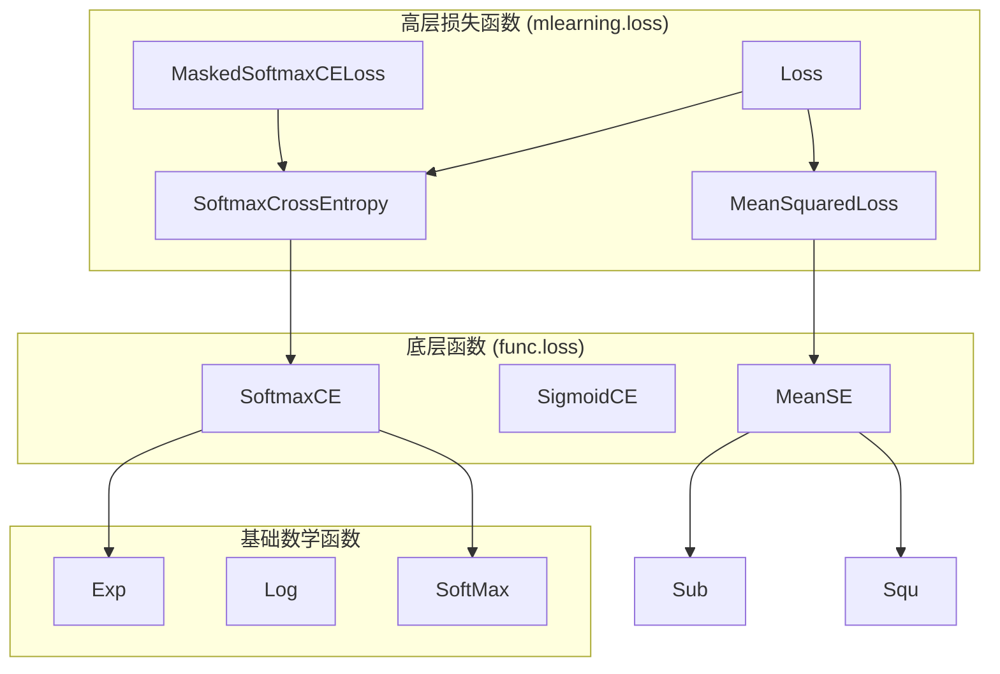
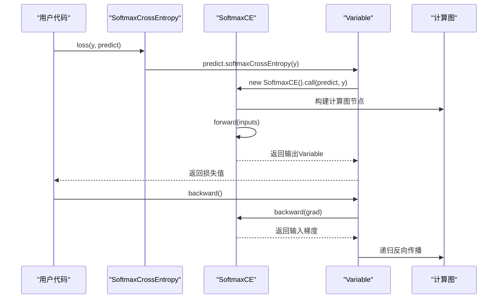
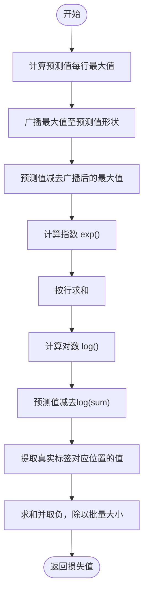
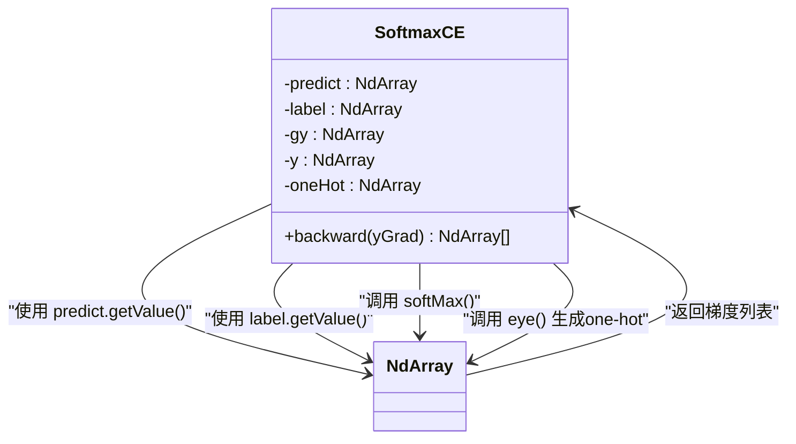
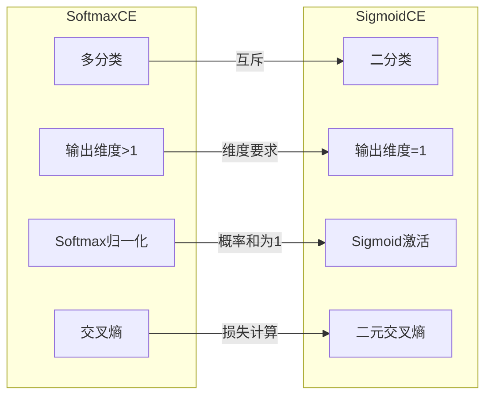
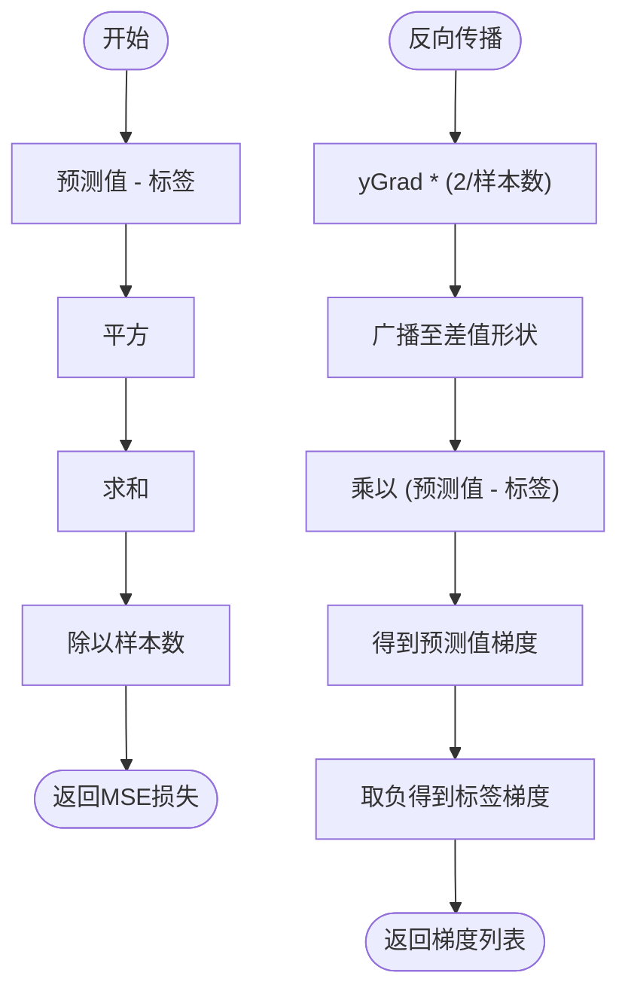
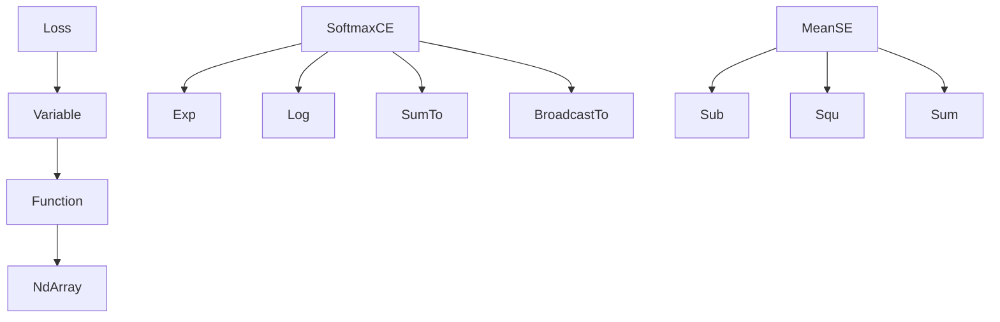

# 损失函数

<cite>
**本文档中引用的文件**  
- [Loss.java](file://src/main/java/io/leavesfly/tinydl/mlearning/loss/Loss.java)
- [SoftmaxCrossEntropy.java](file://src/main/java/io/leavesfly/tinydl/mlearning/loss/SoftmaxCrossEntropy.java)
- [MeanSquaredLoss.java](file://src/main/java/io/leavesfly/tinydl/mlearning/loss/MeanSquaredLoss.java)
- [MaskedSoftmaxCELoss.java](file://src/main/java/io/leavesfly/tinydl/mlearning/loss/MaskedSoftmaxCELoss.java)
- [SoftmaxCE.java](file://src/main/java/io/leavesfly/tinydl/func/loss/SoftmaxCE.java)
- [SigmoidCE.java](file://src/main/java/io/leavesfly/tinydl/func/loss/SigmoidCE.java)
- [MeanSE.java](file://src/main/java/io/leavesfly/tinydl/func/loss/MeanSE.java)
- [Variable.java](file://src/main/java/io/leavesfly/tinydl/func/Variable.java)
- [Function.java](file://src/main/java/io/leavesfly/tinydl/func/Function.java)
- [NdArray.java](file://src/main/java/io/leavesfly/tinydl/ndarr/NdArray.java)
- [SoftMax.java](file://src/main/java/io/leavesfly/tinydl/func/matrix/SoftMax.java)
- [Exp.java](file://src/main/java/io/leavesfly/tinydl/func/math/Exp.java)
</cite>

## 目录
1. [引言](#引言)
2. [项目结构](#项目结构)
3. [核心组件](#核心组件)
4. [架构概述](#架构概述)
5. [详细组件分析](#详细组件分析)
6. [依赖分析](#依赖分析)
7. [性能考虑](#性能考虑)
8. [故障排除指南](#故障排除指南)
9. [结论](#结论)

## 引言
本文档深入解析TinyDL框架中损失函数的设计与实现，重点分析抽象基类`Loss`的架构角色，以及各类具体损失函数在分类与回归任务中的数学原理与反向传播机制。文档涵盖`SoftmaxCrossEntropy`、`SigmoidCE`、`MeanSquaredLoss`及`MaskedSoftmaxCELoss`等核心组件，并结合底层函数（如`SoftmaxCE`、`MeanSE`）说明高层损失函数如何构建可微计算图。同时提供自定义损失函数的扩展方法与常见错误的调试策略。

## 项目结构
损失函数模块在项目中分为两层：高层抽象位于`mlearning/loss`包，实现具体计算逻辑的底层函数位于`func/loss`包。高层组件通过组合`func`模块中的基础函数（如`SoftmaxCE`、`MeanSE`）来构建完整的损失计算流程。

**Diagram sources**
- [Loss.java](file://src/main/java/io/leavesfly/tinydl/mlearning/loss/Loss.java)
- [SoftmaxCrossEntropy.java](file://src/main/java/io/leavesfly/tinydl/mlearning/loss/SoftmaxCrossEntropy.java)
- [MeanSquaredLoss.java](file://src/main/java/io/leavesfly/tinydl/mlearning/loss/MeanSquaredLoss.java)
- [SoftmaxCE.java](file://src/main/java/io/leavesfly/tinydl/func/loss/SoftmaxCE.java)
- [MeanSE.java](file://src/main/java/io/leavesfly/tinydl/func/loss/MeanSE.java)
- [Exp.java](file://src/main/java/io/leavesfly/tinydl/func/math/Exp.java)
- [SoftMax.java](file://src/main/java/io/leavesfly/tinydl/func/matrix/SoftMax.java)

**Section sources**
- [Loss.java](file://src/main/java/io/leavesfly/tinydl/mlearning/loss/Loss.java)
- [SoftmaxCrossEntropy.java](file://src/main/java/io/leavesfly/tinydl/mlearning/loss/SoftmaxCrossEntropy.java)
- [MeanSquaredLoss.java](file://src/main/java/io/leavesfly/tinydl/mlearning/loss/MeanSquaredLoss.java)
- [SoftmaxCE.java](file://src/main/java/io/leavesfly/tinydl/func/loss/SoftmaxCE.java)
- [MeanSE.java](file://src/main/java/io/leavesfly/tinydl/func/loss/MeanSE.java)

## 核心组件
`Loss`抽象类定义了所有损失函数的统一接口，要求子类实现`loss(Variable y, Variable predict)`方法。`SoftmaxCrossEntropy`和`MeanSquaredLoss`分别封装了分类与回归任务的损失计算，通过调用`Variable`的`softmaxCrossEntropy`和`meanSquaredError`方法，间接使用底层`SoftmaxCE`和`MeanSE`函数。

**Section sources**
- [Loss.java](file://src/main/java/io/leavesfly/tinydl/mlearning/loss/Loss.java#L1-L11)
- [SoftmaxCrossEntropy.java](file://src/main/java/io/leavesfly/tinydl/mlearning/loss/SoftmaxCrossEntropy.java#L1-L12)
- [MeanSquaredLoss.java](file://src/main/java/io/leavesfly/tinydl/mlearning/loss/MeanSquaredLoss.java#L1-L15)
- [Variable.java](file://src/main/java/io/leavesfly/tinydl/func/Variable.java#L300-L338)

## 架构概述
损失函数的计算基于可微计算图，`Variable`对象记录其创建函数（`creator`），从而在反向传播时通过`backward()`方法递归计算梯度。`Function`基类的`call`方法负责构建计算图，`forward`执行前向计算，`backward`实现梯度回传。

**Diagram sources**
- [SoftmaxCrossEntropy.java](file://src/main/java/io/leavesfly/tinydl/mlearning/loss/SoftmaxCrossEntropy.java#L1-L12)
- [SoftmaxCE.java](file://src/main/java/io/leavesfly/tinydl/func/loss/SoftmaxCE.java#L1-L60)
- [Variable.java](file://src/main/java/io/leavesfly/tinydl/func/Variable.java#L100-L150)
- [Function.java](file://src/main/java/io/leavesfly/tinydl/func/Function.java#L1-L92)

## 详细组件分析

### SoftmaxCrossEntropy 分析
`SoftmaxCrossEntropy`用于多分类任务，其前向计算通过`SoftmaxCE`实现交叉熵损失，包含数值稳定化处理（减去最大值）。

#### 前向传播实现

**Diagram sources**
- [SoftmaxCE.java](file://src/main/java/io/leavesfly/tinydl/func/loss/SoftmaxCE.java#L15-L35)

#### 反向传播实现

**Diagram sources**
- [SoftmaxCE.java](file://src/main/java/io/leavesfly/tinydl/func/loss/SoftmaxCE.java#L37-L55)

**Section sources**
- [SoftmaxCE.java](file://src/main/java/io/leavesfly/tinydl/func/loss/SoftmaxCE.java#L1-L60)
- [SoftmaxCrossEntropy.java](file://src/main/java/io/leavesfly/tinydl/mlearning/loss/SoftmaxCrossEntropy.java#L1-L12)

### SigmoidCE 与 SoftmaxCE 对比
`SigmoidCE`专为二分类设计，要求预测值维度为1，内部使用sigmoid函数将输出压缩至(0,1)。与`SoftmaxCE`相比，`SigmoidCE`不进行归一化，而是直接计算二元交叉熵。

**Diagram sources**
- [SoftmaxCE.java](file://src/main/java/io/leavesfly/tinydl/func/loss/SoftmaxCE.java#L1-L60)
- [SigmoidCE.java](file://src/main/java/io/leavesfly/tinydl/func/loss/SigmoidCE.java#L1-L66)

**Section sources**
- [SigmoidCE.java](file://src/main/java/io/leavesfly/tinydl/func/loss/SigmoidCE.java#L1-L66)

### MeanSquaredLoss 分析
`MeanSquaredLoss`用于回归任务，计算预测值与标签的均方误差。

#### 梯度计算逻辑

**Diagram sources**
- [MeanSE.java](file://src/main/java/io/leavesfly/tinydl/func/loss/MeanSE.java#L1-L40)

**Section sources**
- [MeanSE.java](file://src/main/java/io/leavesfly/tinydl/func/loss/MeanSE.java#L1-L40)
- [MeanSquaredLoss.java](file://src/main/java/io/leavesfly/tinydl/mlearning/loss/MeanSquaredLoss.java#L1-L15)

### MaskedSoftmaxCELoss 分析
`MaskedSoftmaxCELoss`继承自`SoftmaxCrossEntropy`，用于序列模型中忽略填充（padding）位置的损失计算。当前实现为占位（todo），需在`loss`方法中添加掩码逻辑，将填充位置的损失置零。

**Section sources**
- [MaskedSoftmaxCELoss.java](file://src/main/java/io/leavesfly/tinydl/mlearning/loss/MaskedSoftmaxCELoss.java#L1-L13)

## 依赖分析
损失函数组件依赖于`NdArray`进行数值计算，`Function`基类构建计算图，`Variable`管理梯度。`SoftmaxCE`依赖`Exp`、`Log`、`SumTo`等函数实现稳定计算。

**Diagram sources**
- [Function.java](file://src/main/java/io/leavesfly/tinydl/func/Function.java#L1-L92)
- [NdArray.java](file://src/main/java/io/leavesfly/tinydl/ndarr/NdArray.java#L1-L799)
- [SoftmaxCE.java](file://src/main/java/io/leavesfly/tinydl/func/loss/SoftmaxCE.java#L1-L60)
- [MeanSE.java](file://src/main/java/io/leavesfly/tinydl/func/loss/MeanSE.java#L1-L40)

**Section sources**
- [Function.java](file://src/main/java/io/leavesfly/tinydl/func/Function.java#L1-L92)
- [NdArray.java](file://src/main/java/io/leavesfly/tinydl/ndarr/NdArray.java#L1-L799)

## 性能考虑
- **数值稳定性**：`SoftmaxCE`通过减去最大值避免指数溢出。
- **内存效率**：`NdArray`使用一维数组存储多维数据，减少内存碎片。
- **计算图优化**：仅在训练模式（`Config.train=true`）下构建计算图，节省推理时开销。

## 故障排除指南
### 常见错误与调试
- **数值溢出**：检查`SoftmaxCE`输入是否过大，确保进行了最大值减法。
- **维度不匹配**：确认预测值与标签的`Shape`一致，特别是`SigmoidCE`要求预测值列数为1。
- **梯度消失**：在深层网络中，使用`clip`函数限制梯度范围。

**Section sources**
- [SoftmaxCE.java](file://src/main/java/io/leavesfly/tinydl/func/loss/SoftmaxCE.java#L15-L35)
- [SigmoidCE.java](file://src/main/java/io/leavesfly/tinydl/func/loss/SigmoidCE.java#L1-L66)
- [NdArray.java](file://src/main/java/io/leavesfly/tinydl/ndarr/NdArray.java#L500-L550)

## 结论
TinyDL的损失函数设计采用分层架构，高层`Loss`抽象类提供统一接口，底层`func`函数实现具体计算。通过`Variable`和`Function`构建的可微计算图，实现了高效的前向与反向传播。开发者可继承`Loss`类并重写`loss`方法来扩展自定义损失函数，同时需注意数值稳定性和维度匹配等常见问题。