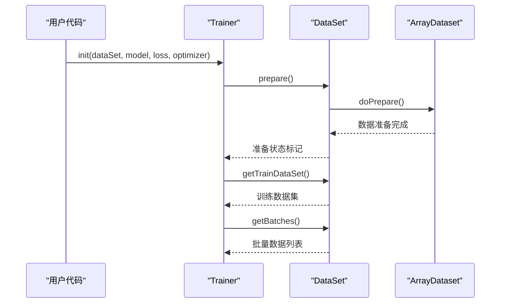
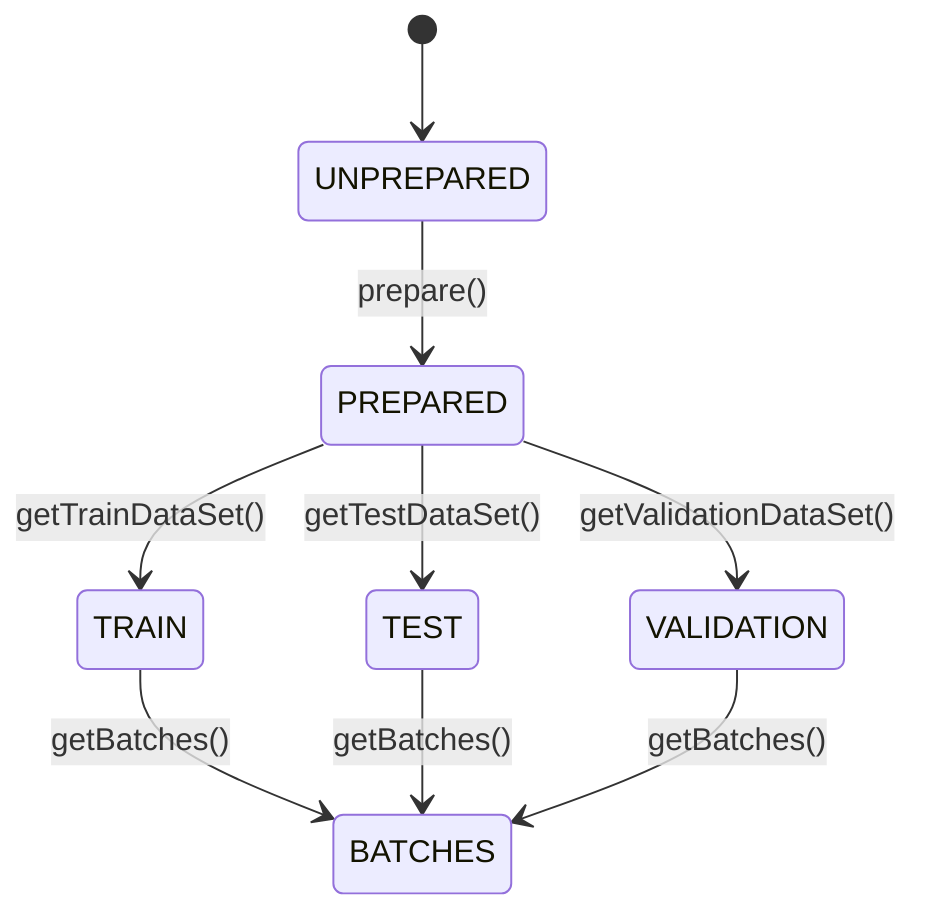
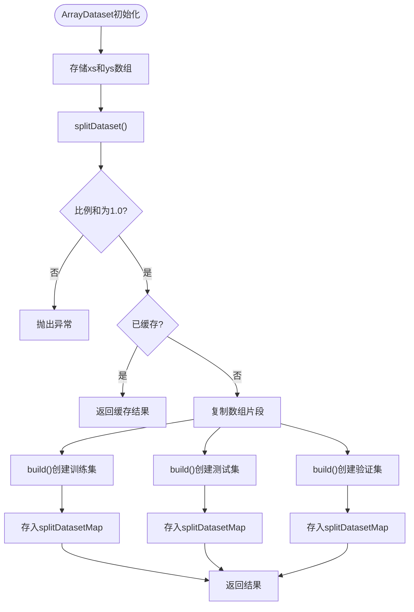
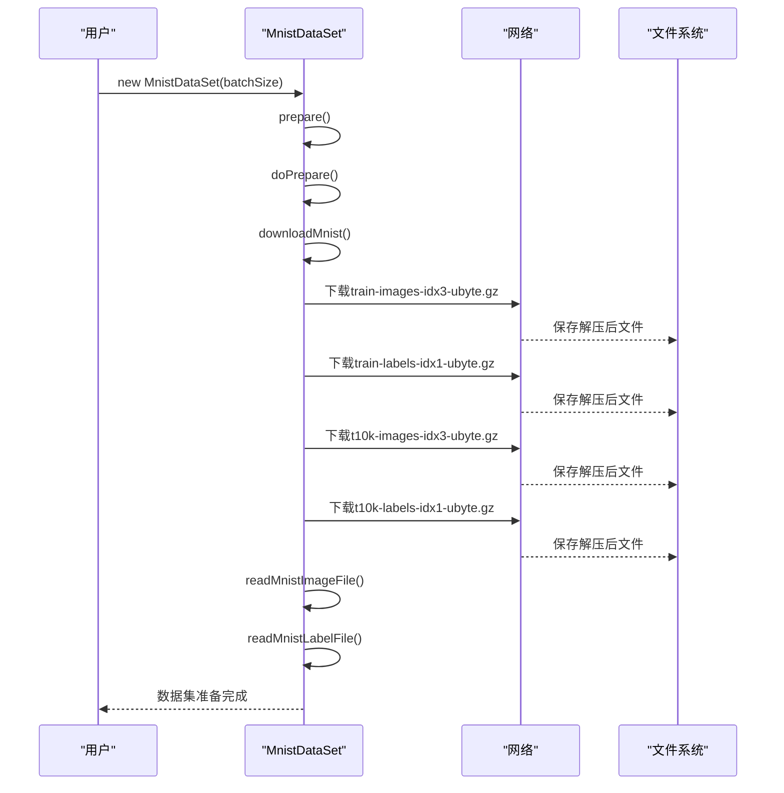
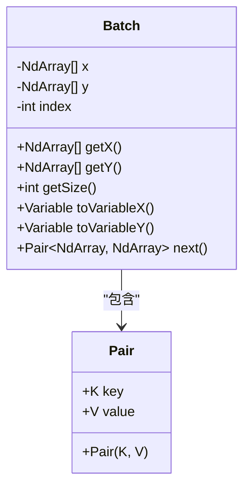
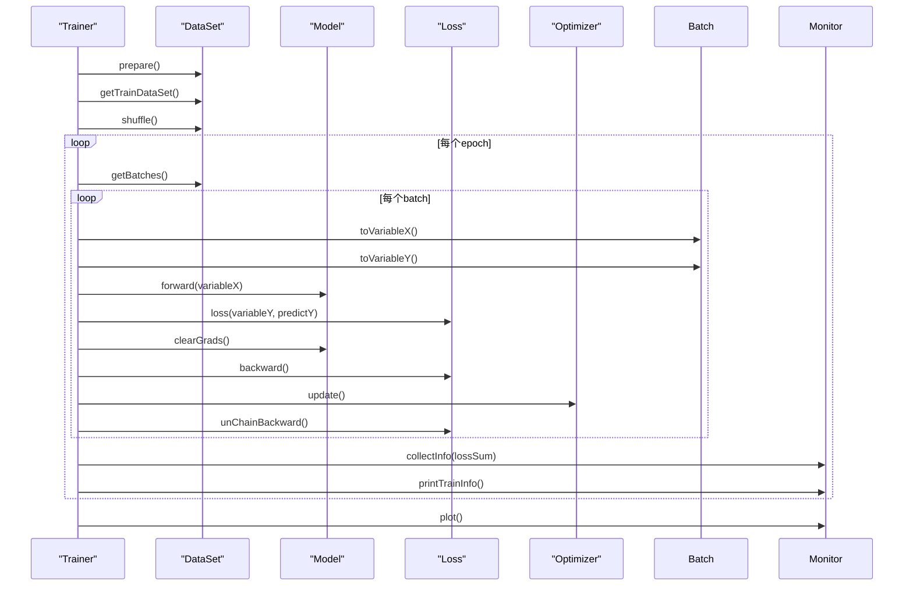

# 数据集处理

<cite>
**本文档引用的文件**  
- [DataSet.java](file://src/main/java/io/leavesfly/tinydl/mlearning/dataset/DataSet.java)
- [ArrayDataset.java](file://src/main/java/io/leavesfly/tinydl/mlearning/dataset/ArrayDataset.java)
- [Batch.java](file://src/main/java/io/leavesfly/tinydl/mlearning/dataset/Batch.java)
- [MnistDataSet.java](file://src/main/java/io/leavesfly/tinydl/mlearning/dataset/simple/MnistDataSet.java)
- [SpiralDateSet.java](file://src/main/java/io/leavesfly/tinydl/mlearning/dataset/simple/SpiralDateSet.java)
- [StreamDataset.java](file://src/main/java/io/leavesfly/tinydl/mlearning/dataset/StreamDataset.java)
- [Trainer.java](file://src/main/java/io/leavesfly/tinydl/mlearning/Trainer.java)
- [SinDataSet.java](file://src/main/java/io/leavesfly/tinydl/mlearning/dataset/simple/SinDataSet.java)
- [CosDataSet.java](file://src/main/java/io/leavesfly/tinydl/mlearning/dataset/simple/CosDataSet.java)
</cite>

## 目录
1. [引言](#引言)
2. [核心组件](#核心组件)
3. [数据集接口设计](#数据集接口设计)
4. [ArrayDataset实现机制](#arraydataset实现机制)
5. [具体数据集实现](#具体数据集实现)
6. [批量数据处理](#批量数据处理)
7. [数据集与训练器集成](#数据集与训练器集成)
8. [自定义数据集实现](#自定义数据集实现)
9. [常见问题与解决方案](#常见问题与解决方案)
10. [性能优化建议](#性能优化建议)

## 引言
本文档详细阐述了TinyDL框架中数据集处理系统的设计与实现。重点分析了DataSet接口的抽象原理、ArrayDataset通用容器的实现机制，以及MnistDataSet、SpiralDateSet等具体数据集的构建流程。文档还深入探讨了Batch类在训练循环中的作用，以及数据集与Trainer组件的集成关系，为开发者提供完整的数据处理指导。

## 核心组件

本节分析数据集处理系统的核心组件及其相互关系。

```mermaid
classDiagram
class DataSet {
+int batchSize
+Map~String, DataSet~ splitDatasetMap
+void prepare()
+abstract Batch[] getBatches()
+abstract void doPrepare()
+abstract void shuffle()
+abstract Map~String, DataSet~ splitDataset(float, float, float)
+abstract int getSize()
+enum Usage {TRAIN, TEST, VALIDATION}
}
class ArrayDataset {
+NdArray[] xs
+NdArray[] ys
+Batch[] getBatches()
+Map~String, DataSet~ splitDataset(float, float, float)
+void shuffle()
+abstract DataSet build(int, NdArray[], NdArray[])
+int getSize()
}
class StreamDataset {
+Batch[] getBatches()
+void doPrepare()
+void shuffle()
+Map~String, DataSet~ splitDataset(float, float, float)
+int getSize()
}
class Batch {
-NdArray[] x
-NdArray[] y
-int index
+NdArray[] getX()
+NdArray[] getY()
+int getSize()
+Variable toVariableX()
+Variable toVariableY()
+Pair~NdArray, NdArray~ next()
}
class MnistDataSet {
+void doPrepare()
+DataSet build(int, NdArray[], NdArray[])
+NdArray[] readMnistImageFile(String)
+NdArray[] readMnistLabelFile(String)
+void downloadMnist()
}
class SpiralDateSet {
+void doPrepare()
+DataSet build(int, NdArray[], NdArray[])
+static SpiralDateSet toSpiralDateSet(Variable, Variable)
}
class SinDataSet {
+void doPrepare()
+DataSet build(int, NdArray[], NdArray[])
}
class CosDataSet {
+void doPrepare()
+DataSet build(int, NdArray[], NdArray[])
}
DataSet <|-- ArrayDataset : "继承"
DataSet <|-- StreamDataset : "继承"
ArrayDataset <|-- MnistDataSet : "继承"
ArrayDataset <|-- SpiralDateSet : "继承"
ArrayDataset <|-- SinDataSet : "继承"
ArrayDataset <|-- CosDataSet : "继承"
```

**图示来源**
- [DataSet.java](file://src/main/java/io/leavesfly/tinydl/mlearning/dataset/DataSet.java#L1-L61)
- [ArrayDataset.java](file://src/main/java/io/leavesfly/tinydl/mlearning/dataset/ArrayDataset.java#L1-L116)
- [Batch.java](file://src/main/java/io/leavesfly/tinydl/mlearning/dataset/Batch.java#L1-L68)
- [MnistDataSet.java](file://src/main/java/io/leavesfly/tinydl/mlearning/dataset/simple/MnistDataSet.java#L1-L181)
- [SpiralDateSet.java](file://src/main/java/io/leavesfly/tinydl/mlearning/dataset/simple/SpiralDateSet.java#L1-L79)
- [StreamDataset.java](file://src/main/java/io/leavesfly/tinydl/mlearning/dataset/StreamDataset.java#L1-L37)

## 数据集接口设计

### DataSet抽象基类
DataSet类作为所有数据集实现的抽象基类，定义了机器学习数据集的核心接口。它通过抽象方法规范了数据加载、批处理、随机化和数据集划分等关键操作。



**图示来源**
- [DataSet.java](file://src/main/java/io/leavesfly/tinydl/mlearning/dataset/DataSet.java#L1-L61)
- [Trainer.java](file://src/main/java/io/leavesfly/tinydl/mlearning/Trainer.java#L1-L106)

### 核心方法解析
- **prepare()**: 模板方法，确保数据集只准备一次，调用抽象的doPrepare()进行实际准备
- **getBatches()**: 抽象方法，返回数据批次列表，由子类实现具体的批处理逻辑
- **shuffle()**: 抽象方法，用于随机打散数据顺序，防止训练偏差
- **splitDataset()**: 抽象方法，按比例将数据集划分为训练、测试和验证集
- **getSize()**: 抽象方法，返回数据集大小

**数据集使用状态枚举**


**图示来源**
- [DataSet.java](file://src/main/java/io/leavesfly/tinydl/mlearning/dataset/DataSet.java#L1-L61)

## ArrayDataset实现机制

### 内存数据集容器
ArrayDataset是DataSet的抽象实现，专为能全量装载到内存的数据集设计。它使用NdArray数组存储输入和输出数据，提供了通用的数据处理基础。



**图示来源**
- [ArrayDataset.java](file://src/main/java/io/leavesfly/tinydl/mlearning/dataset/ArrayDataset.java#L1-L116)

### 批处理逻辑
ArrayDataset的getBatches()方法实现了将数据数组按批次大小分组的逻辑。它将原始数据重新组织为二维数组结构，每行代表一个批次。

```java
[SPEC SYMBOL](file://src/main/java/io/leavesfly/tinydl/mlearning/dataset/ArrayDataset.java#L25-L45)
```

**批处理流程**
1. 计算完整批次数量（忽略不足一批的数据）
2. 创建二维数组存储批次数据
3. 按批次大小重新组织原始数据
4. 封装为Batch对象列表返回

### 数据随机化
shuffle()方法通过生成随机索引序列来重新排列数据，确保训练过程中的数据多样性。

```java
[SPEC SYMBOL](file://src/main/java/io/leavesfly/tinydl/mlearning/dataset/ArrayDataset.java#L82-L95)
```

**随机化步骤**
1. 生成0到数据大小的序列索引
2. 使用Collections.shuffle()随机打乱索引
3. 按随机索引重建xs和ys数组

**图示来源**
- [ArrayDataset.java](file://src/main/java/io/leavesfly/tinydl/mlearning/dataset/ArrayDataset.java#L82-L95)

## 具体数据集实现

### MnistDataSet实现
MnistDataSet继承ArrayDataset，专门处理MNIST手写数字数据集。它实现了自动下载、解压和解析MNIST数据文件的功能。



**图示来源**
- [MnistDataSet.java](file://src/main/java/io/leavesfly/tinydl/mlearning/dataset/simple/MnistDataSet.java#L1-L181)

### SpiralDateSet实现
SpiralDateSet生成螺旋形分布的数据点，常用于分类任务的演示。它在doPrepare()方法中生成具有三个类别的螺旋数据。

```java
[SPEC SYMBOL](file://src/main/java/io/leavesfly/tinydl/mlearning/dataset/simple/SpiralDateSet.java#L15-L37)
```

**数据生成算法**
- 每个类别生成100个数据点
- 使用极坐标公式生成螺旋形状
- 添加高斯噪声增加数据多样性
- 输入维度为2，输出为类别标签

### 回归数据集实现
SinDataSet和CosDataSet用于回归任务，生成正弦和余弦函数的数据点。

```mermaid
flowchart LR
SinDataSet[正弦数据集] --> |doPrepare()| GenerateSin["生成sin(x)数据"]
CosDataSet[余弦数据集] --> |doPrepare()| GenerateCos["生成cos(x)数据"]
GenerateSin --> StoreData["存储为NdArray数组"]
GenerateCos --> StoreData
StoreData --> BuildDataset["build()创建数据集"]
```

**图示来源**
- [SinDataSet.java](file://src/main/java/io/leavesfly/tinydl/mlearning/dataset/simple/SinDataSet.java#L1-L33)
- [CosDataSet.java](file://src/main/java/io/leavesfly/tinydl/mlearning/dataset/simple/CosDataSet.java#L1-L47)

## 批量数据处理

### Batch类设计
Batch类封装了一批数据，提供便捷的访问接口和转换功能，是训练循环中的基本数据单元。



**图示来源**
- [Batch.java](file://src/main/java/io/leavesfly/tinydl/mlearning/dataset/Batch.java#L1-L68)

### 批量数据转换
toVariableX()和toVariableY()方法将批次数据合并为Variable对象，便于模型训练。

```java
[SPEC SYMBOL](file://src/main/java/io/leavesfly/tinydl/mlearning/dataset/Batch.java#L50-L54)
```

**转换流程**
1. 使用NdArrayUtil.merge()沿指定轴合并数组
2. 创建Variable对象包装合并后的NdArray
3. 设置变量名称和梯度计算标志

### 迭代器模式
next()方法提供迭代器功能，允许逐个访问批次中的数据对。

```java
[SPEC SYMBOL](file://src/main/java/io/leavesfly/tinydl/mlearning/dataset/Batch.java#L56-L64)
```

## 数据集与训练器集成

### 训练流程集成
Trainer组件与DataSet紧密集成，形成完整的训练循环。



**图示来源**
- [Trainer.java](file://src/main/java/io/leavesfly/tinydl/mlearning/Trainer.java#L1-L106)

### 分类任务应用
在分类任务中，数据集提供标签数据用于计算分类准确率。

```java
[SPEC SYMBOL](file://src/main/java/io/leavesfly/tinydl/example/classify/SpiralMlpExam.java#L83-L110)
```

### 回归任务应用
在回归任务中，数据集提供连续值用于计算均方误差。

```java
[SPEC SYMBOL](file://src/main/java/io/leavesfly/tinydl/example/regress/MlpSinExam.java#L1-L50)
```

## 自定义数据集实现

### 继承ArrayDataset
创建自定义数据集的最佳实践是继承ArrayDataset，只需实现doPrepare()和build()方法。

```java
[SPEC SYMBOL](file://src/main/java/io/leavesfly/tinydl/mlearning/dataset/simple/SinDataSet.java#L1-L33)
```

**实现步骤**
1. 继承ArrayDataset类
2. 实现doPrepare()方法准备数据
3. 实现build()方法创建新实例
4. 调用prepare()触发数据准备

### prepare()方法使用
prepare()是模板方法，确保数据只准备一次。

```java
[SPEC SYMBOL](file://src/main/java/io/leavesfly/tinydl/mlearning/dataset/DataSet.java#L15-L19)
```

### shuffle()方法使用
shuffle()方法在训练前随机化数据顺序，防止模型学习到数据的顺序模式。

```java
[SPEC SYMBOL](file://src/main/java/io/leavesfly/tinydl/mlearning/dataset/ArrayDataset.java#L82-L95)
```

### getTrainDataSet()方法使用
getTrainDataSet()从splitDatasetMap中获取训练数据集，需先调用splitDataset()。

```java
[SPEC SYMBOL](file://src/main/java/io/leavesfly/tinydl/mlearning/dataset/DataSet.java#L45-L47)
```

## 常见问题与解决方案

### 数据形状不匹配
当输入数据形状与模型期望不匹配时，会导致训练失败。

**解决方案**
- 检查NdArray的Shape是否符合模型输入要求
- 使用reshape()方法调整数据形状
- 在数据预处理阶段统一数据格式

### 内存溢出
大型数据集可能导致内存不足。

**解决方案**
- 使用StreamDataset处理大文件
- 增加JVM堆内存
- 实现数据流式处理
- 使用数据生成器而非全量加载

### 数据准备失败
网络问题可能导致MnistDataSet下载失败。

**解决方案**
- 检查网络连接
- 手动下载并放置文件到指定目录
- 实现断点续传功能

## 性能优化建议

### 流式加载适用场景
StreamDataset适用于无法全量加载到内存的大型数据集。

```java
[SPEC SYMBOL](file://src/main/java/io/leavesfly/tinydl/mlearning/dataset/StreamDataset.java#L1-L37)
```

**适用场景**
- 大型图像数据集
- 视频数据流
- 实时传感器数据
- 数据库查询结果

### 批处理优化
合理设置批次大小可平衡内存使用和训练效率。

**建议**
- GPU训练时使用较大批次
- CPU训练时使用较小批次
- 根据内存容量调整批次大小
- 确保批次大小能整除数据集大小

### 数据预加载
对于频繁使用的数据集，可考虑预加载到内存。

**策略**
- 在应用启动时准备常用数据集
- 使用缓存机制避免重复准备
- 实现数据集池化管理

**图示来源**
- [StreamDataset.java](file://src/main/java/io/leavesfly/tinydl/mlearning/dataset/StreamDataset.java#L1-L37)