# 训练器

<cite>
**本文档中引用的文件**   
- [Trainer.java](file://src/main/java/io/leavesfly/tinydl/mlearning/Trainer.java)
- [Model.java](file://src/main/java/io/leavesfly/tinydl/mlearning/Model.java)
- [DataSet.java](file://src/main/java/io/leavesfly/tinydl/mlearning/dataset/DataSet.java)
- [Loss.java](file://src/main/java/io/leavesfly/tinydl/mlearning/loss/Loss.java)
- [Optimizer.java](file://src/main/java/io/leavesfly/tinydl/mlearning/optimize/Optimizer.java)
- [Evaluator.java](file://src/main/java/io/leavesfly/tinydl/mlearning/evaluator/Evaluator.java)
- [Monitor.java](file://src/main/java/io/leavesfly/tinydl/mlearning/Monitor.java)
- [MnistMlpExam.java](file://src/main/java/io/leavesfly/tinydl/example/classify/MnistMlpExam.java)
- [SpiralMlpExam.java](file://src/main/java/io/leavesfly/tinydl/example/classify/SpiralMlpExam.java)
- [RnnCosExam.java](file://src/main/java/io/leavesfly/tinydl/example/regress/RnnCosExam.java)
- [Variable.java](file://src/main/java/io/leavesfly/tinydl/func/Variable.java)
- [Block.java](file://src/main/java/io/leavesfly/tinydl/nnet/Block.java)
- [Parameter.java](file://src/main/java/io/leavesfly/tinydl/nnet/Parameter.java)
- [Plot.java](file://src/main/java/io/leavesfly/tinydl/utils/Plot.java)
</cite>

## 目录
1. [简介](#简介)
2. [项目结构](#项目结构)
3. [核心组件](#核心组件)
4. [架构概述](#架构概述)
5. [详细组件分析](#详细组件分析)
6. [依赖分析](#依赖分析)
7. [性能考量](#性能考量)
8. [故障排除指南](#故障排除指南)
9. [结论](#结论)

## 简介
本文档全面解析了`Trainer`类作为训练流程控制中枢的职责。详细描述了其内部组件依赖关系，包括如何协调`Model`、`DataSet`、`Loss`、`Optimizer`和`Evaluator`形成完整训练闭环。深入剖析了`train()`方法的执行流程，涵盖epoch循环、数据shuffle、`model.resetState()`状态管理、前向传播、损失计算、反向传播触发及`optimizer.update()`参数更新等关键步骤。说明了`Monitor`接口如何实现训练过程的可视化监控（如损失曲线、准确率变化）。提供了一个端到端的训练脚本示例，展示了`init()`和`train()`的调用方式。文档还包含了训练中断恢复、训练状态调试、性能瓶颈分析等高级话题，并指出了当前单线程实现的局限性与未来多GPU支持的扩展路径。

## 项目结构

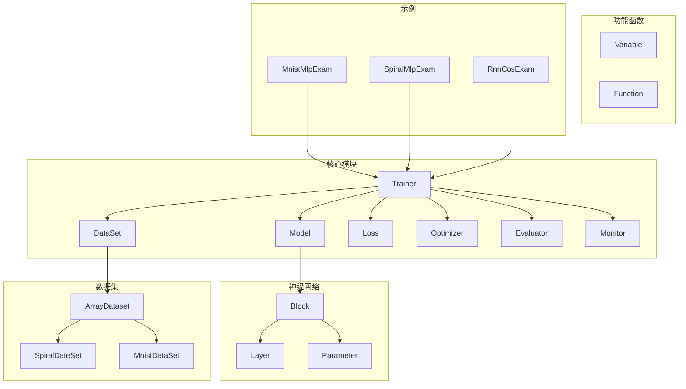

**图示来源**
- [Trainer.java](file://src/main/java/io/leavesfly/tinydl/mlearning/Trainer.java#L1-L106)
- [Model.java](file://src/main/java/io/leavesfly/tinydl/mlearning/Model.java#L1-L86)
- [DataSet.java](file://src/main/java/io/leavesfly/tinydl/mlearning/dataset/DataSet.java#L1-L62)
- [Loss.java](file://src/main/java/io/leavesfly/tinydl/mlearning/loss/Loss.java#L1-L10)
- [Optimizer.java](file://src/main/java/io/leavesfly/tinydl/mlearning/optimize/Optimizer.java#L1-L28)
- [Evaluator.java](file://src/main/java/io/leavesfly/tinydl/mlearning/evaluator/Evaluator.java#L1-L16)
- [Monitor.java](file://src/main/java/io/leavesfly/tinydl/mlearning/Monitor.java#L1-L41)

**本节来源**
- [Trainer.java](file://src/main/java/io/leavesfly/tinydl/mlearning/Trainer.java#L1-L106)
- [Model.java](file://src/main/java/io/leavesfly/tinydl/mlearning/Model.java#L1-L86)
- [DataSet.java](file://src/main/java/io/leavesfly/tinydl/mlearning/dataset/DataSet.java#L1-L62)

## 核心组件

`Trainer`类是整个训练流程的核心控制器，负责协调`Model`、`DataSet`、`Loss`、`Optimizer`和`Evaluator`等组件，形成一个完整的训练闭环。`Model`类表示机器学习模型，封装了神经网络的结构和参数。`DataSet`类表示用于训练、测试或验证的数据集，提供了数据的批量处理和随机打散功能。`Loss`类定义了损失函数，用于衡量模型预测结果与真实标签之间的差异。`Optimizer`类实现了参数优化算法，如SGD和Adam，负责根据损失函数的梯度更新模型参数。`Evaluator`类用于评估模型在测试集上的表现，如准确率和回归误差。`Monitor`类收集训练过程中的信息，如损失值和准确率，并提供可视化功能。

**本节来源**
- [Trainer.java](file://src/main/java/io/leavesfly/tinydl/mlearning/Trainer.java#L1-L106)
- [Model.java](file://src/main/java/io/leavesfly/tinydl/mlearning/Model.java#L1-L86)
- [DataSet.java](file://src/main/java/io/leavesfly/tinydl/mlearning/dataset/DataSet.java#L1-L62)
- [Loss.java](file://src/main/java/io/leavesfly/tinydl/mlearning/loss/Loss.java#L1-L10)
- [Optimizer.java](file://src/main/java/io/leavesfly/tinydl/mlearning/optimize/Optimizer.java#L1-L28)
- [Evaluator.java](file://src/main/java/io/leavesfly/tinydl/mlearning/evaluator/Evaluator.java#L1-L16)
- [Monitor.java](file://src/main/java/io/leavesfly/tinydl/mlearning/Monitor.java#L1-L41)

## 架构概述

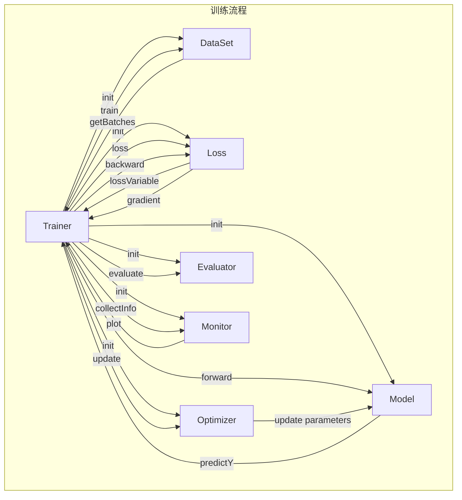

**图示来源**
- [Trainer.java](file://src/main/java/io/leavesfly/tinydl/mlearning/Trainer.java#L1-L106)
- [Model.java](file://src/main/java/io/leavesfly/tinydl/mlearning/Model.java#L1-L86)
- [DataSet.java](file://src/main/java/io/leavesfly/tinydl/mlearning/dataset/DataSet.java#L1-L62)
- [Loss.java](file://src/main/java/io/leavesfly/tinydl/mlearning/loss/Loss.java#L1-L10)
- [Optimizer.java](file://src/main/java/io/leavesfly/tinydl/mlearning/optimize/Optimizer.java#L1-L28)
- [Evaluator.java](file://src/main/java/io/leavesfly/tinydl/mlearning/evaluator/Evaluator.java#L1-L16)
- [Monitor.java](file://src/main/java/io/leavesfly/tinydl/mlearning/Monitor.java#L1-L41)

## 详细组件分析

### Trainer 分析

`Trainer`类通过`init()`方法初始化训练所需的各个组件，包括`DataSet`、`Model`、`Loss`和`Optimizer`。`train()`方法是训练的核心，它执行epoch循环，对每个epoch进行数据shuffle，调用`model.resetState()`重置模型状态，然后遍历数据集的每个batch，执行前向传播、损失计算、反向传播和参数更新。`Monitor`类用于收集训练过程中的信息，如损失值，并在训练结束后绘制损失曲线。`Evaluator`类用于评估模型在测试集上的表现。

#### 类图

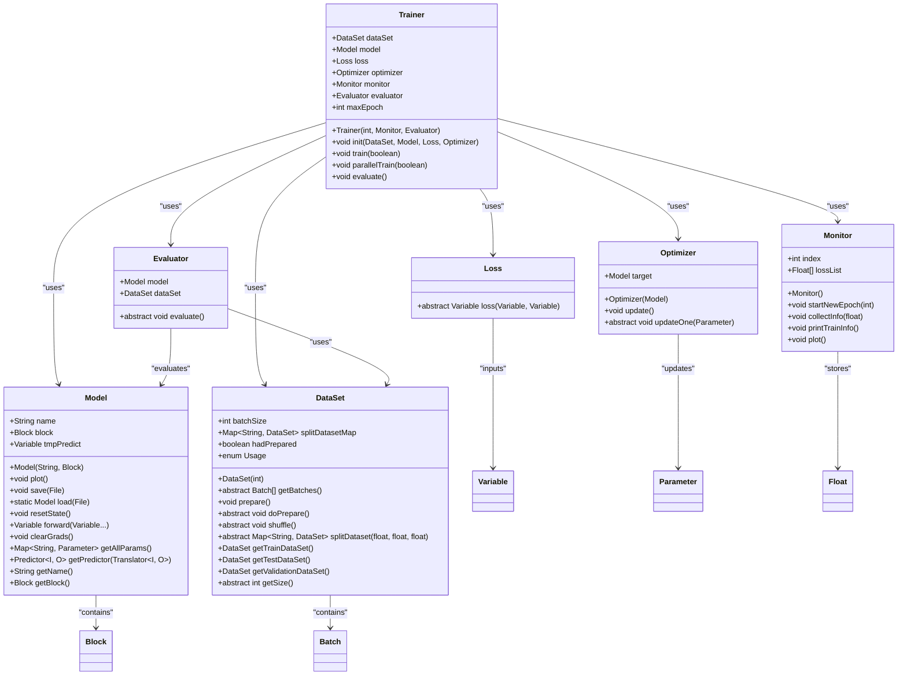

**图示来源**
- [Trainer.java](file://src/main/java/io/leavesfly/tinydl/mlearning/Trainer.java#L1-L106)
- [Model.java](file://src/main/java/io/leavesfly/tinydl/mlearning/Model.java#L1-L86)
- [DataSet.java](file://src/main/java/io/leavesfly/tinydl/mlearning/dataset/DataSet.java#L1-L62)
- [Loss.java](file://src/main/java/io/leavesfly/tinydl/mlearning/loss/Loss.java#L1-L10)
- [Optimizer.java](file://src/main/java/io/leavesfly/tinydl/mlearning/optimize/Optimizer.java#L1-L28)
- [Evaluator.java](file://src/main/java/io/leavesfly/tinydl/mlearning/evaluator/Evaluator.java#L1-L16)
- [Monitor.java](file://src/main/java/io/leavesfly/tinydl/mlearning/Monitor.java#L1-L41)

#### 训练流程序列图

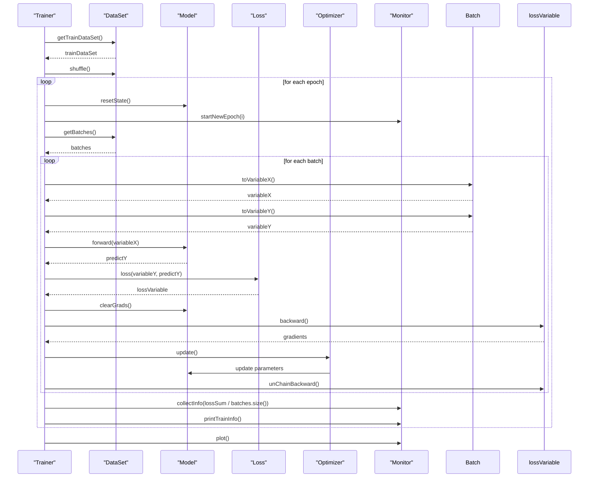

**图示来源**
- [Trainer.java](file://src/main/java/io/leavesfly/tinydl/mlearning/Trainer.java#L1-L106)
- [Model.java](file://src/main/java/io/leavesfly/tinydl/mlearning/Model.java#L1-L86)
- [DataSet.java](file://src/main/java/io/leavesfly/tinydl/mlearning/dataset/DataSet.java#L1-L62)
- [Loss.java](file://src/main/java/io/leavesfly/tinydl/mlearning/loss/Loss.java#L1-L10)
- [Optimizer.java](file://src/main/java/io/leavesfly/tinydl/mlearning/optimize/Optimizer.java#L1-L28)
- [Monitor.java](file://src/main/java/io/leavesfly/tinydl/mlearning/Monitor.java#L1-L41)

**本节来源**
- [Trainer.java](file://src/main/java/io/leavesfly/tinydl/mlearning/Trainer.java#L1-L106)
- [Model.java](file://src/main/java/io/leavesfly/tinydl/mlearning/Model.java#L1-L86)
- [DataSet.java](file://src/main/java/io/leavesfly/tinydl/mlearning/dataset/DataSet.java#L1-L62)
- [Loss.java](file://src/main/java/io/leavesfly/tinydl/mlearning/loss/Loss.java#L1-L10)
- [Optimizer.java](file://src/main/java/io/leavesfly/tinydl/mlearning/optimize/Optimizer.java#L1-L28)
- [Evaluator.java](file://src/main/java/io/leavesfly/tinydl/mlearning/evaluator/Evaluator.java#L1-L16)
- [Monitor.java](file://src/main/java/io/leavesfly/tinydl/mlearning/Monitor.java#L1-L41)

### Model 分析

`Model`类表示机器学习模型，封装了神经网络的结构和参数。`Block`类表示由层组合起来的更大的神经网络的块，`Layer`类表示神经网络中的层，`Parameter`类表示神经网络中需要训练的参数。`Model`类通过`forward()`方法执行前向传播，`clearGrads()`方法清除梯度，`resetState()`方法重置模型状态，`getAllParams()`方法获取所有参数。

#### 类图

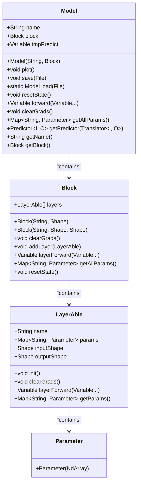

**图示来源**
- [Model.java](file://src/main/java/io/leavesfly/tinydl/mlearning/Model.java#L1-L86)
- [Block.java](file://src/main/java/io/leavesfly/tinydl/nnet/Block.java#L1-L90)
- [LayerAble.java](file://src/main/java/io/leavesfly/tinydl/nnet/LayerAble.java#L1-L50)
- [Parameter.java](file://src/main/java/io/leavesfly/tinydl/nnet/Parameter.java#L1-L13)

**本节来源**
- [Model.java](file://src/main/java/io/leavesfly/tinydl/mlearning/Model.java#L1-L86)
- [Block.java](file://src/main/java/io/leavesfly/tinydl/nnet/Block.java#L1-L90)
- [LayerAble.java](file://src/main/java/io/leavesfly/tinydl/nnet/LayerAble.java#L1-L50)
- [Parameter.java](file://src/main/java/io/leavesfly/tinydl/nnet/Parameter.java#L1-L13)

### DataSet 分析

`DataSet`类表示用于训练、测试或验证的数据集，提供了数据的批量处理和随机打散功能。`ArrayDataset`类表示基于数组的数据集，`SpiralDateSet`类表示螺旋数据集，`MnistDataSet`类表示MNIST数据集。

#### 类图

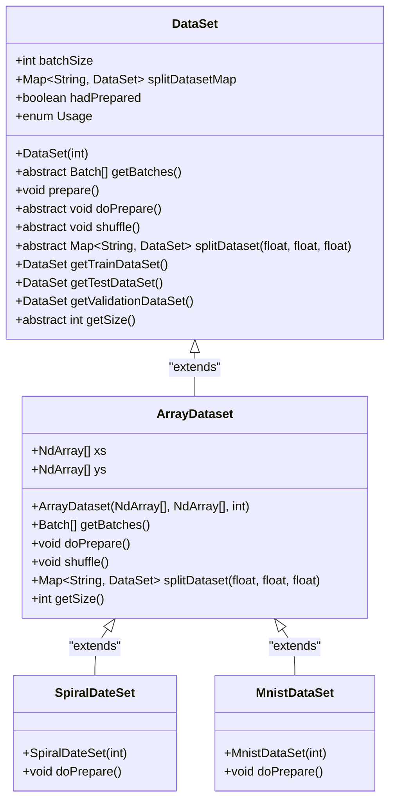

**图示来源**
- [DataSet.java](file://src/main/java/io/leavesfly/tinydl/mlearning/dataset/DataSet.java#L1-L62)
- [ArrayDataset.java](file://src/main/java/io/leavesfly/tinydl/mlearning/dataset/ArrayDataset.java#L1-L50)
- [SpiralDateSet.java](file://src/main/java/io/leavesfly/tinydl/mlearning/dataset/simple/SpiralDateSet.java#L1-L30)
- [MnistDataSet.java](file://src/main/java/io/leavesfly/tinydl/mlearning/dataset/simple/MnistDataSet.java#L1-L40)

**本节来源**
- [DataSet.java](file://src/main/java/io/leavesfly/tinydl/mlearning/dataset/DataSet.java#L1-L62)
- [ArrayDataset.java](file://src/main/java/io/leavesfly/tinydl/mlearning/dataset/ArrayDataset.java#L1-L50)
- [SpiralDateSet.java](file://src/main/java/io/leavesfly/tinydl/mlearning/dataset/simple/SpiralDateSet.java#L1-L30)
- [MnistDataSet.java](file://src/main/java/io/leavesfly/tinydl/mlearning/dataset/simple/MnistDataSet.java#L1-L40)

### Loss 分析

`Loss`类定义了损失函数，用于衡量模型预测结果与真实标签之间的差异。`SoftmaxCrossEntropy`类实现了Softmax交叉熵损失函数，`MeanSquaredLoss`类实现了均方误差损失函数。

#### 类图

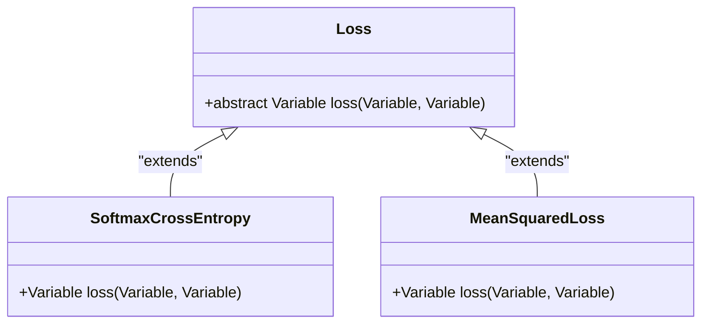

**图示来源**
- [Loss.java](file://src/main/java/io/leavesfly/tinydl/mlearning/loss/Loss.java#L1-L10)
- [SoftmaxCrossEntropy.java](file://src/main/java/io/leavesfly/tinydl/mlearning/loss/SoftmaxCrossEntropy.java#L1-L20)
- [MeanSquaredLoss.java](file://src/main/java/io/leavesfly/tinydl/mlearning/loss/MeanSquaredLoss.java#L1-L20)

**本节来源**
- [Loss.java](file://src/main/java/io/leavesfly/tinydl/mlearning/loss/Loss.java#L1-L10)
- [SoftmaxCrossEntropy.java](file://src/main/java/io/leavesfly/tinydl/mlearning/loss/SoftmaxCrossEntropy.java#L1-L20)
- [MeanSquaredLoss.java](file://src/main/java/io/leavesfly/tinydl/mlearning/loss/MeanSquaredLoss.java#L1-L20)

### Optimizer 分析

`Optimizer`类实现了参数优化算法，如SGD和Adam，负责根据损失函数的梯度更新模型参数。`SGD`类实现了随机梯度下降算法，`Adam`类实现了Adam优化算法。

#### 类图

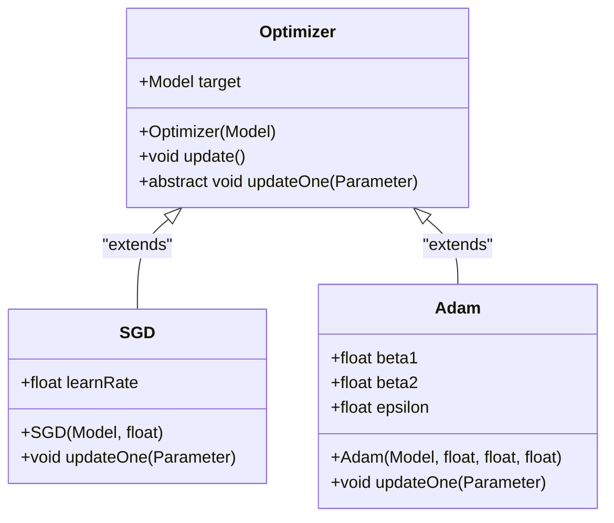

**图示来源**
- [Optimizer.java](file://src/main/java/io/leavesfly/tinydl/mlearning/optimize/Optimizer.java#L1-L28)
- [SGD.java](file://src/main/java/io/leavesfly/tinydl/mlearning/optimize/SGD.java#L1-L30)
- [Adam.java](file://src/main/java/io/leavesfly/tinydl/mlearning/optimize/Adam.java#L1-L40)

**本节来源**
- [Optimizer.java](file://src/main/java/io/leavesfly/tinydl/mlearning/optimize/Optimizer.java#L1-L28)
- [SGD.java](file://src/main/java/io/leavesfly/tinydl/mlearning/optimize/SGD.java#L1-L30)
- [Adam.java](file://src/main/java/io/leavesfly/tinydl/mlearning/optimize/Adam.java#L1-L40)

### Evaluator 分析

`Evaluator`类用于评估模型在测试集上的表现，如准确率和回归误差。`AccuracyEval`类用于评估分类模型的准确率，`RegressEval`类用于评估回归模型的误差。

#### 类图

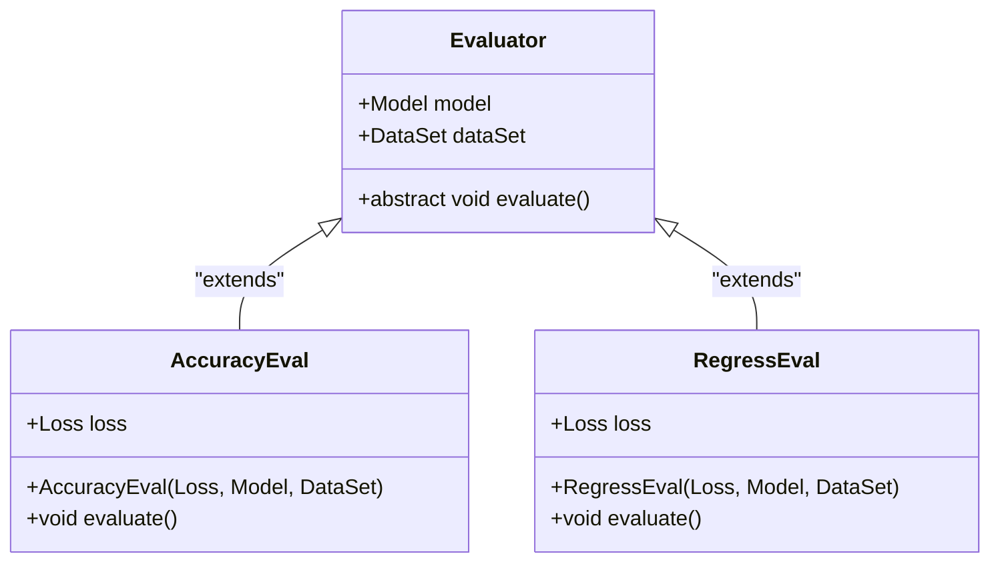

**图示来源**
- [Evaluator.java](file://src/main/java/io/leavesfly/tinydl/mlearning/evaluator/Evaluator.java#L1-L16)
- [AccuracyEval.java](file://src/main/java/io/leavesfly/tinydl/mlearning/evaluator/AccuracyEval.java#L1-L25)
- [RegressEval.java](file://src/main/java/io/leavesfly/tinydl/mlearning/evaluator/RegressEval.java#L1-L25)

**本节来源**
- [Evaluator.java](file://src/main/java/io/leavesfly/tinydl/mlearning/evaluator/Evaluator.java#L1-L16)
- [AccuracyEval.java](file://src/main/java/io/leavesfly/tinydl/mlearning/evaluator/AccuracyEval.java#L1-L25)
- [RegressEval.java](file://src/main/java/io/leavesfly/tinydl/mlearning/evaluator/RegressEval.java#L1-L25)

### Monitor 分析

`Monitor`类收集训练过程中的信息，如损失值和准确率，并提供可视化功能。`Plot`类用于绘制损失曲线和准确率变化。

#### 类图

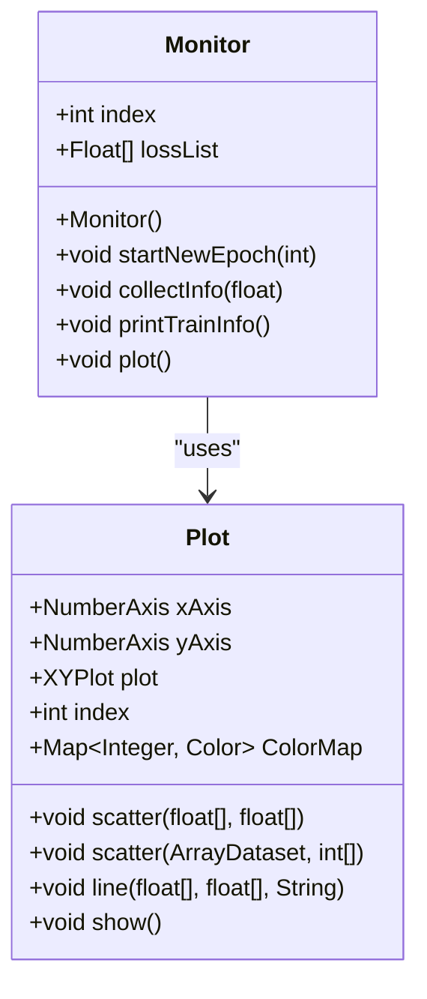

**图示来源**
- [Monitor.java](file://src/main/java/io/leavesfly/tinydl/mlearning/Monitor.java#L1-L41)
- [Plot.java](file://src/main/java/io/leavesfly/tinydl/utils/Plot.java#L1-L179)

**本节来源**
- [Monitor.java](file://src/main/java/io/leavesfly/tinydl/mlearning/Monitor.java#L1-L41)
- [Plot.java](file://src/main/java/io/leavesfly/tinydl/utils/Plot.java#L1-L179)

## 依赖分析

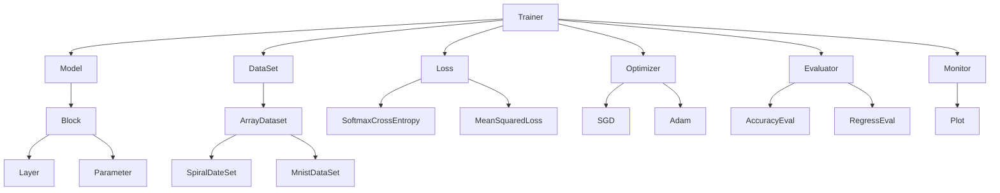

**图示来源**
- [Trainer.java](file://src/main/java/io/leavesfly/tinydl/mlearning/Trainer.java#L1-L106)
- [Model.java](file://src/main/java/io/leavesfly/tinydl/mlearning/Model.java#L1-L86)
- [DataSet.java](file://src/main/java/io/leavesfly/tinydl/mlearning/dataset/DataSet.java#L1-L62)
- [Loss.java](file://src/main/java/io/leavesfly/tinydl/mlearning/loss/Loss.java#L1-L10)
- [Optimizer.java](file://src/main/java/io/leavesfly/tinydl/mlearning/optimize/Optimizer.java#L1-L28)
- [Evaluator.java](file://src/main/java/io/leavesfly/tinydl/mlearning/evaluator/Evaluator.java#L1-L16)
- [Monitor.java](file://src/main/java/io/leavesfly/tinydl/mlearning/Monitor.java#L1-L41)

**本节来源**
- [Trainer.java](file://src/main/java/io/leavesfly/tinydl/mlearning/Trainer.java#L1-L106)
- [Model.java](file://src/main/java/io/leavesfly/tinydl/mlearning/Model.java#L1-L86)
- [DataSet.java](file://src/main/java/io/leavesfly/tinydl/mlearning/dataset/DataSet.java#L1-L62)
- [Loss.java](file://src/main/java/io/leavesfly/tinydl/mlearning/loss/Loss.java#L1-L10)
- [Optimizer.java](file://src/main/java/io/leavesfly/tinydl/mlearning/optimize/Optimizer.java#L1-L28)
- [Evaluator.java](file://src/main/java/io/leavesfly/tinydl/mlearning/evaluator/Evaluator.java#L1-L16)
- [Monitor.java](file://src/main/java/io/leavesfly/tinydl/mlearning/Monitor.java#L1-L41)

## 性能考量

`Trainer`类的`train()`方法是单线程实现，对于大规模数据集和复杂模型，可能会成为性能瓶颈。未来可以通过并行训练和多GPU支持来提高训练效率。`parallelTrain()`方法已经预留了并行训练的接口，但尚未实现。`Variable`类的`backward()`方法使用递归调用，为了提高效率，可以使用堆栈循环来替代。

**本节来源**
- [Trainer.java](file://src/main/java/io/leavesfly/tinydl/mlearning/Trainer.java#L1-L106)
- [Variable.java](file://src/main/java/io/leavesfly/tinydl/func/Variable.java#L1-L338)

## 故障排除指南

如果训练过程中出现异常，可以检查以下几点：
1. 确保`DataSet`的`prepare()`方法已正确调用，数据已准备好。
2. 检查`Model`的`resetState()`方法是否在每个epoch开始时正确调用，特别是对于RNN模型。
3. 确保`Loss`函数的输入和输出维度匹配。
4. 检查`Optimizer`的`update()`方法是否正确更新了模型参数。
5. 使用`Monitor`类的`printTrainInfo()`方法查看训练过程中的损失值，判断是否正常下降。

**本节来源**
- [Trainer.java](file://src/main/java/io/leavesfly/tinydl/mlearning/Trainer.java#L1-L106)
- [Model.java](file://src/main/java/io/leavesfly/tinydl/mlearning/Model.java#L1-L86)
- [DataSet.java](file://src/main/java/io/leavesfly/tinydl/mlearning/dataset/DataSet.java#L1-L62)
- [Loss.java](file://src/main/java/io/leavesfly/tinydl/mlearning/loss/Loss.java#L1-L10)
- [Optimizer.java](file://src/main/java/io/leavesfly/tinydl/mlearning/optimize/Optimizer.java#L1-L28)
- [Monitor.java](file://src/main/java/io/leavesfly/tinydl/mlearning/Monitor.java#L1-L41)

## 结论

`Trainer`类作为训练流程的控制中枢，协调了`Model`、`DataSet`、`Loss`、`Optimizer`和`Evaluator`等组件，形成了一个完整的训练闭环。通过`init()`和`train()`方法，用户可以方便地进行模型训练和评估。`Monitor`类提供了训练过程的可视化监控功能。尽管当前实现是单线程的，但通过并行训练和多GPU支持，可以进一步提高训练效率。未来的工作可以集中在优化`Variable`类的`backward()`方法，使用堆栈循环替代递归调用，以提高性能。