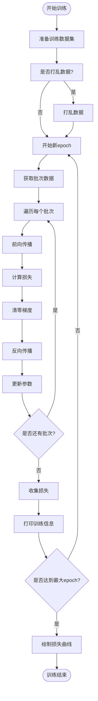

# 训练流程详解

<cite>
**本文档中引用的文件**  
- [DataSet.java](file://src/main/java/io/leavesfly/tinydl/mlearning/dataset/DataSet.java)
- [ArrayDataset.java](file://src/main/java/io/leavesfly/tinydl/mlearning/dataset/ArrayDataset.java)
- [MnistDataSet.java](file://src/main/java/io/leavesfly/tinydl/mlearning/dataset/simple/MnistDataSet.java)
- [SpiralDateSet.java](file://src/main/java/io/leavesfly/tinydl/mlearning/dataset/simple/SpiralDateSet.java)
- [SoftmaxCrossEntropy.java](file://src/main/java/io/leavesfly/tinydl/mlearning/loss/SoftmaxCrossEntropy.java)
- [MeanSquaredLoss.java](file://src/main/java/io/leavesfly/tinydl/mlearning/loss/MeanSquaredLoss.java)
- [SoftmaxCE.java](file://src/main/java/io/leavesfly/tinydl/func/loss/SoftmaxCE.java)
- [MeanSE.java](file://src/main/java/io/leavesfly/tinydl/func/loss/MeanSE.java)
- [SGD.java](file://src/main/java/io/leavesfly/tinydl/mlearning/optimize/SGD.java)
- [Adam.java](file://src/main/java/io/leavesfly/tinydl/mlearning/optimize/Adam.java)
- [Trainer.java](file://src/main/java/io/leavesfly/tinydl/mlearning/Trainer.java)
- [Monitor.java](file://src/main/java/io/leavesfly/tinydl/mlearning/Monitor.java)
- [AccuracyEval.java](file://src/main/java/io/leavesfly/tinydl/mlearning/evaluator/AccuracyEval.java)
- [RegressEval.java](file://src/main/java/io/leavesfly/tinydl/mlearning/evaluator/RegressEval.java)
- [SpiralMlpExam.java](file://src/main/java/io/leavesfly/tinydl/example/classify/SpiralMlpExam.java)
</cite>

## 目录
1. [数据集处理](#数据集处理)
2. [损失函数详解](#损失函数详解)
3. [优化器解析](#优化器解析)
4. [训练器与监控](#训练器与监控)
5. [评估器说明](#评估器说明)
6. [完整训练脚本示例](#完整训练脚本示例)

## 数据集处理

数据集处理是模型训练的基础环节，本框架通过抽象类 `DataSet` 定义了统一的数据集接口，并提供了 `ArrayDataset` 作为通用内存加载实现，同时支持 `MnistDataSet` 和 `SpiralDateSet` 等具体数据集的加载与预处理。

### DataSet 接口设计

`DataSet` 是所有数据集的抽象基类，定义了数据集的核心行为，包括批次获取、数据准备、打乱与划分等。其主要方法如下：

- `getBatches()`：获取按批次组织的数据。
- `prepare()`：执行数据预处理逻辑，确保数据就绪。
- `shuffle()`：对数据进行随机打乱。
- `splitDataset()`：将数据划分为训练、测试和验证集。
- `getSize()`：返回数据集大小。

该类还定义了 `Usage` 枚举，用于标识数据用途（训练、测试、验证）。

**Section sources**
- [DataSet.java](file://src/main/java/io/leavesfly/tinydl/mlearning/dataset/DataSet.java#L1-L61)

### ArrayDataset 通用实现

`ArrayDataset` 是 `DataSet` 的抽象子类，适用于可完全加载到内存中的数据集。它通过两个 `NdArray[]` 数组 `xs` 和 `ys` 分别存储输入特征和标签，并实现了批次划分、数据打乱和集拆分等通用逻辑。

在 `getBatches()` 方法中，数据被按 `batchSize` 划分为多个批次，不足一个批次的数据将被丢弃。`splitDataset()` 方法根据传入的比例将数据划分为训练、测试和验证集，并缓存结果。

**Section sources**
- [ArrayDataset.java](file://src/main/java/io/leavesfly/tinydl/mlearning/dataset/ArrayDataset.java#L1-L116)

### 具体数据集实现

#### MnistDataSet

`MnistDataSet` 用于加载经典的 MNIST 手写数字数据集。它继承自 `ArrayDataset`，在 `doPrepare()` 方法中实现了数据的自动下载（若本地不存在）、解压和读取。图像数据被归一化到 [0,1] 区间，标签以整数形式存储。该类还提供了将图像保存为 PNG 文件的辅助方法。

**Section sources**
- [MnistDataSet.java](file://src/main/java/io/leavesfly/tinydl/mlearning/dataset/simple/MnistDataSet.java#L1-L181)

#### SpiralDateSet

`SpiralDateSet` 生成一个经典的螺旋形分类数据集，常用于测试非线性模型。它在 `doPrepare()` 中生成三类螺旋分布的数据点，每类100个样本，共300个。数据点的坐标通过极坐标变换生成，并加入高斯噪声以增加难度。该数据集也用于训练和测试集的划分。

**Section sources**
- [SpiralDateSet.java](file://src/main/java/io/leavesfly/tinydl/mlearning/dataset/simple/SpiralDateSet.java#L1-L79)

## 损失函数详解

损失函数用于衡量模型预测值与真实标签之间的差异，是模型优化的目标。本框架在 `mlearning.loss` 包中提供了高层封装，并在 `func.loss` 包中实现了具体的数学运算。

### SoftmaxCrossEntropy（分类任务）

`SoftmaxCrossEntropy` 适用于多分类任务。其数学原理为：首先对预测值进行 Softmax 操作，将其转换为概率分布；然后计算真实标签与预测概率之间的交叉熵损失。

在代码实现上，`SoftmaxCrossEntropy` 类调用 `Variable` 的 `softmaxCrossEntropy()` 方法，该方法最终由底层的 `SoftmaxCE` 函数实现。`SoftmaxCE` 的前向传播计算交叉熵，后向传播计算梯度，其梯度为预测概率减去真实标签的 one-hot 编码。

**Section sources**
- [SoftmaxCrossEntropy.java](file://src/main/java/io/leavesfly/tinydl/mlearning/loss/SoftmaxCrossEntropy.java#L1-L11)
- [SoftmaxCE.java](file://src/main/java/io/leavesfly/tinydl/func/loss/SoftmaxCE.java#L1-L60)

### MeanSquaredLoss（回归任务）

`MeanSquaredLoss` 适用于回归任务。其数学原理为：计算预测值与真实值之间差值的平方的均值。

在代码实现上，`MeanSquaredLoss` 类调用 `Variable` 的 `meanSquaredError()` 方法，由底层的 `MeanSE` 函数实现。`MeanSE` 的前向传播计算均方误差，后向传播的梯度为 `2*(predict - label)/batch_size`。

**Section sources**
- [MeanSquaredLoss.java](file://src/main/java/io/leavesfly/tinydl/mlearning/loss/MeanSquaredLoss.java#L1-L14)
- [MeanSE.java](file://src/main/java/io/leavesfly/tinydl/func/loss/MeanSE.java#L1-L40)

## 优化器解析

优化器负责根据损失函数的梯度更新模型参数。本框架提供了 `SGD` 和 `Adam` 两种优化算法。

### SGD（随机梯度下降）

`SGD` 是最基础的优化算法，其更新规则为：
`parameter = parameter - lr * grad`

其中 `lr` 为学习率，`grad` 为参数梯度。`SGD` 实现简单，但收敛速度较慢，且对学习率敏感。

**Section sources**
- [SGD.java](file://src/main/java/io/leavesfly/tinydl/mlearning/optimize/SGD.java#L1-L22)

### Adam（自适应矩估计）

`Adam` 融合了动量（Momentum）和自适应学习率（AdaGrad/RMSProp）的思想，通常具有更快的收敛速度和更好的稳定性。

其更新规则较为复杂，维护了梯度的一阶矩（`m`）和二阶矩（`v`）的指数移动平均。参数更新时，使用一阶矩除以二阶矩的平方根进行自适应调整。`Adam` 的超参数包括：
- `learningRate`：基础学习率
- `beta1`：一阶矩的衰减率
- `beta2`：二阶矩的衰减率
- `epsilon`：防止除零的小常数

**Section sources**
- [Adam.java](file://src/main/java/io/leavesfly/tinydl/mlearning/optimize/Adam.java#L1-L70)

## 训练器与监控

### Trainer 核心功能

`Trainer` 类封装了完整的训练循环，其 `train()` 方法实现了标准的训练流程：

1. **数据准备**：获取训练数据集，根据需要进行打乱。
2. **训练循环**：遍历每个训练轮次（epoch）。
3. **批次处理**：对每个批次执行以下操作：
   - 前向传播：`model.forward(variableX)`
   - 损失计算：`loss.loss(variableY, predictY)`
   - 梯度清零：`model.clearGrads()`
   - 反向传播：`lossVariable.backward()`
   - 参数更新：`optimizer.update()`
4. **监控**：收集并打印每个 epoch 的平均损失。
5. **绘图**：训练结束后绘制损失曲线。



**Diagram sources**
- [Trainer.java](file://src/main/java/io/leavesfly/tinydl/mlearning/Trainer.java#L1-L106)

**Section sources**
- [Trainer.java](file://src/main/java/io/leavesfly/tinydl/mlearning/Trainer.java#L1-L106)

### Monitor 训练监控

`Monitor` 类用于收集和展示训练过程中的信息。它维护一个 `lossList` 来记录每个 epoch 的平均损失，并提供 `printTrainInfo()` 打印当前损失，`plot()` 方法调用 `Plot` 工具绘制损失曲线图。

**Section sources**
- [Monitor.java](file://src/main/java/io/leavesfly/tinydl/mlearning/Monitor.java#L1-L41)

## 评估器说明

评估器用于在训练后评估模型在测试集上的性能。

### AccuracyEval（分类任务）

`AccuracyEval` 用于评估分类模型的准确率。它使用 `Classify` 类的 `accuracyRate()` 方法，该方法通过比较预测值的 `argMax` 与真实标签是否相等来计算准确率。

**Section sources**
- [AccuracyEval.java](file://src/main/java/io/leavesfly/tinydl/mlearning/evaluator/AccuracyEval.java#L1-L40)

### RegressEval（回归任务）

`RegressEval` 用于评估回归模型的性能。它计算模型在测试集上的平均损失（如均方误差），作为模型性能的指标。

**Section sources**
- [RegressEval.java](file://src/main/java/io/leavesfly/tinydl/mlearning/evaluator/RegressEval.java#L1-L39)

## 完整训练脚本示例

以下是一个完整的训练脚本示例，串联了数据集、模型、损失函数、优化器、训练器和评估器等所有组件：

```java
// 1. 创建数据集
DataSet dataSet = new SpiralDateSet(batchSize);
dataSet.prepare();

// 2. 创建模型 (假设已定义)
Model model = new MlpBlock(...);

// 3. 创建损失函数和优化器
Loss lossFunc = new SoftmaxCrossEntropy();
Optimizer optimizer = new SGD(model, learnRate);

// 4. 创建监控器和评估器
Monitor monitor = new Monitor();
Evaluator evaluator = new AccuracyEval(new Classify(), model, dataSet);

// 5. 创建训练器并初始化
Trainer trainer = new Trainer(maxEpoch, monitor, evaluator);
trainer.init(dataSet, model, lossFunc, optimizer);

// 6. 开始训练
trainer.train(true);

// 7. 评估模型
trainer.evaluate();
```

此流程清晰地展示了如何将各个组件组合起来，完成一个端到端的模型训练与评估任务。

**Section sources**
- [SpiralMlpExam.java](file://src/main/java/io/leavesfly/tinydl/example/classify/SpiralMlpExam.java#L83-L110)