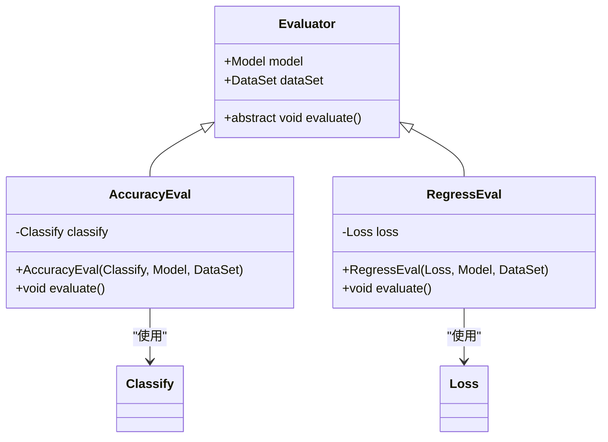
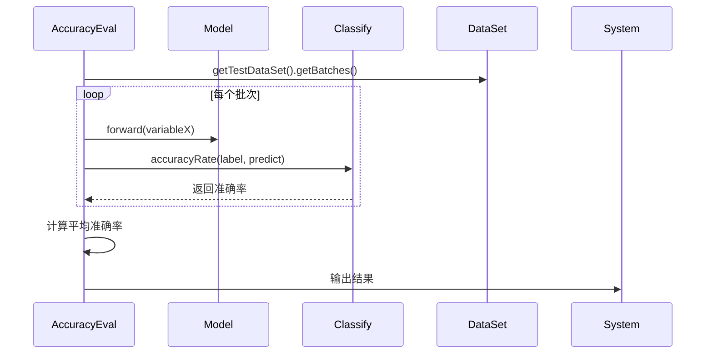
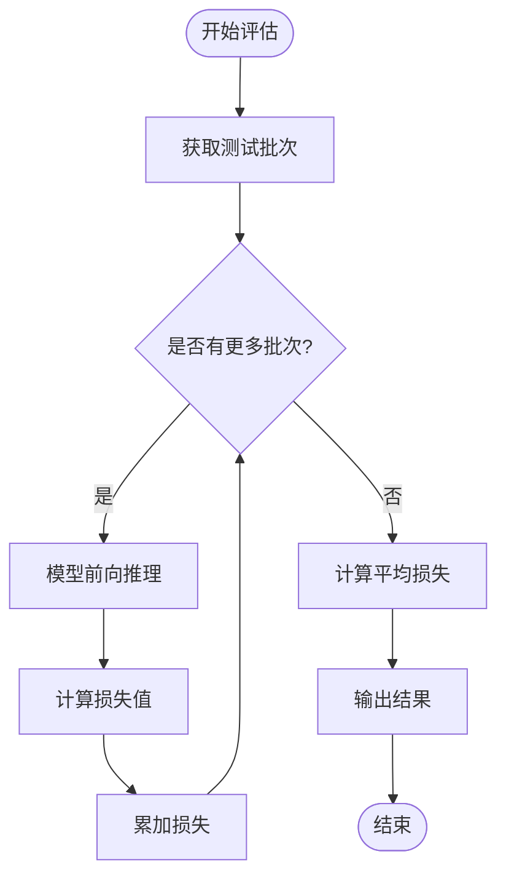
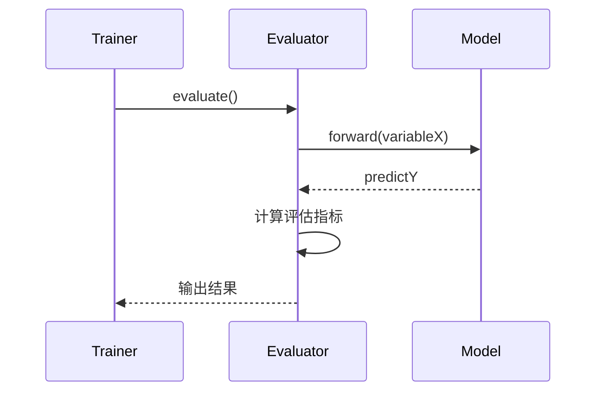
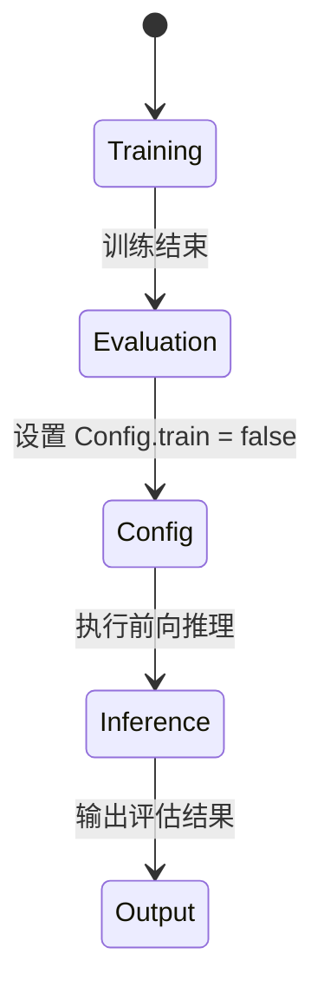

# 评估器

<cite>
**本文档中引用的文件**  
- [Evaluator.java](file://src/main/java/io/leavesfly/tinydl/mlearning/evaluator/Evaluator.java)
- [AccuracyEval.java](file://src/main/java/io/leavesfly/tinydl/mlearning/evaluator/AccuracyEval.java)
- [RegressEval.java](file://src/main/java/io/leavesfly/tinydl/mlearning/evaluator/RegressEval.java)
- [Trainer.java](file://src/main/java/io/leavesfly/tinydl/mlearning/Trainer.java)
- [Config.java](file://src/main/java/io/leavesfly/tinydl/utils/Config.java)
- [Classify.java](file://src/main/java/io/leavesfly/tinydl/mlearning/loss/Classify.java)
- [Loss.java](file://src/main/java/io/leavesfly/tinydl/mlearning/loss/Loss.java)
- [MeanSE.java](file://src/main/java/io/leavesfly/tinydl/func/loss/MeanSE.java)
- [SoftmaxCE.java](file://src/main/java/io/leavesfly/tinydl/func/loss/SoftmaxCE.java)
</cite>

## 目录
1. [引言](#引言)
2. [评估器模块架构](#评估器模块架构)
3. [分类任务评估：AccuracyEval](#分类任务评估accuracyeval)
4. [回归任务评估：RegressEval](#回归任务评估regresseval)
5. [评估流程与训练器集成](#评估流程与训练器集成)
6. [评估结果的可信度分析](#评估结果的可信度分析)
7. [自定义评估指标扩展](#自定义评估指标扩展)
8. [评估阶段梯度控制的重要性](#评估阶段梯度控制的重要性)
9. [结论](#结论)

## 引言
评估器模块是TinyDL框架中用于量化模型性能的核心组件。它通过定义统一的`Evaluator`接口，支持分类与回归任务的性能度量。本文档详细阐述评估器的设计原理、实现机制及其在训练流程中的集成方式，重点解析准确率（Accuracy）与均方误差（MSE）等指标的计算逻辑，并指导用户如何扩展自定义评估功能。

**文档来源**
- [Evaluator.java](file://src/main/java/io/leavesfly/tinydl/mlearning/evaluator/Evaluator.java)

## 评估器模块架构
评估器模块采用抽象基类`Evaluator`定义通用接口，所有具体评估器需继承该类并实现`evaluate()`方法。核心组件包括：
- `Evaluator`：抽象基类，声明模型与数据集的引用及评估接口
- `AccuracyEval`：实现分类任务的准确率计算
- `RegressEval`：实现回归任务的损失值评估



**图示来源**  
- [Evaluator.java](file://src/main/java/io/leavesfly/tinydl/mlearning/evaluator/Evaluator.java#L1-L15)
- [AccuracyEval.java](file://src/main/java/io/leavesfly/tinydl/mlearning/evaluator/AccuracyEval.java#L1-L40)
- [RegressEval.java](file://src/main/java/leavesfly/tinydl/mlearning/evaluator/RegressEval.java#L1-L39)

## 分类任务评估：AccuracyEval
`AccuracyEval`用于评估分类模型的性能，其核心逻辑是计算预测标签与真实标签的一致性比率。

### 准确率计算逻辑
1. **批量处理测试数据**：从`DataSet`获取测试批次列表
2. **前向推理**：模型对输入数据进行预测，生成输出概率分布
3. **标签比较**：利用`Classify.accuracyRate()`方法，通过`argMax`提取预测类别，并与真实标签对比
4. **统计平均准确率**：对所有批次的准确率求平均



**图示来源**  
- [AccuracyEval.java](file://src/main/java/io/leavesfly/tinydl/mlearning/evaluator/AccuracyEval.java#L20-L35)
- [Classify.java](file://src/main/java/io/leavesfly/tinydl/mlearning/loss/Classify.java#L5-L15)

**章节来源**  
- [AccuracyEval.java](file://src/main/java/io/leavesfly/tinydl/mlearning/evaluator/AccuracyEval.java#L1-L40)
- [Classify.java](file://src/main/java/io/leavesfly/tinydl/mlearning/loss/Classify.java#L1-L15)

## 回归任务评估：RegressEval
`RegressEval`用于评估回归模型的性能，主要依赖损失函数（如MSE、MAE）作为评估指标。

### 回归评估指标与计算过程
- **均方误差（MSE）**：通过`MeanSE`函数实现，计算预测值与真实值差值的平方均值
- **平均绝对误差（MAE）**：可通过扩展`Loss`子类实现

评估流程：
1. 遍历测试数据批次
2. 模型前向输出预测值
3. 调用`Loss.loss()`计算每批次损失
4. 累加并输出平均损失值



**图示来源**  
- [RegressEval.java](file://src/main/java/io/leavesfly/tinydl/mlearning/evaluator/RegressEval.java#L20-L35)
- [MeanSE.java](file://src/main/java/io/leavesfly/tinydl/func/loss/MeanSE.java#L1-L10)

**章节来源**  
- [RegressEval.java](file://src/main/java/io/leavesfly/tinydl/mlearning/evaluator/RegressEval.java#L1-L39)
- [Loss.java](file://src/main/java/io/leavesfly/tinydl/mlearning/loss/Loss.java#L1-L9)

## 评估流程与训练器集成
评估器由`Trainer`在训练结束后调用，形成完整的训练-评估闭环。

### 集成流程
1. `Trainer`初始化时注入`Evaluator`实例
2. 训练完成后调用`evaluate()`方法
3. 评估器执行独立的前向推理流程



**图示来源**  
- [Trainer.java](file://src/main/java/io/leavesfly/tinydl/mlearning/Trainer.java#L100-L105)
- [AccuracyEval.java](file://src/main/java/io/leavesfly/tinydl/mlearning/evaluator/AccuracyEval.java#L25-L30)

**章节来源**  
- [Trainer.java](file://src/main/java/io/leavesfly/tinydl/mlearning/Trainer.java#L1-L106)
- [Evaluator.java](file://src/main/java/io/leavesfly/tinydl/mlearning/evaluator/Evaluator.java#L1-L15)

## 评估结果的可信度分析
评估结果的可信度依赖于以下因素：
- **数据划分合理性**：测试集应独立于训练集，避免数据泄露
- **过拟合判断**：若训练损失持续下降而测试损失回升，则表明模型过拟合
- **评估批次一致性**：批量统计可减少随机性，提升结果稳定性

通过对比训练损失与测试损失的变化趋势，可有效判断模型泛化能力。

**章节来源**  
- [Trainer.java](file://src/main/java/io/leavesfly/tinydl/mlearning/Trainer.java#L70-L80)
- [RegressEval.java](file://src/main/java/io/leavesfly/tinydl/mlearning/evaluator/RegressEval.java#L30-L35)

## 自定义评估指标扩展
用户可通过继承`Evaluator`并实现`evaluate()`方法，添加如F1-score、R²等自定义指标。

### 扩展示例
```java
public class F1ScoreEval extends Evaluator {
    @Override
    public void evaluate() {
        // 实现F1-score计算逻辑
        // 可复用Variable的矩阵操作方法
    }
}
```

建议将通用统计方法封装至`Classify`或新增`Metrics`工具类，提升代码复用性。

**章节来源**  
- [Evaluator.java](file://src/main/java/io/leavesfly/tinydl/mlearning/evaluator/Evaluator.java#L1-L15)
- [Classify.java](file://src/main/java/io/leavesfly/tinydl/mlearning/loss/Classify.java#L1-L15)

## 评估阶段梯度控制的重要性
在评估阶段必须关闭梯度计算，原因如下：
- **性能优化**：避免不必要的反向传播计算，提升推理速度
- **内存节约**：防止构建计算图导致内存占用增加
- **行为一致性**：确保模型处于推理模式，避免Dropout等训练特异性操作

通过设置`Config.train = false`，框架自动禁用梯度追踪与训练相关操作。



**图示来源**  
- [AccuracyEval.java](file://src/main/java/io/leavesfly/tinydl/mlearning/evaluator/AccuracyEval.java#L22)
- [RegressEval.java](file://src/main/java/io/leavesfly/tinydl/mlearning/evaluator/RegressEval.java#L25)
- [Config.java](file://src/main/java/io/leavesfly/tinydl/utils/Config.java#L4)

**章节来源**  
- [Config.java](file://src/main/java/io/leavesfly/tinydl/utils/Config.java#L1-L13)

## 结论
评估器模块通过清晰的接口设计与职责分离，实现了对模型性能的高效量化。`AccuracyEval`与`RegressEval`分别针对分类与回归任务提供了标准化评估方案，且易于扩展。与`Trainer`的无缝集成确保了训练-评估流程的自动化。正确使用`Config.train = false`是保证评估效率与准确性的关键。未来可进一步丰富评估指标库，支持更多统计量的开箱即用。