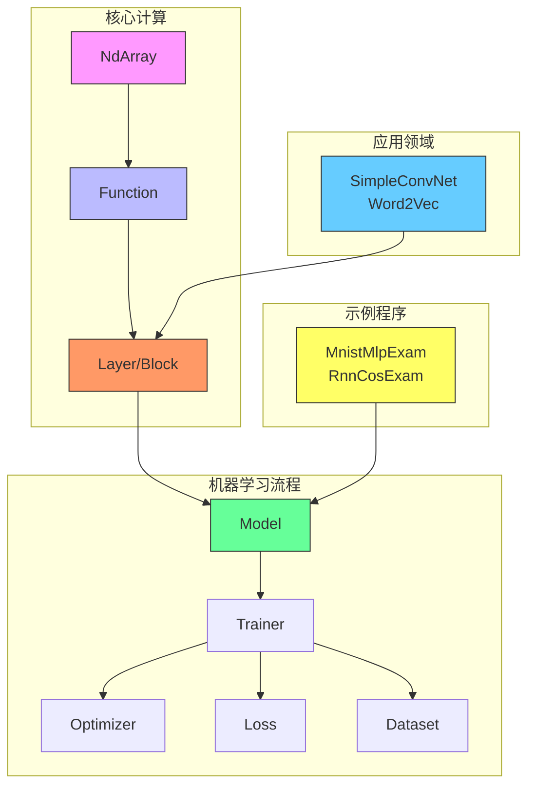

# 项目概述

<cite>
**本文档引用文件**  
- [README.md](file://README.md)
- [NdArray.java](file://src/main/java/io/leavesfly/tinydl/ndarr/NdArray.java)
- [Function.java](file://src/main/java/io/leavesfly/tinydl/func/Function.java)
- [Layer.java](file://src/main/java/io/leavesfly/tinydl/nnet/Layer.java)
- [Trainer.java](file://src/main/java/io/leavesfly/tinydl/mlearning/Trainer.java)
- [SimpleConvNet.java](file://src/main/java/io/leavesfly/tinydl/modality/cv/SimpleConvNet.java)
</cite>

## 目录
1. [项目定位与目标](#项目定位与目标)
2. [设计哲学](#设计哲学)
3. [功能范围](#功能范围)
4. [生产环境适用性](#生产环境适用性)
5. [核心模块架构](#核心模块架构)
6. [学习路径指引](#学习路径指引)
7. [技术愿景与未来方向](#技术愿景与未来方向)

## 项目定位与目标

TinyDL 是一个用 Java 实现的轻量级深度学习框架，旨在为开发者和研究人员提供一个简洁、清晰且易于理解的深度学习核心机制实现。该项目主要面向教学、研究和小规模实验场景，帮助用户深入理解自动微分、神经网络构建、训练流程等关键技术原理。其设计目标并非替代成熟的工业级框架（如 PyTorch 或 TensorFlow），而是作为一个教学工具，降低深度学习底层原理的学习门槛。

**Section sources**  
- [README.md](file://README.md#L1-L207)

## 设计哲学

TinyDL 的设计深受 PyTorch 启发，强调代码的可读性和模块化结构。其核心设计哲学包括：

- **简洁性**：避免过度工程化，保持代码逻辑直观，便于初学者理解和调试。
- **分层清晰**：采用分层架构，将底层数据操作、自动微分、网络构建、训练管理等功能解耦，各模块职责明确。
- **教学导向**：所有组件的设计都以教育目的为核心，注释详尽，API 设计直观，便于追踪计算流程。
- **可扩展性**：通过接口和抽象类定义规范，允许用户在现有基础上进行功能扩展和自定义实现。

**Section sources**  
- [README.md](file://README.md#L1-L207)

## 功能范围

TinyDL 提供了深度学习开发所需的核心功能，涵盖从数据处理到模型训练的完整链条。

### 自动微分
基于计算图机制实现自动梯度计算。通过 `Variable` 和 `Function` 类在前向传播过程中动态构建计算图，并在调用 `backward()` 方法时自动执行反向传播，计算各参数的梯度。

### 神经网络构建
提供 `Layer` 和 `Block` 抽象，支持构建各种神经网络结构。已实现全连接层（`AffineLayer`）、卷积层（`ConvLayer`）、循环层（`LstmLayer`、`SimpleRnnlayer`）以及激活函数层（如 `ReLuLayer`、`SigmoidLayer`）等。

### 训练流程管理
通过 `Trainer` 类封装了完整的训练循环，包括数据加载、前向传播、损失计算、反向传播、参数更新和监控记录。支持自定义优化器（如 `SGD`、`Adam`）和损失函数（如 `MeanSquaredLoss`、`SoftmaxCrossEntropy`）。

### 多模态支持
在 `modality` 包中初步支持计算机视觉（CV）和自然语言处理（NLP）应用。例如，`SimpleConvNet` 提供了卷积神经网络的模板，`Word2Vec` 实现了基础的语言模型。

### 数据与可视化
`mlearning.dataset` 模块提供了多种数据集（如 `MnistDataSet`、`SpiralDateSet`）和批处理机制。同时集成 JFreeChart 实现训练过程的可视化监控。

**Section sources**  
- [README.md](file://README.md#L1-L207)
- [Function.java](file://src/main/java/io/leavesfly/tinydl/func/Function.java#L1-L92)
- [Layer.java](file://src/main/java/io/leavesfly/tinydl/nnet/Layer.java#L1-L34)
- [Trainer.java](file://src/main/java/io/leavesfly/tinydl/mlearning/Trainer.java#L1-L106)

## 生产环境适用性

TinyDL 当前处于开发阶段，主要适用于学习、研究和小规模实验。其 CPU 版本的 `NdArray` 实现未针对大规模并行计算进行优化，缺乏分布式训练、混合精度计算等生产环境所需的关键特性。因此，**不建议在生产环境中使用 TinyDL**。对于实际项目部署，应选择 PyTorch、TensorFlow 等经过充分验证的成熟框架。

**Section sources**  
- [README.md](file://README.md#L200-L207)

## 核心模块架构

根据 README.md 中的架构图，TinyDL 由五大核心模块构成，各模块职责明确，协同工作。

**Diagram sources**  
- [README.md](file://README.md#L1-L207)
- [NdArray.java](file://src/main/java/io/leavesfly/tinydl/ndarr/NdArray.java#L1-L799)
- [Function.java](file://src/main/java/io/leavesfly/tinydl/func/Function.java#L1-L92)
- [Layer.java](file://src/main/java/io/leavesfly/tinydl/nnet/Layer.java#L1-L34)
- [Trainer.java](file://src/main/java/io/leavesfly/tinydl/mlearning/Trainer.java#L1-L106)
- [SimpleConvNet.java](file://src/main/java/io/leavesfly/tinydl/modality/cv/SimpleConvNet.java#L1-L75)

### 模块职责说明
1. **ndarr包**：提供 `NdArray` 类，作为所有数值计算的基础，支持多维数组的创建、数学运算和形状变换。
2. **func包**：实现自动微分核心，`Function` 的子类定义具体运算，`Variable` 负责记录计算图并支持梯度回传。
3. **nnet包**：定义神经网络的基本构建单元，`Layer` 表示单个网络层，`Block` 用于组合多个层形成复杂网络。
4. **mlearning包**：提供机器学习通用组件，包括 `Model`（模型容器）、`Trainer`（训练器）、`Optimizer`（优化器）、`Loss`（损失函数）和 `Dataset`（数据集）。
5. **modality包**：针对特定应用领域的实现，如 `cv` 下的卷积网络和 `nlp` 下的词向量模型。

**Section sources**  
- [README.md](file://README.md#L1-L207)

## 学习路径指引

为帮助初学者系统掌握 TinyDL，建议遵循以下学习路径：

1. **理解 NdArray**：从 `ndarr` 包入手，掌握多维数组的创建、基本运算（加减乘除、矩阵乘法）和变形操作（reshape、transpose）。
2. **掌握自动微分**：学习 `func` 包中的 `Variable` 和 `Function`，通过简单运算示例（如 `x.add(y).mul(x)`）理解计算图的构建与反向传播机制。
3. **构建神经网络**：进入 `nnet` 包，了解 `Layer` 和 `Block` 的使用方法，尝试组合 `MlpBlock` 或 `SequentialBlock` 构建多层感知机。
4. **运行完整训练流程**：参考 `example` 包中的示例（如 `MnistMlpExam`），学习如何使用 `Model`、`Trainer`、`Optimizer` 和 `Dataset` 完成一个完整的训练周期。
5. **探索高级应用**：研究 `modality` 包中的 `SimpleConvNet` 和 `Word2Vec`，了解如何将框架应用于计算机视觉和自然语言处理任务。

**Section sources**  
- [README.md](file://README.md#L1-L207)

## 技术愿景与未来方向

TinyDL 的长期愿景是成为一个功能完整且易于理解的教学框架。根据开发计划，未来版本将重点推进以下方向：

- **并行训练支持**：优化训练效率，实现基于多线程或分布式计算的并行训练能力。
- **Transformer 支持**：在 `nnet.block.transformer` 中实现 Transformer 架构，支持现代 NLP 模型的构建。
- **GPT-2 实现**：提供 GPT-2 模型的示例，展示大规模语言模型的训练与应用。
- **GPU 加速**：扩展 `NdArray` 实现，支持 GPU 版本（`NdArrayGpu`），提升计算性能。
- **更丰富的模型库**：在 `modality` 包中增加更多 CV 和 NLP 领域的经典模型实现。

这些规划体现了项目从基础教学工具向更强大研究平台演进的路径。

**Section sources**  
- [README.md](file://README.md#L1-L207)