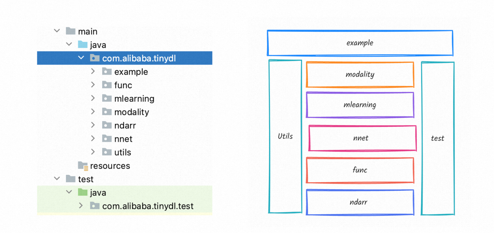

## 1，TinyDL的整体架构

TinyDL的秉承简洁分层清晰的原则，并参考了通用的分层逻辑，整体的结构如下：
* 1，ndarr包：核心类 NdArray，底层线性代数的简单实现，目前只实现CPU版本，GPU版本需要依赖庞大的三方库。
* 2，func包：核心类Function与Variable 分别是抽象的数学函数与变量的抽象，用于在前向传播时自动构建计算图，实现自动微分功能，其中Variable对应PyTorch的tensor。
* 3，nnet包：核心类Layer与Block表示神经网络的层和块，任何复杂的深度网络都是依赖这些Layer与Block的堆叠而层。实现了一些常用的cnn层rnn层norm层以及encode与decode的seq2seq架构等等。
* 4，mlearning 包：机器学习的通用组件的表示，深度学习是机器学习的一个分支，对应更广泛的机器学习有一套通用的组件，包括数据集，损失函数，优化算法，训练器，推导器，效果评估器等。
* 5，modality 包：属于应用层的范畴，目前深度学习主要应用任务图形图像的视觉，自然语言处理以及强化学习三部分，暂时还没有相应的领域的实现，希望在0.02版中实现GPT-2的原型。
* 6，example包：一些简单的能跑通的例子，主要包括机器学习的分类和回归两类问题，有曲线的拟合，螺旋曲线的分类，手写数字的识别以及序列数据的预测。