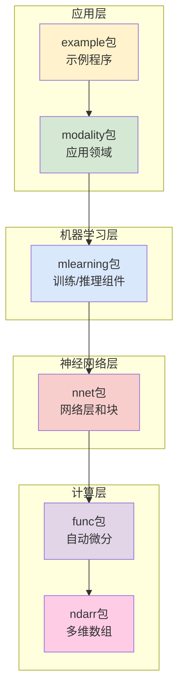

# TinyDL - 轻量级深度学习框架

[](https://www.oracle.com/java/)
[](https://maven.apache.org/)
[](LICENSE)
[]()

## 📖 项目简介

TinyDL 是一个用 **Java** 实现的轻量级深度学习框架，旨在为深度学习初学者和研究人员提供清晰、简洁的核心功能实现。该框架参考了 **PyTorch** 的设计理念，实现了自动微分、神经网络层、优化器等核心组件，特别适合：

- 🎓 **深度学习教学与学习**：代码结构清晰，注释详尽，便于理解底层原理
- 🔬 **学术研究与实验**：模块化设计，易于扩展和定制
- 🚀 **快速原型开发**：提供完整的机器学习工具链
- 💡 **算法验证**：在JVM环境中进行深度学习算法的验证和调试

## ✨ 核心特性

### 🔢 多维数组计算
- **NdArray 核心类**：支持标量、向量、矩阵及高维张量操作
- **丰富数学运算**：四则运算、矩阵乘法、形状变换、广播机制
- **内存高效**：针对 CPU 优化的数组实现

### 🔄 自动微分系统
- **动态计算图**：运行时构建，支持复杂的控制流
- **自动梯度计算**：一键调用 `backward()` 完成反向传播
- **灵活的梯度控制**：支持梯度开关和计算图切断

### 🧠 神经网络组件
- **完整的层实现**：
  - 全连接层（`LinearLayer`、`AffineLayer`）
  - 卷积层（`ConvLayer`）
  - 循环层（`LstmLayer`、`SimpleRnnLayer`）
  - 激活函数（`ReLU`、`Sigmoid`、`Tanh`、`Softmax`）
- **模块化设计**：`Layer` 和 `Block` 支持灵活组合
- **预构建网络**：`MlpBlock`、`LstmBlock`、`SequentialBlock`

### 📊 完整机器学习工具链
- **数据处理**：多种内置数据集（MNIST、螺旋数据、三角函数等）
- **损失函数**：交叉熵、均方误差、软最大交叉熵等
- **优化算法**：SGD、Adam 优化器
- **训练控制**：`Trainer` 类提供完整训练循环
- **效果评估**：准确率、回归误差等评估器

### 📈 可视化与监控
- **训练监控**：实时显示损失和准确率变化
- **结果可视化**：基于 JFreeChart 的图表绘制
- **模型结构图**：UML 工具可视化网络架构
- **训练日志**：支持训练过程日志记录和分析

### 🎯 丰富应用示例
- **分类任务**：螺旋数据分类、手写数字识别
- **回归任务**：曲线拟合、时间序列预测
- **序列建模**：RNN 序列预测、LSTM 应用

## 🏗️ 系统架构

TinyDL 采用分层模块化架构，各组件职责明确，易于理解和扩展：



### 📦 核心模块详解

#### 1. ndarr包 - 数值计算基础
- **`NdArray`**：多维数组核心实现，支持各种数学运算
- **`Shape`**：形状定义和操作
- **`NdArrayUtil`**：数组工具方法
- **设计理念**：提供高效的CPU计算支持，为上层提供数值计算基础

#### 2. func包 - 自动微分引擎
- **`Variable`**：变量抽象，记录计算图节点
- **`Function`**：所有数学运算的基类
- **运算类别**：
  - `base/`：四则运算（Add、Sub、Mul、Div）
  - `math/`：数学函数（Sin、Exp、ReLU、Sigmoid等）
  - `matrix/`：矩阵运算（MatMul、Reshape、Softmax等）
- **设计理念**：通过计算图实现动态自动微分

#### 3. nnet包 - 神经网络构建
- **`Layer`**：网络层接口
- **`Block`**：网络块抽象，可组合多个层
- **层实现**：
  - `layer/dnn/`：全连接层
  - `layer/cnn/`：卷积层、池化层
  - `layer/rnn/`：循环神经网络层
  - `layer/activate/`：激活函数层
- **设计理念**：模块化组件，支持灵活的网络架构构建

#### 4. mlearning包 - 机器学习工具链
- **`Model`**：模型封装器，提供统一的训练/推理接口
- **`Trainer`**：训练控制器，管理训练循环
- **`DataSet`**：数据集抽象和实现
- **`Loss`**：损失函数集合
- **`Optimizer`**：优化器实现（SGD、Adam）
- **`Evaluator`**：模型评估器
- **设计理念**：提供完整的机器学习开发工具链

#### 5. modality包 - 领域应用
- **`cv/`**：计算机视觉应用（`SimpleConvNet`）
- **`nlp/`**：自然语言处理应用（`Word2Vec`）
- **设计理念**：针对特定领域的高层封装

#### 6. example包 - 实用示例
- **`classify/`**：分类任务示例
- **`regress/`**：回归任务示例
- **设计理念**：展示框架使用方法，提供学习参考

## 🚀 快速开始

### 环境要求

- Java 8+
- Maven 3.6+

### 依赖配置

```xml
<dependencies>
    <dependency>
        <groupId>jfree</groupId>
        <artifactId>jfreechart</artifactId>
        <version>1.0.7</version>
    </dependency>
    <dependency>
        <groupId>junit</groupId>
        <artifactId>junit</artifactId>
        <version>4.13.2</version>
        <scope>test</scope>
    </dependency>
</dependencies>
```

### 💡 快速上手示例

#### 1. 自动微分基础

理解TinyDL的核心——自动微分机制：

```java


// 创建变量（支持梯度计算）
Variable x=new Variable(new NdArray(2.0f)).setName("x");
        Variable y=new Variable(new NdArray(3.0f)).setName("y");

// 构建计算表达式 z = (x + y) * x = (2 + 3) * 2 = 10
        Variable z=x.add(y).mul(x);

// 自动微分：计算 dz/dx 和 dz/dy
        z.backward();

// 查看梯度结果
        System.out.println("z的值: "+z.getValue().getNumber()); // 输出: 10.0
        System.out.println("x的梯度 dz/dx: "+x.getGrad().getNumber()); // 输出: 5.0 (y + x)
        System.out.println("y的梯度 dz/dy: "+y.getGrad().getNumber()); // 输出: 2.0 (x)
```

#### 2. 神经网络构建

使用Block构建多层感知机：

```java


// 网络参数设置
int batchSize=32;
        int inputSize=2;   // 输入维度
        int hiddenSize=10; // 隐藏层大小
        int outputSize=3;  // 输出类别数

// 创建多层感知机：input -> hidden -> output
        MlpBlock mlpBlock=new MlpBlock("MLP",batchSize,null,
        inputSize,hiddenSize,outputSize);
        Model model=new Model("ClassificationModel",mlpBlock);

// 创建随机输入数据
        Variable input=new Variable(
        NdArray.likeRandom(-1,1,new Shape(batchSize,inputSize))
        );

// 前向传播
        Variable output=model.forward(input);
        System.out.println("输出形状: "+output.getValue().getShape()); // [32, 3]
```

#### 3. 完整训练流程

以螺旋数据分类为例：

```java
import io.leavesfly.tinydl.mlearning.*;
import io.leavesfly.tinydl.mlearning.dataset.simple.SpiralDateSet;
import io.leavesfly.tinydl.mlearning.loss.SoftmaxCrossEntropy;
import io.leavesfly.tinydl.mlearning.optimize.SGD;

// 训练参数
int maxEpoch = 300;
int batchSize = 10;
float learningRate = 1.0f;

// 创建数据集
SpiralDateSet dataSet = new SpiralDateSet(batchSize);

// 创建模型
MlpBlock block = new MlpBlock("SpiralMLP", batchSize, null, 2, 30, 3);
Model model = new Model("SpiralClassifier", block);

// 配置训练组件
Optimizer optimizer = new SGD(model, learningRate);
Loss lossFunc = new SoftmaxCrossEntropy();

// 创建训练器
Trainer trainer = new Trainer(maxEpoch, new Monitor(), null);
trainer.init(dataSet, model, lossFunc, optimizer);

// 开始训练
trainer.train(true); // true表示显示训练过程

// 使用带日志功能的Monitor
Monitor monitorWithLog = new Monitor("training_log.txt");
Trainer trainerWithLog = new Trainer(maxEpoch, monitorWithLog, null);
trainerWithLog.init(dataSet, model, lossFunc, optimizer);
trainerWithLog.train(true);
```

## 📚 API 文档

### 核心类说明

#### NdArray
多维数组类，支持各种数学运算：
- `NdArray(float value)`: 创建标量
- `NdArray(float[][] data)`: 创建二维矩阵
- `add()`, `sub()`, `mul()`, `div()`: 基本数学运算
- `matMul()`: 矩阵乘法
- `reshape()`: 改变形状

#### Variable
变量类，支持自动微分：
- `setRequireGrad(boolean)`: 设置是否需要梯度
- `backward()`: 反向传播
- `clearGrad()`: 清除梯度
- 支持各种数学运算符重载

#### Layer & Block
神经网络层和块：
- `LinearLayer`: 全连接层
- `ConvLayer`: 卷积层
- `LstmLayer`: LSTM层
- `MlpBlock`: 多层感知机块

#### Monitor
训练监控器，用于收集和可视化训练过程信息：
- `collectInfo()`: 收集训练损失
- `collectAccuracy()`: 收集训练准确率
- `printTrainInfo()`: 打印训练信息
- `plot()`: 绘制训练过程图表
- `saveLogToFile()`: 保存训练日志到文件

#### Batch
数据批次类，用于封装一批训练或测试数据：
- `toVariableX()`, `toVariableY()`: 将数据转换为Variable对象（带缓存优化）
- `next()`: 获取下一对数据
- `hasNext()`: 检查是否还有更多数据
- `resetIndex()`: 重置遍历索引

## 🎯 示例项目

### 1. 螺旋数据分类
```bash
# 运行螺旋数据分类示例
java -cp target/classes io.leavesfly.tinydl.example.classify.SpiralMlpExam
```

### 2. 手写数字识别
```bash
# 运行MNIST手写数字识别
java -cp target/classes io.leavesfly.tinydl.example.classify.MnistMlpExam
```

### 3. 曲线拟合
```bash
# 运行Sin曲线拟合
java -cp target/classes io.leavesfly.tinydl.example.regress.MlpSinExam
```

### 4. RNN序列预测
```bash
# 运行RNN余弦序列预测
java -cp target/classes io.leavesfly.tinydl.example.regress.RnnCosExam
```

## 🛠️ 开发路线图

### ✅ 已完成功能 (v0.01)

- ✅ **多维数组计算**：NdArray核心实现，支持CPU计算
- ✅ **自动微分系统**：基于计算图的动态梯度计算
- ✅ **神经网络层**：全连接、卷积、RNN、LSTM等基础层
- ✅ **训练工具链**：数据集、损失函数、优化器、训练器
- ✅ **可视化支持**：JFreeChart集成，训练过程监控
- ✅ **应用示例**：分类、回归、序列预测等完整示例

### 🚧 开发中功能 (v0.02)

- [x] **高维数组支持**：扩展NdArray维度处理能力
- [x] **CNN完善**：卷积层优化和相关示例
- [x] **RNN增强**：循环网络层完善和demo
- [x] **词向量模型**：Word2Vec实现和训练
- [x] **注意力机制**：Attention机制基础实现
- [x] **Transformer架构**：完整Transformer模型
- [x] **GPT-2支持**：小规模语言模型实现
- [x] **并行训练**：多线程训练优化

### 🔮 未来规划 (v0.03+)

#### 性能优化
- [ ] **GPU加速**：CUDA支持和GPU版本NdArray
- [ ] **内存优化**：减少内存占用，提升大模型支持
- [ ] **计算优化**：算子融合，计算图优化
- [ ] **分布式训练**：多机多卡训练支持

#### 功能扩展
- [ ] **更多网络层**：BatchNorm、Dropout、GroupNorm等
- [ ] **高级优化器**：AdamW、Lion、RMSprop等
- [ ] **模型压缩**：量化、剪枝、蒸馏
- [ ] **强化学习**：RL算法和环境支持

#### 工程化
- [ ] **模型序列化**：完善的模型保存/加载
- [ ] **配置管理**：YAML/JSON配置文件支持
- [ ] **日志系统**：完整的日志记录
- [ ] **单元测试**：全面的测试覆盖
- [ ] **文档完善**：API文档和教程

## 🏃‍♂️ 编译和运行

```bash
# 编译项目
mvn clean compile

# 运行测试
mvn test

# 打包
mvn package
```

## 📁 项目结构

```
src/main/java/io/leavesfly/tinydl/
├── ndarr/          # 多维数组核心实现
├── func/           # 函数和变量抽象
├── nnet/           # 神经网络层和块
├── mlearning/      # 机器学习通用组件
├── modality/       # 应用领域相关
├── example/        # 示例代码
└── utils/          # 工具类
```

## 🤝 贡献指南

1. Fork 本仓库
2. 创建特性分支 (`git checkout -b feature/AmazingFeature`)
3. 提交更改 (`git commit -m 'Add some AmazingFeature'`)
4. 推送到分支 (`git push origin feature/AmazingFeature`)
5. 打开 Pull Request

## 📄 许可证

本项目采用 MIT 许可证 - 查看 [LICENSE](LICENSE) 文件了解详情

## 🤝 社区与贡献

### 贡献指南

我们欢迎各种形式的贡献！

1. **🐛 Bug报告**：在Issues中报告发现的问题
2. **💡 功能建议**：提出新功能或改进建议
3. **📝 文档改进**：完善文档、教程、注释
4. **🔧 代码贡献**：
   ```bash
   # Fork本仓库
   git checkout -b feature/your-feature-name
   # 进行开发和测试
   git commit -m "Add: your feature description"
   git push origin feature/your-feature-name
   # 创建Pull Request
   ```

### 开发规范

- **代码风格**：遵循Java标准命名规范
- **注释要求**：关键类和方法需要详细注释
- **测试覆盖**：新功能需要对应的单元测试
- **文档更新**：API变更需要同步更新文档

### 学习资源

- 📚 **项目Wiki**：详细的技术文档和设计说明
- 🎯 **示例代码**：`example/`目录下的完整示例
- 🔍 **单元测试**：`test/`目录下的测试用例
- 📊 **架构图表**：UML工具生成的项目结构图

---

## ⚠️ 重要声明

**TinyDL 当前版本 (v0.01) 处于早期开发阶段，主要面向以下用途：**

✅ **适用场景**：
- 深度学习教学和学习
- 算法原理验证和研究
- 小规模实验和原型开发
- Java生态系统中的ML应用

❌ **不适用场景**：
- 生产环境部署
- 大规模模型训练
- 高性能计算需求
- 商业级应用开发

**生产环境建议使用成熟框架**：PyTorch、TensorFlow、JAX等

---

*TinyDL - 让深度学习变得简单易懂* 🚀